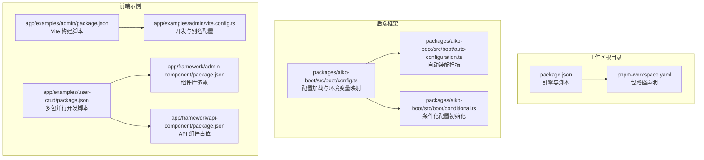
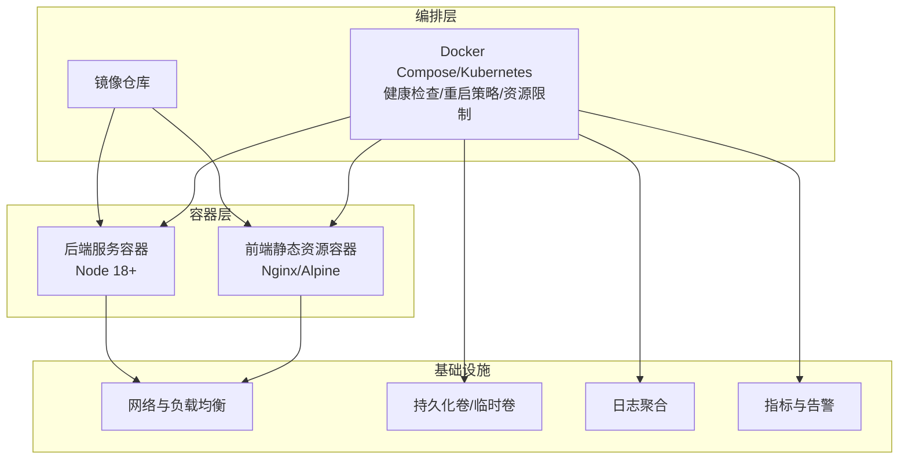
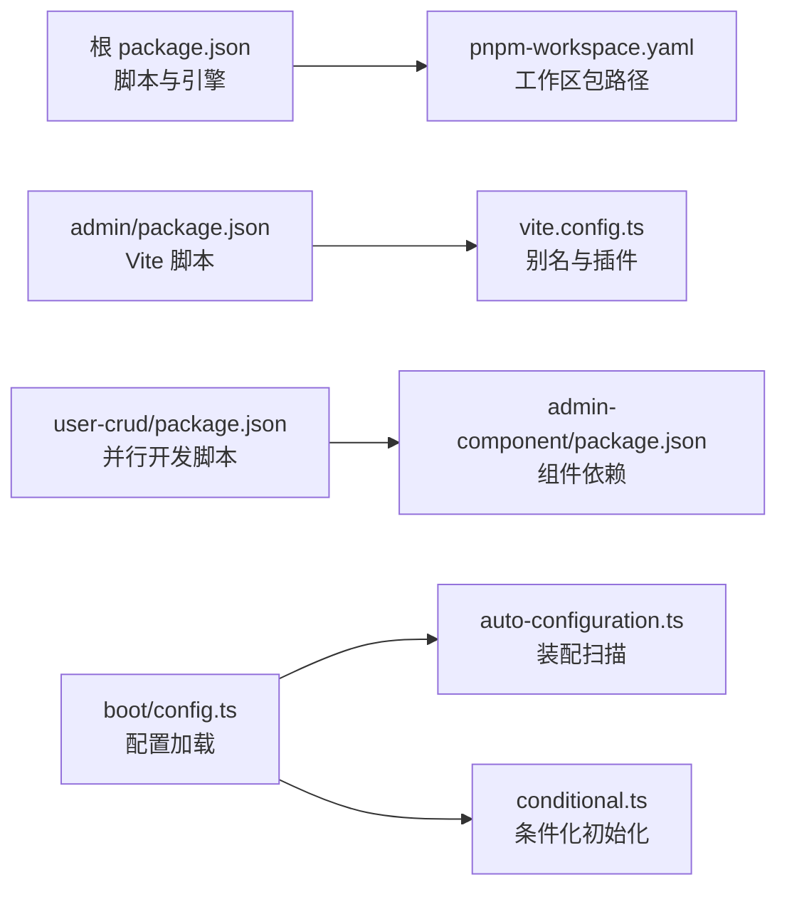

# 容器化部署

<cite>
**本文引用的文件**
- [package.json](file://package.json)
- [pnpm-workspace.yaml](file://pnpm-workspace.yaml)
- [packages/aiko-boot/src/boot/config.ts](file://packages/aiko-boot/src/boot/config.ts)
- [packages/aiko-boot/src/boot/auto-configuration.ts](file://packages/aiko-boot/src/boot/auto-configuration.ts)
- [packages/aiko-boot/src/boot/conditional.ts](file://packages/aiko-boot/src/boot/conditional.ts)
- [app/examples/admin/package.json](file://app/examples/admin/package.json)
- [app/examples/admin/vite.config.ts](file://app/examples/admin/vite.config.ts)
- [app/examples/user-crud/package.json](file://app/examples/user-crud/package.json)
- [app/framework/admin-component/package.json](file://app/framework/admin-component/package.json)
- [app/framework/api-component/package.json](file://app/framework/api-component/package.json)
</cite>

## 目录
1. [简介](#简介)
2. [项目结构](#项目结构)
3. [核心组件](#核心组件)
4. [架构总览](#架构总览)
5. [详细组件分析](#详细组件分析)
6. [依赖关系分析](#依赖关系分析)
7. [性能考虑](#性能考虑)
8. [故障排查指南](#故障排查指南)
9. [结论](#结论)
10. [附录](#附录)

## 简介
本指南面向在容器环境中部署该多包工作区（monorepo）项目的工程团队，提供从镜像构建、运行时配置、编排部署、健康检查与重启策略、监控与日志、安全加固到资源限制与性能调优的完整落地建议。内容基于仓库中现有的包管理、配置加载机制与前端示例应用进行适配性说明，帮助您在 Docker、Docker Compose 与 Kubernetes 上实现稳定、可维护、可观察且安全的容器化部署。

## 项目结构
该仓库采用 pnpm workspace 组织，包含后端框架与前端示例应用两大类：
- 后端框架层：aiko-boot 核心配置与自动装配能力位于 packages/aiko-boot。
- 前端示例层：admin 示例应用位于 app/examples/admin；用户 CRUD 示例位于 app/examples/user-crud；通用组件位于 app/framework。

图表来源
- [package.json](file://package.json#L1-L32)
- [pnpm-workspace.yaml](file://pnpm-workspace.yaml#L1-L6)
- [packages/aiko-boot/src/boot/config.ts](file://packages/aiko-boot/src/boot/config.ts#L1-L315)
- [packages/aiko-boot/src/boot/auto-configuration.ts](file://packages/aiko-boot/src/boot/auto-configuration.ts#L273-L354)
- [packages/aiko-boot/src/boot/conditional.ts](file://packages/aiko-boot/src/boot/conditional.ts#L337-L370)
- [app/examples/admin/package.json](file://app/examples/admin/package.json#L1-L31)
- [app/examples/admin/vite.config.ts](file://app/examples/admin/vite.config.ts#L1-L16)
- [app/examples/user-crud/package.json](file://app/examples/user-crud/package.json#L1-L20)
- [app/framework/admin-component/package.json](file://app/framework/admin-component/package.json#L1-L43)
- [app/framework/api-component/package.json](file://app/framework/api-component/package.json#L1-L25)

章节来源
- [package.json](file://package.json#L1-L32)
- [pnpm-workspace.yaml](file://pnpm-workspace.yaml#L1-L6)

## 核心组件
- 配置系统（Spring Boot 风格）：支持 JSON/YAML/环境变量加载，支持按前缀将环境变量映射为嵌套配置键，便于容器内通过环境变量注入配置。
- 自动装配：动态扫描并按顺序处理带元数据的配置类，保证装配顺序与条件满足后再注册。
- 条件化配置：对 Bean 定义进行条件评估，仅在满足条件时注册，适合在不同运行环境（开发/测试/生产）下差异化启用功能。

章节来源
- [packages/aiko-boot/src/boot/config.ts](file://packages/aiko-boot/src/boot/config.ts#L1-L315)
- [packages/aiko-boot/src/boot/auto-configuration.ts](file://packages/aiko-boot/src/boot/auto-configuration.ts#L273-L354)
- [packages/aiko-boot/src/boot/conditional.ts](file://packages/aiko-boot/src/boot/conditional.ts#L337-L370)

## 架构总览
下图展示容器化部署视角下的典型分层：前端构建产物（静态资源）与后端服务（Node 进程）在容器内协同工作，配置由环境变量注入，健康检查与日志采集在编排层统一管理。

## 详细组件分析

### 镜像构建策略（多阶段、体积与安全）
- 多阶段构建建议
  - 构建阶段：使用 Node 18+ 基础镜像安装 pnpm、拉取依赖并执行 monorepo 构建（参考根目录脚本与工作区配置）。
  - 运行阶段：使用更小的基础镜像（如 Alpine），仅复制构建产物与运行所需依赖，避免携带开发工具链。
  - 前端静态资源：可使用 Nginx 镜像作为最终运行镜像，减少 Node 运行时开销。
- 镜像体积控制
  - 分离开发与运行依赖，利用 pnpm 的工作区特性在构建阶段一次性安装，运行阶段仅保留产物。
  - 清理缓存与无关文件，确保 .dockerignore 与构建参数最小化。
- 安全最佳实践
  - 使用不可变标签与校验和，启用只读根文件系统，以非 root 用户运行。
  - 在 CI 中启用镜像扫描，修补基础镜像漏洞。

章节来源
- [package.json](file://package.json#L11-L18)
- [pnpm-workspace.yaml](file://pnpm-workspace.yaml#L1-L6)

### 容器运行时配置（环境变量、卷挂载、网络）
- 环境变量传递
  - 使用配置系统前缀映射规则（例如 APP_ 前缀 → 嵌套键），在容器中通过环境变量注入配置，避免硬编码。
  - 建议将敏感信息放入密钥管理或编排平台的机密资源，容器启动时以环境变量或挂载方式注入。
- 卷挂载
  - 日志与临时文件：使用临时卷（tmpfs）存放日志与缓存，避免写入只读文件系统。
  - 配置文件：通过配置映射或挂载读写卷，按需热更新。
- 网络配置
  - 服务暴露：仅开放必要端口；通过反向代理或入口控制器统一接入。
  - 内部通信：使用服务发现与命名空间隔离，限制出站访问。

章节来源
- [packages/aiko-boot/src/boot/config.ts](file://packages/aiko-boot/src/boot/config.ts#L73-L82)
- [packages/aiko-boot/src/boot/config.ts](file://packages/aiko-boot/src/boot/config.ts#L231-L243)

### 容器编排配置（Docker Compose 与 Kubernetes）
- Docker Compose
  - 服务定义：分别声明前端静态资源服务与后端服务，设置健康检查、重启策略与资源限制。
  - 网络与卷：定义自定义网络与卷，挂载配置与日志目录。
  - 环境变量：通过 env 文件或 secrets 管理敏感参数。
- Kubernetes
  - Deployment/StatefulSet：根据服务状态性选择控制器；为日志与配置使用 ConfigMap/Secret。
  - Service/Ingress：暴露服务，配置 TLS 与限流。
  - HPA/VPA：根据 CPU/内存指标弹性扩缩容。
  - Pod 安全策略：非 root、只读根文件系统、最小权限。

章节来源
- [packages/aiko-boot/src/boot/config.ts](file://packages/aiko-boot/src/boot/config.ts#L73-L82)

### 健康检查与重启策略
- 健康检查
  - HTTP 探针：对后端提供 /health 或 /ready 接口，容器内探针轮询检查。
  - TCP/Exec 探针：用于数据库连接或进程存活检测。
- 重启策略
  - 开发环境：Always，便于快速迭代。
  - 生产环境：OnFailure 或保持默认，结合探针与副本数实现高可用。

章节来源
- [packages/aiko-boot/src/boot/config.ts](file://packages/aiko-boot/src/boot/config.ts#L73-L82)

### 监控与日志收集
- 日志
  - 标准输出：容器标准输出即日志源，配合编排平台集中收集。
  - 前端静态资源：Nginx 访问/错误日志可挂载至宿主机或远程日志系统。
- 指标
  - 应用指标：通过指标库暴露 Prometheus 格式端点，Kubernetes 中以 ServiceMonitor/Service 暴露。
  - 基础设施指标：CPU/内存/磁盘/网络，结合告警策略。

章节来源
- [packages/aiko-boot/src/boot/config.ts](file://packages/aiko-boot/src/boot/config.ts#L73-L82)

### 安全加固（非 root、只读文件系统、最小权限）
- 运行用户：以非 root 用户运行，降低权限风险。
- 文件系统：根文件系统只读，仅将日志与缓存目录挂载为可写卷。
- 最小权限：仅授予容器运行所需的 API 权限与网络访问，避免特权模式。

章节来源
- [packages/aiko-boot/src/boot/config.ts](file://packages/aiko-boot/src/boot/config.ts#L73-L82)

### 资源限制与性能调优
- 资源限制
  - CPU/内存：在编排层设置 requests/limits，避免资源争抢。
  - 并发与线程：根据 CPU 核心数与业务特征调整 Node 线程池大小与并发参数。
- 性能调优
  - 构建优化：利用 pnpm workspace 与缓存，减少重复安装时间。
  - 运行优化：启用压缩、静态资源 CDN、连接复用与合理的超时配置。

章节来源
- [package.json](file://package.json#L11-L18)
- [pnpm-workspace.yaml](file://pnpm-workspace.yaml#L1-L6)

## 依赖关系分析
- 包管理与构建
  - 根 package.json 定义了 monorepo 的构建、开发与测试脚本，pnpm-workspace.yaml 明确了工作区范围。
  - 前端示例应用使用 Vite 进行开发与构建，具备别名解析与 PostCSS 配置。
- 配置与装配
  - 配置系统支持多种来源合并与环境变量映射，自动装配与条件化初始化保证运行期装配的可控性。

图表来源
- [package.json](file://package.json#L1-L32)
- [pnpm-workspace.yaml](file://pnpm-workspace.yaml#L1-L6)
- [app/examples/admin/package.json](file://app/examples/admin/package.json#L1-L31)
- [app/examples/admin/vite.config.ts](file://app/examples/admin/vite.config.ts#L1-L16)
- [app/examples/user-crud/package.json](file://app/examples/user-crud/package.json#L1-L20)
- [app/framework/admin-component/package.json](file://app/framework/admin-component/package.json#L1-L43)
- [packages/aiko-boot/src/boot/config.ts](file://packages/aiko-boot/src/boot/config.ts#L1-L315)
- [packages/aiko-boot/src/boot/auto-configuration.ts](file://packages/aiko-boot/src/boot/auto-configuration.ts#L273-L354)
- [packages/aiko-boot/src/boot/conditional.ts](file://packages/aiko-boot/src/boot/conditional.ts#L337-L370)

章节来源
- [package.json](file://package.json#L1-L32)
- [pnpm-workspace.yaml](file://pnpm-workspace.yaml#L1-L6)
- [app/examples/admin/package.json](file://app/examples/admin/package.json#L1-L31)
- [app/examples/admin/vite.config.ts](file://app/examples/admin/vite.config.ts#L1-L16)
- [app/examples/user-crud/package.json](file://app/examples/user-crud/package.json#L1-L20)
- [app/framework/admin-component/package.json](file://app/framework/admin-component/package.json#L1-L43)
- [packages/aiko-boot/src/boot/config.ts](file://packages/aiko-boot/src/boot/config.ts#L1-L315)
- [packages/aiko-boot/src/boot/auto-configuration.ts](file://packages/aiko-boot/src/boot/auto-configuration.ts#L273-L354)
- [packages/aiko-boot/src/boot/conditional.ts](file://packages/aiko-boot/src/boot/conditional.ts#L337-L370)

## 性能考虑
- 构建阶段：利用 pnpm workspace 缓存与并行构建，缩短 CI 时间。
- 运行阶段：前端静态资源由 Nginx 提供，后端 Node 进程专注业务逻辑；合理设置探针与副本数提升可用性。
- 资源分配：结合业务峰值与历史指标设定 requests/limits，避免过度预留造成资源浪费。

## 故障排查指南
- 配置未生效
  - 检查环境变量前缀与键名是否符合配置系统映射规则。
  - 确认配置文件加载顺序与覆盖关系。
- 自动装配未触发
  - 检查配置类是否带有正确元数据，以及条件是否满足。
- 健康检查失败
  - 确认探针端点可达，检查容器内监听地址与端口映射。
- 日志缺失
  - 确认容器标准输出是否被正确采集，卷挂载路径是否正确。

章节来源
- [packages/aiko-boot/src/boot/config.ts](file://packages/aiko-boot/src/boot/config.ts#L73-L82)
- [packages/aiko-boot/src/boot/auto-configuration.ts](file://packages/aiko-boot/src/boot/auto-configuration.ts#L313-L354)
- [packages/aiko-boot/src/boot/conditional.ts](file://packages/aiko-boot/src/boot/conditional.ts#L337-L370)

## 结论
通过将仓库的配置系统、自动装配与前端构建流程与容器化最佳实践相结合，可以在 Docker 与 Kubernetes 上实现稳定、可观测、安全且高性能的部署方案。建议在 CI 中固化镜像构建与扫描，在生产中启用严格的健康检查、资源限制与安全策略，并持续优化构建与运行时性能。

## 附录
- 关键配置要点速查
  - 环境变量前缀映射：APP_ → 嵌套键（如 APP_DATABASE_HOST → database.host）
  - 配置加载顺序：TypeScript 配置文件优先于 JSON/YAML，再覆盖环境变量
  - 自动装配：按顺序处理带元数据的配置类，支持 before/after 排序与条件过滤
  - 前端构建：Vite 别名与 PostCSS 配置，开发与预览脚本

章节来源
- [packages/aiko-boot/src/boot/config.ts](file://packages/aiko-boot/src/boot/config.ts#L64-L82)
- [packages/aiko-boot/src/boot/auto-configuration.ts](file://packages/aiko-boot/src/boot/auto-configuration.ts#L313-L354)
- [packages/aiko-boot/src/boot/conditional.ts](file://packages/aiko-boot/src/boot/conditional.ts#L337-L370)
- [app/examples/admin/vite.config.ts](file://app/examples/admin/vite.config.ts#L1-L16)