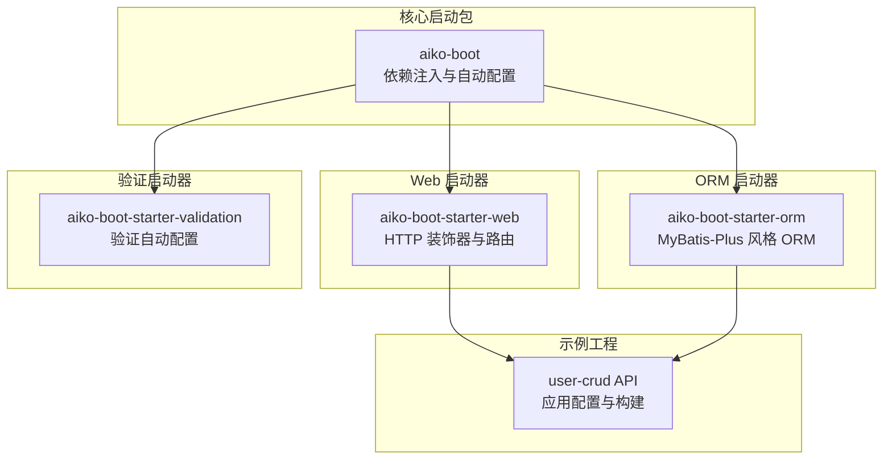
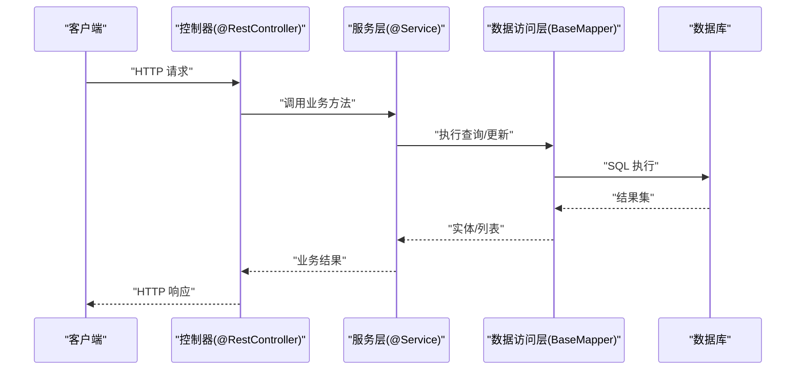
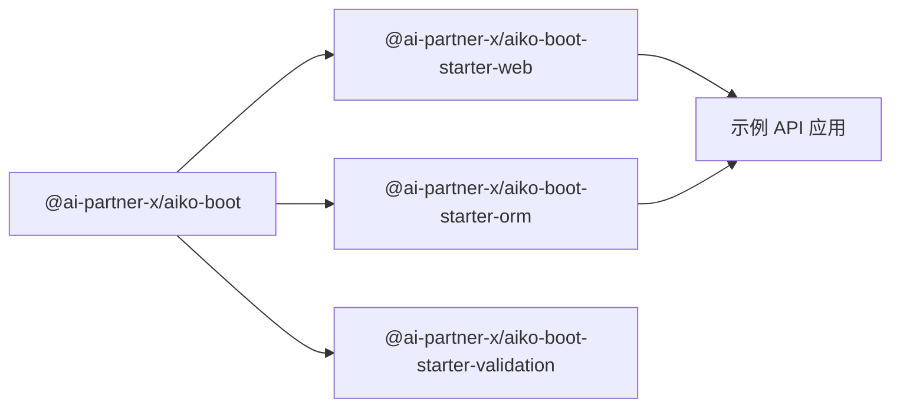

# 性能监控与优化

<cite>
**本文引用的文件**
- [README.md](file://README.md)
- [package.json](file://package.json)
- [app/examples/user-crud/packages/api/app.config.ts](file://app/examples/user-crud/packages/api/app.config.ts)
- [app/examples/user-crud/packages/api/tsup.config.ts](file://app/examples/user-crud/packages/api/tsup.config.ts)
- [packages/aiko-boot/src/index.ts](file://packages/aiko-boot/src/index.ts)
- [packages/aiko-boot-starter-web/src/index.ts](file://packages/aiko-boot-starter-web/src/index.ts)
- [packages/aiko-boot-starter-orm/src/index.ts](file://packages/aiko-boot-starter-orm/src/index.ts)
- [packages/aiko-boot/src/config-types.ts](file://packages/aiko-boot/src/config-types.ts)
- [packages/aiko-boot/schemas/app-config.schema.json](file://packages/aiko-boot/schemas/app-config.schema.json)
- [packages/aiko-boot-starter-validation/src/auto-configuration.ts](file://packages/aiko-boot-starter-validation/src/auto-configuration.ts)
</cite>

## 目录
1. [简介](#简介)
2. [项目结构](#项目结构)
3. [核心组件](#核心组件)
4. [架构总览](#架构总览)
5. [详细组件分析](#详细组件分析)
6. [依赖关系分析](#依赖关系分析)
7. [性能考虑](#性能考虑)
8. [故障排查指南](#故障排查指南)
9. [结论](#结论)
10. [附录](#附录)

## 简介
本文件面向生产环境的性能监控与优化，结合仓库中的框架与示例工程，给出可落地的指标体系、基准测试方法、监控配置、瓶颈识别与优化策略、容量规划与扩缩容方案，以及性能回归与持续监控机制。框架以 TypeScript/Next.js 为基础，提供 Spring Boot 风格的配置与装饰器能力，便于在生产环境中进行可观测性与性能治理。

## 项目结构
该仓库采用 monorepo 结构，核心由以下部分组成：
- 核心启动包：提供依赖注入、自动配置、生命周期事件等能力
- Web 启动器：提供基于装饰器的 HTTP 控制器与路由生成
- ORM 启动器：提供 MyBatis-Plus 风格的数据访问能力（Kysely 适配）
- 示例工程：用户 CRUD 示例，包含 API 层配置与构建脚本
- 验证启动器：提供数据验证的自动配置能力

图表来源
- [packages/aiko-boot/src/index.ts](file://packages/aiko-boot/src/index.ts#L1-L64)
- [packages/aiko-boot-starter-web/src/index.ts](file://packages/aiko-boot-starter-web/src/index.ts#L1-L73)
- [packages/aiko-boot-starter-orm/src/index.ts](file://packages/aiko-boot-starter-orm/src/index.ts#L1-L91)
- [app/examples/user-crud/packages/api/app.config.ts](file://app/examples/user-crud/packages/api/app.config.ts#L1-L45)

章节来源
- [README.md](file://README.md#L14-L33)
- [package.json](file://package.json#L1-L32)

## 核心组件
- 依赖注入与自动配置：提供装饰器驱动的服务注册、生命周期事件与异常处理，支撑性能监控与指标采集的模块化组织
- Web 装饰器与路由：提供 REST 控制器与请求映射装饰器，便于在控制器层埋点与统计请求耗时、吞吐与错误
- ORM 装饰器与查询包装器：提供实体与 Mapper 的声明式定义，配合查询包装器进行条件构造，便于数据库查询性能分析与优化
- 应用配置：提供 server、logging、database、validation 等配置项，支撑性能相关参数的集中管理与热更新
- 验证自动配置：提供验证开关与快速失败策略，有助于在高负载场景下减少无效请求对后端的压力

章节来源
- [packages/aiko-boot/src/index.ts](file://packages/aiko-boot/src/index.ts#L1-L64)
- [packages/aiko-boot-starter-web/src/index.ts](file://packages/aiko-boot-starter-web/src/index.ts#L1-L73)
- [packages/aiko-boot-starter-orm/src/index.ts](file://packages/aiko-boot-starter-orm/src/index.ts#L1-L91)
- [packages/aiko-boot-starter-validation/src/auto-configuration.ts](file://packages/aiko-boot-starter-validation/src/auto-configuration.ts#L68-L100)
- [packages/aiko-boot/src/config-types.ts](file://packages/aiko-boot/src/config-types.ts#L1-L48)
- [packages/aiko-boot/schemas/app-config.schema.json](file://packages/aiko-boot/schemas/app-config.schema.json#L88-L148)

## 架构总览
下图展示了从请求进入应用到数据库访问的整体链路，以及性能监控的关键落点：

图表来源
- [packages/aiko-boot-starter-web/src/index.ts](file://packages/aiko-boot-starter-web/src/index.ts#L14-L34)
- [packages/aiko-boot-starter-orm/src/index.ts](file://packages/aiko-boot-starter-orm/src/index.ts#L44-L64)

## 详细组件分析

### 应用配置与性能参数
- server 配置：端口、上下文路径、优雅停机等，影响接入层性能与可用性
- logging 配置：日志级别与格式，影响可观测性成本与性能权衡
- database 配置：连接类型与参数，直接影响数据库访问性能
- validation 配置：验证开关与快速失败策略，有助于降低无效请求带来的后端压力

章节来源
- [app/examples/user-crud/packages/api/app.config.ts](file://app/examples/user-crud/packages/api/app.config.ts#L10-L44)
- [packages/aiko-boot/src/config-types.ts](file://packages/aiko-boot/src/config-types.ts#L34-L46)
- [packages/aiko-boot/schemas/app-config.schema.json](file://packages/aiko-boot/schemas/app-config.schema.json#L88-L148)

### 依赖注入与生命周期
- 装饰器与容器：通过 @Service、@Component 等实现模块化与解耦，便于在不同层插入性能监控逻辑
- 生命周期事件：应用就绪、关闭等事件可用于启动/停止指标采集器与清理资源

章节来源
- [packages/aiko-boot/src/index.ts](file://packages/aiko-boot/src/index.ts#L29-L53)

### Web 装饰器与路由
- 控制器装饰器：@RestController、@GetMapping 等，便于在控制器入口/出口埋点，统计请求耗时与错误
- 路由自动生成：与 Express 集成，减少手工路由开销，提升路由层性能

章节来源
- [packages/aiko-boot-starter-web/src/index.ts](file://packages/aiko-boot-starter-web/src/index.ts#L14-L34)

### ORM 与查询包装器
- 实体与 Mapper：声明式定义实体与通用 CRUD，降低样板代码带来的性能损耗
- 查询包装器：条件构造与排序，便于进行查询优化与慢查询定位

章节来源
- [packages/aiko-boot-starter-orm/src/index.ts](file://packages/aiko-boot-starter-orm/src/index.ts#L22-L64)

### 验证自动配置
- 验证开关与快速失败：在高并发场景下减少无效请求对后端的压力，提高整体吞吐

章节来源
- [packages/aiko-boot-starter-validation/src/auto-configuration.ts](file://packages/aiko-boot-starter-validation/src/auto-configuration.ts#L73-L100)

## 依赖关系分析
- aiko-boot 为核心，被 web 与 orm 启动器依赖
- 示例工程依赖 web 与 orm 启动器以完成端到端功能
- 验证启动器作为独立模块参与自动配置流程

图表来源
- [packages/aiko-boot/src/index.ts](file://packages/aiko-boot/src/index.ts#L1-L64)
- [packages/aiko-boot-starter-web/src/index.ts](file://packages/aiko-boot-starter-web/src/index.ts#L39-L45)
- [packages/aiko-boot-starter-orm/src/index.ts](file://packages/aiko-boot-starter-orm/src/index.ts#L83-L87)

章节来源
- [packages/aiko-boot/src/index.ts](file://packages/aiko-boot/src/index.ts#L1-L64)
- [packages/aiko-boot-starter-web/src/index.ts](file://packages/aiko-boot-starter-web/src/index.ts#L1-L73)
- [packages/aiko-boot-starter-orm/src/index.ts](file://packages/aiko-boot-starter-orm/src/index.ts#L1-L91)

## 性能考虑
- 指标体系
  - 响应时间：在控制器入口/出口记录请求耗时，区分路径与状态码
  - 吞吐量：统计每秒请求数（QPS），按路径与方法分类
  - 错误率：统计 4xx/5xx 比例，区分来源（验证、业务、数据库）
  - 资源利用率：CPU、内存、线程池、数据库连接数、GC 次数与暂停时间
- 基准测试
  - 压力测试：逐步提升并发与请求速率，观察 P95/P99 延迟与错误率拐点
  - 负载测试：在稳定负载下长时间运行，评估稳定性与资源消耗
  - 容量规划：基于峰值 QPS、P99 延迟与资源上限，计算所需实例数与数据库连接池大小
- 监控配置
  - APM 集成：在控制器层埋点，结合链路追踪与指标面板
  - 日志聚合：统一日志格式与级别，结合日志检索与告警
  - 告警设置：针对延迟、错误率、资源使用率阈值与趋势告警
- 瓶颈识别
  - 代码性能分析：热点方法、锁竞争、序列化/反序列化开销
  - 数据库查询优化：慢查询日志、索引缺失、N+1 查询、不必要的排序/分页
  - 网络延迟分析：外部依赖调用、DNS 解析、TLS 握手、连接池复用
- 优化策略
  - 缓存策略：热点数据本地缓存与分布式缓存，合理过期与失效
  - 异步处理：批量写入、异步通知、消息队列削峰
  - 并发优化：线程池与连接池调优、无阻塞 I/O、限流与熔断
- 容量规划与扩缩容
  - 水平扩展：多副本部署，负载均衡，状态分离
  - 垂直扩展：增加 CPU/内存，优化 JVM/进程参数
- 性能回归与持续监控
  - 回归测试：在 CI 中加入基准测试任务，对比关键指标
  - 持续监控：建立仪表盘与自动化告警，定期回顾与优化

## 故障排查指南
- 配置校验
  - 使用配置模式文件对数据库类型与必填字段进行约束，避免因配置错误导致的启动失败或运行时异常
- 日志级别
  - 在高负载场景下调低日志级别，减少 IO 压力；在问题定位时临时提升级别
- 验证策略
  - 启用验证并设置快速失败，尽早拒绝无效请求，降低后端压力
- 构建与打包
  - 使用 tsup 外部化第三方依赖，减小包体积，提升冷启动速度

章节来源
- [packages/aiko-boot/schemas/app-config.schema.json](file://packages/aiko-boot/schemas/app-config.schema.json#L88-L148)
- [app/examples/user-crud/packages/api/app.config.ts](file://app/examples/user-crud/packages/api/app.config.ts#L19-L44)
- [packages/aiko-boot-starter-validation/src/auto-configuration.ts](file://packages/aiko-boot-starter-validation/src/auto-configuration.ts#L73-L100)
- [app/examples/user-crud/packages/api/tsup.config.ts](file://app/examples/user-crud/packages/api/tsup.config.ts#L1-L10)
- [packages/aiko-boot-starter-web/src/index.ts](file://packages/aiko-boot-starter-web/src/index.ts#L1-L73)

## 结论
通过装饰器驱动的模块化架构与 Spring Boot 风格的配置体系，本框架为生产环境的性能监控与优化提供了良好的基础。结合控制器层埋点、ORM 查询优化、验证前置与合理的容量规划，可在保证稳定性的同时持续提升系统性能与用户体验。

## 附录
- 快速开始与示例运行
  - 安装依赖与构建：使用 monorepo 的统一脚本
  - 运行示例 API：进入示例工程目录启动开发服务器
- 配置参考
  - server：端口、上下文路径、优雅停机
  - logging：日志级别与格式
  - database：数据库类型与连接参数
  - validation：验证开关与快速失败策略

章节来源
- [README.md](file://README.md#L35-L54)
- [package.json](file://package.json#L11-L18)
- [app/examples/user-crud/packages/api/app.config.ts](file://app/examples/user-crud/packages/api/app.config.ts#L10-L44)