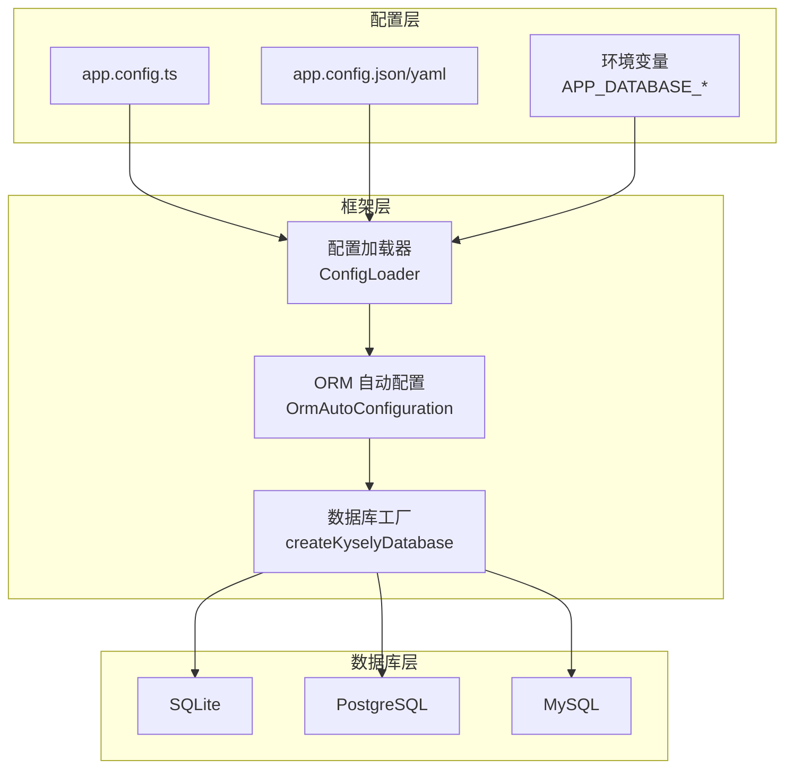
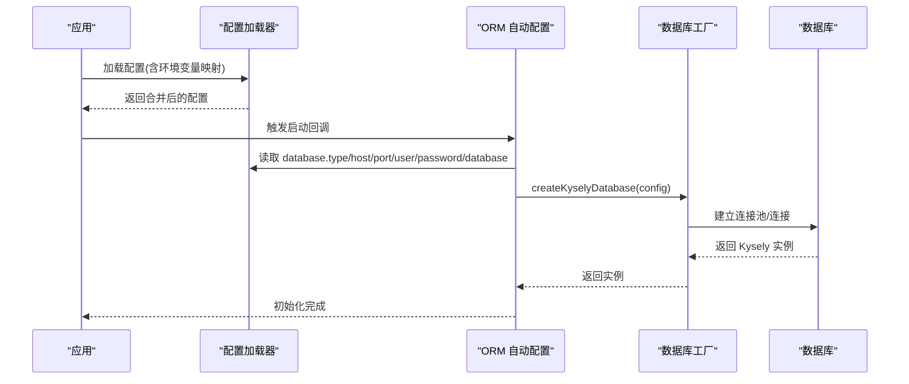
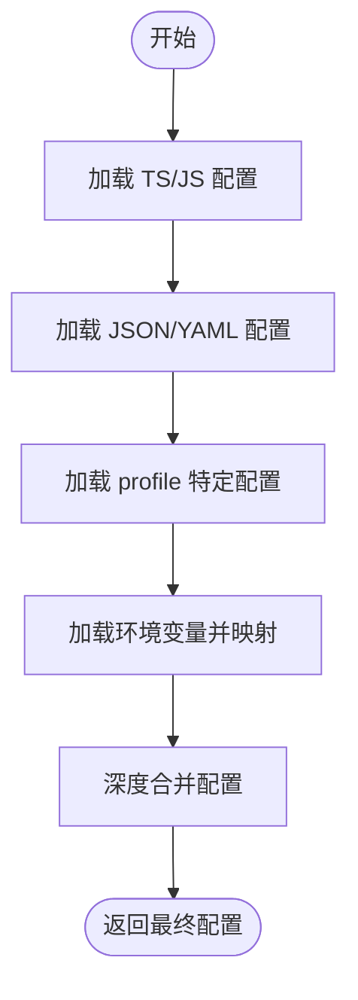
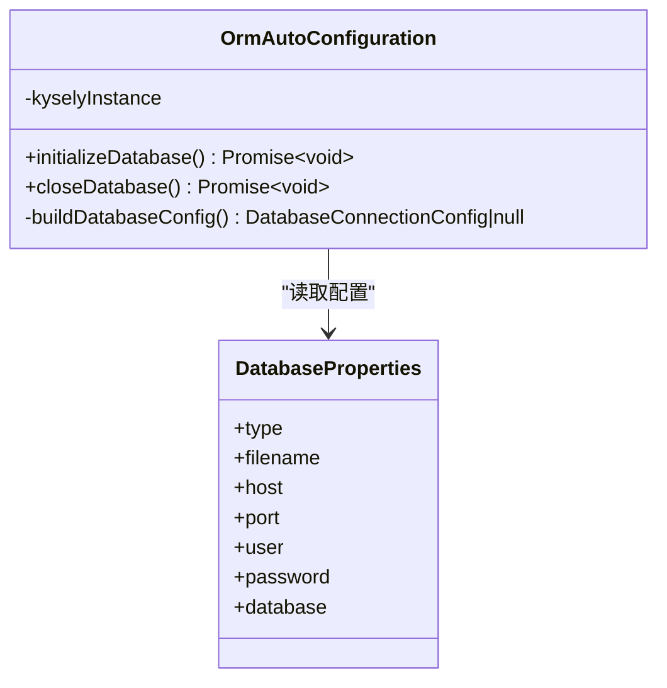
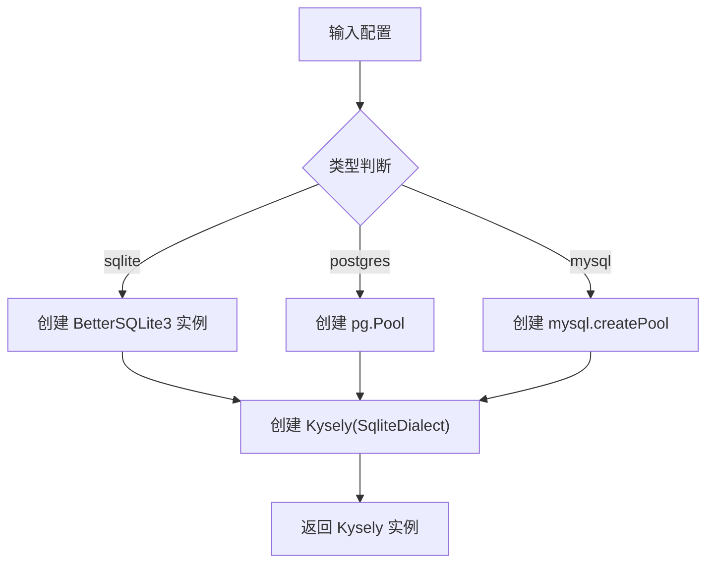
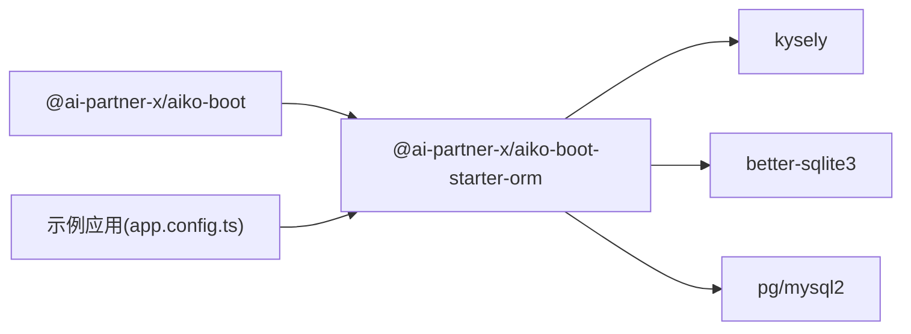

# 数据库部署

<cite>
**本文引用的文件**
- [packages/aiko-boot-starter-orm/src/auto-configuration.ts](file://packages/aiko-boot-starter-orm/src/auto-configuration.ts)
- [packages/aiko-boot-starter-orm/src/database.ts](file://packages/aiko-boot-starter-orm/src/database.ts)
- [packages/aiko-boot-starter-orm/src/config-augment.ts](file://packages/aiko-boot-starter-orm/src/config-augment.ts)
- [packages/aiko-boot/src/boot/config.ts](file://packages/aiko-boot/src/boot/config.ts)
- [packages/aiko-boot-starter-orm/package.json](file://packages/aiko-boot-starter-orm/package.json)
- [packages/aiko-boot/package.json](file://packages/aiko-boot/package.json)
- [app/examples/user-crud/packages/api/app.config.ts](file://app/examples/user-crud/packages/api/app.config.ts)
- [app/examples/user-crud/packages/api/gen/src/main/resources/application.yml](file://app/examples/user-crud/packages/api/gen/src/main/resources/application.yml)
</cite>

## 目录
1. [简介](#简介)
2. [项目结构](#项目结构)
3. [核心组件](#核心组件)
4. [架构总览](#架构总览)
5. [详细组件分析](#详细组件分析)
6. [依赖关系分析](#依赖关系分析)
7. [性能考虑](#性能考虑)
8. [故障排查指南](#故障排查指南)
9. [结论](#结论)
10. [附录](#附录)

## 简介
本文件面向数据库部署与运维场景，基于仓库中现有的配置系统与 ORM 启动器，提供可落地的数据库部署策略与管理实践。内容涵盖：
- 部署策略：主从复制、集群配置与高可用性设置的落地建议
- 连接池配置：连接数限制、超时设置与连接复用策略
- 性能调优：索引优化、查询缓存与统计信息更新
- 备份与恢复：全量/增量备份与灾难恢复计划
- 监控与告警：慢查询、连接数与存储空间监控
- 安全配置：访问控制、SSL 连接与审计日志
- 版本升级与迁移：平滑升级与数据迁移策略

说明：当前仓库实现支持 SQLite、PostgreSQL、MySQL 三种数据库类型，并通过配置系统与自动装配机制完成数据库连接初始化。

## 项目结构
围绕数据库部署与管理，关键模块如下：
- 配置系统：支持 JSON/YAML/TS/环境变量多源配置，支持按 profile 覆盖，支持环境变量前缀映射
- ORM 启动器：根据配置自动初始化数据库连接，支持 SQLite、PostgreSQL、MySQL
- 示例应用：提供 SQLite 与 PostgreSQL 的配置示例

图表来源
- [packages/aiko-boot/src/boot/config.ts](file://packages/aiko-boot/src/boot/config.ts#L73-L143)
- [packages/aiko-boot-starter-orm/src/auto-configuration.ts](file://packages/aiko-boot-starter-orm/src/auto-configuration.ts#L61-L93)
- [packages/aiko-boot-starter-orm/src/database.ts](file://packages/aiko-boot-starter-orm/src/database.ts#L47-L95)

章节来源
- [packages/aiko-boot/src/boot/config.ts](file://packages/aiko-boot/src/boot/config.ts#L64-L143)
- [packages/aiko-boot-starter-orm/src/auto-configuration.ts](file://packages/aiko-boot-starter-orm/src/auto-configuration.ts#L1-L135)
- [packages/aiko-boot-starter-orm/src/database.ts](file://packages/aiko-boot-starter-orm/src/database.ts#L1-L134)
- [app/examples/user-crud/packages/api/app.config.ts](file://app/examples/user-crud/packages/api/app.config.ts#L1-L45)

## 核心组件
- 配置加载器：支持 TS/JS/JSON/YAML 多格式配置，支持按 profile 加载，支持环境变量前缀映射（如 APP_DATABASE_HOST → database.host），并提供深度合并策略
- ORM 自动配置：当存在 database.type 时自动初始化数据库连接；在应用启动时建立连接，在关闭时释放连接
- 数据库工厂：根据配置选择对应方言与连接池，创建 Kysely 实例；支持 SQLite 内存数据库、PostgreSQL 连接池、MySQL 连接池

章节来源
- [packages/aiko-boot/src/boot/config.ts](file://packages/aiko-boot/src/boot/config.ts#L64-L143)
- [packages/aiko-boot-starter-orm/src/auto-configuration.ts](file://packages/aiko-boot-starter-orm/src/auto-configuration.ts#L61-L133)
- [packages/aiko-boot-starter-orm/src/database.ts](file://packages/aiko-boot-starter-orm/src/database.ts#L47-L126)

## 架构总览
下图展示从配置到数据库连接的端到端流程：

图表来源
- [packages/aiko-boot/src/boot/config.ts](file://packages/aiko-boot/src/boot/config.ts#L231-L243)
- [packages/aiko-boot-starter-orm/src/auto-configuration.ts](file://packages/aiko-boot-starter-orm/src/auto-configuration.ts#L70-L81)
- [packages/aiko-boot-starter-orm/src/database.ts](file://packages/aiko-boot-starter-orm/src/database.ts#L47-L95)

## 详细组件分析

### 组件一：配置系统（ConfigLoader）
- 支持的配置源与加载顺序：TS/JS 配置文件 → JSON/YAML → profile 特定配置 → 环境变量
- 环境变量映射规则：APP_DATABASE_HOST → database.host，自动将下划线转点号并小写化
- 值解析：布尔、整数、浮点、字符串自动识别
- 深度合并：后加载的配置覆盖先前配置

图表来源
- [packages/aiko-boot/src/boot/config.ts](file://packages/aiko-boot/src/boot/config.ts#L73-L143)
- [packages/aiko-boot/src/boot/config.ts](file://packages/aiko-boot/src/boot/config.ts#L231-L243)

章节来源
- [packages/aiko-boot/src/boot/config.ts](file://packages/aiko-boot/src/boot/config.ts#L64-L143)
- [packages/aiko-boot/src/boot/config.ts](file://packages/aiko-boot/src/boot/config.ts#L231-L243)

### 组件二：ORM 自动配置（OrmAutoConfiguration）
- 条件初始化：仅当配置中存在 database.type 时才执行
- 启动阶段：在应用准备就绪回调中初始化数据库连接
- 关闭阶段：在应用关闭回调中释放连接
- 配置构建：根据 database.type 分支构建对应配置对象

图表来源
- [packages/aiko-boot-starter-orm/src/auto-configuration.ts](file://packages/aiko-boot-starter-orm/src/auto-configuration.ts#L34-L133)

章节来源
- [packages/aiko-boot-starter-orm/src/auto-configuration.ts](file://packages/aiko-boot-starter-orm/src/auto-configuration.ts#L61-L133)

### 组件三：数据库工厂（createKyselyDatabase）
- 支持类型：sqlite、postgres、mysql
- 连接方式：
  - SQLite：本地文件或内存数据库
  - PostgreSQL：使用 pg 的连接池
  - MySQL：使用 mysql2 的连接池
- 实例管理：全局单例，提供获取与关闭能力

图表来源
- [packages/aiko-boot-starter-orm/src/database.ts](file://packages/aiko-boot-starter-orm/src/database.ts#L47-L95)

章节来源
- [packages/aiko-boot-starter-orm/src/database.ts](file://packages/aiko-boot-starter-orm/src/database.ts#L47-L126)

### 组件四：配置类型扩展（Module Augmentation）
- 通过模块增强，使 AppConfig 自动包含 database 配置字段
- 便于在 IDE 中获得类型提示与校验

章节来源
- [packages/aiko-boot-starter-orm/src/config-augment.ts](file://packages/aiko-boot-starter-orm/src/config-augment.ts#L20-L25)

### 组件五：示例配置（app.config.ts）
- 提供 SQLite 与 PostgreSQL 的配置示例
- 可通过环境变量覆盖默认值

章节来源
- [app/examples/user-crud/packages/api/app.config.ts](file://app/examples/user-crud/packages/api/app.config.ts#L26-L37)

### 组件六：YAML 示例（application.yml）
- 展示了其他生态中的配置风格（如 Spring Boot 的 datasource、MyBatis Plus 等）
- 有助于理解不同平台的配置差异

章节来源
- [app/examples/user-crud/packages/api/gen/src/main/resources/application.yml](file://app/examples/user-crud/packages/api/gen/src/main/resources/application.yml#L1-L24)

## 依赖关系分析
- aiko-boot-starter-orm 依赖 aiko-boot 提供的配置系统与自动装配能力
- 数据库工厂依赖第三方驱动：pg（PostgreSQL）、better-sqlite3（SQLite）、mysql2（MySQL）
- 示例应用依赖 ORM 启动器以启用数据库连接

图表来源
- [packages/aiko-boot-starter-orm/package.json](file://packages/aiko-boot-starter-orm/package.json#L24-L44)
- [packages/aiko-boot/package.json](file://packages/aiko-boot/package.json#L35-L38)

章节来源
- [packages/aiko-boot-starter-orm/package.json](file://packages/aiko-boot-starter-orm/package.json#L24-L44)
- [packages/aiko-boot/package.json](file://packages/aiko-boot/package.json#L35-L38)

## 性能考虑
以下为通用数据库性能调优建议，结合当前仓库对数据库类型的支持进行落地说明：
- 连接池配置优化
  - PostgreSQL：通过 pg.Pool 设置最大连接数、空闲超时、获取超时等参数
  - MySQL：通过 mysql2 的连接池选项设置类似参数
  - SQLite：连接池由 better-sqlite3 提供，注意并发写入限制
- 查询性能
  - 索引优化：为高频查询列建立合适索引，避免全表扫描
  - 查询缓存：PostgreSQL/MySQL 可启用查询缓存或结果缓存（需结合具体版本特性）
  - 统计信息更新：定期更新表统计信息以帮助查询优化器
- 监控与告警
  - 慢查询监控：开启慢查询日志并设置阈值
  - 连接数监控：监控活跃连接数与等待队列长度
  - 存储空间监控：定期检查数据文件大小与增长趋势

说明：当前仓库未内置连接池参数配置项，可在应用侧通过环境变量映射或自定义配置扩展实现。

## 故障排查指南
- 启动失败：检查 database.type 与必填字段是否完整
- 连接异常：确认 host/port/user/password/database 是否正确，以及网络连通性
- 环境变量映射：确保使用 APP_DATABASE_* 前缀并遵循下划线到点号的转换规则
- 关闭流程：确保在应用关闭回调中调用关闭逻辑，避免资源泄漏

章节来源
- [packages/aiko-boot-starter-orm/src/auto-configuration.ts](file://packages/aiko-boot-starter-orm/src/auto-configuration.ts#L70-L93)
- [packages/aiko-boot/src/boot/config.ts](file://packages/aiko-boot/src/boot/config.ts#L231-L243)

## 结论
本仓库提供了完善的配置系统与 ORM 启动器，能够快速在应用中接入 SQLite、PostgreSQL、MySQL 数据库。结合本文提供的部署与运维建议，可在生产环境中实现稳定、可扩展且高性能的数据库服务。

## 附录

### A. 部署策略与高可用性
- 主从复制与集群
  - PostgreSQL：使用逻辑复制或物理复制，结合流复制与仲裁节点实现高可用
  - MySQL：使用组复制或主从复制，配合代理层实现读写分离
  - SQLite：适合单机或嵌入式场景，不建议用于高可用主从
- 高可用性设置
  - 健康检查与自动故障转移
  - 多副本部署与数据同步
  - 网络隔离与跨可用区部署

### B. 连接池配置优化
- 最大连接数：根据 CPU 与 I/O 能力设定上限
- 空闲超时与获取超时：避免连接泄露与请求阻塞
- 连接复用策略：减少频繁创建/销毁连接的开销

### C. 备份与恢复策略
- 全量备份：定期执行全量快照
- 增量备份：基于 WAL/binlog 的增量备份
- 灾难恢复：制定 RPO/RTO 指标，演练恢复流程

### D. 监控与告警
- 慢查询：记录慢 SQL 并设置阈值告警
- 连接数：监控活跃连接与排队长度
- 存储空间：监控数据文件大小与增长趋势

### E. 安全配置
- 访问控制：最小权限原则，限制来源 IP
- SSL 连接：启用 TLS，强制加密传输
- 审计日志：记录敏感操作与登录行为

### F. 版本升级与迁移
- 平滑升级：灰度发布与回滚策略
- 数据迁移：结构迁移与数据迁移脚本，保证一致性
- 兼容性验证：升级前后功能与性能回归测试