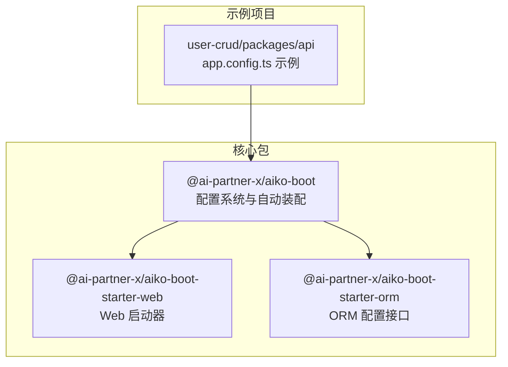
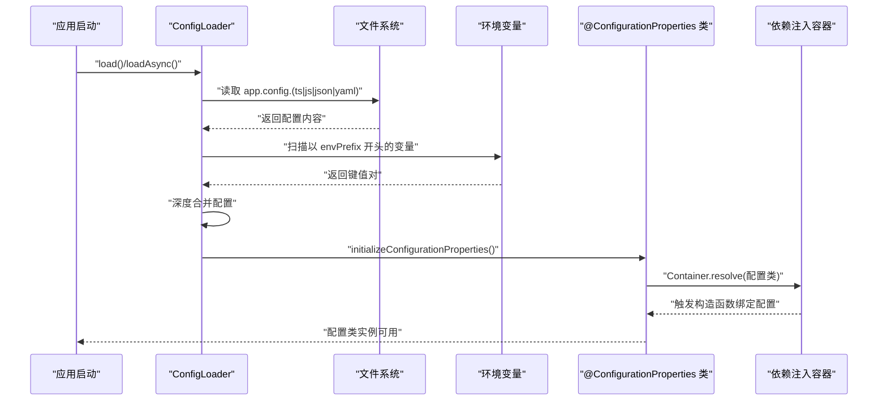
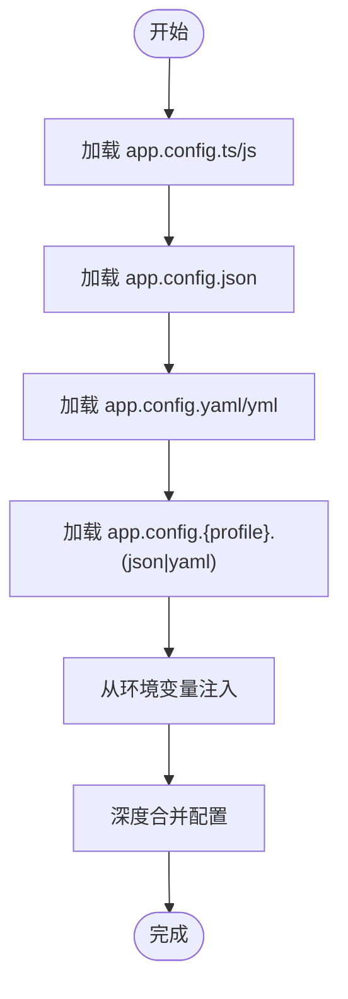
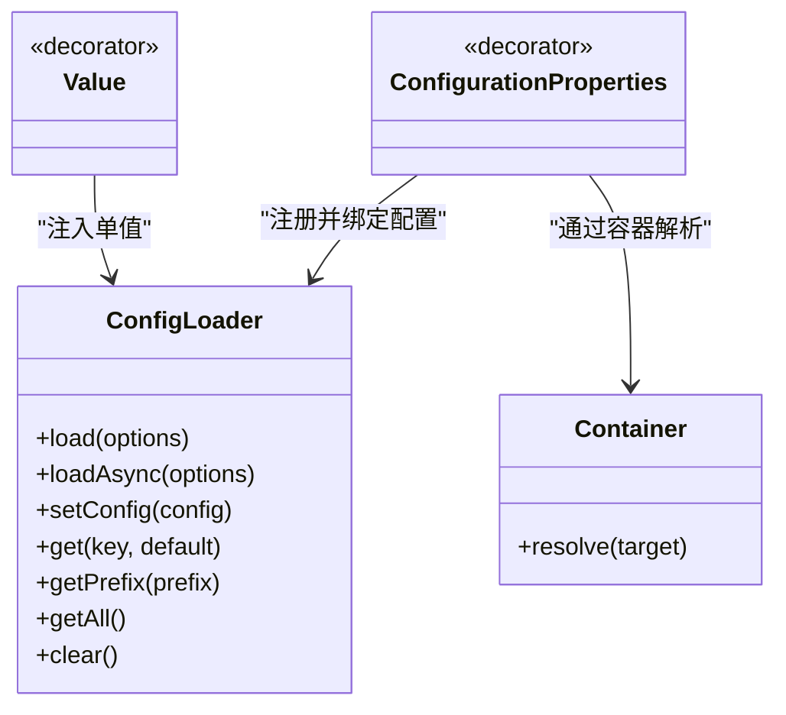
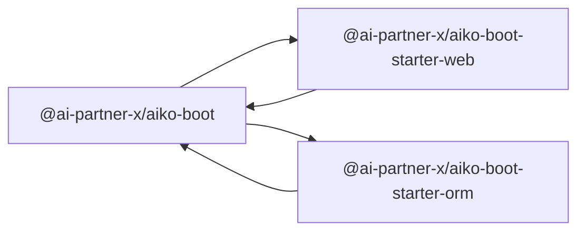

# 环境配置管理

<cite>
**本文引用的文件**
- [packages/aiko-boot/src/boot/config.ts](file://packages/aiko-boot/src/boot/config.ts)
- [packages/aiko-boot/src/boot/index.ts](file://packages/aiko-boot/src/boot/index.ts)
- [packages/aiko-boot-starter-orm/src/config.ts](file://packages/aiko-boot-starter-orm/src/config.ts)
- [packages/aiko-boot/package.json](file://packages/aiko-boot/package.json)
- [packages/aiko-boot-starter-web/package.json](file://packages/aiko-boot-starter-web/package.json)
- [package.json](file://package.json)
- [README.md](file://README.md)
- [app/examples/user-crud/packages/api/app.config.ts](file://app/examples/user-crud/packages/api/app.config.ts)
</cite>

## 目录
1. [简介](#简介)
2. [项目结构](#项目结构)
3. [核心组件](#核心组件)
4. [架构总览](#架构总览)
5. [详细组件分析](#详细组件分析)
6. [依赖关系分析](#依赖关系分析)
7. [性能考虑](#性能考虑)
8. [故障排查指南](#故障排查指南)
9. [结论](#结论)
10. [附录](#附录)

## 简介
本指南围绕“环境配置管理”主题，结合仓库中现有的配置系统实现，提供一套面向开发、测试、预生产与生产的配置管理最佳实践。内容涵盖：
- 不同环境的配置文件组织与差异
- 环境变量定义与使用规范
- 敏感信息的安全存储与加密管理建议
- 配置模板、默认值与环境特定配置
- 配置热更新与动态配置管理机制
- 配置验证与错误处理策略
- 配置迁移与版本管理方法
- 配置监控与审计日志记录
- 配置备份与恢复策略

## 项目结构
该仓库采用 monorepo 结构，核心配置能力位于 aiko-boot 包中；示例项目展示了配置文件的实际落地位置。

图表来源
- [packages/aiko-boot/src/boot/index.ts](file://packages/aiko-boot/src/boot/index.ts#L43-L52)
- [packages/aiko-boot-starter-web/package.json](file://packages/aiko-boot-starter-web/package.json#L32-L37)
- [packages/aiko-boot-starter-orm/src/config.ts](file://packages/aiko-boot-starter-orm/src/config.ts#L1-L77)
- [app/examples/user-crud/packages/api/app.config.ts](file://app/examples/user-crud/packages/api/app.config.ts)

章节来源
- [README.md](file://README.md#L14-L33)
- [package.json](file://package.json#L11-L18)

## 核心组件
- 配置加载器：支持 JSON、YAML、TypeScript/JavaScript 配置文件以及环境变量加载，具备合并覆盖与嵌套路径访问能力。
- 配置注解：@ConfigurationProperties 将配置绑定到类，@Value 注入单个配置值。
- 初始化流程：在应用启动时初始化配置属性类，确保配置在依赖注入容器中可用。

章节来源
- [packages/aiko-boot/src/boot/config.ts](file://packages/aiko-boot/src/boot/config.ts#L49-L101)
- [packages/aiko-boot/src/boot/config.ts](file://packages/aiko-boot/src/boot/config.ts#L334-L365)
- [packages/aiko-boot/src/boot/config.ts](file://packages/aiko-boot/src/boot/config.ts#L382-L392)
- [packages/aiko-boot/src/boot/config.ts](file://packages/aiko-boot/src/boot/config.ts#L438-L447)

## 架构总览
下图展示配置系统的加载与绑定流程，包括文件加载、环境变量注入、配置类初始化与依赖注入容器解析。

图表来源
- [packages/aiko-boot/src/boot/config.ts](file://packages/aiko-boot/src/boot/config.ts#L73-L101)
- [packages/aiko-boot/src/boot/config.ts](file://packages/aiko-boot/src/boot/config.ts#L214-L229)
- [packages/aiko-boot/src/boot/config.ts](file://packages/aiko-boot/src/boot/config.ts#L438-L447)

## 详细组件分析

### 配置加载器（ConfigLoader）
- 文件加载顺序与覆盖规则：先加载默认配置文件，再加载 profile 特定配置，最后加载环境变量，后加载项覆盖先前项。
- 支持的文件类型：app.config.json、app.config.yaml、app.config.yml、app.config.ts/js。
- 环境变量映射：以 envPrefix 为前缀，将大写下划线风格转换为点号分隔的配置路径。
- 嵌套配置访问：通过点号路径访问深层配置，支持默认值回退。
- 异步加载：优先加载 TypeScript/JavaScript 配置文件，便于复杂逻辑或条件配置。

图表来源
- [packages/aiko-boot/src/boot/config.ts](file://packages/aiko-boot/src/boot/config.ts#L111-L143)
- [packages/aiko-boot/src/boot/config.ts](file://packages/aiko-boot/src/boot/config.ts#L192-L209)
- [packages/aiko-boot/src/boot/config.ts](file://packages/aiko-boot/src/boot/config.ts#L231-L243)

章节来源
- [packages/aiko-boot/src/boot/config.ts](file://packages/aiko-boot/src/boot/config.ts#L64-L101)
- [packages/aiko-boot/src/boot/config.ts](file://packages/aiko-boot/src/boot/config.ts#L111-L143)

### 配置注解与绑定
- @ConfigurationProperties(prefix)：将指定前缀的配置绑定到类实例，类需配合依赖注入容器使用。
- @Value(key, defaultValue)：向类的属性注入单个配置值，支持默认值。
- 初始化流程：在应用启动阶段调用 initializeConfigurationProperties，通过容器解析触发构造函数中的配置绑定。

图表来源
- [packages/aiko-boot/src/boot/config.ts](file://packages/aiko-boot/src/boot/config.ts#L334-L365)
- [packages/aiko-boot/src/boot/config.ts](file://packages/aiko-boot/src/boot/config.ts#L382-L392)
- [packages/aiko-boot/src/boot/config.ts](file://packages/aiko-boot/src/boot/config.ts#L438-L447)

章节来源
- [packages/aiko-boot/src/boot/config.ts](file://packages/aiko-boot/src/boot/config.ts#L334-L392)
- [packages/aiko-boot/src/boot/config.ts](file://packages/aiko-boot/src/boot/config.ts#L438-L447)

### ORM 配置接口
- 提供从实体元数据创建数据库适配器的能力，强调通过实体装饰器驱动的配置方式。
- 当数据库未初始化时抛出明确错误，提示先初始化数据库。

章节来源
- [packages/aiko-boot-starter-orm/src/config.ts](file://packages/aiko-boot-starter-orm/src/config.ts#L42-L76)

### 示例项目中的配置文件
- 示例项目在 api 包中提供了 app.config.ts，作为 TypeScript 配置文件的落地示例，体现异步加载与复杂配置的可能性。

章节来源
- [app/examples/user-crud/packages/api/app.config.ts](file://app/examples/user-crud/packages/api/app.config.ts)

## 依赖关系分析
- aiko-boot 为核心配置与自动装配包，提供配置系统与条件装配等能力。
- aiko-boot-starter-web 依赖 aiko-boot，同时导出 aiko-boot.config.json 文件，表明其作为 Web 启动器的配置入口。
- aiko-boot-starter-orm 依赖 aiko-boot，提供 ORM 相关配置接口。

图表来源
- [packages/aiko-boot/package.json](file://packages/aiko-boot/package.json#L35-L38)
- [packages/aiko-boot-starter-web/package.json](file://packages/aiko-boot-starter-web/package.json#L32-L37)
- [packages/aiko-boot-starter-orm/src/config.ts](file://packages/aiko-boot-starter-orm/src/config.ts#L6-L8)

章节来源
- [packages/aiko-boot/package.json](file://packages/aiko-boot/package.json#L35-L38)
- [packages/aiko-boot-starter-web/package.json](file://packages/aiko-boot-starter-web/package.json#L32-L37)

## 性能考虑
- 配置加载仅在应用启动阶段执行一次，避免重复 IO。
- 环境变量解析采用简单正则与基础类型判断，性能开销极低。
- 建议将大型配置拆分为多个小文件，减少单文件体积与解析时间。
- 对于频繁变更的配置，建议通过外部配置中心或缓存层进行集中管理，避免每次重启生效。

## 故障排查指南
- 配置文件无法加载：检查文件是否存在、权限是否正确、格式是否合法（JSON/YAML）。
- 环境变量未生效：确认环境变量前缀与映射规则一致，键名大小写与下划线风格符合约定。
- 配置类未绑定：确认已调用 initializeConfigurationProperties，并在依赖注入容器中解析过配置类。
- 数据库未初始化：当使用 ORM 适配器时，若数据库未初始化会抛出错误，需先完成数据库初始化。

章节来源
- [packages/aiko-boot/src/boot/config.ts](file://packages/aiko-boot/src/boot/config.ts#L206-L208)
- [packages/aiko-boot/src/boot/config.ts](file://packages/aiko-boot/src/boot/config.ts#L226-L228)
- [packages/aiko-boot-starter-orm/src/config.ts](file://packages/aiko-boot-starter-orm/src/config.ts#L45-L47)

## 结论
本仓库提供了接近 Spring Boot 风格的配置系统，支持多源配置加载、环境变量注入与配置类绑定。结合示例项目，可在不同环境中实现清晰的配置分离与安全治理。建议在此基础上扩展动态配置与审计能力，以满足更复杂的运维需求。

## 附录

### 不同环境的配置文件管理
- 开发环境（development）：使用 app.config.development.json/yaml 或 app.config.development.ts/js。
- 测试环境（test）：使用 app.config.test.json/yaml 或 app.config.test.ts/js。
- 预生产环境（staging）：使用 app.config.staging.json/yaml 或 app.config.staging.ts/js。
- 生产环境（production）：使用 app.config.production.json/yaml 或 app.config.production.ts/js。
- 加载顺序：默认配置 → profile 特定配置 → 环境变量（后加载覆盖前加载）。

章节来源
- [packages/aiko-boot/src/boot/config.ts](file://packages/aiko-boot/src/boot/config.ts#L73-L95)

### 环境变量定义与使用
- 命名规范：以 envPrefix（默认 APP_）开头，键名使用大写与下划线，映射为点号分隔的配置路径。
- 类型解析：自动识别布尔、整数、浮点与字符串类型。
- 使用场景：数据库连接、服务端口、开关类参数等。

章节来源
- [packages/aiko-boot/src/boot/config.ts](file://packages/aiko-boot/src/boot/config.ts#L231-L252)

### 敏感信息的安全存储与加密管理
- 建议：将密钥、密码等敏感信息置于环境变量或外部密钥管理服务（如 Vault、KMS），不直接写入配置文件。
- 加密：在应用启动前解密或通过运行时解密模块处理，避免明文落盘。
- 访问控制：限制配置文件与环境变量的读取权限，仅授予必要用户与进程。

### 配置模板、默认值与环境特定配置
- 模板：提供 app.config.ts/js 作为模板，便于条件逻辑与动态生成。
- 默认值：在配置类中设置合理默认值，降低部署成本。
- 环境特定：通过 profile 文件覆盖默认值，满足各环境差异化需求。

章节来源
- [packages/aiko-boot/src/boot/config.ts](file://packages/aiko-boot/src/boot/config.ts#L111-L143)
- [packages/aiko-boot/src/boot/config.ts](file://packages/aiko-boot/src/boot/config.ts#L324-L332)

### 配置热更新与动态配置管理机制
- 当前实现：配置在启动时一次性加载并合并，后续不会自动重新加载。
- 建议方案：引入配置中心（如 Apollo、Nacos）或本地缓存 + 轮询/通知机制，按需刷新配置并触发业务重载。
- 注意事项：确保配置变更不影响正在执行的任务，必要时采用优雅降级与回滚策略。

### 配置验证与错误处理策略
- 格式校验：对 JSON/YAML 进行严格解析，捕获异常并记录警告。
- 类型校验：通过装饰器与类型系统在编译期约束配置结构。
- 运行期校验：在配置类构造或初始化阶段进行必填项与范围检查，失败时中断启动并给出明确提示。

章节来源
- [packages/aiko-boot/src/boot/config.ts](file://packages/aiko-boot/src/boot/config.ts#L206-L208)
- [packages/aiko-boot/src/boot/config.ts](file://packages/aiko-boot/src/boot/config.ts#L226-L228)

### 配置迁移与版本管理方法
- 版本控制：将 app.config.* 文件纳入 Git，记录每次变更与审批。
- 迁移脚本：提供升级/降级脚本，自动迁移键名、默认值与结构变化。
- 回滚策略：保留最近 N 份配置快照，支持一键回滚。

### 配置监控与审计日志记录
- 启动日志：记录加载的配置文件、环境变量与最终生效配置摘要。
- 变更审计：记录配置变更的时间、操作人、变更前后对比，便于追溯。
- 告警机制：对缺失关键配置或类型不匹配发出告警。

### 配置备份与恢复策略
- 备份：定期导出当前生效配置（含环境变量映射），保存至安全存储。
- 恢复：在新环境快速还原配置，确保与历史环境一致。
- 验证：恢复后执行最小化自检，验证关键功能正常。