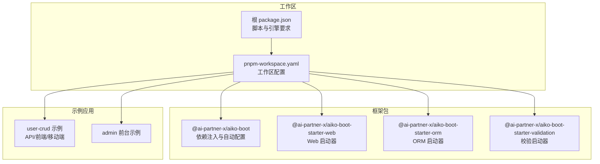
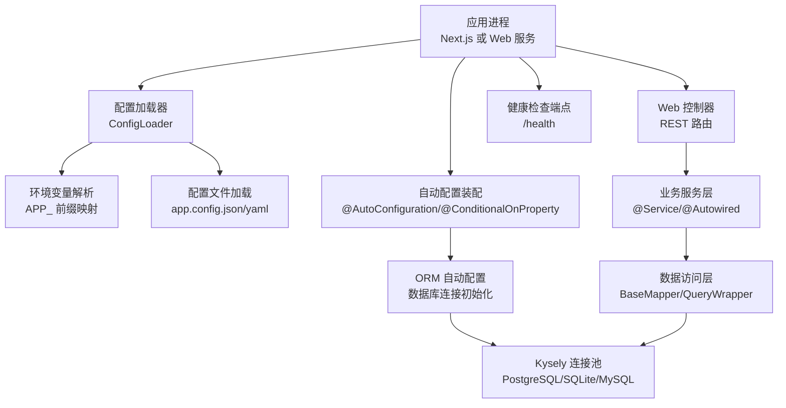
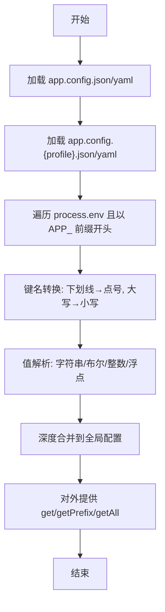
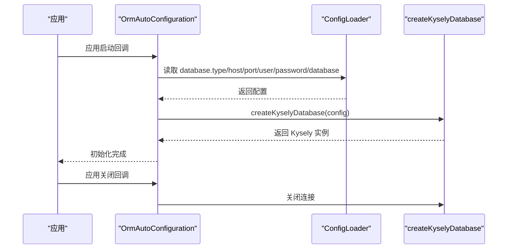
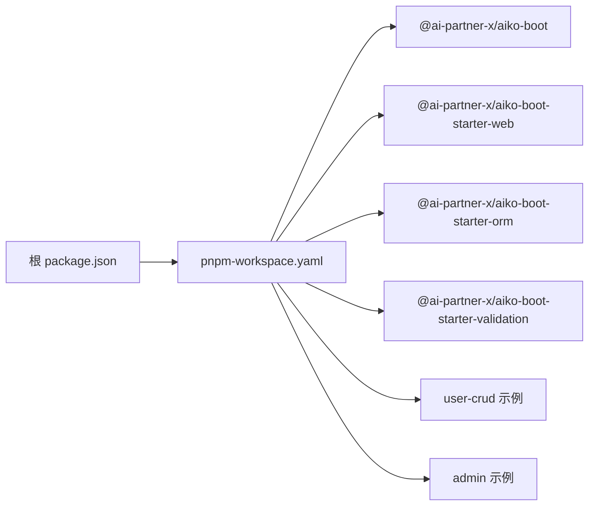

# 生产环境部署

<cite>
**本文引用的文件**
- [package.json](file://package.json)
- [pnpm-workspace.yaml](file://pnpm-workspace.yaml)
- [README.md](file://README.md)
- [app/examples/user-crud/package.json](file://app/examples/user-crud/package.json)
- [app/examples/user-crud/next.config.ts](file://app/examples/user-crud/next.config.ts)
- [packages/aiko-boot/package.json](file://packages/aiko-boot/package.json)
- [packages/aiko-boot-starter-web/package.json](file://packages/aiko-boot-starter-web/package.json)
- [packages/aiko-boot-starter-orm/package.json](file://packages/aiko-boot-starter-orm/package.json)
- [packages/aiko-boot/src/boot/config.ts](file://packages/aiko-boot/src/boot/config.ts)
- [packages/aiko-boot/src/boot/auto-configuration.ts](file://packages/aiko-boot/src/boot/auto-configuration.ts)
- [packages/aiko-boot/src/boot/conditional.ts](file://packages/aiko-boot/src/boot/conditional.ts)
- [packages/aiko-boot-starter-orm/src/auto-configuration.ts](file://packages/aiko-boot-starter-orm/src/auto-configuration.ts)
- [packages/aiko-boot-starter-orm/src/database.ts](file://packages/aiko-boot-starter-orm/src/database.ts)
- [packages/aiko-boot-starter-orm/src/config-augment.ts](file://packages/aiko-boot-starter-orm/src/config-augment.ts)
- [packages/aiko-boot-starter-validation/src/auto-configuration.ts](file://packages/aiko-boot-starter-validation/src/auto-configuration.ts)
</cite>

## 目录
1. [简介](#简介)
2. [项目结构](#项目结构)
3. [核心组件](#核心组件)
4. [架构总览](#架构总览)
5. [详细组件分析](#详细组件分析)
6. [依赖关系分析](#依赖关系分析)
7. [性能考虑](#性能考虑)
8. [故障排查指南](#故障排查指南)
9. [结论](#结论)
10. [附录](#附录)

## 简介
本指导文档面向生产环境部署，围绕该仓库的全栈能力（TypeScript/Next.js + Spring Boot 风格的依赖注入与自动配置）给出系统化的容器化、CI/CD、配置管理、高可用与数据库部署策略。文档以仓库现有能力为基础，结合实际工程实践，提供可落地的生产级方案。

## 项目结构
该项目采用 monorepo 结构，核心由以下部分组成：
- packages：框架与启动器包，提供依赖注入、Web 启动器、ORM 启动器、校验等能力
- app/examples：示例应用（含用户 CRUD 示例与后台管理前端）
- app/framework：框架组件库（UI 组件等）

图表来源
- [pnpm-workspace.yaml](file://pnpm-workspace.yaml#L1-L6)
- [packages/aiko-boot/package.json](file://packages/aiko-boot/package.json#L1-L61)
- [packages/aiko-boot-starter-web/package.json](file://packages/aiko-boot-starter-web/package.json#L1-L60)
- [packages/aiko-boot-starter-orm/package.json](file://packages/aiko-boot-starter-orm/package.json#L1-L55)
- [packages/aiko-boot-starter-validation/package.json](file://packages/aiko-boot-starter-validation/package.json#L1-L60)

章节来源
- [README.md](file://README.md#L14-L33)
- [pnpm-workspace.yaml](file://pnpm-workspace.yaml#L1-L6)
- [package.json](file://package.json#L1-L32)

## 核心组件
- 依赖注入与自动配置：提供装饰器驱动的 DI、生命周期事件、条件装配与配置加载能力
- Web 启动器：提供注解式控制器与路由集成
- ORM 启动器：基于 Kysely 的多数据库支持（PostgreSQL、SQLite、MySQL），自动连接与关闭
- 校验启动器：基于配置的参数校验自动装配

章节来源
- [packages/aiko-boot/src/boot/config.ts](file://packages/aiko-boot/src/boot/config.ts#L1-L354)
- [packages/aiko-boot/src/boot/auto-configuration.ts](file://packages/aiko-boot/src/boot/auto-configuration.ts#L310-L354)
- [packages/aiko-boot/src/boot/conditional.ts](file://packages/aiko-boot/src/boot/conditional.ts#L284-L335)
- [packages/aiko-boot-starter-web/package.json](file://packages/aiko-boot-starter-web/package.json#L1-L60)
- [packages/aiko-boot-starter-orm/src/auto-configuration.ts](file://packages/aiko-boot-starter-orm/src/auto-configuration.ts#L1-L134)
- [packages/aiko-boot-starter-orm/src/database.ts](file://packages/aiko-boot-starter-orm/src/database.ts#L1-L95)
- [packages/aiko-boot-starter-validation/src/auto-configuration.ts](file://packages/aiko-boot-starter-validation/src/auto-configuration.ts#L68-L100)

## 架构总览
下图展示了生产部署的关键路径：应用启动、配置加载、数据库连接、请求处理与健康检查。

图表来源
- [packages/aiko-boot/src/boot/config.ts](file://packages/aiko-boot/src/boot/config.ts#L131-L143)
- [packages/aiko-boot/src/boot/auto-configuration.ts](file://packages/aiko-boot/src/boot/auto-configuration.ts#L310-L354)
- [packages/aiko-boot-starter-orm/src/auto-configuration.ts](file://packages/aiko-boot-starter-orm/src/auto-configuration.ts#L61-L93)
- [packages/aiko-boot-starter-orm/src/database.ts](file://packages/aiko-boot-starter-orm/src/database.ts#L47-L95)

## 详细组件分析

### 配置系统与环境变量
- 配置来源优先级：配置文件 → profile 特定配置 → 环境变量
- 环境变量键名转换规则：APP_DATABASE_HOST → database.host；下划线转点号，大写转小写
- 支持布尔/数字/字符串自动解析
- 提供全局配置读取、前缀读取与全部配置导出

图表来源
- [packages/aiko-boot/src/boot/config.ts](file://packages/aiko-boot/src/boot/config.ts#L131-L143)
- [packages/aiko-boot/src/boot/config.ts](file://packages/aiko-boot/src/boot/config.ts#L231-L266)

章节来源
- [packages/aiko-boot/src/boot/config.ts](file://packages/aiko-boot/src/boot/config.ts#L1-L354)

### ORM 自动配置与数据库连接
- 条件装配：当存在 database.type 时自动初始化
- 支持数据库类型：sqlite、postgres、mysql
- 连接建立：根据类型选择对应方言与连接池
- 关闭流程：应用关闭时释放连接

图表来源
- [packages/aiko-boot-starter-orm/src/auto-configuration.ts](file://packages/aiko-boot-starter-orm/src/auto-configuration.ts#L61-L93)
- [packages/aiko-boot-starter-orm/src/auto-configuration.ts](file://packages/aiko-boot-starter-orm/src/auto-configuration.ts#L98-L133)
- [packages/aiko-boot-starter-orm/src/database.ts](file://packages/aiko-boot-starter-orm/src/database.ts#L47-L95)

章节来源
- [packages/aiko-boot-starter-orm/src/auto-configuration.ts](file://packages/aiko-boot-starter-orm/src/auto-configuration.ts#L1-L134)
- [packages/aiko-boot-starter-orm/src/database.ts](file://packages/aiko-boot-starter-orm/src/database.ts#L1-L95)
- [packages/aiko-boot-starter-orm/src/config-augment.ts](file://packages/aiko-boot-starter-orm/src/config-augment.ts#L1-L25)

### 校验自动配置
- 条件装配：当 validation.enabled=true 时启用
- 支持 failFast、默认消息、字段名包含、分组等配置项
- 在应用就绪时设置全局校验配置

章节来源
- [packages/aiko-boot-starter-validation/src/auto-configuration.ts](file://packages/aiko-boot-starter-validation/src/auto-configuration.ts#L68-L100)

### Web 启动器与控制器
- 提供注解式控制器与路由集成，便于快速搭建 REST API
- 与依赖注入容器配合，实现服务层装配与生命周期管理

章节来源
- [packages/aiko-boot-starter-web/package.json](file://packages/aiko-boot-starter-web/package.json#L1-L60)

## 依赖关系分析
- 工作区：通过 pnpm-workspace.yaml 管理多包
- 包依赖：各启动器依赖核心 aiko-boot；ORM 启动器依赖 pg/mysql2/better-sqlite3 等
- 示例应用：user-crud 示例提供 API、前端与移动端三端示例

图表来源
- [pnpm-workspace.yaml](file://pnpm-workspace.yaml#L1-L6)
- [packages/aiko-boot/package.json](file://packages/aiko-boot/package.json#L1-L61)
- [packages/aiko-boot-starter-web/package.json](file://packages/aiko-boot-starter-web/package.json#L1-L60)
- [packages/aiko-boot-starter-orm/package.json](file://packages/aiko-boot-starter-orm/package.json#L1-L55)

章节来源
- [pnpm-workspace.yaml](file://pnpm-workspace.yaml#L1-L6)
- [package.json](file://package.json#L1-L32)

## 性能考虑
- 构建与打包
  - 使用 tsup 进行模块化打包，建议在生产镜像中使用精简基础镜像与缓存策略
  - 建议对 Next.js 应用启用静态导出或服务端渲染优化，减少首屏延迟
- 数据库连接
  - 使用连接池（PostgreSQL 使用 pg.Pool，MySQL 使用 mysql2.pool），合理设置最大连接数与空闲回收
  - 为长事务与复杂查询设置超时与重试策略
- 配置与启动
  - 将关键配置置于环境变量，避免在启动时进行昂贵的磁盘 IO
  - 利用条件装配按需加载功能模块，缩短启动时间
- 监控与告警
  - 暴露 /health 端点，结合探针实现就绪/存活检查
  - 记录关键指标（QPS、P95/P99、错误率、数据库连接池状态）

[本节为通用指导，无需特定文件来源]

## 故障排查指南
- 配置未生效
  - 检查环境变量前缀是否为 APP_，键名是否符合下划线转点号规则
  - 确认配置文件路径与命名（app.config.json/yaml）及 profile 特定配置是否存在
- 数据库连接失败
  - 核对 database.type 与必填字段（host/port/user/password/database/filename）
  - 检查网络连通性与凭据正确性
- 启动卡顿或异常
  - 查看自动配置日志，确认条件装配是否满足
  - 检查 DI 容器中 Bean 是否成功注册

章节来源
- [packages/aiko-boot/src/boot/config.ts](file://packages/aiko-boot/src/boot/config.ts#L231-L266)
- [packages/aiko-boot/src/boot/auto-configuration.ts](file://packages/aiko-boot/src/boot/auto-configuration.ts#L310-L354)
- [packages/aiko-boot-starter-orm/src/auto-configuration.ts](file://packages/aiko-boot-starter-orm/src/auto-configuration.ts#L61-L93)

## 结论
本仓库提供了完整的 Spring Boot 风格配置与依赖注入能力，并内置 ORM 与校验启动器，能够支撑生产级部署。结合本文的容器化、CI/CD、配置管理、高可用与数据库部署策略，可快速构建稳定可靠的生产环境。

[本节为总结，无需特定文件来源]

## 附录

### A. 容器化部署策略
- 基础镜像选择
  - Node.js 官方镜像或 Alpine 变体，确保满足引擎版本要求
- 多阶段构建
  - 第一阶段：安装依赖与构建（使用 pnpm），产物仅包含 dist
  - 第二阶段：复制最小运行时产物至轻量基础镜像，禁用 dev 依赖
- 运行时
  - 设置 NODE_ENV=production，使用环境变量覆盖配置
  - 暴露健康检查端点 /health，配置探针
  - 限制资源配额与 OOM 保护

[本节为通用指导，无需特定文件来源]

### B. CI/CD 流水线设计
- 触发条件
  - 主分支保护与 PR 触发，分支策略明确
- 步骤建议
  - 依赖安装（pnpm install）
  - 类型检查与代码规范（type-check、lint）
  - 单元测试（test）
  - 构建（build）
  - 镜像构建与推送（多阶段构建）
  - 部署（Kubernetes/Helm/编排平台）
- 发布策略
  - 蓝绿/金丝雀发布，结合滚动更新与回滚策略

[本节为通用指导，无需特定文件来源]

### C. 不同部署环境的配置管理
- 环境变量
  - 使用统一前缀（如 APP_）映射到配置键
  - 机密信息通过平台密钥管理服务注入
- 配置文件
  - app.config.json/yaml 支持多 profile（如 app.config.prod.json）
- 密钥管理
  - 使用平台密钥管理（如 Kubernetes Secret、云厂商密钥服务）
  - 避免将密钥硬编码进镜像或配置文件

[本节为通用指导，无需特定文件来源]

### D. 负载均衡与高可用
- 反向代理
  - Nginx/Traefik/Ingress 控制器，开启健康检查与会话亲和
- 健康检查
  - /health 端点返回 200/500，结合探针
- 故障转移
  - 多副本部署，结合就绪/存活探针与滚动重启

[本节为通用指导，无需特定文件来源]

### E. 数据库部署与连接池
- 连接池配置
  - PostgreSQL：pg.Pool，设置 max、idleTimeout、connectionTimeoutMillis
  - MySQL：mysql2.createPool，设置 connectionLimit、queueLimit、timeout
  - SQLite：better-sqlite3，注意并发与 WAL 模式
- 连接超时与重试
  - 查询超时与事务超时，失败重试与指数退避
- 监控告警
  - 连接池利用率、等待队列长度、慢查询统计

[本节为通用指导，无需特定文件来源]

### F. 部署前性能测试与基准测试
- 压力测试
  - 使用 wrk/JMeter/Artillery，覆盖关键接口
- 基准测试
  - 固定场景与硬件，记录 QPS/P95/P99
- 资源基线
  - CPU/内存/GC 峰值与稳定态对比

[本节为通用指导，无需特定文件来源]

### G. 部署回滚与应急响应
- 回滚策略
  - 版本标签与镜像标签管理，蓝绿/金丝雀回滚
- 应急响应
  - 快速定位（日志、指标、链路追踪）
  - 降级开关与熔断策略
  - 热修复与紧急补丁流程

[本节为通用指导，无需特定文件来源]