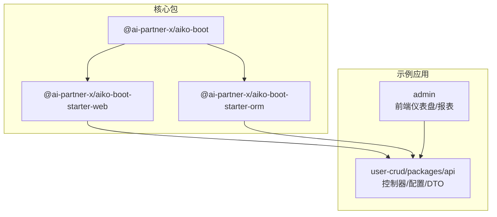
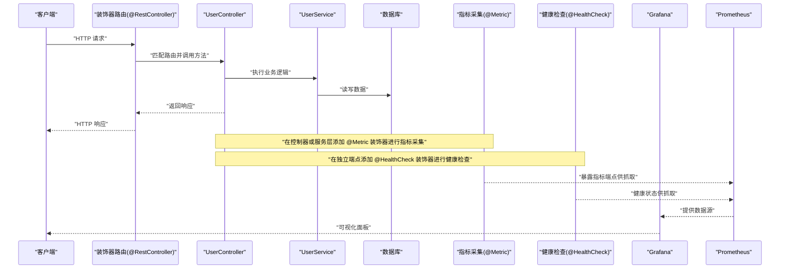
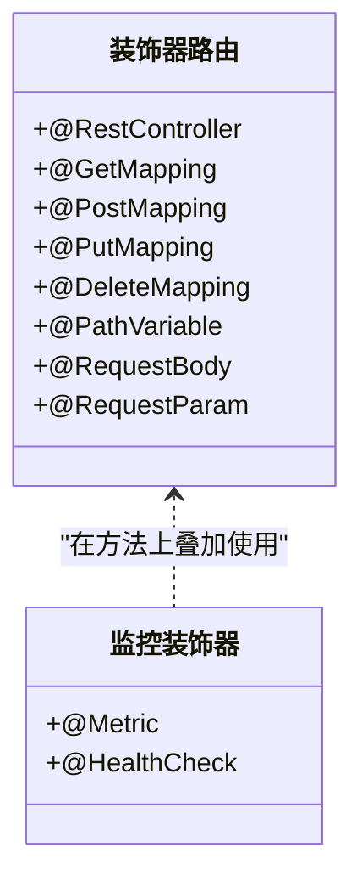
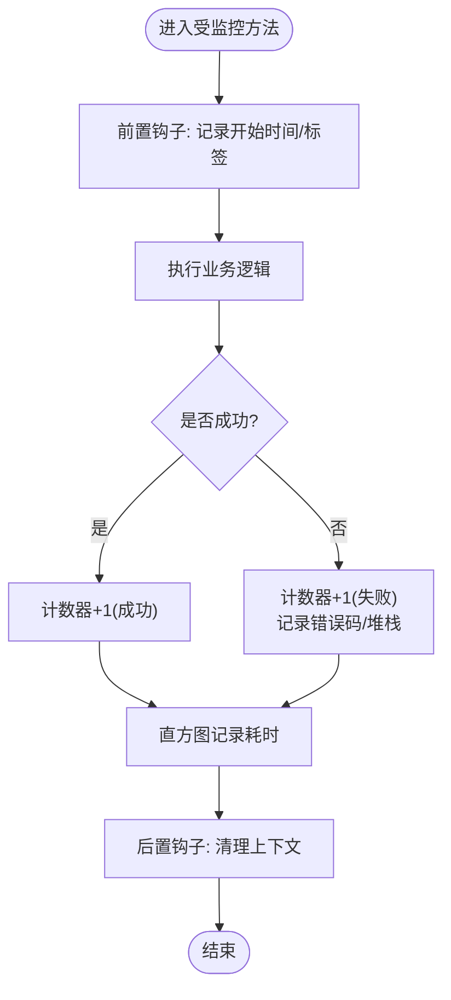
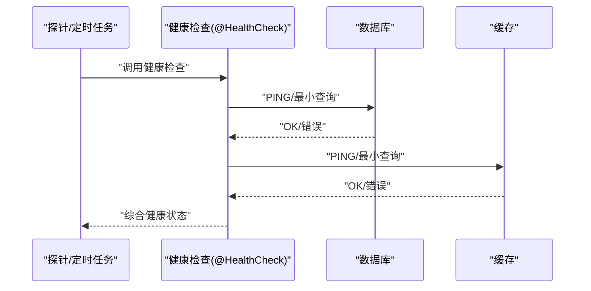
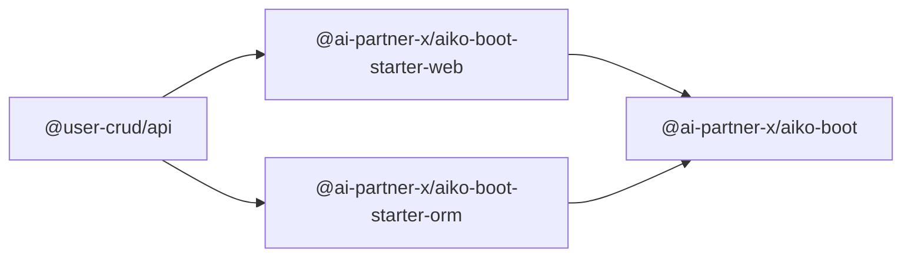

# 应用监控

<cite>
**本文引用的文件**
- [README.md](file://README.md)
- [package.json](file://packages/aiko-boot/package.json)
- [package.json](file://packages/aiko-boot-starter-web/package.json)
- [package.json](file://packages/aiko-boot-starter-orm/package.json)
- [package.json](file://app/examples/user-crud/packages/api/package.json)
- [app.config.ts](file://app/examples/user-crud/packages/api/app.config.ts)
- [user.controller.ts](file://app/examples/user-crud/packages/api/src/controller/user.controller.ts)
- [exception.ts](file://packages/aiko-boot/src/boot/exception.ts)
- [HomePage.tsx](file://app/examples/admin/src/pages/HomePage.tsx)
- [PurchaseOrderReport.tsx](file://app/examples/admin/src/pages/reports/PurchaseOrderReport.tsx)
- [ViewPage.tsx](file://app/examples/admin/src/pages/master-data/plants/ViewPage.tsx)
</cite>

## 目录
1. [简介](#简介)
2. [项目结构](#项目结构)
3. [核心组件](#核心组件)
4. [架构总览](#架构总览)
5. [详细组件分析](#详细组件分析)
6. [依赖关系分析](#依赖关系分析)
7. [性能考量](#性能考量)
8. [故障排查指南](#故障排查指南)
9. [结论](#结论)
10. [附录](#附录)

## 简介
本指南围绕“应用监控”主题，结合仓库中现有的装饰器驱动 Web 框架与示例工程，给出一套可落地的监控体系实施路径。当前代码库提供了：
- 基于装饰器的控制器与路由能力（@RestController、@GetMapping 等）
- 依赖注入与自动装配能力（@Service、@Autowired）
- Spring Boot 风格的配置文件（app.config.ts）
- 前端仪表盘与报表组件（Fiori 风格）

在此基础上，我们将系统化地阐述如何：
- 建立性能指标与业务指标的采集与上报
- 使用装饰器系统扩展监控端点（如 @Metric、@HealthCheck）
- 制定指标定义、采样频率与存储策略
- 搭建监控仪表板（Grafana、Prometheus）与告警规则
- 提供可视化图表配置、趋势分析与报表生成
- 给出最佳实践与常见问题排查

## 项目结构
该仓库采用 monorepo 结构，核心由以下部分组成：
- packages：核心包与启动器
  - aiko-boot：依赖注入与自动配置
  - aiko-boot-starter-web：Web 启动器（装饰器路由）
  - aiko-boot-starter-orm：ORM 启动器（MyBatis-Plus 风格）
- app/examples：示例项目
  - user-crud：后端 API 示例（含控制器、DTO、配置）
  - admin：前端仪表盘与报表示例（Fiori 风格）

**图表来源**
- [package.json](file://packages/aiko-boot/package.json#L1-L61)
- [package.json](file://packages/aiko-boot-starter-web/package.json#L1-L60)
- [package.json](file://packages/aiko-boot-starter-orm/package.json#L1-L55)
- [package.json](file://app/examples/user-crud/packages/api/package.json#L1-L47)

**章节来源**
- [README.md](file://README.md#L14-L33)
- [package.json](file://packages/aiko-boot/package.json#L1-L61)
- [package.json](file://packages/aiko-boot-starter-web/package.json#L1-L60)
- [package.json](file://packages/aiko-boot-starter-orm/package.json#L1-L55)
- [package.json](file://app/examples/user-crud/packages/api/package.json#L1-L47)

## 核心组件
- 装饰器路由与控制器
  - @RestController、@GetMapping、@PostMapping 等装饰器用于声明 REST 端点
  - 控制器通过 @Autowired 注入服务层，实现业务逻辑与监控埋点的解耦
- 依赖注入与自动配置
  - @Service、@Autowired 提供服务注册与注入
  - app.config.ts 提供 Spring Boot 风格的配置（端口、日志、数据库、校验等）
- 前端仪表盘与报表
  - admin 项目提供 Fiori 风格的首页与报表组件，可用于展示监控结果

**章节来源**
- [user.controller.ts](file://app/examples/user-crud/packages/api/src/controller/user.controller.ts#L30-L170)
- [app.config.ts](file://app/examples/user-crud/packages/api/app.config.ts#L9-L44)
- [HomePage.tsx](file://app/examples/admin/src/pages/HomePage.tsx#L1-L39)
- [PurchaseOrderReport.tsx](file://app/examples/admin/src/pages/reports/PurchaseOrderReport.tsx#L278-L292)
- [ViewPage.tsx](file://app/examples/admin/src/pages/master-data/plants/ViewPage.tsx#L294-L329)

## 架构总览
下图展示了从请求到监控数据采集与可视化的整体流程，以及与现有装饰器路由的对应关系。

**图表来源**
- [user.controller.ts](file://app/examples/user-crud/packages/api/src/controller/user.controller.ts#L30-L170)
- [app.config.ts](file://app/examples/user-crud/packages/api/app.config.ts#L9-L44)

## 详细组件分析

### 装饰器路由与监控端点扩展
- 现有装饰器
  - @RestController、@GetMapping、@PostMapping、@PutMapping、@DeleteMapping、@PathVariable、@RequestBody、@RequestParam
  - 通过这些装饰器，可以快速声明 REST 端点，便于后续在这些端点上挂载监控逻辑
- 建议新增装饰器
  - @Metric：用于在方法上标注指标采集（如耗时、请求数、错误数）
  - @HealthCheck：用于在方法上标注健康检查端点（返回系统/服务健康状态）
- 实施要点
  - 在控制器方法上使用 @Metric，自动记录方法耗时、成功率、错误率等
  - 在独立端点上使用 @HealthCheck，统一返回健康状态（如数据库连通性、缓存可用性等）
  - 将指标与健康检查统一暴露为 Prometheus 可抓取的端点

**图表来源**
- [user.controller.ts](file://app/examples/user-crud/packages/api/src/controller/user.controller.ts#L30-L170)

**章节来源**
- [user.controller.ts](file://app/examples/user-crud/packages/api/src/controller/user.controller.ts#L30-L170)

### 性能指标采集与业务指标监控
- 指标类型建议
  - 性能指标：请求耗时（histogram）、请求速率（counter）、错误率（counter）
  - 业务指标：用户注册数、订单创建数、库存变更数等
- 采集位置
  - 控制器层：记录接口耗时、成功率、错误码分布
  - 服务层：记录关键业务操作耗时、重试次数
  - 数据访问层：记录 SQL 执行时间、慢查询数量
- 采样频率与窗口
  - 采用滑动窗口与直方图聚合，按分钟/小时汇总
  - 对高基数标签（如用户 ID）谨慎采样，避免指标风暴
- 存储策略
  - 短期：内存或本地时序存储（如 Prometheus TSDB）
  - 中长期：归档到对象存储或时序数据库（如 InfluxDB、TimescaleDB）

**图表来源**
- [user.controller.ts](file://app/examples/user-crud/packages/api/src/controller/user.controller.ts#L30-L170)

**章节来源**
- [user.controller.ts](file://app/examples/user-crud/packages/api/src/controller/user.controller.ts#L30-L170)

### 系统健康检查实现
- 健康检查端点
  - 新增独立控制器或中间件，提供 /health 端点
  - 返回关键组件健康状态（数据库、缓存、消息队列等）
- 健康检查装饰器
  - @HealthCheck 可用于方法级健康检查，返回布尔或枚举状态
- 健康检查策略
  - 分层检查：连接池、外部依赖、磁盘空间、内存使用
  - 周期性与事件触发结合，异常时快速告警

**图表来源**
- [user.controller.ts](file://app/examples/user-crud/packages/api/src/controller/user.controller.ts#L30-L170)

**章节来源**
- [user.controller.ts](file://app/examples/user-crud/packages/api/src/controller/user.controller.ts#L30-L170)

### 监控仪表板搭建（Grafana + Prometheus）
- 指标暴露
  - 将 @Metric 采集的数据以 Prometheus 格式暴露
  - 在 app.config.ts 中配置端口与上下文路径，确保 Prometheus 可抓取
- Grafana 面板
  - 使用直方图分位数（p50/p90/p95）展示延迟趋势
  - 使用计数器计算错误率与吞吐量
  - 使用即时向量表达式对异常进行实时告警
- 前端仪表盘复用
  - admin 项目中的首页与报表组件可作为监控看板的基础样式与布局参考

**章节来源**
- [app.config.ts](file://app/examples/user-crud/packages/api/app.config.ts#L9-L44)
- [HomePage.tsx](file://app/examples/admin/src/pages/HomePage.tsx#L1-L39)
- [PurchaseOrderReport.tsx](file://app/examples/admin/src/pages/reports/PurchaseOrderReport.tsx#L278-L292)
- [ViewPage.tsx](file://app/examples/admin/src/pages/master-data/plants/ViewPage.tsx#L294-L329)

### 告警规则配置与通知机制
- 告警规则
  - 基于 Prometheus 报警规则（PromQL），设置阈值与持续时间
  - 错误率、P95 延迟、下游依赖不可用等
- 告警级别
  - P0/P1/P2 级别区分紧急程度
- 通知渠道
  - 邮件、Slack、钉钉、企业微信等
  - 与值班流程联动，确保快速处置

[本节为通用实践说明，不直接分析具体文件]

### 监控数据可视化
- 图表配置
  - 使用 Grafana 的面板类型（Graph、Stat、Heatmap、Table）组合展示关键指标
  - 设置时间范围与刷新频率，支持钻取与联动
- 趋势分析
  - 通过同比/环比计算与阈值对比，识别异常波动
- 报表生成
  - 导出 PDF 或定期邮件发送周报/月报
  - admin 项目中的报表组件可作为前端展示模板参考

**章节来源**
- [PurchaseOrderReport.tsx](file://app/examples/admin/src/pages/reports/PurchaseOrderReport.tsx#L278-L292)
- [ViewPage.tsx](file://app/examples/admin/src/pages/master-data/plants/ViewPage.tsx#L294-L329)

## 依赖关系分析
- 包依赖
  - aiko-boot 为核心容器，提供依赖注入与自动配置
  - aiko-boot-starter-web 提供装饰器路由能力
  - aiko-boot-starter-orm 提供 ORM 能力
  - user-crud/api 依赖上述包，构建控制器与配置
- 运行时依赖
  - express、cors、pg、better-sqlite3 等

**图表来源**
- [package.json](file://app/examples/user-crud/packages/api/package.json#L21-L32)
- [package.json](file://packages/aiko-boot-starter-web/package.json#L32-L37)
- [package.json](file://packages/aiko-boot-starter-orm/package.json#L24-L29)
- [package.json](file://packages/aiko-boot/package.json#L35-L38)

**章节来源**
- [package.json](file://app/examples/user-crud/packages/api/package.json#L21-L32)
- [package.json](file://packages/aiko-boot-starter-web/package.json#L32-L37)
- [package.json](file://packages/aiko-boot-starter-orm/package.json#L24-L29)
- [package.json](file://packages/aiko-boot/package.json#L35-L38)

## 性能考量
- 指标开销控制
  - 采样率与直方图桶设置需平衡精度与资源消耗
  - 避免在高频路径上进行昂贵的字符串拼接或深拷贝
- 并发与线程安全
  - 指标累加需使用原子操作或无锁结构
- 存储与查询
  - 合理分区与压缩策略，避免热点标签导致的写放大
- 可观测性成本
  - 通过标签降噪与聚合减少指标维度爆炸

[本节为通用指导，不直接分析具体文件]

## 故障排查指南
- 异常处理与可观测性
  - 使用 @ExceptionHandler 统一捕获异常，记录错误码与堆栈
  - 在异常处理中增加指标埋点（错误计数、错误类型分布）
- 日志与追踪
  - app.config.ts 中开启适当日志级别，定位问题根因
  - 结合链路追踪（如 OpenTelemetry）与指标、日志形成闭环
- 健康检查失效
  - 检查 @HealthCheck 端点可达性与依赖组件状态
  - 确认 Prometheus 抓取间隔与超时设置合理

**章节来源**
- [exception.ts](file://packages/aiko-boot/src/boot/exception.ts#L114-L131)
- [app.config.ts](file://app/examples/user-crud/packages/api/app.config.ts#L19-L24)

## 结论
通过在现有装饰器路由与配置体系之上，引入 @Metric 与 @HealthCheck 装饰器，结合 Prometheus 与 Grafana，可快速构建覆盖性能、业务与健康度的监控体系。配合 admin 项目的前端仪表盘模板，能够高效完成从数据采集到可视化的全链路落地。

[本节为总结性内容，不直接分析具体文件]

## 附录

### 监控端点与装饰器使用清单
- 控制器端点
  - 使用 @RestController 与 @GetMapping/@PostMapping 等装饰器声明端点
  - 在端点方法上叠加 @Metric，采集耗时与错误
- 健康检查
  - 新增独立端点，使用 @HealthCheck 装饰器返回健康状态
- 配置
  - 在 app.config.ts 中配置端口、上下文路径与日志级别

**章节来源**
- [user.controller.ts](file://app/examples/user-crud/packages/api/src/controller/user.controller.ts#L30-L170)
- [app.config.ts](file://app/examples/user-crud/packages/api/app.config.ts#L9-L44)

### 指标定义与采样策略模板
- 指标命名规范
  - 接口级：http_request_duration_seconds、http_requests_total、http_request_errors_total
  - 业务级：business_operation_duration_seconds、business_operations_total
- 采样策略
  - 高频接口：1% 采样；低频接口：全量
  - 标签维度：限定必要标签，避免高基数
- 存储策略
  - 短期保留 7 天，长期归档 90 天

[本节为通用模板说明，不直接分析具体文件]