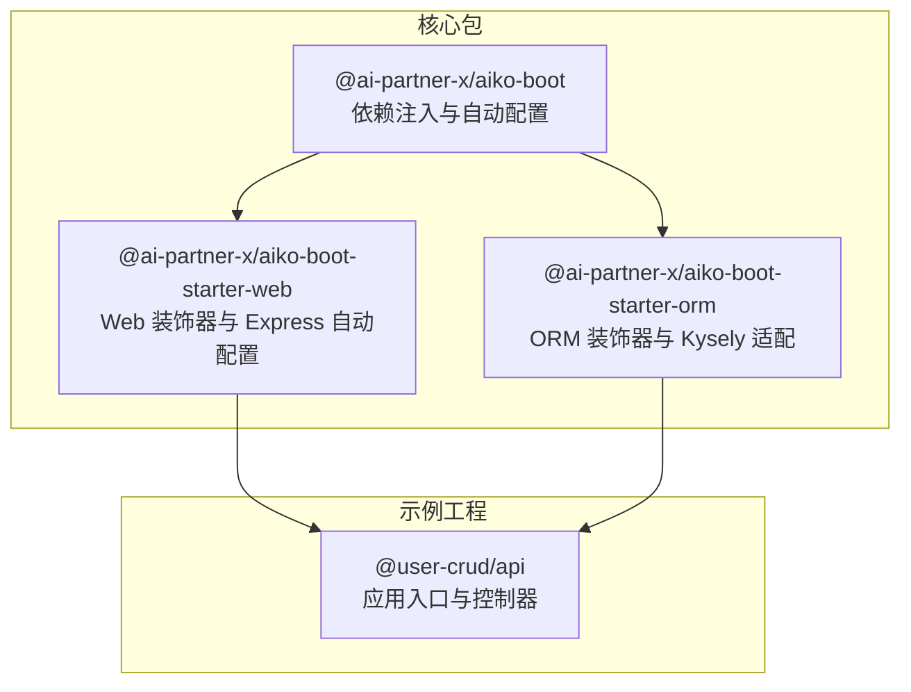
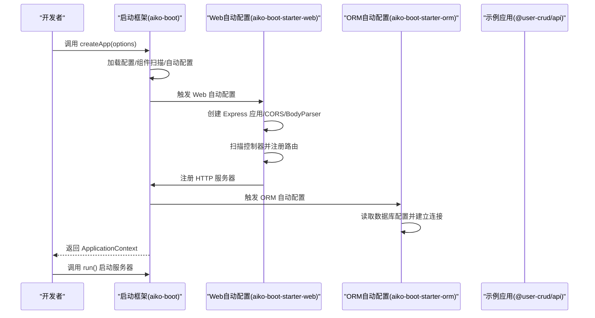
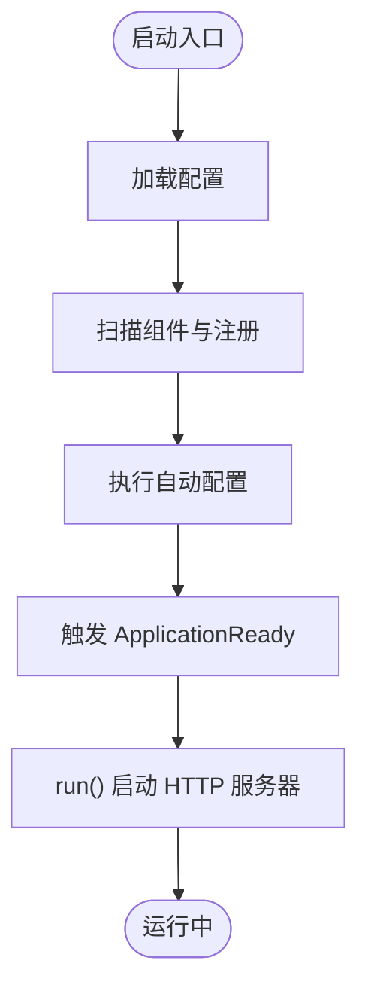
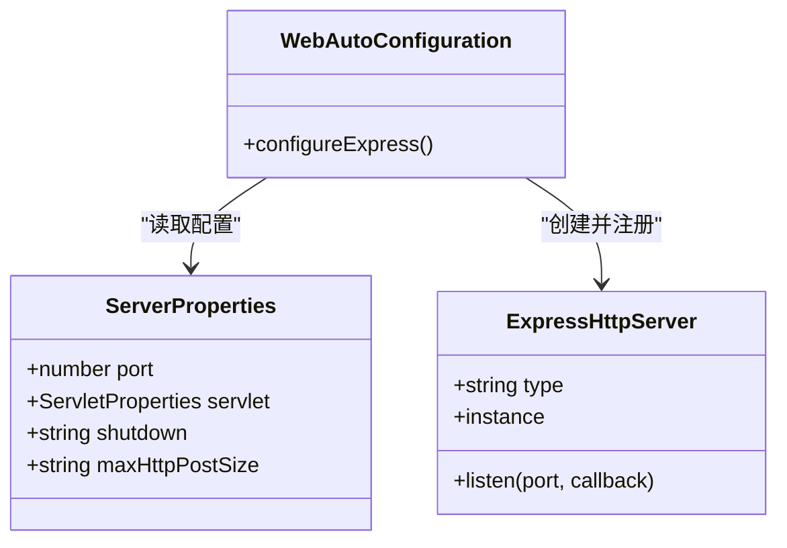
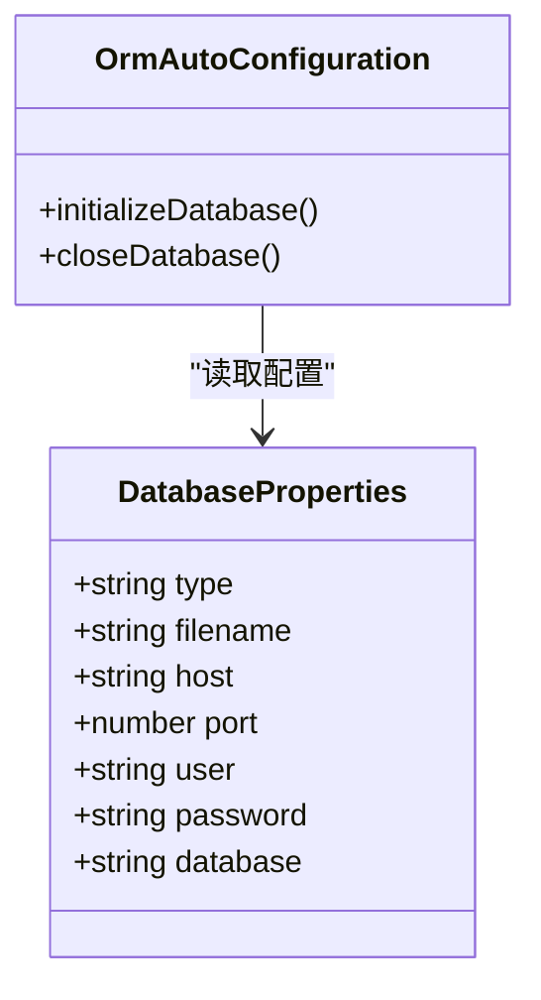
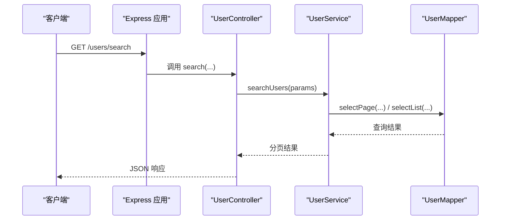
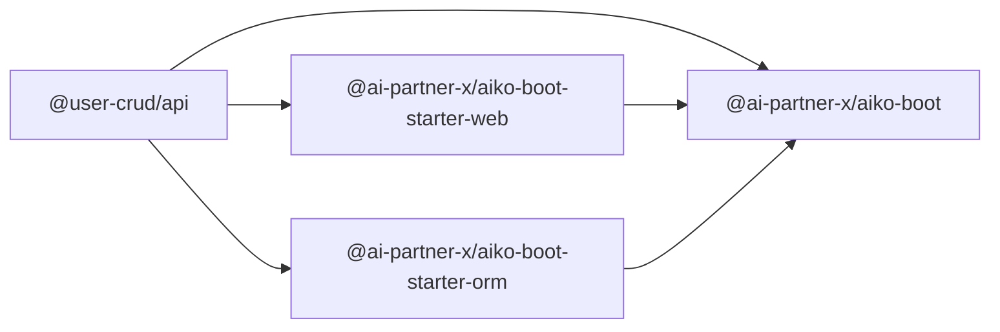

# 性能优化

<cite>
**本文引用的文件**
- [README.md](file://README.md)
- [package.json](file://package.json)
- [packages/aiko-boot/package.json](file://packages/aiko-boot/package.json)
- [packages/aiko-boot-starter-web/package.json](file://packages/aiko-boot-starter-web/package.json)
- [packages/aiko-boot-starter-orm/package.json](file://packages/aiko-boot-starter-orm/package.json)
- [packages/aiko-boot/src/index.ts](file://packages/aiko-boot/src/index.ts)
- [packages/aiko-boot/src/boot/bootstrap.ts](file://packages/aiko-boot/src/boot/bootstrap.ts)
- [packages/aiko-boot-starter-web/src/index.ts](file://packages/aiko-boot-starter-web/src/index.ts)
- [packages/aiko-boot-starter-web/src/auto-configuration.ts](file://packages/aiko-boot-starter-web/src/auto-configuration.ts)
- [packages/aiko-boot-starter-orm/src/index.ts](file://packages/aiko-boot-starter-orm/src/index.ts)
- [packages/aiko-boot-starter-orm/src/auto-configuration.ts](file://packages/aiko-boot-starter-orm/src/auto-configuration.ts)
- [app/examples/user-crud/packages/api/package.json](file://app/examples/user-crud/packages/api/package.json)
- [app/examples/user-crud/packages/api/src/server.ts](file://app/examples/user-crud/packages/api/src/server.ts)
- [app/examples/user-crud/packages/api/src/controller/user.controller.ts](file://app/examples/user-crud/packages/api/src/controller/user.controller.ts)
</cite>

## 目录
1. [简介](#简介)
2. [项目结构](#项目结构)
3. [核心组件](#核心组件)
4. [架构总览](#架构总览)
5. [详细组件分析](#详细组件分析)
6. [依赖分析](#依赖分析)
7. [性能考虑](#性能考虑)
8. [故障排查指南](#故障排查指南)
9. [结论](#结论)
10. [附录](#附录)

## 简介
本文件面向系统性能优化，结合仓库中现有启动框架与示例工程，给出可落地的性能监控指标定义、数据库优化策略、Web 服务优化方案、内存与并发优化、性能测试与基准测试方法论，以及具体优化案例与工具使用建议。内容以仓库实际代码为依据，避免脱离实现的空谈。

## 项目结构
该仓库采用 monorepo 结构，核心由“启动框架 + Web 启动器 + ORM 启动器 + 示例工程”组成。示例工程展示了如何通过装饰器风格的控制器、服务与数据访问层，配合自动配置完成应用启动与路由注册。

图表来源
- [packages/aiko-boot/src/index.ts](file://packages/aiko-boot/src/index.ts#L1-L64)
- [packages/aiko-boot-starter-web/src/index.ts](file://packages/aiko-boot-starter-web/src/index.ts#L1-L73)
- [packages/aiko-boot-starter-orm/src/index.ts](file://packages/aiko-boot-starter-orm/src/index.ts#L1-L91)
- [app/examples/user-crud/packages/api/src/server.ts](file://app/examples/user-crud/packages/api/src/server.ts#L1-L21)

章节来源
- [README.md](file://README.md#L14-L33)
- [package.json](file://package.json#L1-L32)
- [packages/aiko-boot/package.json](file://packages/aiko-boot/package.json#L1-L61)
- [packages/aiko-boot-starter-web/package.json](file://packages/aiko-boot-starter-web/package.json#L1-L60)
- [packages/aiko-boot-starter-orm/package.json](file://packages/aiko-boot-starter-orm/package.json#L1-L55)
- [app/examples/user-crud/packages/api/package.json](file://app/examples/user-crud/packages/api/package.json#L1-L47)

## 核心组件
- 启动框架（aiko-boot）
  - 提供依赖注入、生命周期事件、自动配置加载、优雅停机等能力，是 Web 与 ORM 启动器的基础。
- Web 启动器（aiko-boot-starter-web）
  - 提供 REST 控制器装饰器、Express 路由自动生成、CORS、请求体解析、全局异常处理等。
- ORM 启动器（aiko-boot-starter-orm）
  - 提供实体与映射装饰器、通用 Mapper、条件构造器、多数据库适配（PostgreSQL、SQLite、MySQL）。
- 示例工程（@user-crud/api）
  - 展示如何通过装饰器组织控制器、服务与数据访问层，并通过自动配置启动 HTTP 服务器。

章节来源
- [packages/aiko-boot/src/index.ts](file://packages/aiko-boot/src/index.ts#L1-L64)
- [packages/aiko-boot-starter-web/src/index.ts](file://packages/aiko-boot-starter-web/src/index.ts#L1-L73)
- [packages/aiko-boot-starter-orm/src/index.ts](file://packages/aiko-boot-starter-orm/src/index.ts#L1-L91)
- [app/examples/user-crud/packages/api/src/server.ts](file://app/examples/user-crud/packages/api/src/server.ts#L1-L21)

## 架构总览
下图展示从应用启动到 HTTP 服务可用的关键流程：启动框架加载配置、扫描组件、执行自动配置；Web 启动器创建 Express 应用并注册路由；ORM 启动器按配置初始化数据库连接。

图表来源
- [packages/aiko-boot/src/boot/bootstrap.ts](file://packages/aiko-boot/src/boot/bootstrap.ts#L132-L289)
- [packages/aiko-boot-starter-web/src/auto-configuration.ts](file://packages/aiko-boot-starter-web/src/auto-configuration.ts#L97-L147)
- [packages/aiko-boot-starter-orm/src/auto-configuration.ts](file://packages/aiko-boot-starter-orm/src/auto-configuration.ts#L61-L93)
- [app/examples/user-crud/packages/api/src/server.ts](file://app/examples/user-crud/packages/api/src/server.ts#L16-L21)

## 详细组件分析

### 启动框架（性能相关要点）
- 启动阶段指标
  - 启动耗时：通过上下文中的启动耗时字段记录，可用于评估组件扫描与自动配置成本。
  - 组件加载：扫描目录与动态导入模块，失败会记录错误日志，便于定位性能瓶颈。
- 优雅停机
  - 支持优雅停机模式，可在关闭前释放资源，减少连接泄漏风险。
- 自动配置与条件装配
  - 通过条件注解与配置属性，仅在满足条件时初始化对应组件，避免不必要的初始化开销。

图表来源
- [packages/aiko-boot/src/boot/bootstrap.ts](file://packages/aiko-boot/src/boot/bootstrap.ts#L132-L289)

章节来源
- [packages/aiko-boot/src/boot/bootstrap.ts](file://packages/aiko-boot/src/boot/bootstrap.ts#L46-L90)
- [packages/aiko-boot/src/boot/bootstrap.ts](file://packages/aiko-boot/src/boot/bootstrap.ts#L132-L289)

### Web 启动器（性能相关要点）
- 路由与中间件
  - 默认启用 CORS 与 JSON 请求体解析，支持设置请求体大小上限，避免过大请求导致内存占用过高。
  - 路由注册基于装饰器扫描，避免手写冗长路由，提升开发效率与一致性。
- 异常处理
  - 提供全局异常处理机制，有助于在高并发场景下稳定返回错误信息，降低异常传播成本。
- 服务器配置
  - 支持端口、上下文路径、关闭模式等配置，便于在不同环境进行针对性调优。

图表来源
- [packages/aiko-boot-starter-web/src/auto-configuration.ts](file://packages/aiko-boot-starter-web/src/auto-configuration.ts#L47-L90)
- [packages/aiko-boot-starter-web/src/auto-configuration.ts](file://packages/aiko-boot-starter-web/src/auto-configuration.ts#L97-L147)

章节来源
- [packages/aiko-boot-starter-web/src/auto-configuration.ts](file://packages/aiko-boot-starter-web/src/auto-configuration.ts#L1-L160)
- [packages/aiko-boot-starter-web/src/index.ts](file://packages/aiko-boot-starter-web/src/index.ts#L1-L73)

### ORM 启动器（性能相关要点）
- 多数据库支持
  - 支持 SQLite、PostgreSQL、MySQL，便于在开发/测试/生产环境选择合适存储与连接特性。
- 自动配置与连接管理
  - 在应用启动时根据配置初始化数据库连接，在关闭时释放连接，避免连接泄漏。
- 查询与条件构造
  - 提供条件构造器与通用 Mapper，便于编写高性能查询与分页逻辑。

图表来源
- [packages/aiko-boot-starter-orm/src/auto-configuration.ts](file://packages/aiko-boot-starter-orm/src/auto-configuration.ts#L34-L54)
- [packages/aiko-boot-starter-orm/src/auto-configuration.ts](file://packages/aiko-boot-starter-orm/src/auto-configuration.ts#L61-L93)

章节来源
- [packages/aiko-boot-starter-orm/src/auto-configuration.ts](file://packages/aiko-boot-starter-orm/src/auto-configuration.ts#L1-L135)
- [packages/aiko-boot-starter-orm/src/index.ts](file://packages/aiko-boot-starter-orm/src/index.ts#L1-L91)

### 示例工程（性能相关要点）
- 控制器装饰器
  - 使用 REST 控制器与参数装饰器，简化路由定义与参数解析，减少样板代码带来的维护与性能负担。
- 服务与数据访问层
  - 通过服务层封装业务逻辑，数据访问层使用通用 Mapper 与条件构造器，有利于统一性能策略与缓存策略。

图表来源
- [app/examples/user-crud/packages/api/src/controller/user.controller.ts](file://app/examples/user-crud/packages/api/src/controller/user.controller.ts#L46-L76)
- [packages/aiko-boot-starter-web/src/auto-configuration.ts](file://packages/aiko-boot-starter-web/src/auto-configuration.ts#L127-L139)

章节来源
- [app/examples/user-crud/packages/api/src/controller/user.controller.ts](file://app/examples/user-crud/packages/api/src/controller/user.controller.ts#L1-L170)

## 依赖分析
- 包导出与运行时依赖
  - 启动框架导出装饰器、DI 与启动入口；Web 启动器导出路由与自动配置；ORM 启动器导出装饰器与数据库工厂。
  - 示例工程依赖上述启动器与数据库驱动，形成完整的运行链路。

图表来源
- [app/examples/user-crud/packages/api/package.json](file://app/examples/user-crud/packages/api/package.json#L21-L32)
- [packages/aiko-boot/package.json](file://packages/aiko-boot/package.json#L35-L38)
- [packages/aiko-boot-starter-web/package.json](file://packages/aiko-boot-starter-web/package.json#L32-L37)
- [packages/aiko-boot-starter-orm/package.json](file://packages/aiko-boot-starter-orm/package.json#L24-L29)

章节来源
- [package.json](file://package.json#L11-L18)
- [packages/aiko-boot/package.json](file://packages/aiko-boot/package.json#L1-L61)
- [packages/aiko-boot-starter-web/package.json](file://packages/aiko-boot-starter-web/package.json#L1-L60)
- [packages/aiko-boot-starter-orm/package.json](file://packages/aiko-boot-starter-orm/package.json#L1-L55)
- [app/examples/user-crud/packages/api/package.json](file://app/examples/user-crud/packages/api/package.json#L1-L47)

## 性能考虑

### 性能监控指标与测量方法
- 响应时间
  - 定义：从请求进入服务器到返回响应的总耗时。可通过中间件在进入路由处理前后打点，计算差值并统计 P50/P95/P99。
  - 测量位置：Web 自动配置中注册的 Express 应用，可在路由注册前/后插入中间件进行计时。
- 吞吐量
  - 定义：单位时间内处理的请求数（QPS）。可通过压测工具统计成功请求总数与总耗时。
  - 采集：结合启动框架的启动耗时与运行时日志，评估冷启动与热身对吞吐的影响。
- 资源利用率
  - 定义：CPU、内存、网络带宽、磁盘 IO。可结合 Node.js 进程监控与系统指标采集。
  - 采集：在启动框架的优雅停机钩子中输出资源状态，辅助排障。

章节来源
- [packages/aiko-boot/src/boot/bootstrap.ts](file://packages/aiko-boot/src/boot/bootstrap.ts#L219-L282)
- [packages/aiko-boot-starter-web/src/auto-configuration.ts](file://packages/aiko-boot-starter-web/src/auto-configuration.ts#L117-L146)

### 数据库性能优化策略
- 慢查询分析
  - 在 ORM 层使用条件构造器与分页，避免一次性拉取大量数据；对复杂查询添加 EXPLAIN/ANALYZE（PG/MySQL），定位索引缺失与回表。
- 索引优化
  - 为高频过滤字段（如用户名称、邮箱、时间范围）建立复合索引；避免在索引列上使用函数或隐式转换。
- 连接池调优
  - 根据并发与事务特性设置最大连接数、空闲超时与获取超时；在优雅停机时确保连接池被正确关闭。
- 查询缓存配置
  - 对热点只读数据使用进程内缓存或外部缓存（Redis）；对频繁变更的数据采用失效策略或版本控制。

章节来源
- [packages/aiko-boot-starter-orm/src/auto-configuration.ts](file://packages/aiko-boot-starter-orm/src/auto-configuration.ts#L61-L93)
- [packages/aiko-boot-starter-orm/src/index.ts](file://packages/aiko-boot-starter-orm/src/index.ts#L66-L81)

### Web 服务性能优化方案
- 中间件优化
  - 合理放置中间件顺序，将短路逻辑前置（如限流、鉴权）；避免在中间件中进行阻塞操作。
- 静态资源缓存
  - 将前端产物交由 CDN 或反向代理缓存，设置合理的 Cache-Control 与 ETag；后端 API 返回必要的缓存头。
- 负载均衡与水平扩展
  - 使用反向代理（Nginx/Traefik）做健康检查与会话亲和；多实例部署时注意共享状态与缓存。
- CDN 集成
  - 将静态资源与图片等非动态内容接入 CDN，降低源站压力并提升全球访问速度。

章节来源
- [packages/aiko-boot-starter-web/src/auto-configuration.ts](file://packages/aiko-boot-starter-web/src/auto-configuration.ts#L117-L146)

### 内存管理与垃圾回收优化
- 内存泄漏检测
  - 使用 Node.js 内置 heap 采样与外部工具（如 clinic、heapdump）定期采样；关注长生命周期对象与未释放的定时器/监听器。
- 对象池与复用
  - 对频繁创建/销毁的对象（如 DTO、查询包装器）采用对象池；在服务层避免重复构造大型结构。
- 内存监控
  - 在优雅停机钩子中输出堆快照与进程指标，辅助定位内存增长趋势。

章节来源
- [packages/aiko-boot/src/boot/bootstrap.ts](file://packages/aiko-boot/src/boot/bootstrap.ts#L301-L303)

### 并发与多线程优化
- 线程池与任务调度
  - Node.js 为单线程事件循环模型，可通过 Worker Threads 处理 CPU 密集任务；对 I/O 密集任务优先使用异步与并发控制。
- 锁优化
  - 避免在热路径加锁；对共享资源使用无锁数据结构或细粒度锁；在 ORM 层合理使用事务隔离级别。
- 异步处理模式
  - 使用队列（消息中间件）解耦耗时任务；对批量操作采用分批与背压策略。

章节来源
- [packages/aiko-boot-starter-web/src/auto-configuration.ts](file://packages/aiko-boot-starter-web/src/auto-configuration.ts#L117-L146)

### 性能测试与基准测试方法论
- 压力测试
  - 使用压测工具（如 wrk、Artillery、k6）模拟峰值流量，观察响应时间与错误率拐点，识别瓶颈。
- 负载测试
  - 在不同并发与数据规模下持续运行，评估系统的稳定性与资源消耗曲线。
- 容量规划
  - 基于压测结果与资源利用率，确定 CPU/内存/数据库连接上限与扩容阈值；预留安全余量。

章节来源
- [packages/aiko-boot/src/boot/bootstrap.ts](file://packages/aiko-boot/src/boot/bootstrap.ts#L219-L282)

### 具体优化案例与工具使用
- 案例一：路由热路径优化
  - 在 Web 自动配置中将鉴权与限流中间件置于路由注册之前，减少无效请求进入业务处理。
- 案例二：数据库连接池
  - 在 ORM 自动配置中读取数据库配置，确保连接在优雅停机时被正确关闭，避免连接泄漏。
- 案例三：静态资源缓存
  - 将前端构建产物交由 CDN 缓存，后端 API 返回合适的缓存头，降低带宽与延迟。
- 工具推荐
  - 监控：Prometheus + Grafana（采集 Node 指标与自定义指标）
  - 压测：Artillery/k6/wrk
  - 内存分析：clinic/heapdump/heap snapshot
  - 日志：结构化日志与分布式追踪（如 Jaeger/Zipkin）

章节来源
- [packages/aiko-boot-starter-web/src/auto-configuration.ts](file://packages/aiko-boot-starter-web/src/auto-configuration.ts#L117-L146)
- [packages/aiko-boot-starter-orm/src/auto-configuration.ts](file://packages/aiko-boot-starter-orm/src/auto-configuration.ts#L61-L93)

## 故障排查指南
- 启动失败与组件加载
  - 若组件扫描阶段导入失败，启动框架会记录错误日志；检查模块文件扩展名与测试文件排除规则。
- HTTP 服务器未注册
  - 若未引入 Web 启动器，启动框架会提示未注册 HTTP 服务器；确保已安装并启用相应自动配置。
- 数据库连接异常
  - 检查数据库配置项是否完整；在 ORM 自动配置中确认连接初始化与关闭流程。
- 路由未生效
  - 确认控制器类已通过装饰器标注且被扫描；检查上下文路径与路由前缀配置。

章节来源
- [packages/aiko-boot/src/boot/bootstrap.ts](file://packages/aiko-boot/src/boot/bootstrap.ts#L308-L354)
- [packages/aiko-boot/src/boot/bootstrap.ts](file://packages/aiko-boot/src/boot/bootstrap.ts#L238-L242)
- [packages/aiko-boot-starter-orm/src/auto-configuration.ts](file://packages/aiko-boot-starter-orm/src/auto-configuration.ts#L70-L93)
- [packages/aiko-boot-starter-web/src/auto-configuration.ts](file://packages/aiko-boot-starter-web/src/auto-configuration.ts#L127-L139)

## 结论
本仓库提供了以装饰器与自动配置为核心的全栈开发框架，具备良好的可扩展性与性能优化基础。通过在启动框架、Web 启动器与 ORM 启动器中落实性能监控、数据库优化、中间件与缓存策略、内存与并发优化以及系统化的压测与容量规划，可以在保证开发效率的同时获得稳定的运行性能。

## 附录
- 快速开始与示例
  - 参考示例工程入口文件，了解如何通过自动配置启动 HTTP 服务器与注册路由。
- 版本与运行时要求
  - 项目要求较新的 Node.js 与包管理器版本，确保工具链与依赖兼容性。

章节来源
- [README.md](file://README.md#L35-L54)
- [app/examples/user-crud/packages/api/src/server.ts](file://app/examples/user-crud/packages/api/src/server.ts#L16-L21)
- [package.json](file://package.json#L7-L10)