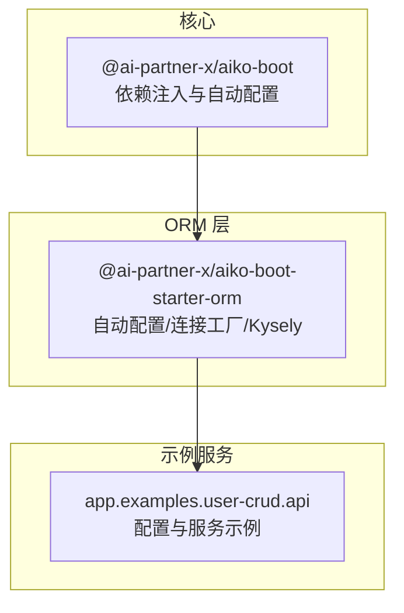
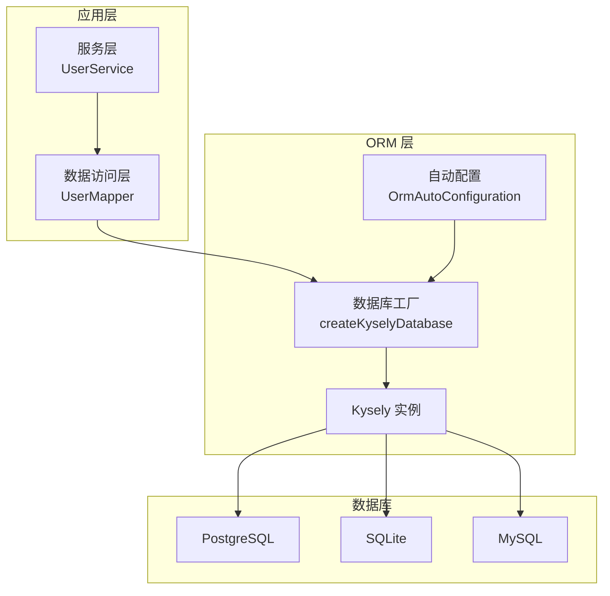
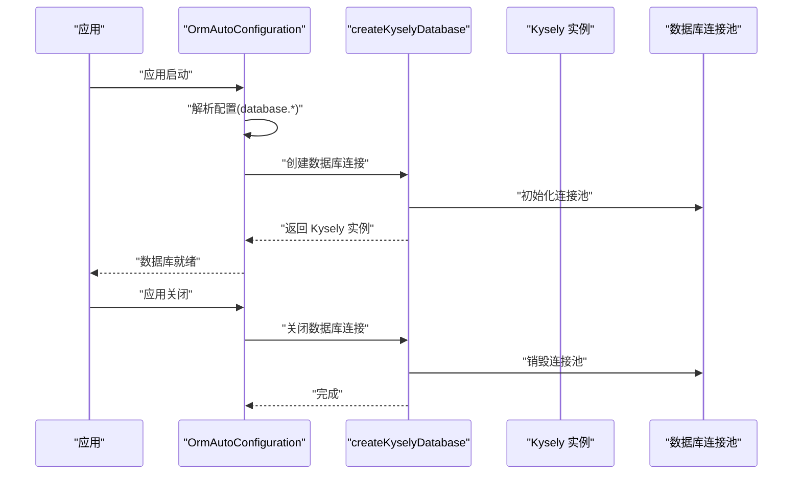
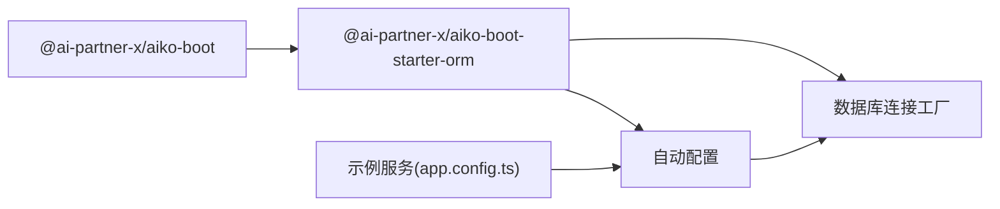

# 数据库监控

<cite>
**本文引用的文件**
- [README.md](file://README.md)
- [packages/aiko-boot-starter-orm/src/auto-configuration.ts](file://packages/aiko-boot-starter-orm/src/auto-configuration.ts)
- [packages/aiko-boot-starter-orm/src/database.ts](file://packages/aiko-boot-starter-orm/src/database.ts)
- [packages/aiko-boot-starter-orm/src/config-augment.ts](file://packages/aiko-boot-starter-orm/src/config-augment.ts)
- [packages/aiko-boot/package.json](file://packages/aiko-boot/package.json)
- [packages/aiko-boot-starter-orm/package.json](file://packages/aiko-boot-starter-orm/package.json)
- [app/examples/user-crud/packages/api/app.config.ts](file://app/examples/user-crud/packages/api/app.config.ts)
- [app/examples/user-crud/packages/api/src/server.ts](file://app/examples/user-crud/packages/api/src/server.ts)
- [app/examples/user-crud/packages/api/src/service/user.service.ts](file://app/examples/user-crud/packages/api/src/service/user.service.ts)
- [app/examples/user-crud/packages/api/src/mapper/user.mapper.ts](file://app/examples/user-crud/packages/api/src/mapper/user.mapper.ts)
</cite>

## 目录
1. [简介](#简介)
2. [项目结构](#项目结构)
3. [核心组件](#核心组件)
4. [架构总览](#架构总览)
5. [详细组件分析](#详细组件分析)
6. [依赖关系分析](#依赖关系分析)
7. [性能考量](#性能考量)
8. [故障排查指南](#故障排查指南)
9. [结论](#结论)
10. [附录](#附录)

## 简介
本技术指导文档面向数据库监控系统，围绕连接池监控、慢查询监控与分析、数据库性能指标监控、备份与恢复监控、数据库安全监控以及容量规划与预警机制进行系统化说明。结合仓库中提供的 ORM 自动配置与数据库连接工厂能力，给出可落地的监控方案与最佳实践，帮助读者在 TypeScript/Next.js 生态下构建可观测、可运维的数据库体系。

## 项目结构
该仓库采用 monorepo 结构，核心与数据库相关的能力集中在以下模块：
- 核心启动与自动配置：@ai-partner-x/aiko-boot
- ORM 启动器与数据库连接工厂：@ai-partner-x/aiko-boot-starter-orm
- 示例 API 服务：app/examples/user-crud/packages/api

图表来源
- [packages/aiko-boot/package.json](file://packages/aiko-boot/package.json#L1-L61)
- [packages/aiko-boot-starter-orm/package.json](file://packages/aiko-boot-starter-orm/package.json#L1-L55)
- [README.md](file://README.md#L14-L33)

章节来源
- [README.md](file://README.md#L14-L33)
- [packages/aiko-boot/package.json](file://packages/aiko-boot/package.json#L1-L61)
- [packages/aiko-boot-starter-orm/package.json](file://packages/aiko-boot-starter-orm/package.json#L1-L55)

## 核心组件
- 自动配置与生命周期钩子：负责在应用启动时按配置初始化数据库连接，在关闭时优雅断开连接。
- 数据库连接工厂：根据配置选择 PostgreSQL、SQLite 或 MySQL，创建 Kysely 实例并管理连接池。
- 配置类型扩展：为应用配置类型自动补充 database.* 字段，便于 IDE 提示与类型安全。

章节来源
- [packages/aiko-boot-starter-orm/src/auto-configuration.ts](file://packages/aiko-boot-starter-orm/src/auto-configuration.ts#L1-L134)
- [packages/aiko-boot-starter-orm/src/database.ts](file://packages/aiko-boot-starter-orm/src/database.ts#L1-L133)
- [packages/aiko-boot-starter-orm/src/config-augment.ts](file://packages/aiko-boot-starter-orm/src/config-augment.ts#L1-L25)

## 架构总览
数据库监控体系以“可观测 + 可治理”为目标，结合 ORM 层的连接管理与示例服务的数据访问模式，形成如下监控闭环：

图表来源
- [packages/aiko-boot-starter-orm/src/auto-configuration.ts](file://packages/aiko-boot-starter-orm/src/auto-configuration.ts#L61-L93)
- [packages/aiko-boot-starter-orm/src/database.ts](file://packages/aiko-boot-starter-orm/src/database.ts#L47-L95)
- [app/examples/user-crud/packages/api/src/service/user.service.ts](file://app/examples/user-crud/packages/api/src/service/user.service.ts#L30-L250)
- [app/examples/user-crud/packages/api/src/mapper/user.mapper.ts](file://app/examples/user-crud/packages/api/src/mapper/user.mapper.ts#L5-L16)

## 详细组件分析

### 连接池监控
目标
- 连接数统计：跟踪活跃连接、空闲连接与最大连接上限。
- 连接泄漏检测：通过生命周期钩子确保连接在应用关闭时释放。
- 连接池性能指标：延迟、超时、拒绝次数等。

实现要点
- 初始化阶段：自动配置在应用启动时读取配置并创建 Kysely 实例，底层数据库驱动负责连接池管理。
- 关闭阶段：应用关闭时调用销毁逻辑，确保连接池被回收。
- 配置入口：示例服务通过 app.config.ts 提供 database.* 配置项，ORM 自动装配生效。

图表来源
- [packages/aiko-boot-starter-orm/src/auto-configuration.ts](file://packages/aiko-boot-starter-orm/src/auto-configuration.ts#L70-L93)
- [packages/aiko-boot-starter-orm/src/database.ts](file://packages/aiko-boot-starter-orm/src/database.ts#L47-L95)

章节来源
- [packages/aiko-boot-starter-orm/src/auto-configuration.ts](file://packages/aiko-boot-starter-orm/src/auto-configuration.ts#L67-L93)
- [packages/aiko-boot-starter-orm/src/database.ts](file://packages/aiko-boot-starter-orm/src/database.ts#L47-L95)
- [app/examples/user-crud/packages/api/app.config.ts](file://app/examples/user-crud/packages/api/app.config.ts#L26-L37)

### 慢查询监控与分析
目标
- 慢查询日志收集：采集超过阈值的 SQL 语句及其执行上下文。
- 执行计划分析：结合数据库 EXPLAIN/EXPLAIN ANALYZE 输出定位瓶颈。
- 查询优化建议：基于索引缺失、全表扫描、N+1 查询等问题提出改进建议。

实现要点
- 在服务层与数据访问层埋点：对关键查询方法进行耗时统计与参数记录。
- 日志落盘与聚合：将慢查询事件写入统一日志系统，支持按接口、SQL、用户维度聚合。
- 执行计划采集：在数据库侧执行 EXPLAIN/EXPLAIN ANALYZE，提取计划树与代价估算。
- 建议生成：基于规则引擎识别常见问题并给出优化建议（如添加索引、拆分查询、使用覆盖索引）。

章节来源
- [app/examples/user-crud/packages/api/src/service/user.service.ts](file://app/examples/user-crud/packages/api/src/service/user.service.ts#L63-L123)
- [app/examples/user-crud/packages/api/src/mapper/user.mapper.ts](file://app/examples/user-crud/packages/api/src/mapper/user.mapper.ts#L7-L16)

### 数据库性能指标监控
目标
- 查询延迟：P50/P95/P99 延迟分布。
- 吞吐量：QPS/RPS 指标，区分读写比例。
- 缓存命中率：应用层缓存与数据库层缓存命中率。
- 锁等待：锁等待时间、阻塞链路与热点表分析。

实现要点
- 指标采集：在数据访问层包装一次调用，记录 SQL、参数、耗时、受影响行数、错误码。
- 指标上报：使用指标 SDK（如 Prometheus/OpenTelemetry）上报直方图与计数器。
- 报表与告警：基于时序数据建立仪表板，设置延迟与错误率阈值告警。

章节来源
- [packages/aiko-boot-starter-orm/src/database.ts](file://packages/aiko-boot-starter-orm/src/database.ts#L47-L95)

### 数据库备份与恢复监控
目标
- 备份任务状态：备份开始/结束、成功/失败、耗时、大小。
- 恢复测试：定期抽样恢复验证数据完整性。
- 数据一致性检查：校验主从一致性、快照一致性。

实现要点
- 备份流程：定时触发备份脚本，记录元数据（时间戳、版本、校验和）。
- 恢复演练：在隔离环境执行恢复测试，比对关键表数据与业务指标。
- 一致性校验：通过哈希校验或行数对比，确保备份可用。

章节来源
- [app/examples/user-crud/packages/api/app.config.ts](file://app/examples/user-crud/packages/api/app.config.ts#L26-L37)

### 数据库安全监控
目标
- 访问审计：记录用户登录、DDL/DML 操作、权限变更。
- 权限变更：最小权限原则下的授权与回收记录。
- 异常登录检测：IP/设备/时间段异常登录行为识别。

实现要点
- 审计日志：在鉴权与关键操作处记录审计事件。
- 权限追踪：集中化权限管理，变更留痕。
- 行为分析：基于历史基线识别异常登录模式。

章节来源
- [app/examples/user-crud/packages/api/app.config.ts](file://app/examples/user-crud/packages/api/app.config.ts#L19-L24)

### 容量规划与预警机制
目标
- 存储空间监控：表空间、索引空间、归档日志占用。
- 增长趋势分析：月度/季度增长预测，识别异常波动。
- 扩容建议：基于容量与增长趋势给出扩容策略（分片/迁移/压缩）。

实现要点
- 指标采集：定期查询数据库对象大小与增长速率。
- 趋势建模：使用时间序列模型预测未来容量需求。
- 预警策略：设置多级阈值（70%/85%/95%），触发不同级别告警与预案。

章节来源
- [app/examples/user-crud/packages/api/app.config.ts](file://app/examples/user-crud/packages/api/app.config.ts#L26-L37)

## 依赖关系分析
ORM 层依赖核心启动包，示例服务通过配置启用 ORM 自动配置，从而实现数据库连接的自动初始化与关闭。

图表来源
- [packages/aiko-boot/package.json](file://packages/aiko-boot/package.json#L25-L38)
- [packages/aiko-boot-starter-orm/package.json](file://packages/aiko-boot-starter-orm/package.json#L24-L29)
- [app/examples/user-crud/packages/api/app.config.ts](file://app/examples/user-crud/packages/api/app.config.ts#L26-L37)

章节来源
- [packages/aiko-boot/package.json](file://packages/aiko-boot/package.json#L1-L61)
- [packages/aiko-boot-starter-orm/package.json](file://packages/aiko-boot-starter-orm/package.json#L1-L55)
- [app/examples/user-crud/packages/api/app.config.ts](file://app/examples/user-crud/packages/api/app.config.ts#L1-L45)

## 性能考量
- 连接池参数：根据并发与数据库承载能力调整最大连接数、空闲超时、连接生命周期。
- SQL 优化：避免 N+1 查询，优先使用批量操作与覆盖索引；对复杂查询使用分页与物化视图。
- 缓存策略：热点数据双写缓存，设置合理过期与失效策略，降低数据库压力。
- 监控粒度：按接口、SQL、用户维度细分指标，快速定位性能瓶颈。

## 故障排查指南
- 连接无法建立
  - 检查配置项是否完整（类型、主机、端口、用户、数据库）。
  - 查看应用启动日志中数据库初始化与关闭阶段的输出。
- 连接泄漏
  - 确认应用关闭流程是否触发数据库关闭钩子。
  - 检查是否存在未释放的事务或长时间运行的查询。
- 慢查询增多
  - 采集慢查询日志并分析执行计划，识别缺少索引或全表扫描。
  - 评估查询参数绑定与统计信息更新情况。
- 备份失败
  - 校验备份命令与权限，检查磁盘空间与网络连通性。
  - 执行恢复演练，验证备份文件可用性。

章节来源
- [packages/aiko-boot-starter-orm/src/auto-configuration.ts](file://packages/aiko-boot-starter-orm/src/auto-configuration.ts#L70-L93)
- [packages/aiko-boot-starter-orm/src/database.ts](file://packages/aiko-boot-starter-orm/src/database.ts#L120-L126)

## 结论
通过 ORM 层的自动配置与连接工厂能力，结合示例服务的数据访问模式，可以构建一套完整的数据库监控体系。建议在生产环境中配套完善的慢查询分析、性能指标采集、备份恢复验证与容量预警机制，持续优化数据库性能与稳定性。

## 附录

### 监控工具配置示例（概念性）
- 指标采集
  - 使用直方图记录 SQL 调用耗时，标签包含接口名、SQL 类型、数据库类型。
  - 使用计数器记录错误码分布与总调用次数。
- 日志采集
  - 将慢查询事件写入统一日志系统，支持关键词检索与聚合分析。
- 告警策略
  - 设置延迟阈值与错误率阈值，区分严重/警告级别。
- 备份与恢复
  - 定时任务触发备份，记录元数据；周期性恢复演练并比对关键指标。

### 数据库优化实践案例（概念性）
- 案例一：复合索引优化
  - 场景：频繁按用户名与年龄范围查询。
  - 方案：创建 (username, age) 复合索引，减少排序与回表。
- 案例二：分页优化
  - 场景：大数据量分页导致延迟升高。
  - 方案：使用基于游标的分页或延迟关联，避免 OFFSET 过大。
- 案例三：批量写入
  - 场景：高频插入导致写放大。
  - 方案：使用批量插入与事务合并，降低往返与锁竞争。