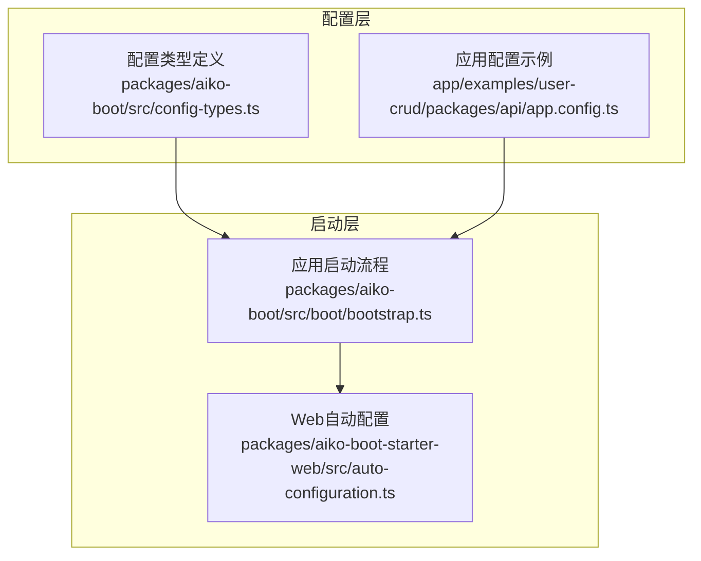
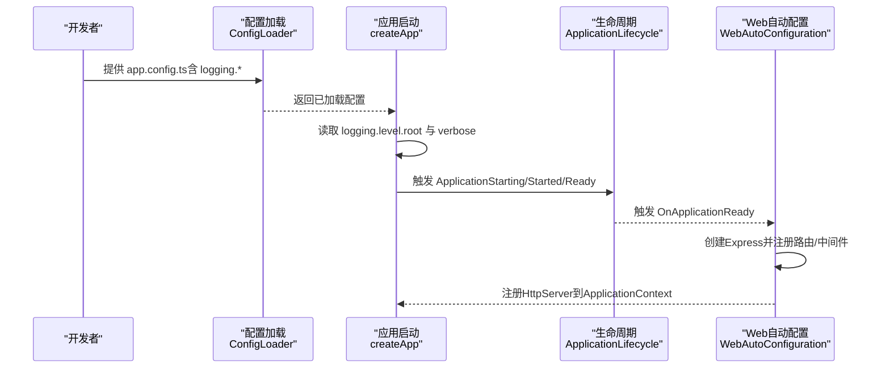
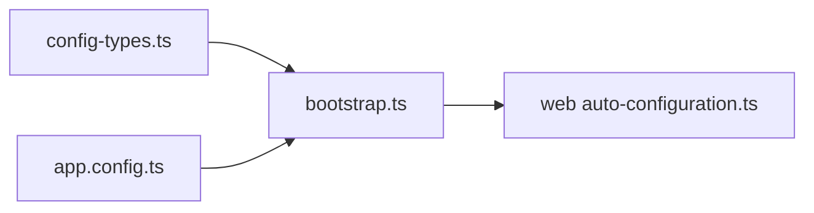

# 日志管理

<cite>
**本文引用的文件**
- [README.md](file://README.md)
- [packages/aiko-boot/src/config-types.ts](file://packages/aiko-boot/src/config-types.ts)
- [packages/aiko-boot/src/boot/bootstrap.ts](file://packages/aiko-boot/src/boot/bootstrap.ts)
- [app/examples/user-crud/packages/api/app.config.ts](file://app/examples/user-crud/packages/api/app.config.ts)
- [packages/aiko-boot-starter-web/src/auto-configuration.ts](file://packages/aiko-boot-starter-web/src/auto-configuration.ts)
- [packages/aiko-boot-starter-web/src/config-augment.ts](file://packages/aiko-boot-starter-web/src/config-augment.ts)
</cite>

## 目录
1. [简介](#简介)
2. [项目结构](#项目结构)
3. [核心组件](#核心组件)
4. [架构总览](#架构总览)
5. [组件详解](#组件详解)
6. [依赖关系分析](#依赖关系分析)
7. [性能考虑](#性能考虑)
8. [故障排除指南](#故障排除指南)
9. [结论](#结论)
10. [附录](#附录)

## 简介
本指南面向日志管理系统的设计与运维，结合仓库中现有的配置类型与启动流程，系统化阐述结构化日志的实现要点（格式标准化、字段定义、日志级别管理）、日志聚合与分析的落地思路（ELK/Fluentd集成建议）、日志轮转与归档策略、安全与隐私保护、性能优化技巧以及故障排除方法。需要特别说明的是：当前仓库未包含实际的日志记录器实现与外部日志系统集成代码，因此本指南以“如何在现有框架基础上接入并规范日志”为主线，提供可操作的配置与实施建议。

## 项目结构
围绕日志管理的关键文件与职责如下：
- 配置类型定义：统一的配置接口与日志配置项（根级别、包级别、文件路径、格式模板）
- 应用启动流程：读取配置、触发生命周期事件、注册HTTP服务器
- 示例配置：展示如何在应用配置中声明日志级别
- Web自动配置：提供HTTP服务器注册与中间件集成能力（便于后续接入日志中间件）

图表来源
- [packages/aiko-boot/src/config-types.ts](file://packages/aiko-boot/src/config-types.ts#L1-L76)
- [packages/aiko-boot/src/boot/bootstrap.ts](file://packages/aiko-boot/src/boot/bootstrap.ts#L143-L206)
- [app/examples/user-crud/packages/api/app.config.ts](file://app/examples/user-crud/packages/api/app.config.ts#L19-L24)
- [packages/aiko-boot-starter-web/src/auto-configuration.ts](file://packages/aiko-boot-starter-web/src/auto-configuration.ts#L97-L146)

章节来源
- [README.md](file://README.md#L14-L33)
- [packages/aiko-boot/src/config-types.ts](file://packages/aiko-boot/src/config-types.ts#L1-L76)
- [packages/aiko-boot/src/boot/bootstrap.ts](file://packages/aiko-boot/src/boot/bootstrap.ts#L143-L206)
- [app/examples/user-crud/packages/api/app.config.ts](file://app/examples/user-crud/packages/api/app.config.ts#L1-L45)
- [packages/aiko-boot-starter-web/src/auto-configuration.ts](file://packages/aiko-boot-starter-web/src/auto-configuration.ts#L1-L160)

## 核心组件
- 配置类型与日志配置项
  - 根日志级别与包级日志级别
  - 日志文件路径与控制台/文件格式模板
- 应用启动阶段对日志级别的读取与verbose行为联动
- Web自动配置对HTTP服务器的注册与中间件扩展点

章节来源
- [packages/aiko-boot/src/config-types.ts](file://packages/aiko-boot/src/config-types.ts#L10-L46)
- [packages/aiko-boot/src/boot/bootstrap.ts](file://packages/aiko-boot/src/boot/bootstrap.ts#L149-L152)
- [packages/aiko-boot-starter-web/src/auto-configuration.ts](file://packages/aiko-boot-starter-web/src/auto-configuration.ts#L97-L146)

## 架构总览
下图展示了从配置到启动再到Web服务器注册的整体流程，以及日志配置在其中的参与位置。

图表来源
- [packages/aiko-boot/src/boot/bootstrap.ts](file://packages/aiko-boot/src/boot/bootstrap.ts#L143-L206)
- [packages/aiko-boot-starter-web/src/auto-configuration.ts](file://packages/aiko-boot-starter-web/src/auto-configuration.ts#L104-L146)

## 组件详解

### 日志配置类型与字段定义
- 根日志级别（logging.level.root）
  - 取值范围：debug | info | warn | error
  - 作用域：全局默认级别
- 包级日志级别（logging.level.<package>)
  - 键为包名字符串，值为上述级别之一
  - 用于精细化控制不同模块日志输出
- 文件路径（logging.file.name）
  - 指定日志文件输出路径
- 控制台与文件格式（logging.pattern.console / logging.pattern.file）
  - 用于定义结构化输出格式（如JSON键名、时间戳格式、字段顺序等）

章节来源
- [packages/aiko-boot/src/config-types.ts](file://packages/aiko-boot/src/config-types.ts#L10-L46)

### 应用启动中的日志级别读取
- 在启动阶段读取根日志级别，并据此决定verbose行为
- verbose为true时，启动过程会输出更详细的控制台日志
- 该机制为后续接入结构化日志记录器提供了统一开关

章节来源
- [packages/aiko-boot/src/boot/bootstrap.ts](file://packages/aiko-boot/src/boot/bootstrap.ts#L149-L152)

### 示例配置中的日志级别
- 在示例应用配置中，设置根日志级别为debug，便于开发调试
- 生产环境建议调整为info或更高级别

章节来源
- [app/examples/user-crud/packages/api/app.config.ts](file://app/examples/user-crud/packages/api/app.config.ts#L19-L24)

### Web自动配置与日志中间件集成
- Web自动配置负责创建Express服务器并在应用就绪后注册
- 可在此阶段引入日志中间件（如morgan、winston transport等），实现请求级结构化日志采集
- 通过全局异常处理器与路由注册，确保日志覆盖到所有HTTP请求

章节来源
- [packages/aiko-boot-starter-web/src/auto-configuration.ts](file://packages/aiko-boot-starter-web/src/auto-configuration.ts#L104-L146)

### 结构化日志实现建议
- 字段标准化
  - 固定字段：timestamp、level、message、service、version、traceId、spanId、module、method、path、statusCode、durationMs
  - 动态字段：根据业务场景追加（如userId、tenantId、requestId）
- 输出格式
  - 控制台：紧凑JSON，便于机器解析
  - 文件：按天滚动，保留7-30天，支持压缩归档
- 日志级别管理
  - 根级别：全局阈值
  - 包级别：按模块细化（如业务层、数据层、网关层）
  - 运行期动态调整：通过配置中心或热更新接口变更

章节来源
- [packages/aiko-boot/src/config-types.ts](file://packages/aiko-boot/src/config-types.ts#L10-L46)
- [packages/aiko-boot/src/boot/bootstrap.ts](file://packages/aiko-boot/src/boot/bootstrap.ts#L149-L152)

### 日志聚合与分析（ELK/Fluentd）
- Fluentd/Fluent Bit
  - 采集应用stdout/stderr与日志文件
  - 通过过滤器进行结构化解析与字段提取
  - 发送到Elasticsearch
- Elasticsearch
  - 建议使用索引模板与别名管理（按日期滚动）
  - 预聚合查询与可视化（Kibana）
- Kibana
  - 构建仪表板：错误率、P95/P99延迟、模块级错误TopN
- 运维建议
  - 为高QPS服务开启批量写入与重试
  - 对敏感字段在采集侧脱敏（如信用卡号、手机号）

章节来源
- [packages/aiko-boot-starter-web/src/auto-configuration.ts](file://packages/aiko-boot-starter-web/src/auto-configuration.ts#L112-L145)

### 日志搜索、过滤与统计分析
- 搜索
  - 时间范围、关键字、状态码、traceId
- 过滤
  - 按模块、用户ID、租户ID、HTTP方法、路径前缀
- 统计
  - 错误率、成功率、响应时间分布、吞吐量
- 报警
  - 异常突增、P95超阈、依赖降级

章节来源
- [packages/aiko-boot/src/config-types.ts](file://packages/aiko-boot/src/config-types.ts#L10-L46)

### 日志轮转与归档策略
- 文件大小限制
  - 单文件上限（如100MB），超过则滚动
- 时间轮转
  - 按日/小时滚动，保留7-30天
- 压缩存储
  - 归档文件压缩（gzip/snappy），降低存储成本
- 清理策略
  - 基于保留期的自动化清理，避免磁盘占满

章节来源
- [packages/aiko-boot/src/config-types.ts](file://packages/aiko-boot/src/config-types.ts#L37-L45)

### 日志安全与隐私保护
- 敏感信息脱敏
  - 采集侧正则替换（身份证、银行卡、手机号、密码）
  - 传输加密（TLS）
- 访问控制
  - 仅授权人员可访问日志系统
  - 审计日志记录对日志系统的操作
- 审计日志
  - 记录谁在何时查询了哪些日志，用于合规追溯

章节来源
- [packages/aiko-boot-starter-web/src/auto-configuration.ts](file://packages/aiko-boot-starter-web/src/auto-configuration.ts#L112-L145)

### 性能优化技巧
- 异步写入
  - 使用缓冲队列与后台线程写盘，减少主线程阻塞
- 缓冲区管理
  - 批量刷盘、背压控制、丢弃策略（可选）
- 磁盘空间监控
  - 预留阈值告警，自动触发清理或扩容
- 日志采样
  - 高频接口采样输出，降低噪声

章节来源
- [packages/aiko-boot/src/boot/bootstrap.ts](file://packages/aiko-boot/src/boot/bootstrap.ts#L149-L152)

## 依赖关系分析
- 配置类型定义被启动流程读取，影响verbose与后续行为
- Web自动配置在应用就绪后注册HTTP服务器，为日志中间件提供挂载点
- 示例配置通过app.config.ts声明日志级别，驱动启动阶段的行为

图表来源
- [packages/aiko-boot/src/config-types.ts](file://packages/aiko-boot/src/config-types.ts#L1-L76)
- [packages/aiko-boot/src/boot/bootstrap.ts](file://packages/aiko-boot/src/boot/bootstrap.ts#L143-L206)
- [app/examples/user-crud/packages/api/app.config.ts](file://app/examples/user-crud/packages/api/app.config.ts#L19-L24)
- [packages/aiko-boot-starter-web/src/auto-configuration.ts](file://packages/aiko-boot-starter-web/src/auto-configuration.ts#L97-L146)

章节来源
- [packages/aiko-boot/src/config-types.ts](file://packages/aiko-boot/src/config-types.ts#L1-L76)
- [packages/aiko-boot/src/boot/bootstrap.ts](file://packages/aiko-boot/src/boot/bootstrap.ts#L143-L206)
- [app/examples/user-crud/packages/api/app.config.ts](file://app/examples/user-crud/packages/api/app.config.ts#L1-L45)
- [packages/aiko-boot-starter-web/src/auto-configuration.ts](file://packages/aiko-boot-starter-web/src/auto-configuration.ts#L1-L160)

## 性能考虑
- 启动阶段verbose由日志级别决定，避免生产环境不必要的冗余输出
- Web中间件链路尽量轻量化，避免阻塞请求处理
- 日志系统自身应具备限流与降级能力，防止雪崩

章节来源
- [packages/aiko-boot/src/boot/bootstrap.ts](file://packages/aiko-boot/src/boot/bootstrap.ts#L149-L152)
- [packages/aiko-boot-starter-web/src/auto-configuration.ts](file://packages/aiko-boot-starter-web/src/auto-configuration.ts#L112-L145)

## 故障排除指南
- 启动阶段未输出预期日志
  - 检查app.config.ts中logging.level.root是否为debug；若为info，则不会输出详细启动日志
  - 确认启动选项verbose是否传入或由配置推导为true
- 未注册HTTP服务器导致无法接收请求日志
  - 确保已安装并启用Web自动配置；检查控制台是否有“未注册HTTP服务器”的警告
- 日志格式不符合预期
  - 检查logging.pattern.console与logging.pattern.file是否正确配置
  - 若使用外部日志系统，请确认采集器的解析规则与字段映射

章节来源
- [packages/aiko-boot/src/boot/bootstrap.ts](file://packages/aiko-boot/src/boot/bootstrap.ts#L238-L241)
- [packages/aiko-boot/src/config-types.ts](file://packages/aiko-boot/src/config-types.ts#L41-L46)
- [app/examples/user-crud/packages/api/app.config.ts](file://app/examples/user-crud/packages/api/app.config.ts#L19-L24)

## 结论
本指南基于仓库中的配置类型与启动流程，给出了在现有框架上实现结构化日志、接入日志聚合系统、制定轮转与归档策略、落实安全与隐私保护以及优化性能的系统性方案。由于仓库未包含具体日志记录器与外部系统集成代码，建议在Web自动配置的注册阶段引入日志中间件，并结合配置中心实现运行期的日志级别与格式动态调整。

## 附录
- 配置项清单（Spring Boot风格）
  - logging.level.root：全局日志级别
  - logging.level.<package>：包级日志级别
  - logging.file.name：日志文件路径
  - logging.pattern.console / logging.pattern.file：控制台与文件格式模板
- 示例配置路径
  - 应用配置示例：app/examples/user-crud/packages/api/app.config.ts

章节来源
- [packages/aiko-boot/src/config-types.ts](file://packages/aiko-boot/src/config-types.ts#L10-L46)
- [app/examples/user-crud/packages/api/app.config.ts](file://app/examples/user-crud/packages/api/app.config.ts#L19-L24)