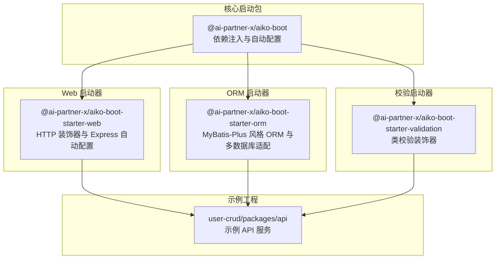
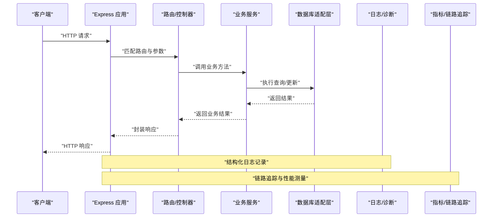
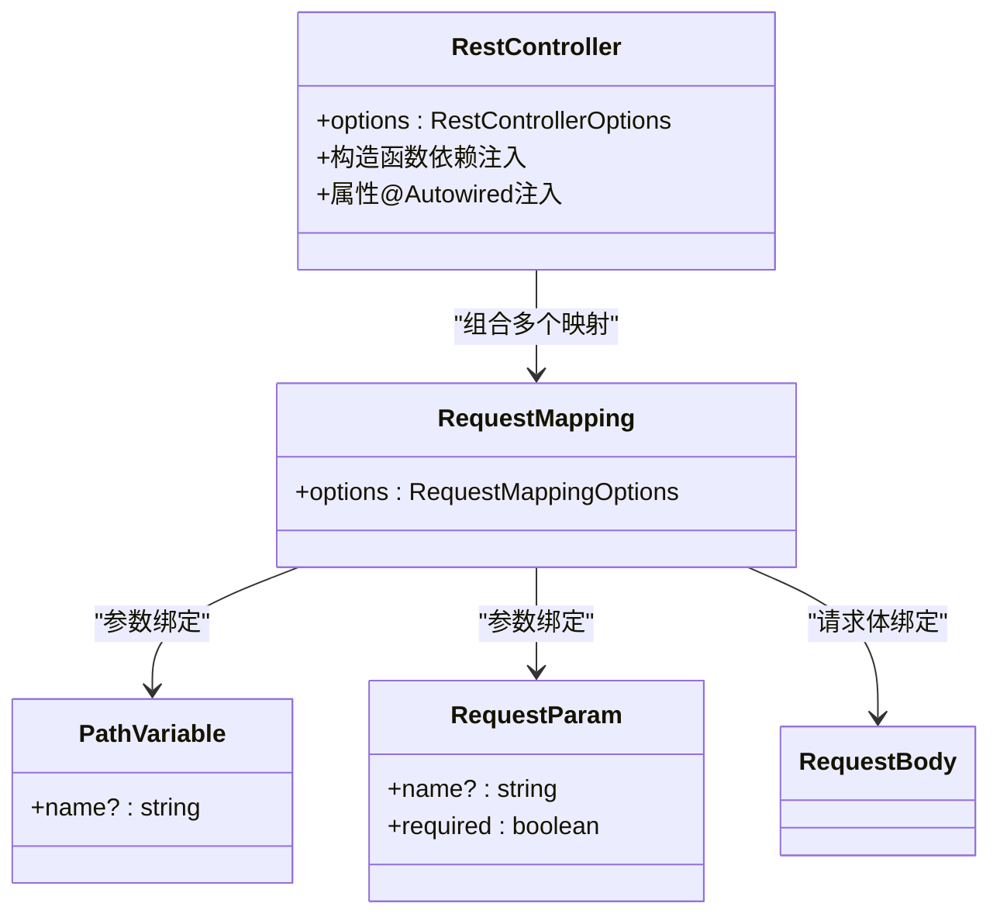
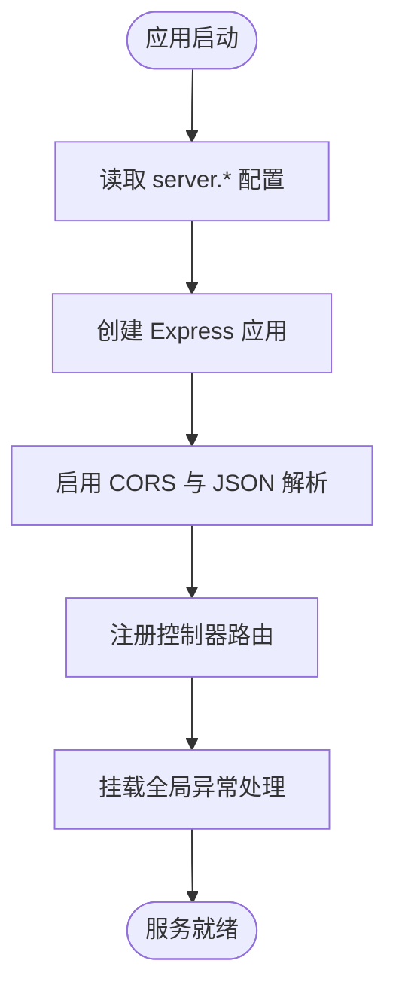
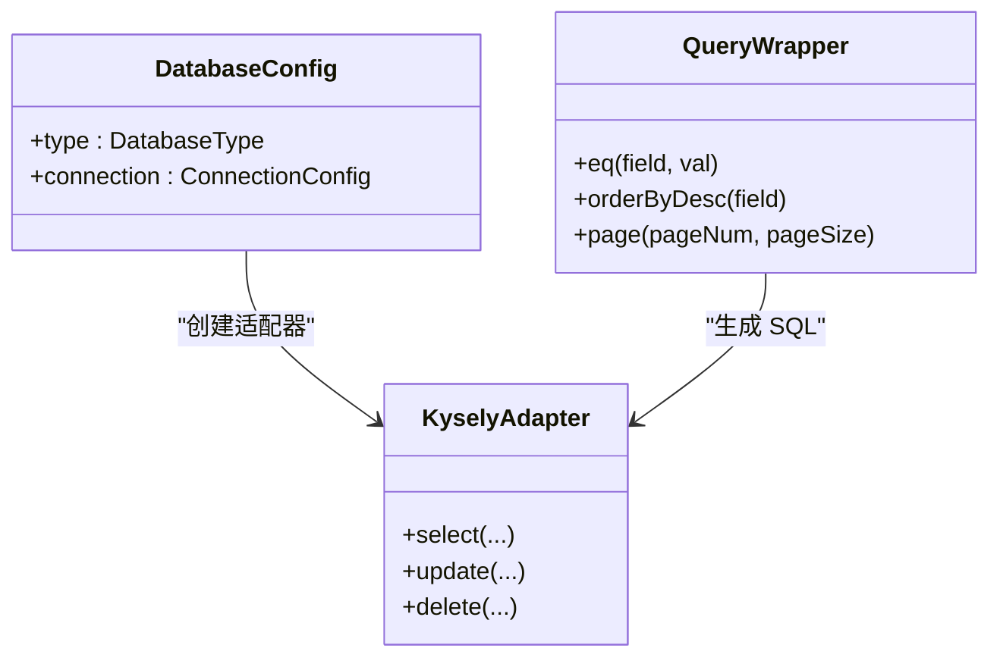
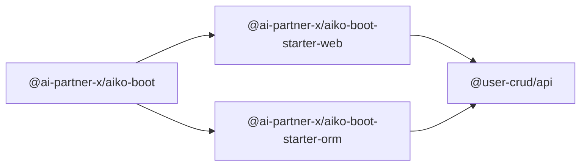

# 监控和运维

<cite>
**本文引用的文件**
- [README.md](file://README.md)
- [package.json](file://package.json)
- [packages/aiko-boot/package.json](file://packages/aiko-boot/package.json)
- [packages/aiko-boot-starter-web/package.json](file://packages/aiko-boot-starter-web/package.json)
- [packages/aiko-boot-starter-web/src/index.ts](file://packages/aiko-boot-starter-web/src/index.ts)
- [packages/aiko-boot-starter-web/src/decorators.ts](file://packages/aiko-boot-starter-web/src/decorators.ts)
- [packages/aiko-boot-starter-web/src/auto-configuration.ts](file://packages/aiko-boot-starter-web/src/auto-configuration.ts)
- [packages/aiko-boot-starter-orm/src/index.ts](file://packages/aiko-boot-starter-orm/src/index.ts)
- [app/examples/user-crud/packages/api/package.json](file://app/examples/user-crud/packages/api/package.json)
</cite>

## 目录
1. [简介](#简介)
2. [项目结构](#项目结构)
3. [核心组件](#核心组件)
4. [架构总览](#架构总览)
5. [详细组件分析](#详细组件分析)
6. [依赖关系分析](#依赖关系分析)
7. [性能考虑](#性能考虑)
8. [故障排除指南](#故障排除指南)
9. [结论](#结论)
10. [附录](#附录)

## 简介
本文件面向监控与运维场景，围绕该仓库中的全栈框架能力，给出可落地的监控与运维实践指南。内容涵盖：
- 性能指标采集与系统健康检查：基于 Web 层装饰器与自动配置，结合 Express 中间件与全局异常处理机制，构建可观测性基础。
- 日志系统：通过 Next.js 内置诊断 API 与 OpenTelemetry 集成点，实现结构化日志与链路追踪埋点。
- 错误追踪与告警：利用全局异常处理与错误上报通道，建立统一的错误报告与告警通知机制。
- 数据库监控与性能优化：基于 ORM 层的多数据库适配与查询包装器，提供慢查询分析与连接池监控思路。
- 运维自动化：结合 monorepo 工作区脚本与示例工程的启动脚本，形成可复用的自动化部署与配置管理流程。
- 故障排除与根因分析：以日志、链路追踪、异常处理与数据库查询为线索，建立系统化的诊断方法论。

## 项目结构
该仓库采用 monorepo 结构，核心由“核心启动包”“Web 启动器”“ORM 启动器”“校验启动器”“代码生成器”等组成；示例工程位于 app/examples/user-crud，演示了如何在实际项目中集成上述能力。

图表来源
- [packages/aiko-boot/package.json](file://packages/aiko-boot/package.json#L1-L61)
- [packages/aiko-boot-starter-web/package.json](file://packages/aiko-boot-starter-web/package.json#L1-L60)
- [packages/aiko-boot-starter-orm/src/index.ts](file://packages/aiko-boot-starter-orm/src/index.ts#L1-L91)
- [app/examples/user-crud/packages/api/package.json](file://app/examples/user-crud/packages/api/package.json#L1-L47)

章节来源
- [README.md](file://README.md#L14-L33)
- [package.json](file://package.json#L11-L18)

## 核心组件
- Web 层装饰器与路由自动生成：提供 Spring Boot 风格的控制器与请求映射装饰器，结合自动配置生成 Express 路由，便于统一接入监控中间件与健康检查端点。
- Express 自动配置与全局异常处理：自动创建 Express 应用、注册路由、启用 CORS 与 JSON 解析，并挂载全局异常处理中间件，为监控与告警提供统一出口。
- ORM 多数据库适配与查询包装器：支持 PostgreSQL、SQLite、MySQL，提供条件构造器与分页查询，便于慢查询分析与索引优化建议。
- Next.js 诊断与 OpenTelemetry 集成点：示例工程中存在 Next.js 内置诊断 API 与 OTEL 性能测量逻辑，可用于结构化日志与链路追踪。

章节来源
- [packages/aiko-boot-starter-web/src/decorators.ts](file://packages/aiko-boot-starter-web/src/decorators.ts#L1-L196)
- [packages/aiko-boot-starter-web/src/auto-configuration.ts](file://packages/aiko-boot-starter-web/src/auto-configuration.ts#L1-L160)
- [packages/aiko-boot-starter-orm/src/index.ts](file://packages/aiko-boot-starter-orm/src/index.ts#L1-L91)

## 架构总览
下图展示了从请求进入、路由匹配、业务执行到响应返回的典型链路，以及可插入监控与运维能力的关键节点。

图表来源
- [packages/aiko-boot-starter-web/src/auto-configuration.ts](file://packages/aiko-boot-starter-web/src/auto-configuration.ts#L104-L146)
- [packages/aiko-boot-starter-web/src/decorators.ts](file://packages/aiko-boot-starter-web/src/decorators.ts#L46-L88)

## 详细组件分析

### Web 层装饰器与路由
- 控制器装饰器：将类标记为 REST 控制器，自动注入构造函数依赖与属性注入，便于在控制器中直接使用服务层组件。
- 请求映射装饰器：支持 GET/POST/PUT/DELETE/PATCH，配合路径变量、请求参数与请求体装饰器，统一提取请求上下文。
- 元数据导出：提供控制器与请求映射元数据读取接口，用于路由生成与文档化。

图表来源
- [packages/aiko-boot-starter-web/src/decorators.ts](file://packages/aiko-boot-starter-web/src/decorators.ts#L50-L135)
- [packages/aiko-boot-starter-web/src/decorators.ts](file://packages/aiko-boot-starter-web/src/decorators.ts#L140-L173)

章节来源
- [packages/aiko-boot-starter-web/src/decorators.ts](file://packages/aiko-boot-starter-web/src/decorators.ts#L1-L196)

### Express 自动配置与健康检查
- 自动配置：在应用启动阶段读取 server.* 配置，创建 Express 应用，启用 CORS 与 JSON 解析，注册控制器路由。
- 全局异常处理：注册全局错误处理器，确保所有未捕获异常被统一处理，便于错误追踪与告警。
- 健康检查端点：可在控制器中新增 /health 或 /ready 等端点，结合数据库连通性检测与外部依赖可用性，作为系统健康检查入口。

图表来源
- [packages/aiko-boot-starter-web/src/auto-configuration.ts](file://packages/aiko-boot-starter-web/src/auto-configuration.ts#L104-L146)

章节来源
- [packages/aiko-boot-starter-web/src/auto-configuration.ts](file://packages/aiko-boot-starter-web/src/auto-configuration.ts#L1-L160)

### ORM 查询与慢查询分析
- 多数据库适配：支持 PostgreSQL、SQLite、MySQL，通过适配器抽象数据库差异。
- 条件构造器：提供 QueryWrapper/LambdaQueryWrapper，便于动态拼接查询条件，利于慢查询分析与索引优化建议。
- 分页与排序：提供分页参数与排序选项，辅助评估查询性能。

图表来源
- [packages/aiko-boot-starter-orm/src/index.ts](file://packages/aiko-boot-starter-orm/src/index.ts#L14-L81)

章节来源
- [packages/aiko-boot-starter-orm/src/index.ts](file://packages/aiko-boot-starter-orm/src/index.ts#L1-L91)

### 日志系统与结构化日志
- Next.js 诊断 API：示例工程中存在诊断 API 与性能测量逻辑，可用于结构化日志与链路追踪埋点。
- 建议实践：
  - 在请求进入与退出处记录结构化日志（如 traceId、method、url、status、duration）。
  - 将日志输出到标准输出，交由平台日志收集器统一采集与聚合。
  - 结合链路追踪，将日志与 spanId 关联，实现端到端可追溯。

章节来源
- [app/examples/user-crud/packages/api/package.json](file://app/examples/user-crud/packages/api/package.json#L13-L18)

### 错误追踪与告警
- 全局异常处理：自动配置中注册全局错误处理中间件，统一拦截未处理异常，便于集中上报与告警。
- 建议实践：
  - 在错误处理器中记录完整上下文（请求头、用户信息、参数等），并上报到错误追踪平台。
  - 对不同异常类型设置不同级别与告警策略，区分业务异常与系统异常。
  - 提供错误码与可读消息，便于前端与运营快速定位问题。

章节来源
- [packages/aiko-boot-starter-web/src/auto-configuration.ts](file://packages/aiko-boot-starter-web/src/auto-configuration.ts#L140-L143)

### 数据库监控与性能优化
- 连接池监控：通过数据库适配器暴露连接状态与使用情况，定期采样连接池指标（活跃连接数、等待队列长度、超时次数）。
- 慢查询分析：结合 ORM 的查询包装器与数据库日志，识别慢查询 SQL，结合 EXPLAIN/EXPLAIN ANALYZE 分析执行计划。
- 索引优化建议：针对高频过滤字段、排序字段与关联字段，建议补充复合索引并定期评估索引使用率。

章节来源
- [packages/aiko-boot-starter-orm/src/index.ts](file://packages/aiko-boot-starter-orm/src/index.ts#L66-L81)

### 运维自动化与部署
- monorepo 脚本：根目录提供统一构建、测试、清理与类型检查脚本，便于 CI/CD 流水线集成。
- 示例工程脚本：示例 API 工程提供开发、初始化数据库、代码生成与启动脚本，可作为自动化部署模板。
- 建议实践：
  - 使用工作区脚本统一管理各包的构建与发布。
  - 将初始化数据库脚本纳入部署流程，确保环境一致性。
  - 将代码生成器集成到 CI，保持前后端契约一致。

章节来源
- [package.json](file://package.json#L11-L18)
- [app/examples/user-crud/packages/api/package.json](file://app/examples/user-crud/packages/api/package.json#L12-L18)

## 依赖关系分析
- Web 启动器依赖核心启动包与 ORM 启动器，示例 API 工程同时依赖 Web 与 ORM 启动器，形成清晰的层次化依赖。
- Next.js 诊断与 OTEL 集成存在于示例工程中，表明框架具备与现代可观测生态对接的能力。

图表来源
- [packages/aiko-boot-starter-web/package.json](file://packages/aiko-boot-starter-web/package.json#L32-L37)
- [packages/aiko-boot-starter-orm/src/index.ts](file://packages/aiko-boot-starter-orm/src/index.ts#L1-L91)
- [app/examples/user-crud/packages/api/package.json](file://app/examples/user-crud/packages/api/package.json#L21-L31)

章节来源
- [packages/aiko-boot-starter-web/src/index.ts](file://packages/aiko-boot-starter-web/src/index.ts#L1-L73)

## 性能考虑
- 请求处理链路：在 Express 中间件层统一记录请求耗时与状态码，结合链路追踪实现端到端性能分析。
- 数据库访问：通过 ORM 的查询包装器与分页参数，避免一次性加载大量数据；对高频查询建立缓存与索引。
- 资源释放：在应用关闭阶段优雅处理连接池与数据库连接，避免资源泄漏。

## 故障排除指南
- 日志分析：利用结构化日志与 traceId，快速定位请求路径与异常发生点；结合链路追踪查看上下游依赖状态。
- 性能分析：关注慢查询与高延迟端点，结合数据库执行计划与应用指标进行根因分析。
- 异常排查：通过全局异常处理收集的上下文信息，还原请求现场；对重复异常进行告警抑制与收敛。
- 数据库问题：检查连接池配置与超时设置，核对慢查询日志与索引使用情况，必要时进行索引重建或查询重写。

## 结论
该框架提供了完善的 Web 与 ORM 能力，结合示例工程中的诊断与 OTEL 集成点，能够快速搭建一套覆盖性能指标、日志、错误追踪与数据库监控的运维体系。通过统一的装饰器与自动配置，可以将监控与运维能力以最小侵入的方式融入现有业务，提升系统的可观测性与稳定性。

## 附录
- 快速开始与示例运行：参考根 README 与示例工程说明，完成本地开发与调试。
- 版本与引擎要求：确保 Node 与包管理器版本满足工程要求，避免运行时兼容性问题。

章节来源
- [README.md](file://README.md#L35-L54)
- [package.json](file://package.json#L7-L10)