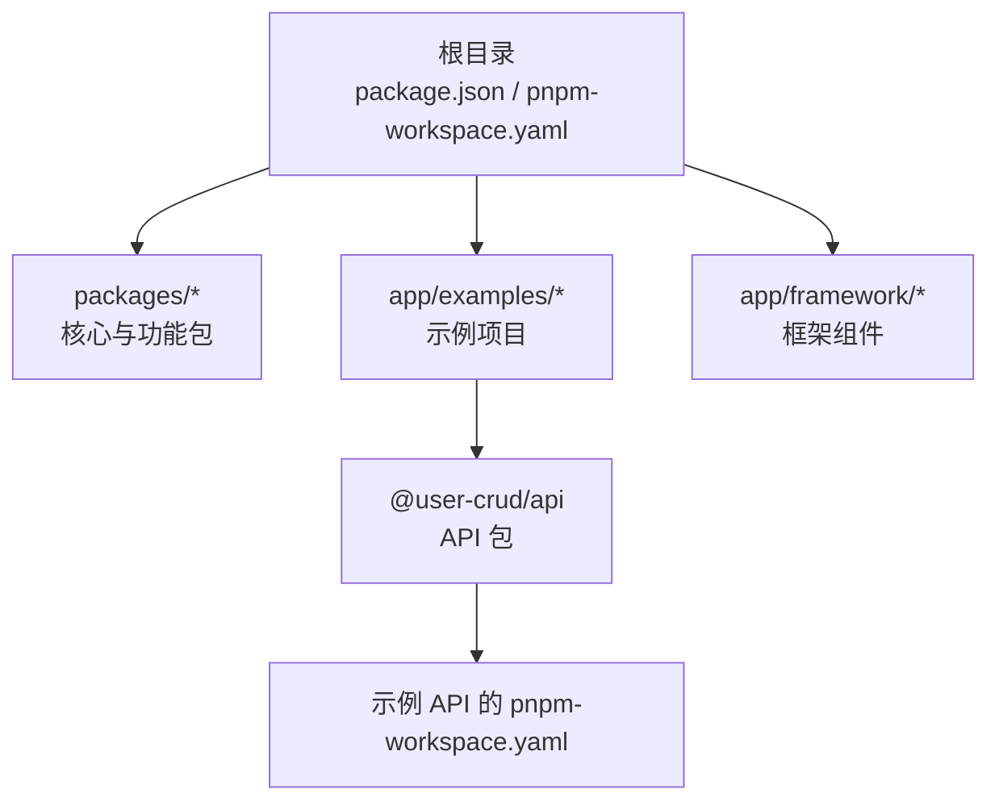
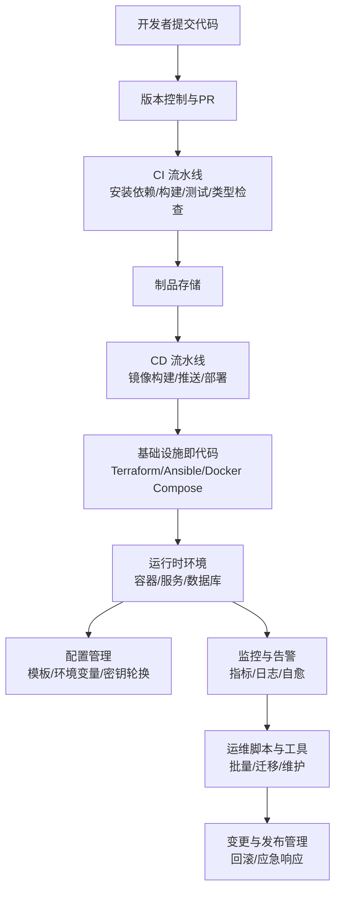
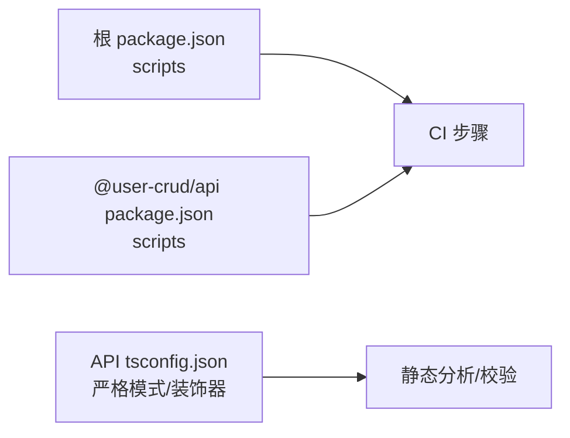

# 运维自动化

<cite>
**本文引用的文件**
- [README.md](file://README.md)
- [package.json](file://package.json)
- [pnpm-workspace.yaml](file://pnpm-workspace.yaml)
- [app/examples/user-crud/pnpm-workspace.yaml](file://app/examples/user-crud/pnpm-workspace.yaml)
- [app/examples/user-crud/packages/api/package.json](file://app/examples/user-crud/packages/api/package.json)
- [app/examples/user-crud/packages/api/tsconfig.json](file://app/examples/user-crud/packages/api/tsconfig.json)
</cite>

## 目录
1. [引言](#引言)
2. [项目结构](#项目结构)
3. [核心组件](#核心组件)
4. [架构总览](#架构总览)
5. [详细组件分析](#详细组件分析)
6. [依赖分析](#依赖分析)
7. [性能考虑](#性能考虑)
8. [故障排查指南](#故障排查指南)
9. [结论](#结论)
10. [附录](#附录)

## 引言
本指南面向在该仓库基础上构建“运维自动化系统”的工程团队，围绕基础设施即代码（IaC）、自动化部署流水线、配置管理、监控告警、运维脚本与工具、流程标准化等维度，提供可落地的实施路径与最佳实践。当前仓库以 TypeScript/Next.js 为基础，采用 monorepo 管理多个包与示例项目，具备良好的工程化基础，适合在此之上扩展 CI/CD、容器化与运维自动化能力。

## 项目结构
仓库采用 pnpm monorepo 结构，顶层通过工作区配置聚合 packages、framework 与 examples。示例项目 user-crud 展示了 API 包的脚本与依赖组织方式，便于映射到运维自动化中的构建、测试、打包与发布流程。

图表来源
- [pnpm-workspace.yaml](file://pnpm-workspace.yaml#L1-L6)
- [app/examples/user-crud/pnpm-workspace.yaml](file://app/examples/user-crud/pnpm-workspace.yaml#L1-L5)

章节来源
- [README.md](file://README.md#L14-L33)
- [pnpm-workspace.yaml](file://pnpm-workspace.yaml#L1-L6)
- [app/examples/user-crud/pnpm-workspace.yaml](file://app/examples/user-crud/pnpm-workspace.yaml#L1-L5)

## 核心组件
- 顶层工程与脚本：统一的构建、开发、测试、清理与类型检查命令，便于在 CI 中复用。
- 示例 API 包：包含开发、初始化数据库、代码生成、构建与启动脚本，适合作为自动化流水线的执行单元。
- TypeScript 配置：启用装饰器元数据与严格模式，有利于静态分析与自动化校验。

章节来源
- [package.json](file://package.json#L11-L18)
- [app/examples/user-crud/packages/api/package.json](file://app/examples/user-crud/packages/api/package.json#L12-L20)
- [app/examples/user-crud/packages/api/tsconfig.json](file://app/examples/user-crud/packages/api/tsconfig.json#L1-L18)

## 架构总览
下图展示从代码提交到运行时交付的运维自动化路径，涵盖 IaC、CI/CD、镜像构建与发布、配置管理与监控告警的关键节点。

## 详细组件分析

### 基础设施即代码（IaC）实施
- Terraform 配置建议
  - 将应用与数据库、缓存、负载均衡等资源以声明式方式管理，确保可重复与可审计。
  - 使用变量与模块化组织，区分 dev/stage/prod 环境。
  - 通过状态后端（如 S3+DynamoDB 或 Terraform Cloud）安全保存状态。
- Ansible Playbook 建议
  - 将应用部署、证书下发、系统加固、网络策略等纳入 Playbook。
  - 使用 vault 管理敏感信息，结合动态 inventory 与标签化主机。
- Docker 容器编排
  - 使用 Compose/Kubernetes 描述服务拓扑、健康检查、滚动更新与回滚策略。
  - 将配置与密钥以 Secret/ConfigMap 注入，避免硬编码。

### 自动化部署流水线设计
- CI/CD 流程
  - 触发条件：分支保护、PR 校验、标签发布。
  - 步骤：安装依赖（pnpm）、构建（build）、测试（test）、类型检查（type-check）、制品归档。
  - 发布：镜像构建与推送、Kubernetes 清单应用或 Terraform 应用。
- 版本管理与回滚
  - 语义化版本与标签策略；发布前进行灰度与健康检查。
  - 回滚：镜像 tag 回退、Kubernetes rollout undo、Terraform 状态回滚。
- 安全与合规
  - 扫描镜像漏洞与依赖风险；对密钥与凭据进行最小权限与轮换。

### 配置管理自动化
- 配置模板与环境变量
  - 使用 Jinja/Helm/ERB 等模板引擎生成最终配置，按环境注入变量。
  - 将非敏感参数放入 ConfigMap，敏感参数放入 Secret。
- 密钥轮换
  - 通过 Vault/KMS/密钥管理服务实现密钥轮换与自动刷新。
  - 在容器内使用挂载或 sidecar 同步最新密钥。

### 监控与告警自动化
- 自动化故障检测
  - 基于指标阈值、日志异常、可用性探测触发告警。
  - 使用 Prometheus/Grafana/PagerDuty/企业微信等集成。
- 自愈机制
  - Kubernetes HPA/HPA、PodDisruptionBudget、探针失败重启。
  - Terraform/Ansible 自动修复常见配置漂移。
- 智能调度
  - 基于负载预测与成本模型的资源调度与扩缩容策略。

### 运维脚本与工具
- 批量操作
  - Ansible/Python/Shell 脚本实现主机巡检、补丁与配置一致性检查。
- 数据迁移
  - 通过迁移工具与事务保障，结合备份与回滚点。
- 系统维护
  - 日志切割、磁盘清理、内核参数调优与安全基线检查。

### 运维流程标准化
- 变更管理
  - 变更请求（RFC）、影响评估、审批与回滚计划。
- 发布管理
  - 发布窗口、灰度发布、A/B 测试与回滚策略。
- 应急响应
  - SLO/SLA 对齐的应急流程、角色与联系方式、演练与复盘。

## 依赖分析
- 顶层依赖与脚本
  - 统一的构建、开发、测试、清理与类型检查命令，便于在 CI 中标准化执行。
- 示例 API 包
  - 包含开发、初始化数据库、代码生成、构建与启动脚本，适合作为流水线中“单包”执行单元。
- TypeScript 配置
  - 启用装饰器元数据与严格模式，有助于静态分析与自动化校验。

图表来源
- [package.json](file://package.json#L11-L18)
- [app/examples/user-crud/packages/api/package.json](file://app/examples/user-crud/packages/api/package.json#L12-L20)
- [app/examples/user-crud/packages/api/tsconfig.json](file://app/examples/user-crud/packages/api/tsconfig.json#L1-L18)

章节来源
- [package.json](file://package.json#L11-L18)
- [app/examples/user-crud/packages/api/package.json](file://app/examples/user-crud/packages/api/package.json#L12-L20)
- [app/examples/user-crud/packages/api/tsconfig.json](file://app/examples/user-crud/packages/api/tsconfig.json#L1-L18)

## 性能考虑
- 构建与缓存
  - 利用 pnpm 的高效缓存与增量构建，减少 CI 时间。
- 镜像与部署
  - 多阶段构建、精简基础镜像、按需加载与懒启动。
- 监控与可观测性
  - 合理设置采样率与告警阈值，避免噪声与误报。

## 故障排查指南
- 常见问题定位
  - 构建失败：检查 Node/pnpm 版本与依赖安装日志。
  - 类型检查失败：根据严格模式与装饰器配置逐项修正。
  - 运行时错误：查看容器日志与堆栈，结合监控指标定位。
- 回滚与恢复
  - 快速回滚至上一个稳定版本，必要时回退数据库迁移。
- 安全加固
  - 定期扫描镜像与依赖，更新密钥与访问凭证。

## 结论
本指南基于仓库现有的 monorepo 结构与示例项目，提出了覆盖 IaC、CI/CD、配置管理、监控告警、运维脚本与流程标准化的运维自动化实施路径。建议从最小可行方案起步，逐步完善模板化与自动化工具链，持续迭代以提升稳定性与效率。

## 附录
- 参考文件路径
  - [README.md](file://README.md)
  - [package.json](file://package.json)
  - [pnpm-workspace.yaml](file://pnpm-workspace.yaml)
  - [app/examples/user-crud/pnpm-workspace.yaml](file://app/examples/user-crud/pnpm-workspace.yaml)
  - [app/examples/user-crud/packages/api/package.json](file://app/examples/user-crud/packages/api/package.json)
  - [app/examples/user-crud/packages/api/tsconfig.json](file://app/examples/user-crud/packages/api/tsconfig.json)