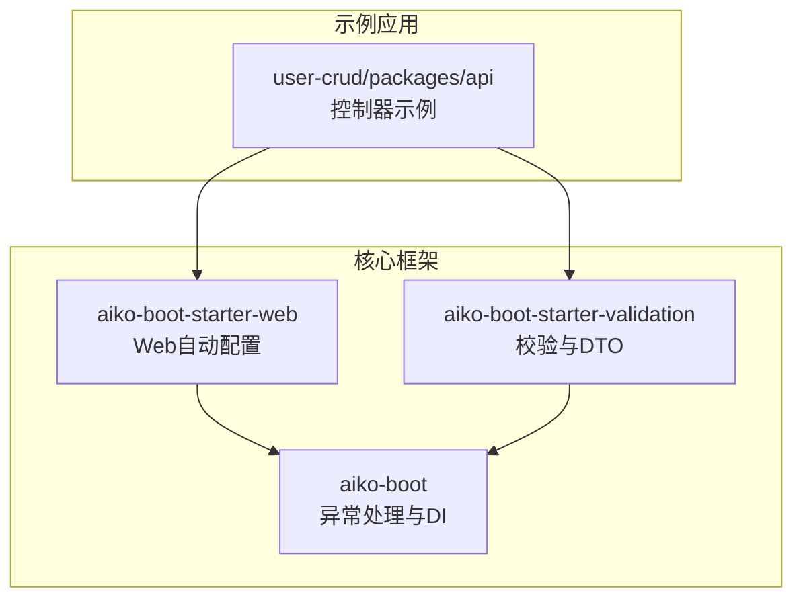
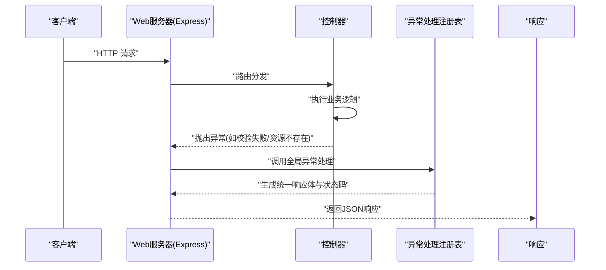
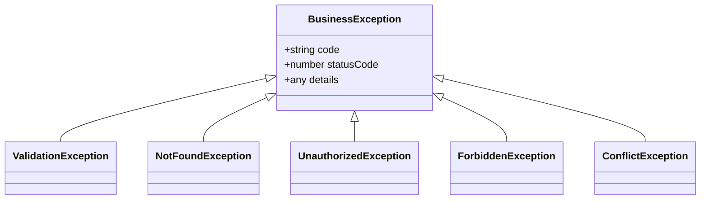
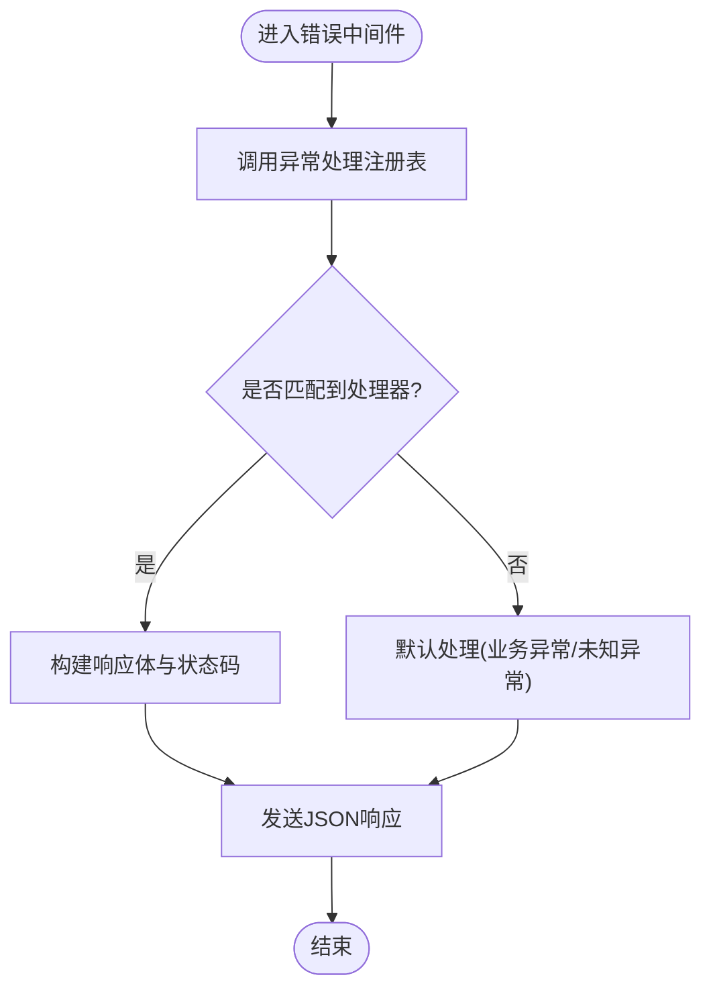
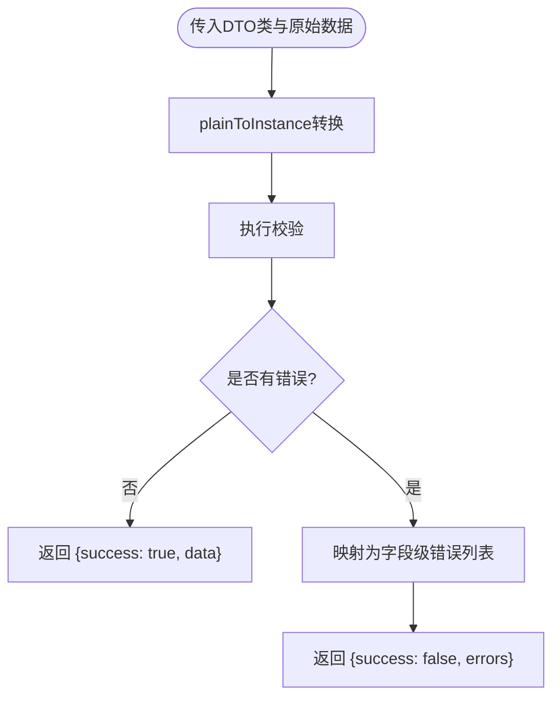
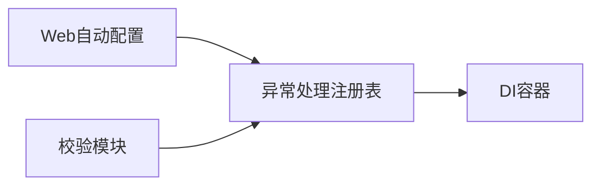

# 错误追踪

<cite>
**本文引用的文件**
- [README.md](file://README.md)
- [packages/aiko-boot/src/boot/exception.ts](file://packages/aiko-boot/src/boot/exception.ts)
- [packages/aiko-boot-starter-web/src/auto-configuration.ts](file://packages/aiko-boot-starter-web/src/auto-configuration.ts)
- [packages/aiko-boot-starter-validation/src/index.ts](file://packages/aiko-boot-starter-validation/src/index.ts)
- [packages/aiko-boot-starter-validation/src/auto-configuration.ts](file://packages/aiko-boot-starter-validation/src/auto-configuration.ts)
- [app/examples/user-crud/packages/api/src/controller/user.controller.ts](file://app/examples/user-crud/packages/api/src/controller/user.controller.ts)
</cite>

## 目录
1. [简介](#简介)
2. [项目结构](#项目结构)
3. [核心组件](#核心组件)
4. [架构总览](#架构总览)
5. [详细组件分析](#详细组件分析)
6. [依赖关系分析](#依赖关系分析)
7. [性能考量](#性能考量)
8. [故障排除指南](#故障排除指南)
9. [结论](#结论)
10. [附录](#附录)

## 简介
本指南围绕“错误追踪与异常监控”主题，结合仓库中现有的全局异常处理、Web 自动配置与验证能力，给出从错误收集、上报、分类分级、分析定位、告警与 SLA 监控到修复与预防的最佳实践。内容覆盖：
- 全局异常处理器与错误拦截器
- 错误分类与优先级管理
- 错误分析与根因分析方法论
- 告警规则、通知渠道与升级策略
- 错误率监控与 SLA 管理
- 修复与预防最佳实践
- 工具集成与故障排除流程

## 项目结构
该仓库采用 monorepo 结构，核心与示例分离。与错误追踪直接相关的模块包括：
- aiko-boot：提供依赖注入与全局异常处理基础设施
- aiko-boot-starter-web：提供 Web 自动配置与错误中间件
- aiko-boot-starter-validation：提供 DTO 校验与错误格式化能力
- 示例工程 user-crud：展示控制器如何触发异常与被全局处理器捕获

图表来源
- [packages/aiko-boot/src/boot/exception.ts](file://packages/aiko-boot/src/boot/exception.ts#L1-L389)
- [packages/aiko-boot-starter-web/src/auto-configuration.ts](file://packages/aiko-boot-starter-web/src/auto-configuration.ts#L92-L125)
- [packages/aiko-boot-starter-validation/src/index.ts](file://packages/aiko-boot-starter-validation/src/index.ts#L1-L199)
- [app/examples/user-crud/packages/api/src/controller/user.controller.ts](file://app/examples/user-crud/packages/api/src/controller/user.controller.ts)

章节来源
- [README.md](file://README.md#L14-L33)

## 核心组件
- 全局异常处理（Spring Boot 风格）：通过装饰器声明式定义异常处理器，统一返回结构与状态码。
- Web 错误中间件：在 Web 层拦截未处理异常，交由异常处理注册表统一处理。
- DTO 校验：对入参进行结构化校验，失败时抛出带字段与约束信息的异常，便于前端与监控侧识别。

章节来源
- [packages/aiko-boot/src/boot/exception.ts](file://packages/aiko-boot/src/boot/exception.ts#L1-L389)
- [packages/aiko-boot-starter-web/src/auto-configuration.ts](file://packages/aiko-boot-starter-web/src/auto-configuration.ts#L92-L125)
- [packages/aiko-boot-starter-validation/src/index.ts](file://packages/aiko-boot-starter-validation/src/index.ts#L117-L196)

## 架构总览
下图展示了从请求进入 Web 层，到异常被捕获、统一处理与返回的整体流程。

图表来源
- [packages/aiko-boot-starter-web/src/auto-configuration.ts](file://packages/aiko-boot-starter-web/src/auto-configuration.ts#L92-L125)
- [packages/aiko-boot/src/boot/exception.ts](file://packages/aiko-boot/src/boot/exception.ts#L382-L388)

## 详细组件分析

### 全局异常处理（Spring Boot 风格）
- 装饰器支持
  - @ControllerAdvice：声明全局异常处理类，支持 order 与 basePackages 限定范围
  - @ExceptionHandler：声明异常处理方法，支持多类型异常与排序
  - @ResponseStatus：为处理方法指定 HTTP 状态码
- 异常基类与内置异常
  - BusinessException：业务异常基类，包含 code、statusCode、details
  - ValidationException、NotFoundException、UnauthorizedException、ForbiddenException、ConflictException：常用业务异常
- 处理流程
  - 注册表按 order 排序加载所有处理器
  - 匹配异常类型后调用对应处理方法
  - 若为业务异常，优先使用其 statusCode；否则使用注解或默认 500
  - 未匹配到处理器时走默认处理（生产环境隐藏内部错误细节）

图表来源
- [packages/aiko-boot/src/boot/exception.ts](file://packages/aiko-boot/src/boot/exception.ts#L157-L220)

章节来源
- [packages/aiko-boot/src/boot/exception.ts](file://packages/aiko-boot/src/boot/exception.ts#L1-L389)

### Web 错误中间件
- 自动配置阶段创建 Express 应用，注册 JSON 解析与 CORS
- 提供 createErrorHandler 工厂方法，将异常转交给 ExceptionHandlerRegistry 统一处理
- 中间件确保最终以 JSON 形式返回统一结构与状态码

图表来源
- [packages/aiko-boot-starter-web/src/auto-configuration.ts](file://packages/aiko-boot-starter-web/src/auto-configuration.ts#L92-L125)
- [packages/aiko-boot/src/boot/exception.ts](file://packages/aiko-boot/src/boot/exception.ts#L269-L332)

章节来源
- [packages/aiko-boot-starter-web/src/auto-configuration.ts](file://packages/aiko-boot-starter-web/src/auto-configuration.ts#L92-L125)
- [packages/aiko-boot/src/boot/exception.ts](file://packages/aiko-boot/src/boot/exception.ts#L382-L388)

### DTO 校验与错误格式化
- validateDto：将原始数据转换为 DTO 实例并执行校验，返回成功或错误列表
- 错误结构包含字段名、消息与约束映射，便于前端展示与监控侧聚合
- createResolver：为 react-hook-form 提供 resolver，将校验结果映射为表单错误对象

图表来源
- [packages/aiko-boot-starter-validation/src/index.ts](file://packages/aiko-boot-starter-validation/src/index.ts#L120-L142)

章节来源
- [packages/aiko-boot-starter-validation/src/index.ts](file://packages/aiko-boot-starter-validation/src/index.ts#L117-L196)

### 示例：控制器中的异常触发与处理
- 控制器方法可直接抛出异常（如业务异常、校验异常），由全局异常处理器捕获并统一返回
- 该模式确保所有异常都经过统一的错误分类、日志与响应格式化

章节来源
- [app/examples/user-crud/packages/api/src/controller/user.controller.ts](file://app/examples/user-crud/packages/api/src/controller/user.controller.ts)

## 依赖关系分析
- Web 自动配置依赖 DI 容器解析异常处理类
- 异常处理依赖反射元数据与容器实例化
- 校验模块与异常处理相互独立但可配合：校验失败抛出 ValidationException，由全局处理器统一处理

图表来源
- [packages/aiko-boot-starter-web/src/auto-configuration.ts](file://packages/aiko-boot-starter-web/src/auto-configuration.ts#L92-L125)
- [packages/aiko-boot/src/boot/exception.ts](file://packages/aiko-boot/src/boot/exception.ts#L234-L264)
- [packages/aiko-boot-starter-validation/src/index.ts](file://packages/aiko-boot-starter-validation/src/index.ts#L120-L142)

章节来源
- [packages/aiko-boot-starter-web/src/auto-configuration.ts](file://packages/aiko-boot-starter-web/src/auto-configuration.ts#L92-L125)
- [packages/aiko-boot/src/boot/exception.ts](file://packages/aiko-boot/src/boot/exception.ts#L234-L264)
- [packages/aiko-boot-starter-validation/src/index.ts](file://packages/aiko-boot-starter-validation/src/index.ts#L120-L142)

## 性能考量
- 异常处理链路应尽量轻量：避免在异常处理器中执行重 IO 或阻塞操作
- 对高频异常进行去抖与聚合，防止雪崩效应
- 生产环境默认隐藏内部错误细节，减少敏感信息泄露风险
- 校验前置：尽早失败，降低后续处理成本

## 故障排除指南
- 症状：接口返回 500 且包含内部错误详情
  - 排查：确认是否为未被任何处理器捕获的未知异常；检查生产环境变量是否处于非生产模式
  - 处置：补充对应的业务异常类型或在全局处理器中增加兜底处理
- 症状：校验失败未返回字段级错误
  - 排查：确认 DTO 是否正确标注校验装饰器；确认调用 validateDto 或 createResolver 的路径
  - 处置：修正 DTO 字段注解或调整表单 resolver 映射
- 症状：异常未被统一处理
  - 排查：确认 Web 自动配置已注册 createErrorHandler；确认 @ControllerAdvice 已扫描到目标包
  - 处置：检查 basePackages 与 order 配置，确保异常处理器被正确加载

章节来源
- [packages/aiko-boot/src/boot/exception.ts](file://packages/aiko-boot/src/boot/exception.ts#L306-L332)
- [packages/aiko-boot-starter-validation/src/index.ts](file://packages/aiko-boot-starter-validation/src/index.ts#L120-L142)
- [packages/aiko-boot-starter-web/src/auto-configuration.ts](file://packages/aiko-boot-starter-web/src/auto-configuration.ts#L92-L125)

## 结论
本仓库提供了完善的全局异常处理与 Web 错误中间件基础，结合 DTO 校验能力，能够快速实现统一的错误收集与上报。在此基础上，建议进一步引入：
- 错误日志采集与上报（如 Sentry、DataDog、自建 ELK）
- 错误分类与优先级（按业务域、异常类型、状态码、用户影响面）
- 错误趋势与热点分析（按时间窗口、端点、用户维度聚合）
- 告警规则与升级策略（阈值、静默期、收敛、升级通道）
- 错误率与 SLA 监控（错误率、P95/P99 延迟、可用性指标）
- 修复与预防闭环（根因分析、修复验证、回归测试、质量门禁）

## 附录

### 错误分类与优先级管理
- 分类维度
  - 业务域：用户中心、订单、库存等
  - 异常类型：校验异常、资源不存在、权限异常、冲突异常、未知异常
  - 状态码：4xx/5xx 分层
  - 影响面：单用户/多用户/全站
- 优先级分级
  - P0：全站不可用/核心链路中断
  - P1：大量用户受影响/关键功能不可用
  - P2：小范围影响/次要功能异常
  - P3：低影响/体验类问题
- 处理流程
  - 自动化：P0/P1 自动升级至值班与告警通道
  - 人工：P2/P3 由团队评审与排期
  - 回归：修复后验证与监控

### 错误分析与根因分析方法论
- 趋势分析：按小时/天聚合错误数，识别突增与周期性波动
- 热点定位：按端点、参数组合、用户特征聚合 Top N
- 影响评估：计算受影响用户数、交易损失、页面停留时长下降
- 根因分析：因果链路、变更对比、依赖回溯、并发条件分析

### 告警系统配置
- 告警规则
  - 错误率阈值：如 1 分钟错误率 > 0.1%
  - 基于端点的阈值：特定接口错误率阈值更高
  - 同比/环比阈值：对比前一小时/前一天
- 通知渠道
  - 即时消息（钉钉/飞书）、邮件、电话
- 升级策略
  - 未在 X 分钟内处理自动升级
  - 多次升级未解决则升级到更高级别

### 错误率监控与 SLA 管理
- 指标
  - 错误率 = 异常请求数 / 总请求数
  - P95/P99 延迟、可用性（99.9%）
- 基线管理
  - 历史基线与业务峰值
  - 不同环境（预发/线上）差异化基线
- 报告与回顾
  - 日报/周报/月报
  - 故障复盘与改进计划

### 错误修复与预防最佳实践
- 预防策略
  - 输入校验前置、输出结构化错误
  - 限流/熔断/降级策略
  - 幂等性与补偿机制
- 代码审查
  - 异常类型与状态码一致性
  - 错误消息可读性与国际化
- 质量门禁
  - 单测覆盖率、异常分支覆盖
  - Lint 规则与安全扫描

### 工具集成示例（概念性）
- 日志采集
  - 客户端：Next.js 错误边界与 unhandledRejection 捕获（参考示例工程中的错误上报路径）
  - 服务端：统一异常处理器输出结构化日志
- 错误平台
  - Sentry：接入全局异常处理器输出，自动聚合与告警
  - 自建：对接日志平台，建立错误率与趋势看板
- 监控面板
  - 错误率、Top N 端点、影响面分布、SLA 指标