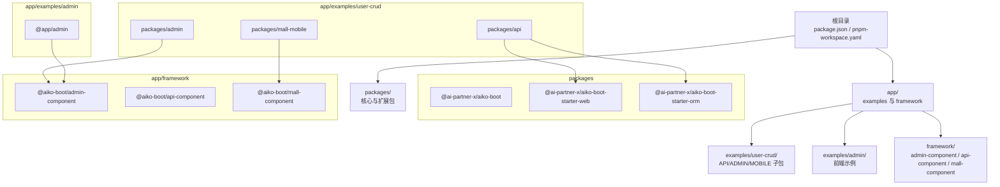
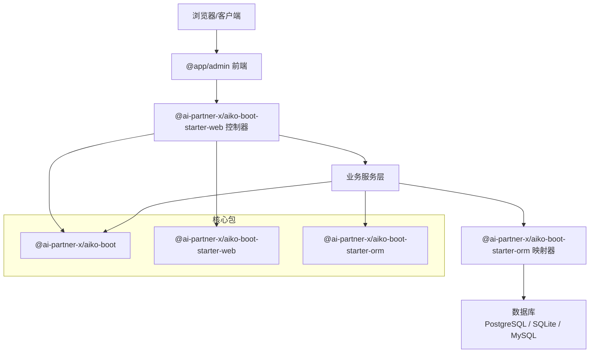
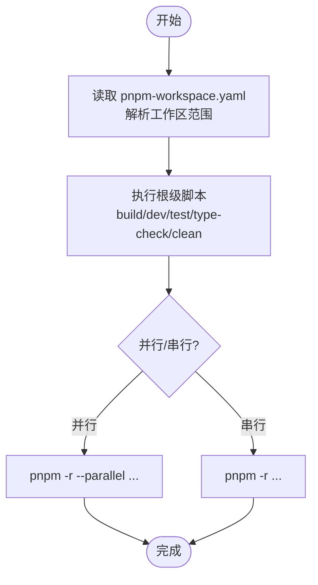
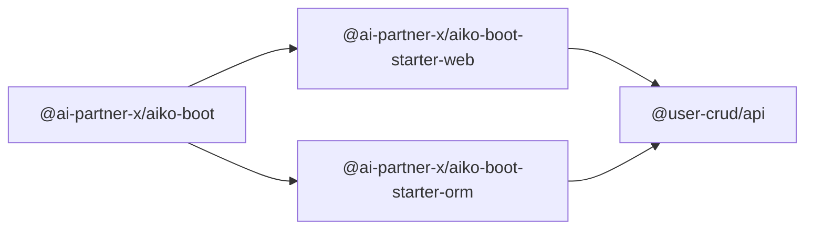
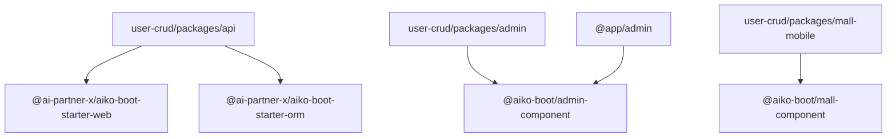
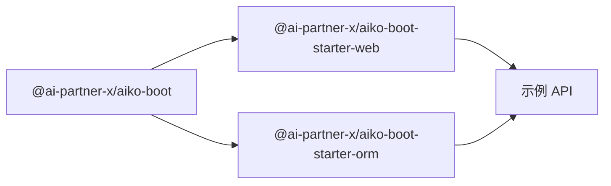

# 部署和运维

<cite>
**本文引用的文件**
- [package.json](file://package.json)
- [pnpm-workspace.yaml](file://pnpm-workspace.yaml)
- [tsconfig.json](file://tsconfig.json)
- [.eslintrc.json](file://.eslintrc.json)
- [README.md](file://README.md)
- [packages/aiko-boot/package.json](file://packages/aiko-boot/package.json)
- [packages/aiko-boot-starter-web/package.json](file://packages/aiko-boot-starter-web/package.json)
- [packages/aiko-boot-starter-orm/package.json](file://packages/aiko-boot-starter-orm/package.json)
- [app/examples/user-crud/package.json](file://app/examples/user-crud/package.json)
- [app/examples/admin/package.json](file://app/examples/admin/package.json)
</cite>

## 目录
1. [简介](#简介)
2. [项目结构](#项目结构)
3. [核心组件](#核心组件)
4. [架构总览](#架构总览)
5. [详细组件分析](#详细组件分析)
6. [依赖分析](#依赖分析)
7. [性能考虑](#性能考虑)
8. [故障排除指南](#故障排除指南)
9. [结论](#结论)
10. [附录](#附录)

## 简介
本文件面向部署与运维团队，提供针对该 Monorepo 的完整部署与运维指导。内容涵盖：
- Monorepo 管理策略：包依赖关系、版本控制与发布流程
- 生产环境部署：Docker 容器化思路、CI/CD 流水线建议与自动化部署策略
- 多环境配置管理：开发、测试、生产环境的差异化配置方法
- 监控与日志：性能监控、错误追踪与日志收集集成方案
- 数据库部署与迁移：多数据库支持与备份恢复策略
- 运维最佳实践与故障排除

## 项目结构
该项目采用 pnpm workspaces 的 Monorepo 结构，根目录通过工作区配置统一管理多个包与示例应用。整体布局如下：
- packages：核心启动与功能扩展包（如依赖注入、Web 启动器、ORM 启动器等）
- app/examples：示例应用与框架组件（包含前端示例与示例项目的子包）
- app/framework：框架组件（如 admin 组件、API 组件、mall 组件）

图表来源
- [pnpm-workspace.yaml](file://pnpm-workspace.yaml#L1-L6)
- [packages/aiko-boot-starter-web/package.json](file://packages/aiko-boot-starter-web/package.json#L32-L37)
- [packages/aiko-boot-starter-orm/package.json](file://packages/aiko-boot-starter-orm/package.json#L24-L29)
- [app/examples/user-crud/package.json](file://app/examples/user-crud/package.json#L1-L20)
- [app/examples/admin/package.json](file://app/examples/admin/package.json#L12-L18)

章节来源
- [pnpm-workspace.yaml](file://pnpm-workspace.yaml#L1-L6)
- [README.md](file://README.md#L14-L33)

## 核心组件
- 依赖注入与自动配置（@ai-partner-x/aiko-boot）：提供装饰器驱动的服务注入与自动装配能力，作为上层 Web 与 ORM 启动器的基础。
- Web 启动器（@ai-partner-x/aiko-boot-starter-web）：提供基于装饰器的控制器与路由能力，依赖核心包与 ORM 包。
- ORM 启动器（@ai-partner-x/aiko-boot-starter-orm）：提供 MyBatis-Plus 风格的装饰器与查询构造器，支持多数据库（PostgreSQL、SQLite、MySQL），底层使用 Kysely。

章节来源
- [packages/aiko-boot/package.json](file://packages/aiko-boot/package.json#L1-L61)
- [packages/aiko-boot-starter-web/package.json](file://packages/aiko-boot-starter-web/package.json#L1-L60)
- [packages/aiko-boot-starter-orm/package.json](file://packages/aiko-boot-starter-orm/package.json#L1-L55)
- [README.md](file://README.md#L58-L80)

## 架构总览
下图展示示例应用中 API 层与前端层的典型交互路径，以及核心包之间的依赖关系。

图表来源
- [packages/aiko-boot-starter-web/package.json](file://packages/aiko-boot-starter-web/package.json#L32-L37)
- [packages/aiko-boot-starter-orm/package.json](file://packages/aiko-boot-starter-orm/package.json#L24-L29)
- [README.md](file://README.md#L58-L80)

## 详细组件分析

### 组件一：Monorepo 管理与版本控制
- 工作区范围：通过 pnpm-workspace.yaml 统一声明 packages、framework 与 examples 下的子包，确保跨包依赖解析与并行构建。
- 根级脚本：提供统一的构建、开发、测试、类型检查与清理命令，便于在根目录一次性操作所有包。
- TypeScript 编译配置：全局 tsconfig.json 提供严格模式与装饰器元数据支持，确保包间共享一致的编译行为。
- 代码规范：根级 ESLint 配置统一风格，避免各包风格漂移。

图表来源
- [pnpm-workspace.yaml](file://pnpm-workspace.yaml#L1-L6)
- [package.json](file://package.json#L11-L18)
- [tsconfig.json](file://tsconfig.json#L1-L33)
- [.eslintrc.json](file://.eslintrc.json#L1-L26)

章节来源
- [pnpm-workspace.yaml](file://pnpm-workspace.yaml#L1-L6)
- [package.json](file://package.json#L11-L18)
- [tsconfig.json](file://tsconfig.json#L1-L33)
- [.eslintrc.json](file://.eslintrc.json#L1-L26)

### 组件二：包依赖关系与发布流程
- 包导出与入口：各包通过 package.json 的 exports 字段声明模块入口，便于消费者按需引入。
- 工作区依赖：Web 与 ORM 启动器通过 workspace:* 引用核心包，确保本地联调与发布一致性。
- 发布建议：采用语义化版本与变更日志，结合工作区统一升级策略；优先在本地验证构建产物后再进行版本标记与推送。

图表来源
- [packages/aiko-boot/package.json](file://packages/aiko-boot/package.json#L1-L61)
- [packages/aiko-boot-starter-web/package.json](file://packages/aiko-boot-starter-web/package.json#L32-L37)
- [packages/aiko-boot-starter-orm/package.json](file://packages/aiko-boot-starter-orm/package.json#L24-L29)

章节来源
- [packages/aiko-boot/package.json](file://packages/aiko-boot/package.json#L8-L25)
- [packages/aiko-boot-starter-web/package.json](file://packages/aiko-boot-starter-web/package.json#L8-L21)
- [packages/aiko-boot-starter-orm/package.json](file://packages/aiko-boot-starter-orm/package.json#L8-L13)

### 组件三：示例应用与前端组件
- user-crud 示例：提供 API、Admin、Mall-Mobile 三个子包，分别对应后端服务、管理端前端与移动端前端。
- admin 组件：示例前端应用依赖框架组件包，实现统一 UI 与交互体验。

图表来源
- [app/examples/user-crud/package.json](file://app/examples/user-crud/package.json#L1-L20)
- [app/examples/admin/package.json](file://app/examples/admin/package.json#L12-L18)

章节来源
- [app/examples/user-crud/package.json](file://app/examples/user-crud/package.json#L5-L14)
- [app/examples/admin/package.json](file://app/examples/admin/package.json#L6-L11)

## 依赖分析
- 包内依赖：Web 启动器依赖核心包与 ORM 启动器；ORM 启动器依赖核心包与数据库驱动（可选）。
- 工作区解析：通过 workspace:* 保持本地开发时的同步更新，避免版本漂移。
- 并行构建：根级脚本与 pnpm 的并行能力配合，提升整体构建效率。

图表来源
- [packages/aiko-boot-starter-web/package.json](file://packages/aiko-boot-starter-web/package.json#L32-L37)
- [packages/aiko-boot-starter-orm/package.json](file://packages/aiko-boot-starter-orm/package.json#L24-L29)

章节来源
- [packages/aiko-boot-starter-web/package.json](file://packages/aiko-boot-starter-web/package.json#L32-L37)
- [packages/aiko-boot-starter-orm/package.json](file://packages/aiko-boot-starter-orm/package.json#L24-L29)

## 性能考虑
- 构建性能：利用 pnpm 的硬链接与并行构建能力，减少磁盘占用与等待时间。
- 编译配置：启用严格模式与装饰器元数据，有助于早期发现潜在问题，同时保持合理的编译开销。
- 依赖体积：通过 exports 字段与 peerDependencies 降低运行时冗余，避免重复打包。

## 故障排除指南
- 构建失败
  - 症状：包构建报错或类型检查失败
  - 排查：确认 tsconfig.json 的严格模式与装饰器配置是否一致；检查各包的 exports 与入口声明
  - 参考
    - [tsconfig.json](file://tsconfig.json#L23-L29)
    - [packages/aiko-boot/package.json](file://packages/aiko-boot/package.json#L8-L25)
- 依赖解析异常
  - 症状：工作区内包无法解析或版本冲突
  - 排查：核对 pnpm-workspace.yaml 的范围声明与各包的 workspace:* 依赖
  - 参考
    - [pnpm-workspace.yaml](file://pnpm-workspace.yaml#L1-L6)
    - [packages/aiko-boot-starter-web/package.json](file://packages/aiko-boot-starter-web/package.json#L35-L36)
- 代码风格问题
  - 症状：ESLint 报告未使用变量或控制台警告
  - 排查：根据根级 ESLint 规则调整代码风格
  - 参考
    - [.eslintrc.json](file://.eslintrc.json#L16-L19)

## 结论
本 Monorepo 以 pnpm workspaces 为核心，结合统一的 TypeScript 与 ESLint 配置，形成高内聚、低耦合的包管理体系。通过明确的包导出与工作区依赖策略，可高效支撑示例应用与多端前端的开发与发布。建议在生产环境中补充 CI/CD 流水线与容器化部署方案，以进一步提升交付稳定性与可运维性。

## 附录

### A. 生产环境部署配置（容器化与流水线建议）
- 容器化思路
  - API 服务：基于 Node.js 运行时镜像，复制构建产物并暴露端口；挂载只读配置卷与日志卷。
  - 前端应用：使用 Nginx 或静态站点服务镜像，构建产物直接部署。
  - 数据库：使用官方镜像（PostgreSQL/MySQL/SQLite 文件），持久化卷管理数据。
- CI/CD 流水线
  - 触发条件：分支保护与 PR 校验（lint、type-check、test）
  - 步骤建议：安装 pnpm → 安装依赖 → 类型检查 → 单元测试 → 构建所有包 → 打包镜像 → 推送镜像 → 发布到目标环境
  - 自动化策略：主分支自动部署到预发布，标签触发生产发布

### B. 多环境配置管理
- 开发环境：本地联调，使用 workspace:* 与 watch 模式快速迭代
- 测试环境：隔离数据库实例，使用独立配置文件与最小权限账号
- 生产环境：只读配置、只写日志、最小权限数据库账号、健康检查与滚动更新

### C. 监控与日志集成
- 性能监控：在 API 层埋点请求耗时、错误率与吞吐量，结合指标导出至监控系统
- 错误追踪：集中捕获未处理异常，输出结构化日志并关联 Trace ID
- 日志收集：容器标准输出采集，结合日志聚合平台进行检索与告警

### D. 数据库部署与迁移
- 多数据库支持：ORM 启动器已声明对 PostgreSQL、SQLite、MySQL 的支持，按需启用相应驱动
- 迁移策略：采用版本化的迁移脚本，先在测试环境验证，再灰度到生产
- 备份恢复：定期快照与增量备份，演练恢复流程，确保 RPO/RTO 满足业务要求