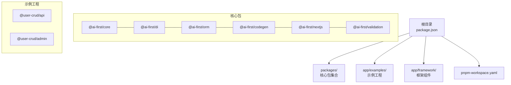
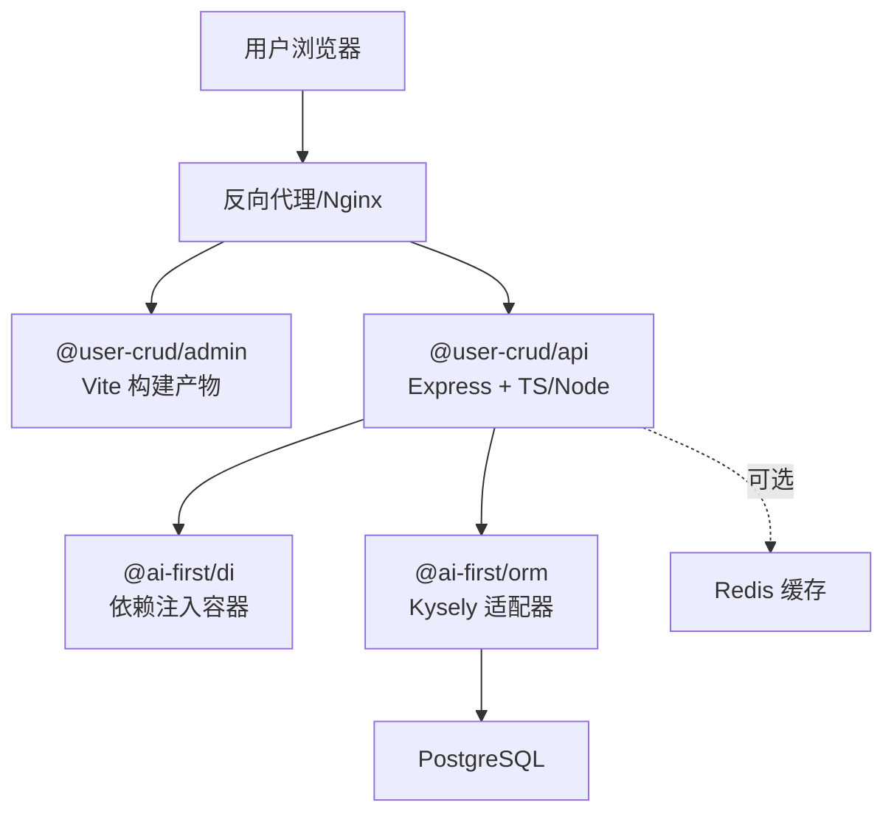
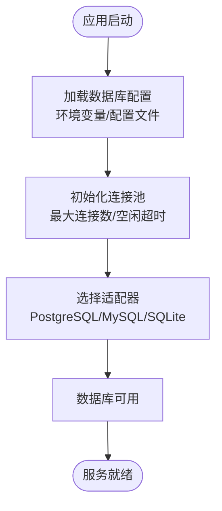
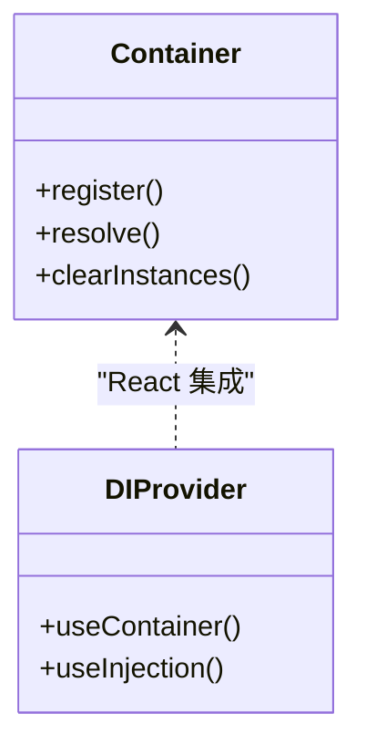
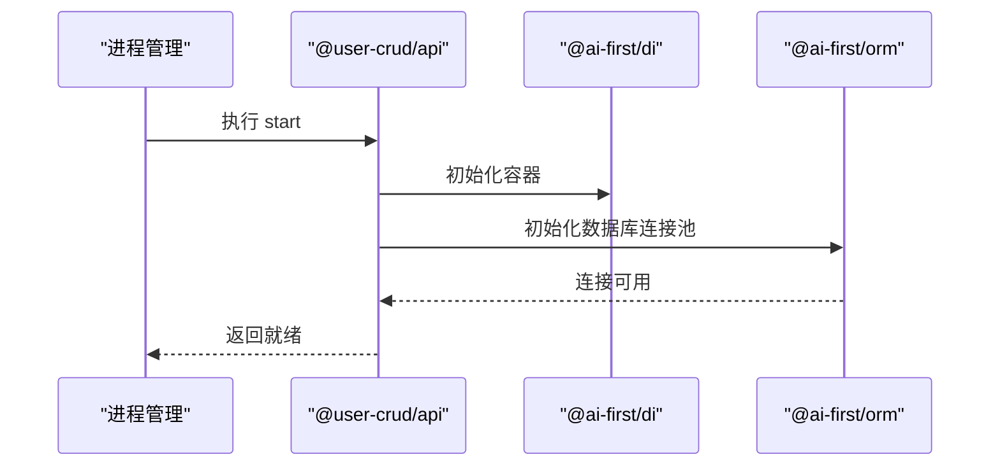
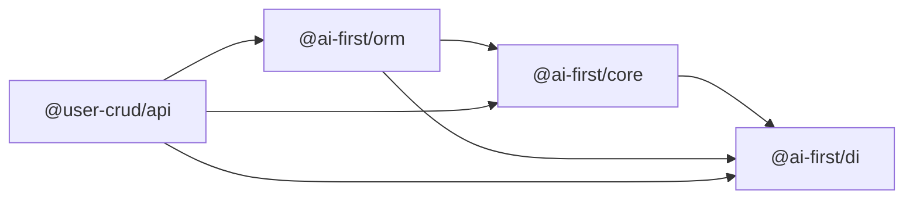

# 部署运维

<cite>
**本文引用的文件**
- [README.md](file://README.md)
- [package.json](file://package.json)
- [pnpm-workspace.yaml](file://pnpm-workspace.yaml)
- [@ai-first/core 包 package.json](file://packages/core/package.json)
- [@ai-first/orm 包 package.json](file://packages/orm/package.json)
- [@ai-first/di 包 package.json](file://packages/di/package.json)
- [@user-crud/api 包 package.json](file://app/examples/user-crud/packages/api/package.json)
- [@user-crud/admin 包 package.json](file://app/examples/user-crud/packages/admin/package.json)
- [@ai-first/core 源码入口](file://packages/core/src/index.ts)
- [@ai-first/orm 源码入口](file://packages/orm/src/index.ts)
- [@ai-first/di 源码入口](file://packages/di/src/index.ts)
</cite>

## 目录
1. [简介](#简介)
2. [项目结构](#项目结构)
3. [核心组件](#核心组件)
4. [架构总览](#架构总览)
5. [详细组件分析](#详细组件分析)
6. [依赖关系分析](#依赖关系分析)
7. [性能考虑](#性能考虑)
8. [故障排查指南](#故障排查指南)
9. [结论](#结论)
10. [附录](#附录)

## 简介
本部署运维文档面向在生产环境中稳定运行 AI-First Framework 的团队与个人开发者，目标是帮助您完成从开发到生产的全流程部署与运维：包括生产环境部署配置、环境变量管理、性能优化策略、Docker 容器化、CI/CD 流水线、监控告警、数据库连接池与缓存策略、负载均衡方案、故障诊断与日志分析、安全加固、备份与灾难恢复等。文档同时给出与仓库现有代码结构相匹配的实践建议，确保可落地、可执行。

## 项目结构
该仓库采用 monorepo 结构，使用 pnpm workspace 管理多个包与示例工程。顶层通过脚本统一构建与开发；核心包位于 packages 下，示例工程位于 app/examples 与 app/framework 中。

图表来源
- [pnpm-workspace.yaml](file://pnpm-workspace.yaml#L1-L5)
- [README.md](file://README.md#L14-L34)
- [package.json](file://package.json#L11-L18)

章节来源
- [README.md](file://README.md#L14-L34)
- [pnpm-workspace.yaml](file://pnpm-workspace.yaml#L1-L5)
- [package.json](file://package.json#L11-L18)

## 核心组件
- 应用入口与运行时
  - 示例 API 工程通过独立的包管理配置启动，包含开发、初始化数据库、代码生成与构建脚本。
- 核心能力包
  - @ai-first/core：领域层装饰器与元数据系统。
  - @ai-first/di：基于 TSyringe 的依赖注入容器，支持服务注册与生命周期管理。
  - @ai-first/orm：MyBatis-Plus 风格 ORM，支持多数据库适配与查询封装。
- 前端管理端
  - @user-crud/admin：基于 Vite 的前端工程，集成表单、表格与状态管理。

章节来源
- [@user-crud/api 包 package.json](file://app/examples/user-crud/packages/api/package.json#L12-L19)
- [@ai-first/core 源码入口](file://packages/core/src/index.ts#L10-L22)
- [@ai-first/di 源码入口](file://packages/di/src/index.ts#L6-L34)
- [@ai-first/orm 源码入口](file://packages/orm/src/index.ts#L7-L72)

## 架构总览
下图展示示例工程的典型生产部署拓扑：前端通过反向代理对外提供静态资源与 API 代理；后端 API 服务负责业务逻辑与数据库交互；数据库采用 PostgreSQL（示例工程中使用 pg）。

图表来源
- [@user-crud/api 包 package.json](file://app/examples/user-crud/packages/api/package.json#L20-L32)
- [@ai-first/orm 源码入口](file://packages/orm/src/index.ts#L56-L72)

## 详细组件分析

### 组件一：数据库连接与 ORM 配置
- 多数据库支持
  - @ai-first/orm 提供数据库工厂与适配器，支持 PostgreSQL、SQLite、MySQL 等类型。
- 生产建议
  - 使用连接池参数控制最大连接数、空闲超时、连接超时等。
  - 在容器编排中通过环境变量注入数据库连接字符串。
  - 对高并发场景启用只读副本与主从分离。

图表来源
- [@ai-first/orm 源码入口](file://packages/orm/src/index.ts#L59-L72)

章节来源
- [@ai-first/orm 源码入口](file://packages/orm/src/index.ts#L56-L72)
- [@ai-first/orm 包 package.json](file://packages/orm/package.json#L23-L44)

### 组件二：依赖注入容器
- 容器能力
  - 基于 TSyringe 的容器包装，提供生命周期、自动注入与 React 集成。
- 生产建议
  - 将服务注册为单例或作用域实例，避免重复创建昂贵对象。
  - 在容器启动阶段预热关键服务，减少首次请求延迟。

图表来源
- [@ai-first/di 源码入口](file://packages/di/src/index.ts#L9-L34)

章节来源
- [@ai-first/di 源码入口](file://packages/di/src/index.ts#L9-L34)
- [@ai-first/di 包 package.json](file://packages/di/package.json#L27-L52)

### 组件三：API 服务启动与健康检查
- 启动流程
  - 示例 API 工程提供 dev、init-db、codegen、build、start 等脚本。
- 健康检查
  - 在生产中暴露 /health 接口，检查数据库连通性与关键依赖状态。

图表来源
- [@user-crud/api 包 package.json](file://app/examples/user-crud/packages/api/package.json#L12-L19)
- [@ai-first/di 源码入口](file://packages/di/src/index.ts#L9-L34)
- [@ai-first/orm 源码入口](file://packages/orm/src/index.ts#L59-L72)

章节来源
- [@user-crud/api 包 package.json](file://app/examples/user-crud/packages/api/package.json#L12-L19)

### 组件四：前端管理端
- 技术栈
  - Vite + React，打包构建后由反向代理提供静态资源。
- 生产建议
  - 开启 Gzip/Brotli 压缩与缓存头；开启 HTTPS 与安全响应头。

章节来源
- [@user-crud/admin 包 package.json](file://app/examples/user-crud/packages/admin/package.json#L6-L11)

## 依赖关系分析
- 包依赖
  - @ai-first/core 依赖 @ai-first/di。
  - @ai-first/orm 依赖 @ai-first/core 与 @ai-first/di，并引入 Kysely 与数据库驱动。
  - @user-crud/api 依赖上述核心包与 Express、pg、better-sqlite3 等。
- 工作区范围
  - pnpm workspace 将 packages/*、app/framework/*、app/examples/* 纳入管理。

图表来源
- [@ai-first/core 包 package.json](file://packages/core/package.json#L23-L26)
- [@ai-first/orm 包 package.json](file://packages/orm/package.json#L23-L29)
- [@user-crud/api 包 package.json](file://app/examples/user-crud/packages/api/package.json#L20-L32)

章节来源
- [@ai-first/core 包 package.json](file://packages/core/package.json#L23-L26)
- [@ai-first/orm 包 package.json](file://packages/orm/package.json#L23-L29)
- [@user-crud/api 包 package.json](file://app/examples/user-crud/packages/api/package.json#L20-L32)
- [pnpm-workspace.yaml](file://pnpm-workspace.yaml#L1-L5)

## 性能考虑
- 数据库连接池
  - 设置合理的最大连接数与空闲超时，避免连接泄漏与抖动。
  - 对热点查询使用只读副本，降低主库压力。
- 缓存策略
  - 引入 Redis 缓存热点数据与查询结果，结合失效策略与一致性模型。
- 反向代理与负载均衡
  - Nginx/Traefik/Envoy 做静态资源与请求分发；多实例横向扩展。
- 日志与指标
  - 输出结构化日志，采集 Prometheus 指标，结合 Grafana 可视化。
- 预热与冷启动
  - 在容器启动阶段进行容器预热，减少首请求延迟。

## 故障排查指南
- 常见问题定位
  - 数据库连接失败：检查连接字符串、网络连通性与凭据。
  - ORM 初始化异常：确认实体元数据与适配器配置一致。
  - 容器注入失败：核对服务注册与生命周期配置。
- 日志分析
  - 分离标准输出与错误输出，按模块输出结构化 JSON 日志。
  - 使用集中式日志平台收集与检索。
- 健康检查
  - 暴露 /health 接口，定期探测数据库与关键依赖状态。
- 限流与熔断
  - 在网关层实施限流与熔断，保护下游系统。

## 结论
通过本运维文档的实践建议，您可以基于 AI-First Framework 在生产环境中实现稳定、可观测、可扩展的部署与运维。建议以“配置即代码”的方式管理环境变量与部署清单，配合 CI/CD 自动化流水线与监控告警体系，持续提升系统的可靠性与交付效率。

## 附录

### A. 环境变量与配置清单
- 数据库相关
  - DATABASE_TYPE：数据库类型（postgres/mysql/sqlite）
  - DATABASE_URL：连接字符串（推荐使用 URL 形式）
  - DB_POOL_MIN/MAX/IDLE_TIMEOUT：连接池最小/最大/空闲超时
- 服务相关
  - NODE_ENV：development/production/test
  - PORT：监听端口
  - CORS_ORIGIN：允许跨域来源
- 缓存相关
  - REDIS_URL：Redis 连接地址
  - CACHE_TTL：默认缓存过期时间
- 安全相关
  - JWT_SECRET：令牌密钥
  - COOKIE_SECURE/SAME_SITE：Cookie 安全策略

### B. Docker 容器化建议
- 多阶段构建
  - 使用 Node 基础镜像进行构建，再复制到更小的基础镜像运行。
- 健康检查
  - 在 Dockerfile 中添加 HEALTHCHECK，指向 /health。
- 环境隔离
  - 使用 docker-compose 或 Kubernetes ConfigMap/Secret 管理配置与密钥。

### C. CI/CD 流水线建议
- 触发条件
  - 主分支保护与 PR 校验（lint、type-check、单元测试）。
- 步骤建议
  - 安装依赖 → 类型检查 → 单元测试 → 构建 → 打包镜像 → 推送镜像 → 发布部署。
- 回滚策略
  - 支持蓝绿/金丝雀发布与快速回滚。

### D. 监控与告警
- 指标采集
  - CPU/内存/连接数/请求延迟/错误率/P95/P99。
- 告警规则
  - 错误率阈值、响应时间阈值、连接池耗尽、健康检查失败。
- 可视化
  - Grafana 展示关键面板，钉钉/飞书/邮件通知。

### E. 安全加固
- 网络
  - 仅暴露必要端口，限制源 IP，启用 WAF。
- 认证与授权
  - 使用 JWT/OAuth2，最小权限原则，定期轮换密钥。
- 数据库
  - 使用只读账号执行查询，敏感字段加密存储。

### F. 备份与灾难恢复
- 备份策略
  - 定时逻辑备份与物理快照；异地多活。
- RTO/RPO
  - 明确恢复目标与数据保留周期。
- 灾难演练
  - 定期进行故障演练，验证备份与恢复流程。