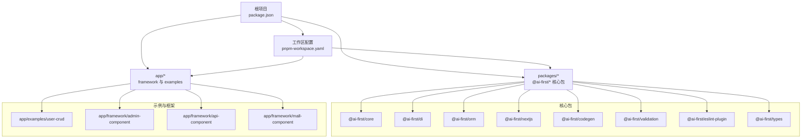
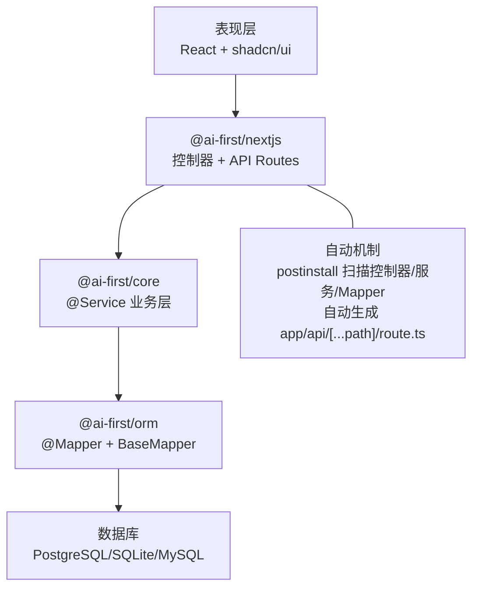
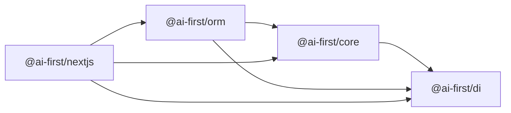

# 项目概述

<cite>
**本文引用的文件**
- [README.md](file://README.md)
- [pnpm-workspace.yaml](file://pnpm-workspace.yaml)
- [package.json](file://package.json)
- [docs/architecture.md](file://docs/architecture.md)
- [@ai-first/core/package.json](file://packages/core/package.json)
- [@ai-first/di/package.json](file://packages/di/package.json)
- [@ai-first/orm/package.json](file://packages/orm/package.json)
- [@ai-first/codegen/package.json](file://packages/codegen/package.json)
- [@ai-first/nextjs/package.json](file://packages/nextjs/package.json)
- [@user-crud/api/package.json](file://app/examples/user-crud/packages/api/package.json)
</cite>

## 目录
1. [引言](#引言)
2. [项目结构](#项目结构)
3. [核心理念](#核心理念)
4. [架构总览](#架构总览)
5. [核心组件详解](#核心组件详解)
6. [依赖关系分析](#依赖关系分析)
7. [性能考量](#性能考量)
8. [故障排查指南](#故障排查指南)
9. [结论](#结论)
10. [附录](#附录)

## 引言
AI-First Framework 是一个面向 AI 时代的 TypeScript 全栈开发框架，旨在以“AI 友好”的方式构建应用：使用 AI 最熟悉的语言（TypeScript/React/Next.js），通过装饰器驱动的 Spring Boot 风格 API 让 AI 能够理解、生成与优化全栈代码，并支持一键转换为 Java Spring Boot + MyBatis-Plus 项目。该框架采用 Monorepo 结构组织，覆盖从 Web 层到数据访问层的完整开发链路，强调“代码即设计”和“类型安全”，并提供自动化的路由生成与代码生成能力。

## 项目结构
- 工作区采用 pnpm monorepo，统一管理多个包与示例项目。
- packages 目录下包含核心包：@ai-first/core、@ai-first/di、@ai-first/orm、@ai-first/validation、@ai-first/nextjs、@ai-first/codegen、@ai-first/eslint-plugin、@ai-first/types。
- app 目录包含框架组件与示例项目，如 user-crud 示例。
- 顶层 package.json 提供统一的构建、测试、类型检查与清理脚本；pnpm-workspace.yaml 定义了工作区范围。

图表来源
- [pnpm-workspace.yaml](file://pnpm-workspace.yaml#L1-L5)
- [package.json](file://package.json#L11-L18)

章节来源
- [README.md](file://README.md#L14-L34)
- [pnpm-workspace.yaml](file://pnpm-workspace.yaml#L1-L5)
- [package.json](file://package.json#L1-L31)

## 核心理念
- AI Native：使用 AI 最熟悉的语言（TypeScript/React/Next.js），便于 AI 理解与生成。
- Code First：以代码为设计，无需学习新的 DSL，直接在现有工程中编写装饰器即可完成分层与路由生成。
- Type Safe：全程 TypeScript 强类型，结合装饰器与反射元数据系统，保障编译期安全与运行时一致性。
- Java Compatible：TypeScript 代码可一键转换为 Java Spring Boot + MyBatis-Plus，实现跨语言生态复用。

章节来源
- [README.md](file://README.md#L7-L12)
- [docs/architecture.md](file://docs/architecture.md#L221-L228)

## 架构总览
框架采用清晰的分层架构：表现层（React + shadcn/ui）、Web 层（Next.js 控制器 + API Routes）、服务层（@Service）、数据访问层（@Mapper + BaseMapper）。通过装饰器 API 串联各层，配合依赖注入容器与 ORM，形成“代码即路由、代码即模型”的自动化开发体验。

图表来源
- [docs/architecture.md](file://docs/architecture.md#L32-L65)
- [docs/architecture.md](file://docs/architecture.md#L164-L194)

章节来源
- [docs/architecture.md](file://docs/architecture.md#L3-L65)
- [docs/architecture.md](file://docs/architecture.md#L164-L204)

## 核心组件详解

### @ai-first/core：装饰器与元数据系统
- 职责：提供业务领域层装饰器与元数据系统，支撑服务层与上层 Web 层的装配。
- 关键点：依赖 @ai-first/di，使用 reflect-metadata 实现装饰器元数据读取与传递。
- 设计要点：以装饰器 API 形式暴露领域注解，降低学习成本，提升 AI 友好度。

章节来源
- [@ai-first/core/package.json](file://packages/core/package.json#L1-L39)

### @ai-first/di：依赖注入容器
- 职责：基于 tsyringe 的依赖注入容器，提供 @Service、@Inject、@Autowired 等装饰器，支持构造函数与属性注入。
- 关键点：与 reflect-metadata 协同工作，确保运行时可解析依赖关系。
- 设计要点：对 React 可选 peer 依赖，兼顾前端与后端场景。

章节来源
- [@ai-first/di/package.json](file://packages/di/package.json#L1-L53)

### @ai-first/orm：MyBatis-Plus 风格 ORM
- 职责：提供与 MyBatis-Plus API 兼容的装饰器 ORM，支持多数据库（PostgreSQL、SQLite、MySQL）。
- 关键点：@Mapper、@TableName、@TableId、@TableField 等装饰器；底层使用 Kysely；与 @ai-first/core、@ai-first/di 协作。
- 设计要点：BaseMapper 提供通用 CRUD；QueryWrapper 支持条件构造。

章节来源
- [@ai-first/orm/package.json](file://packages/orm/package.json#L1-L54)
- [README.md](file://README.md#L59-L67)

### @ai-first/nextjs：Next.js 适配层与控制器装饰器
- 职责：提供 Spring Boot 风格的 HTTP 装饰器（@RestController、@GetMapping、@PostMapping 等）与 API Routes 生成。
- 关键点：依赖 @ai-first/core、@ai-first/di、@ai-first/orm；通过 postinstall 自动扫描控制器并生成路由文件。
- 设计要点：零配置生成路由，降低样板代码。

章节来源
- [@ai-first/nextjs/package.json](file://packages/nextjs/package.json#L1-L59)
- [docs/architecture.md](file://docs/architecture.md#L164-L194)

### @ai-first/codegen：Java 代码生成器
- 职责：将 TypeScript 装饰器代码转换为 Java Spring Boot + MyBatis-Plus 代码，实现跨语言生态复用。
- 关键点：输入为 TypeScript 装饰器代码，输出为 Java 实体、Mapper、Service 等文件。
- 设计要点：与框架整体装饰器风格保持一致，便于双向映射。

章节来源
- [@ai-first/codegen/package.json](file://packages/codegen/package.json#L1-L28)
- [README.md](file://README.md#L75-L81)

### @ai-first/validation：数据验证
- 职责：提供数据验证能力，与 class-validator 等生态协作，保障请求参数与 DTO 的一致性。
- 设计要点：与 Web 层与服务层无缝集成，提升类型安全与运行时健壮性。

章节来源
- [docs/architecture.md](file://docs/architecture.md#L13-L14)

### @ai-first/eslint-plugin 与 @ai-first/types：规范与共享类型
- 职责：提供 ESLint 规则插件与共享类型定义，统一团队编码规范与类型约束。
- 设计要点：作为基础设施包，服务于所有业务包与示例项目。

章节来源
- [README.md](file://README.md#L25-L26)
- [pnpm-workspace.yaml](file://pnpm-workspace.yaml#L1-L5)

### 示例项目：user-crud
- 职责：展示完整的 CRUD 应用开发流程，涵盖实体、Mapper、Service、Controller 的完整链路。
- 关键点：依赖 @ai-first/* 核心包，演示自动路由生成与本地数据库初始化脚本。
- 设计要点：最小可用示例，便于快速上手与扩展。

章节来源
- [@user-crud/api/package.json](file://app/examples/user-crud/packages/api/package.json#L1-L47)
- [README.md](file://README.md#L82-L159)

## 依赖关系分析
- 包间依赖：@ai-first/core 依赖 @ai-first/di；@ai-first/orm 依赖 @ai-first/core 与 @ai-first/di；@ai-first/nextjs 依赖 @ai-first/core、@ai-first/di、@ai-first/orm。
- 运行时依赖：reflect-metadata 提供装饰器元数据支持；Kysely 作为 ORM 底层；tsyringe 作为 DI 容器；Express/CORS 用于 Web 层。
- 工作区范围：pnpm-workspace.yaml 将 packages/*、app/framework/*、app/examples/* 纳入工作区，统一构建与开发。

图表来源
- [@ai-first/core/package.json](file://packages/core/package.json#L23-L26)
- [@ai-first/orm/package.json](file://packages/orm/package.json#L23-L28)
- [@ai-first/nextjs/package.json](file://packages/nextjs/package.json#L31-L36)

章节来源
- [@ai-first/core/package.json](file://packages/core/package.json#L1-L39)
- [@ai-first/orm/package.json](file://packages/orm/package.json#L1-L54)
- [@ai-first/nextjs/package.json](file://packages/nextjs/package.json#L1-L59)

## 性能考量
- 构建与打包：使用 tsup 进行快速打包，支持 watch 模式加速开发迭代。
- 运行时开销：依赖注入与装饰器元数据在启动阶段解析，运行时通过容器缓存减少重复解析成本。
- 数据访问：ORM 基于 Kysely，具备良好的查询计划与 SQL 生成能力；多数据库支持通过适配层实现。
- 自动化生成：postinstall 路由生成避免手动维护路由文件，减少运行时错误与维护成本。

## 故障排查指南
- 装饰器元数据缺失：若出现装饰器无法读取元数据的情况，请确认已引入 reflect-metadata 并在入口处执行初始化。
- 路由未生成：检查 @ai-first/nextjs 是否正确安装，确认 postinstall 是否执行，以及控制器文件命名与路径是否符合扫描规则。
- 数据库连接失败：确认数据库驱动（如 pg、better-sqlite3）版本与 peerDependencies 兼容，检查连接字符串与权限。
- 类型检查失败：使用统一的 type-check 脚本进行全工作区类型检查，定位具体包的类型问题。

## 结论
AI-First Framework 通过装饰器驱动的 Spring Boot 风格 API、Monorepo 结构与自动化生成机制，实现了“AI 友好、类型安全、零配置、跨语言兼容”的全栈开发体验。其核心包覆盖从 Web 到数据访问的完整链路，并提供一键转换为 Java Spring Boot 的能力，适合希望在 TypeScript 生态中快速构建高质量应用，并同时满足 Java 生态迁移需求的团队。

## 附录
- 快速开始：安装依赖、构建所有包、运行示例项目。
- 开发路线图：已完成核心包与示例项目，后续完善 ESLint 插件、更多示例与文档。
- 文档索引：架构设计、开发路线图、Java 兼容性等文档位于 docs 目录。

章节来源
- [README.md](file://README.md#L36-L56)
- [README.md](file://README.md#L186-L204)