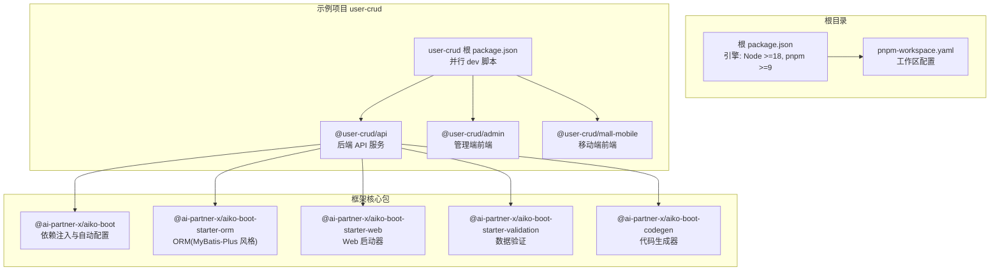
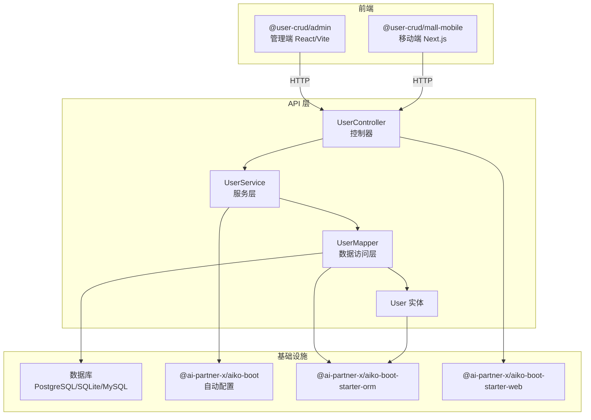
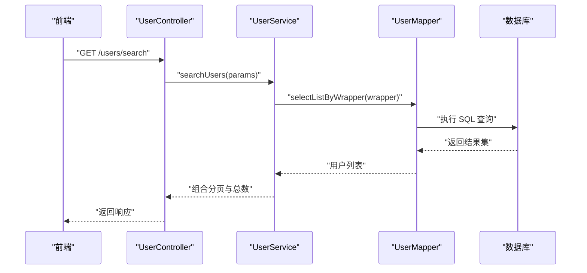
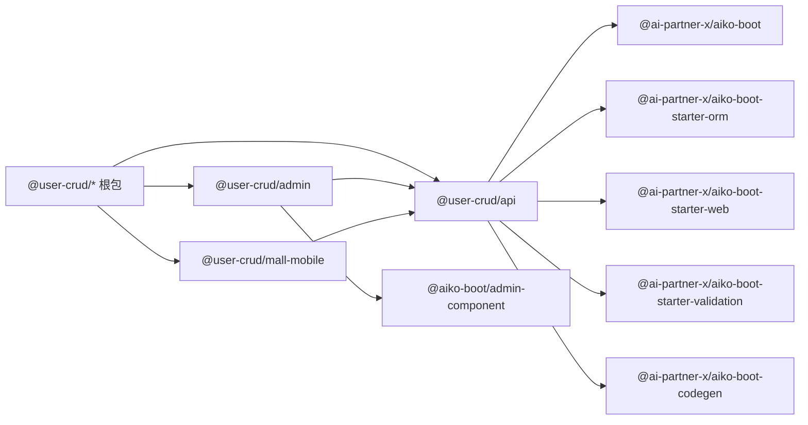

# 快速开始指南

<cite>
**本文引用的文件**
- [README.md](file://README.md)
- [package.json](file://package.json)
- [pnpm-workspace.yaml](file://pnpm-workspace.yaml)
- [app/examples/user-crud/README.md](file://app/examples/user-crud/README.md)
- [app/examples/user-crud/package.json](file://app/examples/user-crud/package.json)
- [app/examples/user-crud/packages/api/package.json](file://app/examples/user-crud/packages/api/package.json)
- [app/examples/user-crud/packages/admin/package.json](file://app/examples/user-crud/packages/admin/package.json)
- [app/examples/user-crud/packages/mall-mobile/package.json](file://app/examples/user-crud/packages/mall-mobile/package.json)
- [app/examples/user-crud/packages/api/src/server.ts](file://app/examples/user-crud/packages/api/src/server.ts)
- [app/examples/user-crud/packages/api/src/entity/user.entity.ts](file://app/examples/user-crud/packages/api/src/entity/user.entity.ts)
- [app/examples/user-crud/packages/api/src/mapper/user.mapper.ts](file://app/examples/user-crud/packages/api/src/mapper/user.mapper.ts)
- [app/examples/user-crud/packages/api/src/service/user.service.ts](file://app/examples/user-crud/packages/api/src/service/user.service.ts)
- [app/examples/user-crud/packages/api/src/controller/user.controller.ts](file://app/examples/user-crud/packages/api/src/controller/user.controller.ts)
</cite>

## 目录
1. [简介](#简介)
2. [项目结构](#项目结构)
3. [核心组件](#核心组件)
4. [架构总览](#架构总览)
5. [详细组件分析](#详细组件分析)
6. [依赖分析](#依赖分析)
7. [性能考虑](#性能考虑)
8. [故障排除指南](#故障排除指南)
9. [结论](#结论)
10. [附录](#附录)

## 简介
本指南面向初学者与有经验的开发者，帮助你在本地快速搭建 AI First Framework 开发环境，并成功运行示例项目 user-crud。你将完成环境准备、项目克隆、依赖安装、构建与启动等完整流程；随后通过 user-crud 示例项目掌握实体、数据访问层、服务层与控制器的基本代码结构与调用关系。

## 项目结构
AI First Framework 采用 monorepo 结构，核心包位于 packages 目录，示例项目位于 app/examples。user-crud 是一个包含 API、管理端前端与移动端前端的多包工作区，使用 pnpm workspace 管理。

图表来源
- [package.json](file://package.json#L7-L10)
- [pnpm-workspace.yaml](file://pnpm-workspace.yaml#L1-L6)
- [app/examples/user-crud/package.json](file://app/examples/user-crud/package.json#L5-L15)
- [app/examples/user-crud/packages/api/package.json](file://app/examples/user-crud/packages/api/package.json#L21-L32)

章节来源
- [README.md](file://README.md#L14-L33)
- [pnpm-workspace.yaml](file://pnpm-workspace.yaml#L1-L6)

## 核心组件
- 依赖注入与自动配置：提供装饰器与容器能力，简化组件装配与生命周期管理。
- ORM（MyBatis-Plus 风格）：提供通用 Mapper、QueryWrapper、UpdateWrapper 与实体注解。
- Web 启动器：提供 Spring Boot 风格的控制器注解与路由映射。
- 数据验证：提供校验器与 DTO 支持。
- Java 代码生成：将 TypeScript 装饰器代码一键转换为 Java Spring Boot + MyBatis-Plus。

章节来源
- [README.md](file://README.md#L56-L80)

## 架构总览
下图展示了 user-crud 示例的三层架构：前端（管理端与移动端）、API 层（控制器-服务-数据访问层），以及数据库层。API 层通过 ORM 访问数据库，前端通过 HTTP 与 API 交互。

图表来源
- [app/examples/user-crud/packages/admin/package.json](file://app/examples/user-crud/packages/admin/package.json#L12-L22)
- [app/examples/user-crud/packages/mall-mobile/package.json](file://app/examples/user-crud/packages/mall-mobile/package.json#L11-L18)
- [app/examples/user-crud/packages/api/src/controller/user.controller.ts](file://app/examples/user-crud/packages/api/src/controller/user.controller.ts#L30-L34)
- [app/examples/user-crud/packages/api/src/service/user.service.ts](file://app/examples/user-crud/packages/api/src/service/user.service.ts#L30-L33)
- [app/examples/user-crud/packages/api/src/mapper/user.mapper.ts](file://app/examples/user-crud/packages/api/src/mapper/user.mapper.ts#L5-L6)
- [app/examples/user-crud/packages/api/src/entity/user.entity.ts](file://app/examples/user-crud/packages/api/src/entity/user.entity.ts#L3-L4)
- [app/examples/user-crud/packages/api/src/server.ts](file://app/examples/user-crud/packages/api/src/server.ts#L10-L17)

## 详细组件分析

### 环境准备与安装
- Node.js 版本要求：>= 18.0.0
- pnpm 版本要求：>= 9.0.0
- 推荐版本：仓库中声明了具体版本范围，确保与本地一致

安装步骤
- 克隆仓库到本地
- 在仓库根目录执行依赖安装与构建
- 进入 user-crud 示例，分别安装其子包依赖并构建

章节来源
- [package.json](file://package.json#L7-L10)
- [README.md](file://README.md#L35-L54)

### 运行示例项目 user-crud
- 进入 API 包目录并启动开发服务器
- 打开浏览器访问默认端口查看页面（示例项目说明）

章节来源
- [README.md](file://README.md#L49-L54)
- [app/examples/user-crud/README.md](file://app/examples/user-crud/README.md#L5-L15)

### 实体（Entity）
- 使用装饰器定义表名与字段映射
- 字段类型与可选性由业务决定，时间戳字段常用于审计

章节来源
- [app/examples/user-crud/packages/api/src/entity/user.entity.ts](file://app/examples/user-crud/packages/api/src/entity/user.entity.ts#L3-L22)

### 数据访问层（Mapper）
- 基于通用 BaseMapper，扩展自定义查询方法
- 支持按字段查询与返回单个/多个记录

章节来源
- [app/examples/user-crud/packages/api/src/mapper/user.mapper.ts](file://app/examples/user-crud/packages/api/src/mapper/user.mapper.ts#L5-L16)

### 服务层（Service）
- 通过 Autowired 注入 Mapper
- 提供业务逻辑封装，支持事务注解
- 支持复杂查询（QueryWrapper）、批量更新（UpdateWrapper）与分页统计

章节来源
- [app/examples/user-crud/packages/api/src/service/user.service.ts](file://app/examples/user-crud/packages/api/src/service/user.service.ts#L30-L250)

### 控制器（Controller）
- 使用注解定义 REST 接口路径与方法
- 参数绑定与请求体解析
- 返回统一的数据传输对象

章节来源
- [app/examples/user-crud/packages/api/src/controller/user.controller.ts](file://app/examples/user-crud/packages/api/src/controller/user.controller.ts#L30-L169)

### API 请求序列图（以用户查询为例）

图表来源
- [app/examples/user-crud/packages/api/src/controller/user.controller.ts](file://app/examples/user-crud/packages/api/src/controller/user.controller.ts#L46-L76)
- [app/examples/user-crud/packages/api/src/service/user.service.ts](file://app/examples/user-crud/packages/api/src/service/user.service.ts#L63-L123)
- [app/examples/user-crud/packages/api/src/mapper/user.mapper.ts](file://app/examples/user-crud/packages/api/src/mapper/user.mapper.ts#L5-L16)

## 依赖分析
- user-crud 根包提供并行开发脚本，分别启动 API、管理端与移动端
- API 包依赖核心框架包与数据库驱动，提供自动配置与 ORM 能力
- 管理端与移动端依赖 API 包与共享组件库

图表来源
- [app/examples/user-crud/package.json](file://app/examples/user-crud/package.json#L5-L15)
- [app/examples/user-crud/packages/api/package.json](file://app/examples/user-crud/packages/api/package.json#L21-L32)
- [app/examples/user-crud/packages/admin/package.json](file://app/examples/user-crud/packages/admin/package.json#L12-L22)
- [app/examples/user-crud/packages/mall-mobile/package.json](file://app/examples/user-crud/packages/mall-mobile/package.json#L11-L18)

章节来源
- [app/examples/user-crud/package.json](file://app/examples/user-crud/package.json#L5-L15)
- [app/examples/user-crud/packages/api/package.json](file://app/examples/user-crud/packages/api/package.json#L21-L32)
- [app/examples/user-crud/packages/admin/package.json](file://app/examples/user-crud/packages/admin/package.json#L12-L22)
- [app/examples/user-crud/packages/mall-mobile/package.json](file://app/examples/user-crud/packages/mall-mobile/package.json#L11-L18)

## 性能考虑
- 使用分页查询避免一次性加载大量数据
- 合理使用索引字段进行过滤与排序
- 对高频接口启用缓存策略（如适用）
- 控制请求体大小与嵌套层级，减少序列化开销
- 在服务层聚合查询，减少数据库往返次数

## 故障排除指南
常见问题与解决思路
- Node.js 或 pnpm 版本不满足要求
  - 现象：安装或构建时报错
  - 处理：升级至满足引擎要求的版本
- 工作区依赖未安装
  - 现象：模块找不到或构建失败
  - 处理：在根目录执行安装与构建命令
- 数据库连接失败
  - 现象：启动时提示连接错误
  - 处理：检查数据库配置与连接字符串
- 端口占用
  - 现象：启动失败显示端口被占用
  - 处理：修改端口或释放占用进程
- TypeScript 编译错误
  - 现象：编译报错
  - 处理：根据错误提示修复类型定义或导入路径
- 反射元数据缺失
  - 现象：装饰器相关功能异常
  - 处理：确保在文件顶部引入反射元数据

章节来源
- [package.json](file://package.json#L7-L10)
- [README.md](file://README.md#L35-L54)

## 结论
通过本指南，你已完成环境准备、项目安装与构建，并成功运行了 user-crud 示例。建议在理解实体、Mapper、Service、Controller 的职责边界后，逐步扩展业务功能与测试用例，充分利用框架提供的装饰器与自动配置能力提升开发效率。

## 附录

### 快速命令清单
- 安装根依赖与构建所有包
  - 在仓库根目录执行安装与构建
- 运行 user-crud 示例
  - 进入 API 包目录并启动开发服务器
- 并行启动 API、管理端与移动端
  - 在 user-crud 根目录使用并行开发脚本

章节来源
- [README.md](file://README.md#L35-L54)
- [app/examples/user-crud/package.json](file://app/examples/user-crud/package.json#L6-L9)

### 代码结构参考路径
- 服务器入口与自动配置
  - [app/examples/user-crud/packages/api/src/server.ts](file://app/examples/user-crud/packages/api/src/server.ts#L10-L21)
- 实体定义
  - [app/examples/user-crud/packages/api/src/entity/user.entity.ts](file://app/examples/user-crud/packages/api/src/entity/user.entity.ts#L3-L22)
- 数据访问层
  - [app/examples/user-crud/packages/api/src/mapper/user.mapper.ts](file://app/examples/user-crud/packages/api/src/mapper/user.mapper.ts#L5-L16)
- 服务层
  - [app/examples/user-crud/packages/api/src/service/user.service.ts](file://app/examples/user-crud/packages/api/src/service/user.service.ts#L30-L250)
- 控制器
  - [app/examples/user-crud/packages/api/src/controller/user.controller.ts](file://app/examples/user-crud/packages/api/src/controller/user.controller.ts#L30-L169)