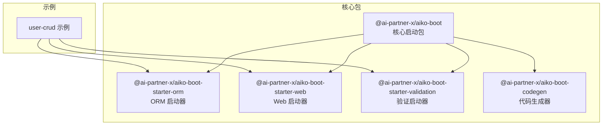
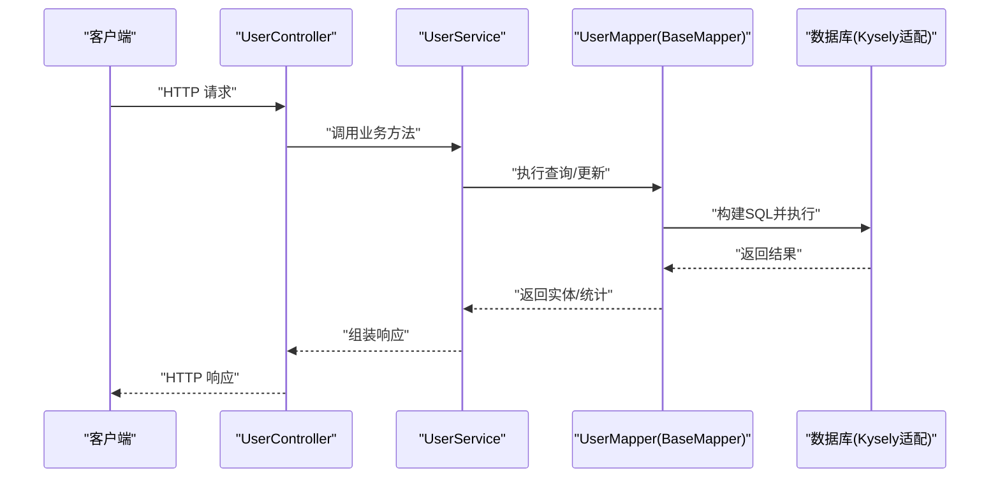
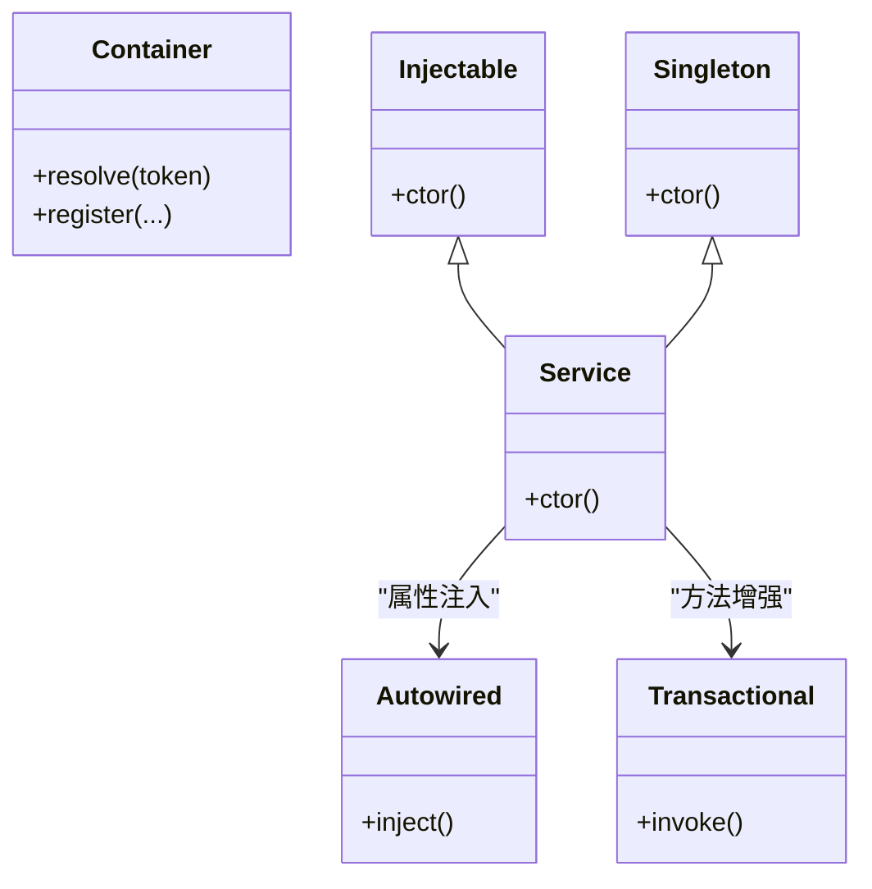
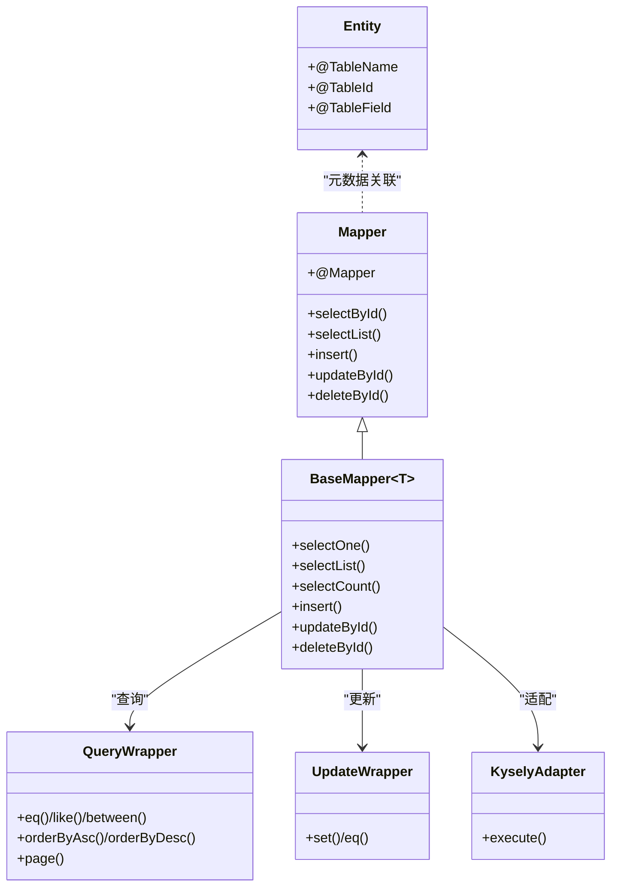
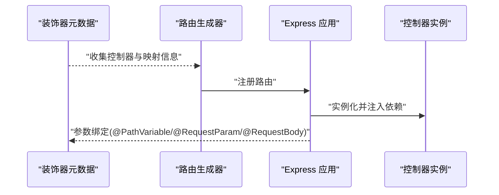
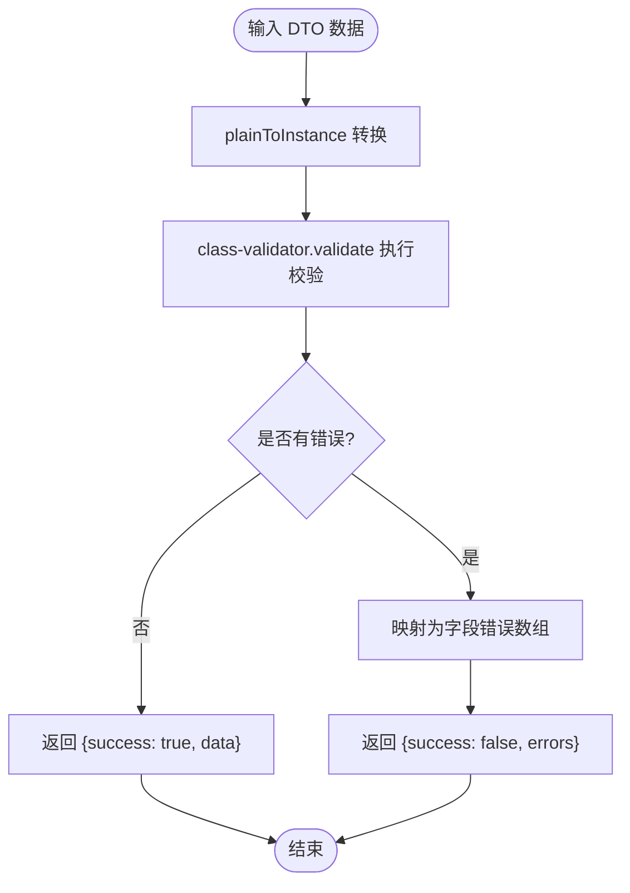
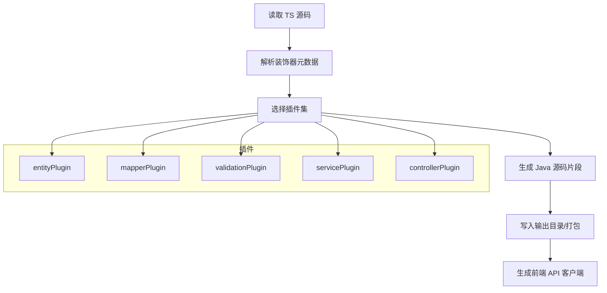
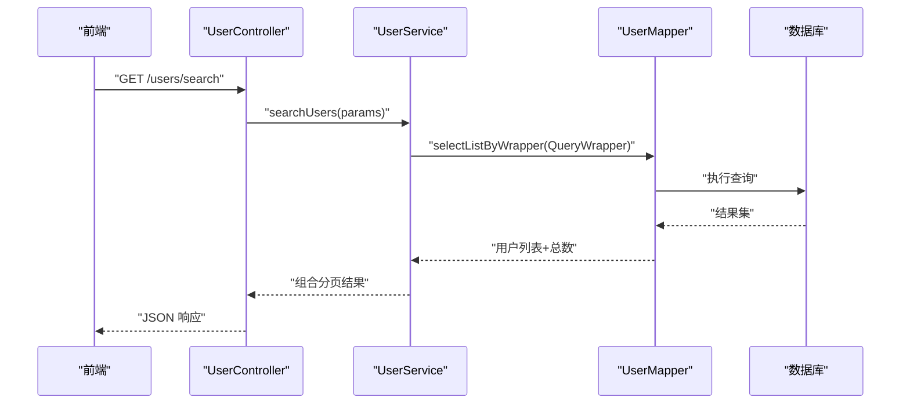
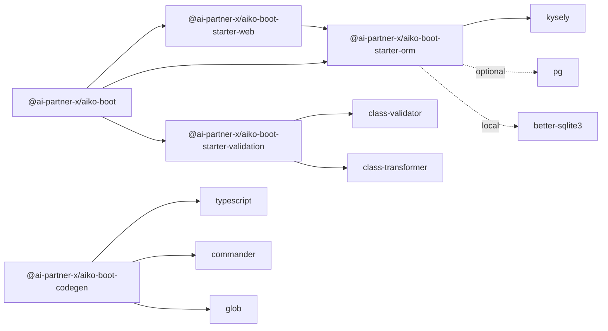

# 技术栈与特性概览

<cite>
**本文引用的文件**
- [README.md](file://README.md)
- [package.json](file://package.json)
- [packages/aiko-boot/package.json](file://packages/aiko-boot/package.json)
- [packages/aiko-boot-starter-orm/package.json](file://packages/aiko-boot-starter-orm/package.json)
- [packages/aiko-boot-starter-web/package.json](file://packages/aiko-boot-starter-web/package.json)
- [packages/aiko-boot-starter-validation/package.json](file://packages/aiko-boot-starter-validation/package.json)
- [packages/aiko-boot-codegen/package.json](file://packages/aiko-boot-codegen/package.json)
- [packages/aiko-boot/src/index.ts](file://packages/aiko-boot/src/index.ts)
- [packages/aiko-boot-starter-orm/src/index.ts](file://packages/aiko-boot-starter-orm/src/index.ts)
- [packages/aiko-boot-starter-web/src/index.ts](file://packages/aiko-boot-starter-web/src/index.ts)
- [packages/aiko-boot-starter-validation/src/index.ts](file://packages/aiko-boot-starter-validation/src/index.ts)
- [packages/aiko-boot-codegen/src/index.ts](file://packages/aiko-boot-codegen/src/index.ts)
- [packages/aiko-boot-starter-orm/src/decorators.ts](file://packages/aiko-boot-starter-orm/src/decorators.ts)
- [packages/aiko-boot-starter-web/src/decorators.ts](file://packages/aiko-boot-starter-web/src/decorators.ts)
- [app/examples/user-crud/packages/api/src/entity/user.entity.ts](file://app/examples/user-crud/packages/api/src/entity/user.entity.ts)
- [app/examples/user-crud/packages/api/src/mapper/user.mapper.ts](file://app/examples/user-crud/packages/api/src/mapper/user.mapper.ts)
- [app/examples/user-crud/packages/api/src/service/user.service.ts](file://app/examples/user-crud/packages/api/src/service/user.service.ts)
- [app/examples/user-crud/packages/api/src/controller/user.controller.ts](file://app/examples/user-crud/packages/api/src/controller/user.controller.ts)
</cite>

## 目录
1. [简介](#简介)
2. [项目结构](#项目结构)
3. [核心组件](#核心组件)
4. [架构总览](#架构总览)
5. [详细组件分析](#详细组件分析)
6. [依赖关系分析](#依赖关系分析)
7. [性能考量](#性能考量)
8. [安全考量](#安全考量)
9. [扩展性与兼容性](#扩展性与兼容性)
10. [故障排查指南](#故障排查指南)
11. [结论](#结论)

## 简介
本项目是一个“AI 可理解”的全栈开发框架，以 TypeScript + Next.js 为基础，采用装饰器驱动的 Spring Boot 风格开发范式，提供：
- MyBatis-Plus 风格 API 的 ORM 能力（Kysely 底层）
- 依赖注入与自动配置
- 数据验证（class-validator 兼容）
- Java 代码生成器（TypeScript → Java Spring Boot + MyBatis-Plus）
- 多数据库支持（PostgreSQL、SQLite、MySQL）

其目标是让 AI 能够理解、生成、优化全栈应用代码，并支持一键转换为 Java 生态。

章节来源
- file://README.md#L1-L215

## 项目结构
仓库采用 monorepo 结构，核心包与示例工程分离：
- packages/aiko-boot：核心启动包（DI、自动配置、生命周期等）
- packages/aiko-boot-starter-orm：ORM 启动器（MyBatis-Plus 风格 API + Kysely）
- packages/aiko-boot-starter-web：Web 启动器（HTTP 装饰器 + Express 路由）
- packages/aiko-boot-starter-validation：数据验证（class-validator 兼容）
- packages/aiko-boot-codegen：TypeScript → Java 代码生成器
- app/examples：示例项目（如 user-crud）

图表来源
- [README.md](file://README.md#L14-L33)
- [packages/aiko-boot/package.json](file://packages/aiko-boot/package.json#L1-L61)
- [packages/aiko-boot-starter-orm/package.json](file://packages/aiko-boot-starter-orm/package.json#L1-L55)
- [packages/aiko-boot-starter-web/package.json](file://packages/aiko-boot-starter-web/package.json#L1-L60)
- [packages/aiko-boot-starter-validation/package.json](file://packages/aiko-boot-starter-validation/package.json#L1-L41)
- [packages/aiko-boot-codegen/package.json](file://packages/aiko-boot-codegen/package.json#L1-L34)

章节来源
- file://README.md#L14-L33
- file://package.json#L1-L32

## 核心组件
- 依赖注入与自动配置（aiko-boot）：提供 @Service、@Autowired、@Inject、@Transactional 等装饰器，以及自动配置、生命周期事件、异常处理等能力。
- ORM 启动器（aiko-boot-starter-orm）：提供 @Entity/@TableName、@TableId、@TableField、@Mapper 等装饰器，BaseMapper 通用 CRUD，QueryWrapper/LambdaQueryWrapper 动态查询，多数据库适配。
- Web 启动器（aiko-boot-starter-web）：提供 @RestController、@GetMapping、@PostMapping 等装饰器，自动路由生成，Feign 风格客户端。
- 验证启动器（aiko-boot-starter-validation）：重导出 class-validator 装饰器，提供 validateDto、createResolver，以及 Java 转译映射。
- 代码生成器（aiko-boot-codegen）：解析 TypeScript 装饰器源码，生成 Java 类、注解与前端 API 客户端。

章节来源
- file://packages/aiko-boot/src/index.ts#L1-L64
- file://packages/aiko-boot-starter-orm/src/index.ts#L1-L91
- file://packages/aiko-boot-starter-web/src/index.ts#L1-L73
- file://packages/aiko-boot-starter-validation/src/index.ts#L1-L242
- file://packages/aiko-boot-codegen/src/index.ts#L1-L57

## 架构总览
下图展示了从控制器到服务、Mapper、数据库的典型调用链路，体现装饰器驱动与依赖注入的协作方式。

图表来源
- [app/examples/user-crud/packages/api/src/controller/user.controller.ts](file://app/examples/user-crud/packages/api/src/controller/user.controller.ts#L1-L170)
- [app/examples/user-crud/packages/api/src/service/user.service.ts](file://app/examples/user-crud/packages/api/src/service/user.service.ts#L1-L251)
- [app/examples/user-crud/packages/api/src/mapper/user.mapper.ts](file://app/examples/user-crud/packages/api/src/mapper/user.mapper.ts#L1-L17)
- [packages/aiko-boot-starter-orm/src/index.ts](file://packages/aiko-boot-starter-orm/src/index.ts#L44-L81)

## 详细组件分析

### 依赖注入与自动配置（aiko-boot）
- 装饰器体系：@Service、@Component、@Transactional、@Inject、@Autowired 等，支持构造函数与属性注入。
- 容器与生命周期：基于 tsyringe，提供 Container、Lifecycle、Injectable、Singleton、Scoped、AutoRegister 等能力。
- 自动配置：结合 @ConfigurationProperties、@Value、@AutoConfiguration、@ConditionalOn* 实现按环境自动装配。
- 异常与事件：@ControllerAdvice、@ExceptionHandler、@OnApplicationReady、@EventListener 等。

图表来源
- [packages/aiko-boot/src/index.ts](file://packages/aiko-boot/src/index.ts#L29-L55)

章节来源
- file://packages/aiko-boot/src/index.ts#L1-L64

### ORM 启动器（aiko-boot-starter-orm）
- 装饰器：@Entity/@TableName、@TableId、@TableField、@Column、@Mapper；元数据存储于反射中，便于生成 SQL 与 Java 映射。
- Mapper：BaseMapper 提供通用 CRUD；支持 QueryWrapper/LambdaQueryWrapper 构建动态查询；UpdateWrapper/LambdaUpdateWrapper 支持批量更新。
- 多数据库：通过 KyselyAdapter、InMemoryAdapter 适配 PostgreSQL、SQLite、MySQL；支持运行时切换与连接配置。
- 自动配置：根据 database.* 配置自动初始化数据库与适配器。

图表来源
- [packages/aiko-boot-starter-orm/src/decorators.ts](file://packages/aiko-boot-starter-orm/src/decorators.ts#L68-L193)
- [packages/aiko-boot-starter-orm/src/index.ts](file://packages/aiko-boot-starter-orm/src/index.ts#L22-L81)

章节来源
- file://packages/aiko-boot-starter-orm/src/index.ts#L1-L91
- file://packages/aiko-boot-starter-orm/src/decorators.ts#L1-L224

### Web 启动器（aiko-boot-starter-web）
- 控制器装饰器：@RestController、@GetMapping、@PostMapping、@PutMapping、@DeleteMapping、@PatchMapping、@RequestMapping。
- 参数绑定：@PathVariable、@RequestParam/@QueryParam、@RequestBody。
- 路由生成：基于元数据自动生成 Express 路由；同时提供轻量客户端（SSR 友好）。
- 自动配置：基于 server.* 配置，提供 ExpressHttpServer、Express 路由器与服务封装。

图表来源
- [packages/aiko-boot-starter-web/src/decorators.ts](file://packages/aiko-boot-starter-web/src/decorators.ts#L50-L173)
- [packages/aiko-boot-starter-web/src/index.ts](file://packages/aiko-boot-starter-web/src/index.ts#L13-L72)

章节来源
- file://packages/aiko-boot-starter-web/src/index.ts#L1-L73
- file://packages/aiko-boot-starter-web/src/decorators.ts#L1-L196

### 验证启动器（aiko-boot-starter-validation）
- 装饰器重导出：完整导出 class-validator 的常用校验装饰器，保持 API 兼容。
- Dto 校验：validateDto 提供统一的校验结果格式；createResolver 与 react-hook-form 集成。
- Java 转译映射：JAVA_VALIDATION_MAPPING 将 TS 装饰器映射为 Java 注解，支撑代码生成器。

图表来源
- [packages/aiko-boot-starter-validation/src/index.ts](file://packages/aiko-boot-starter-validation/src/index.ts#L120-L142)
- [packages/aiko-boot-starter-validation/src/index.ts](file://packages/aiko-boot-starter-validation/src/index.ts#L178-L196)

章节来源
- file://packages/aiko-boot-starter-validation/src/index.ts#L1-L242

### 代码生成器（aiko-boot-codegen）
- 输入：TypeScript 装饰器源码（实体、Mapper、Service、Controller、验证等）。
- 解析与生成：parseSourceFile → generateJavaClass；支持插件化（entityPlugin、mapperPlugin、validationPlugin 等）。
- 输出：Java 类、注解（含 MyBatis-Plus 注解）、前端 API 客户端代码。
- CLI：提供 aiko-codegen 命令行工具入口。

图表来源
- [packages/aiko-boot-codegen/src/index.ts](file://packages/aiko-boot-codegen/src/index.ts#L36-L56)

章节来源
- file://packages/aiko-boot-codegen/src/index.ts#L1-L57

### 示例：用户 CRUD（装饰器驱动）
- 实体：@Entity/@TableName、@TableId、@TableField 标注表结构。
- Mapper：@Mapper(User) 继承 BaseMapper，扩展查询方法。
- Service：@Service + @Autowired 编排业务；使用 QueryWrapper/LambdaQueryWrapper 构建复杂查询；@Transactional 保证一致性。
- Controller：@RestController + HTTP 装饰器暴露接口；参数绑定与 DTO 组装。

图表来源
- [app/examples/user-crud/packages/api/src/controller/user.controller.ts](file://app/examples/user-crud/packages/api/src/controller/user.controller.ts#L46-L76)
- [app/examples/user-crud/packages/api/src/service/user.service.ts](file://app/examples/user-crud/packages/api/src/service/user.service.ts#L63-L123)
- [app/examples/user-crud/packages/api/src/mapper/user.mapper.ts](file://app/examples/user-crud/packages/api/src/mapper/user.mapper.ts#L1-L17)
- [app/examples/user-crud/packages/api/src/entity/user.entity.ts](file://app/examples/user-crud/packages/api/src/entity/user.entity.ts#L1-L23)

章节来源
- file://app/examples/user-crud/packages/api/src/entity/user.entity.ts#L1-L23
- file://app/examples/user-crud/packages/api/src/mapper/user.mapper.ts#L1-L17
- file://app/examples/user-crud/packages/api/src/service/user.service.ts#L1-L251
- file://app/examples/user-crud/packages/api/src/controller/user.controller.ts#L1-L170

## 依赖关系分析
- aiko-boot 为核心，被 web、orm、validation、codegen 依赖。
- starter-web 依赖 aiko-boot 与 aiko-boot-starter-orm。
- starter-orm 依赖 aiko-boot 与 Kysely、better-sqlite3、pg（可选）。
- starter-validation 依赖 aiko-boot 与 class-validator/class-transformer。
- codegen 依赖 commander、glob、typescript，作为独立 CLI 工具。

图表来源
- [packages/aiko-boot/package.json](file://packages/aiko-boot/package.json#L35-L38)
- [packages/aiko-boot-starter-web/package.json](file://packages/aiko-boot-starter-web/package.json#L32-L36)
- [packages/aiko-boot-starter-orm/package.json](file://packages/aiko-boot-starter-orm/package.json#L24-L28)
- [packages/aiko-boot-starter-validation/package.json](file://packages/aiko-boot-starter-validation/package.json#L21-L26)
- [packages/aiko-boot-codegen/package.json](file://packages/aiko-boot-codegen/package.json#L24-L28)

章节来源
- file://packages/aiko-boot/package.json#L1-L61
- file://packages/aiko-boot-starter-web/package.json#L1-L60
- file://packages/aiko-boot-starter-orm/package.json#L1-L55
- file://packages/aiko-boot-starter-validation/package.json#L1-L41
- file://packages/aiko-boot-codegen/package.json#L1-L34

## 性能考量
- 查询性能：QueryWrapper/LambdaQueryWrapper 在编译期生成类型安全的查询条件，配合 Kysely 的类型推断减少运行时错误，提升查询效率与可维护性。
- 连接管理：多数据库适配器统一抽象，避免重复实现；SQLite 适合开发测试，PostgreSQL/MySQL 适合生产，按需切换。
- 事务与批处理：@Transactional 与 UpdateWrapper 批量更新减少往返次数，降低网络开销。
- 前后端一体化：Web 启动器与代码生成器可同步生成前端 API 客户端，减少重复开发与调试成本。

## 安全考量
- 输入验证：starter-validation 提供丰富的校验装饰器与统一错误格式，结合 createResolver 与 react-hook-form，可在前端与后端形成一致的安全防线。
- 参数绑定：@PathVariable、@RequestParam、@RequestBody 明确参数来源，避免误用导致的安全问题。
- Java 转译：通过 JAVA_VALIDATION_MAPPING 将 TS 校验映射为 Java 注解，确保生成的 Java 代码具备同等约束能力。

章节来源
- file://packages/aiko-boot-starter-validation/src/index.ts#L205-L229

## 扩展性与兼容性
- 装饰器驱动：统一的元数据模型（reflect-metadata）贯穿实体、Mapper、Service、Controller、验证，便于扩展插件与生成器。
- 多数据库：通过适配器模式屏蔽底层差异，新增数据库只需实现适配器接口。
- Java 兼容：代码生成器支持从 TypeScript 到 Java Spring Boot + MyBatis-Plus 的一键转换，便于团队在不同技术栈间迁移。

## 故障排查指南
- 装饰器未生效
  - 确认已导入 reflect-metadata（部分模块内部已导入，但自定义文件需显式引入）。
  - 检查 @Mapper 装饰器是否正确标注实体类型，确保 BaseMapper 正确继承。
- 数据库连接失败
  - 核对 database.* 配置项与连接字符串；确认数据库服务可用。
  - 如使用 SQLite，请检查文件路径权限与依赖安装。
- 路由未注册
  - 检查 @RestController 与 @GetMapping/@PostMapping 等装饰器是否正确使用。
  - 确保控制器类被 DI 容器实例化（@Injectable/@Singleton 已自动包裹）。
- 校验不生效
  - 确认 DTO 上的 class-validator 装饰器使用正确，必要时使用 validateDto 手工校验。
  - 若集成前端表单，确保 createResolver 正确传入 DTO 类构造函数。

章节来源
- file://packages/aiko-boot-starter-orm/src/decorators.ts#L140-L193
- file://packages/aiko-boot-starter-web/src/decorators.ts#L50-L87
- file://packages/aiko-boot-starter-validation/src/index.ts#L120-L142

## 结论
本框架以 TypeScript + Next.js 为基础，结合装饰器驱动与 Spring Boot 风格 API，提供了从实体、Mapper、Service 到 Controller 的完整开发体验；通过 Kysely 实现高性能、类型安全的数据库访问；借助 tsyringe 提供灵活的依赖注入与自动配置；通过代码生成器实现 TypeScript 到 Java 的无缝转换。整体方案兼顾易用性、可维护性与可扩展性，适合需要 AI 协作与多语言迁移的全栈团队。