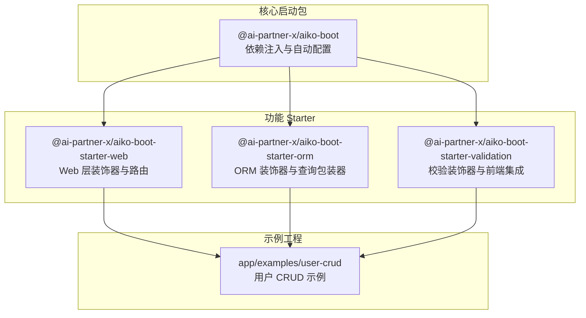
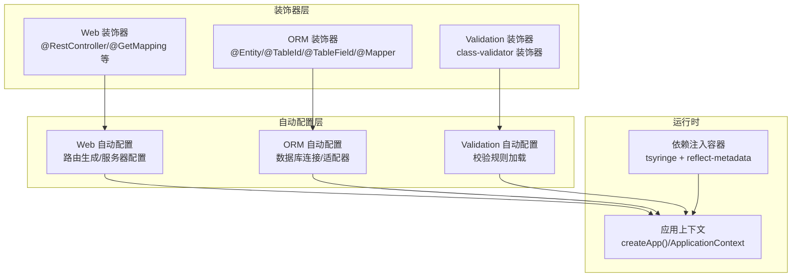
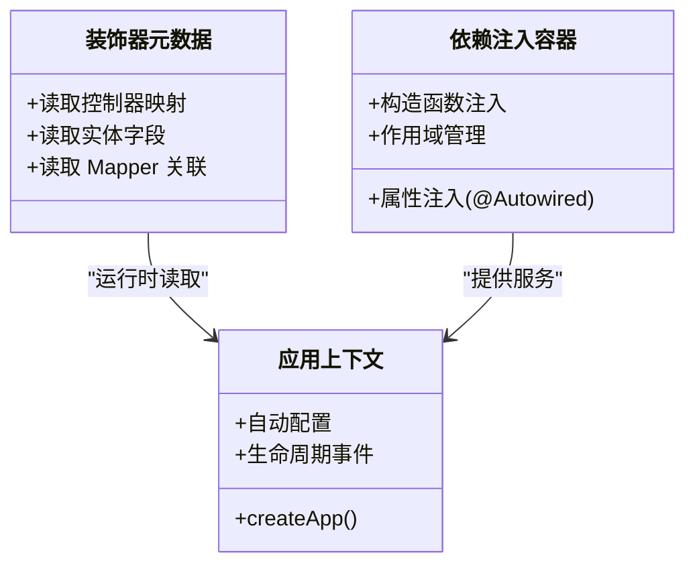
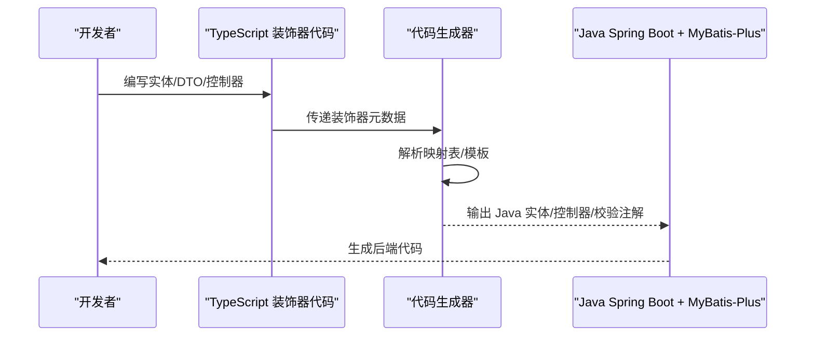
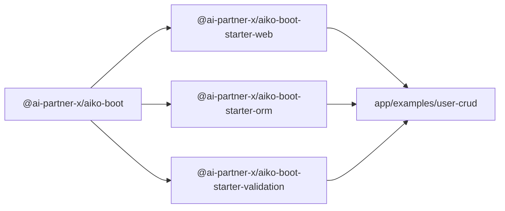

# 核心理念与设计哲学

<cite>
**本文引用的文件**
- [README.md](file://README.md)
- [package.json](file://package.json)
- [packages/aiko-boot/package.json](file://packages/aiko-boot/package.json)
- [packages/aiko-boot-starter-web/package.json](file://packages/aiko-boot-starter-web/package.json)
- [packages/aiko-boot-starter-orm/package.json](file://packages/aiko-boot-starter-orm/package.json)
- [packages/aiko-boot-starter-validation/package.json](file://packages/aiko-boot-starter-validation/package.json)
- [packages/aiko-boot/src/index.ts](file://packages/aiko-boot/src/index.ts)
- [packages/aiko-boot/src/decorators.ts](file://packages/aiko-boot/src/decorators.ts)
- [packages/aiko-boot-starter-orm/src/index.ts](file://packages/aiko-boot-starter-orm/src/index.ts)
- [packages/aiko-boot-starter-orm/src/decorators.ts](file://packages/aiko-boot-starter-orm/src/decorators.ts)
- [packages/aiko-boot-starter-web/src/index.ts](file://packages/aiko-boot-starter-web/src/index.ts)
- [packages/aiko-boot-starter-web/src/decorators.ts](file://packages/aiko-boot-starter-web/src/decorators.ts)
- [packages/aiko-boot-starter-validation/src/index.ts](file://packages/aiko-boot-starter-validation/src/index.ts)
</cite>

## 目录
1. [引言](#引言)
2. [项目结构](#项目结构)
3. [核心组件](#核心组件)
4. [架构总览](#架构总览)
5. [详细组件分析](#详细组件分析)
6. [依赖关系分析](#依赖关系分析)
7. [性能考量](#性能考量)
8. [故障排查指南](#故障排查指南)
9. [结论](#结论)

## 引言
本文件系统阐述 AI First Framework 的核心理念与设计哲学，围绕以下四个维度展开：
- AI 原生（AI Native）：以 AI 最熟悉的语言与生态（TypeScript/React/Next.js）构建，降低理解与生成门槛。
- 代码优先（Code First）：以代码为设计与规范，避免学习新 DSL 的心智负担。
- 类型安全（Type Safe）：结合 TypeScript 类型系统与装饰器元数据，从源头保障代码质量。
- Java 兼容（Java Compatible）：将 TypeScript 装饰器风格的领域模型与接口，一键转换为 Java Spring Boot + MyBatis-Plus 代码。

这些理念在仓库中通过包结构、装饰器 API、自动配置与代码生成管线得到具体体现。

## 项目结构
该仓库采用 monorepo 管理，核心由“核心启动包 + 各功能 Starter + 示例工程”构成。下图给出概览：

图表来源
- [README.md](file://README.md#L14-L33)
- [packages/aiko-boot/package.json](file://packages/aiko-boot/package.json#L1-L61)
- [packages/aiko-boot-starter-web/package.json](file://packages/aiko-boot-starter-web/package.json#L1-L60)
- [packages/aiko-boot-starter-orm/package.json](file://packages/aiko-boot-starter-orm/package.json#L1-L55)
- [packages/aiko-boot-starter-validation/package.json](file://packages/aiko-boot-starter-validation/package.json#L1-L41)

章节来源
- [README.md](file://README.md#L14-L33)
- [package.json](file://package.json#L1-L32)

## 核心组件
- 核心启动包（aiko-boot）：提供依赖注入容器、自动配置、生命周期事件、异常处理等基础设施；导出装饰器与 DI 能力，支撑上层 Web/ORM/Validation Starter。
- Web Starter（aiko-boot-starter-web）：提供与 Spring Boot 对齐的 HTTP 装饰器（如 @RestController、@GetMapping 等），自动生成 Express 路由，支持客户端代理与轻量客户端。
- ORM Starter（aiko-boot-starter-orm）：提供 MyBatis-Plus 风格的实体与 Mapper 装饰器（@Entity/@TableName、@TableId、@TableField、@Mapper），配套 QueryWrapper/LambdaQueryWrapper，支持多数据库适配。
- Validation Starter（aiko-boot-starter-validation）：重导出 class-validator 装饰器，提供 React Hook Form 集成与 DTO 校验工具，并内置 Java 映射表，用于代码生成阶段的转译。

章节来源
- [packages/aiko-boot/src/index.ts](file://packages/aiko-boot/src/index.ts#L1-L64)
- [packages/aiko-boot-starter-web/src/index.ts](file://packages/aiko-boot-starter-web/src/index.ts#L1-L73)
- [packages/aiko-boot-starter-orm/src/index.ts](file://packages/aiko-boot-starter-orm/src/index.ts#L1-L91)
- [packages/aiko-boot-starter-validation/src/index.ts](file://packages/aiko-boot-starter-validation/src/index.ts#L1-L242)

## 架构总览
下图展示“装饰器驱动 + 自动配置”的运行时与编译期协同工作方式：

图表来源
- [packages/aiko-boot/src/decorators.ts](file://packages/aiko-boot/src/decorators.ts#L1-L158)
- [packages/aiko-boot-starter-web/src/decorators.ts](file://packages/aiko-boot-starter-web/src/decorators.ts#L1-L196)
- [packages/aiko-boot-starter-orm/src/decorators.ts](file://packages/aiko-boot-starter-orm/src/decorators.ts#L1-L224)
- [packages/aiko-boot-starter-validation/src/index.ts](file://packages/aiko-boot-starter-validation/src/index.ts#L1-L242)

## 详细组件分析

### AI 原生（AI Native）：为何选择 TypeScript/React/Next.js
- 语言与生态契合：框架以 TypeScript 为核心，配合 React/Next.js 构建前后端一体化体验，便于 AI 理解与生成。
- 代码即设计：通过装饰器直接表达业务意图，减少额外 DSL 的学习成本。
- 生态对齐：与 Spring Boot 的风格对齐（如装饰器命名、模块组织），提升 AI 的迁移与复用效率。

章节来源
- [README.md](file://README.md#L9-L12)
- [packages/aiko-boot/package.json](file://packages/aiko-boot/package.json#L35-L44)
- [packages/aiko-boot-starter-web/package.json](file://packages/aiko-boot-starter-web/package.json#L32-L43)

### 代码优先（Code First）：以代码为设计
- 设计即实现：实体、控制器、Mapper、校验规则均以装饰器与类型声明直接表达，无需额外建模 DSL。
- 一致性：Web 层与 ORM 层均采用与 Spring Boot 对齐的装饰器命名与行为，降低心智负担。
- 可演进：示例工程展示了从实体到服务、控制器的完整链路，体现“先写代码，再生成/运行”的开发节奏。

章节来源
- [README.md](file://README.md#L10-L12)
- [packages/aiko-boot-starter-web/src/decorators.ts](file://packages/aiko-boot-starter-web/src/decorators.ts#L46-L88)
- [packages/aiko-boot-starter-orm/src/decorators.ts](file://packages/aiko-boot-starter-orm/src/decorators.ts#L65-L139)

### 类型安全（Type Safe）：TS 类型系统与装饰器的协同
- 装饰器元数据：通过 reflect-metadata 在运行时读取装饰器信息（如控制器映射、实体字段、Mapper 关联），并与编译期类型系统互补。
- DI 注入与属性注入：装饰器自动完成构造函数与属性注入，结合 TS 类型约束，从源头避免注入错误。
- 查询与校验：ORM 的 QueryWrapper 与 Validation 的 class-validator 装饰器，均在 TS 中提供强类型提示与编译期检查。

图表来源
- [packages/aiko-boot/src/decorators.ts](file://packages/aiko-boot/src/decorators.ts#L13-L158)
- [packages/aiko-boot-starter-web/src/decorators.ts](file://packages/aiko-boot-starter-web/src/decorators.ts#L13-L196)
- [packages/aiko-boot-starter-orm/src/decorators.ts](file://packages/aiko-boot-starter-orm/src/decorators.ts#L14-L224)

章节来源
- [packages/aiko-boot/src/decorators.ts](file://packages/aiko-boot/src/decorators.ts#L1-L158)
- [packages/aiko-boot-starter-web/src/decorators.ts](file://packages/aiko-boot-starter-web/src/decorators.ts#L1-L196)
- [packages/aiko-boot-starter-orm/src/decorators.ts](file://packages/aiko-boot-starter-orm/src/decorators.ts#L1-L224)

### Java 兼容（Java Compatible）：从 TS 到 Java Spring Boot + MyBatis-Plus
- 转换目标：将 TypeScript 装饰器风格的实体与 DTO 映射为 Java 注解风格的实体与校验注解。
- 映射机制：Validation Starter 内置 Java 映射表，ORM 装饰器提供元数据，配合代码生成器实现一键转换。
- 价值：在保持领域模型一致性的前提下，快速落地 Java 后端团队的既有技术栈。

图表来源
- [packages/aiko-boot-starter-validation/src/index.ts](file://packages/aiko-boot-starter-validation/src/index.ts#L198-L229)
- [README.md](file://README.md#L160-L184)

章节来源
- [README.md](file://README.md#L160-L184)
- [packages/aiko-boot-starter-validation/src/index.ts](file://packages/aiko-boot-starter-validation/src/index.ts#L198-L229)

## 依赖关系分析
- aiko-boot 为核心，被 web/orm/validation 三大 Starter 所依赖。
- web/orm/validation 分别通过装饰器与自动配置扩展 aiko-boot 的能力。
- 示例工程 user-crud 依赖上述 Starter，形成“从装饰器到运行时”的闭环。

图表来源
- [packages/aiko-boot/package.json](file://packages/aiko-boot/package.json#L35-L37)
- [packages/aiko-boot-starter-web/package.json](file://packages/aiko-boot-starter-web/package.json#L32-L36)
- [packages/aiko-boot-starter-orm/package.json](file://packages/aiko-boot-starter-orm/package.json#L24-L28)

章节来源
- [packages/aiko-boot/package.json](file://packages/aiko-boot/package.json#L1-L61)
- [packages/aiko-boot-starter-web/package.json](file://packages/aiko-boot-starter-web/package.json#L1-L60)
- [packages/aiko-boot-starter-orm/package.json](file://packages/aiko-boot-starter-orm/package.json#L1-L55)
- [packages/aiko-boot-starter-validation/package.json](file://packages/aiko-boot-starter-validation/package.json#L1-L41)

## 性能考量
- 装饰器解析与反射：装饰器元数据在运行时读取，建议在应用启动阶段完成必要的元数据扫描与缓存，避免重复反射开销。
- ORM 查询包装器：QueryWrapper 提供链式条件构造，建议结合分页参数与索引设计，控制 SQL 复杂度。
- DI 容器：tsyringe 默认单例注册，合理划分组件粒度，避免过度注入导致的内存占用与初始化时间增加。
- 代码生成：在 CI 中按需触发生成任务，避免频繁执行生成器带来的磁盘与 CPU 开销。

## 故障排查指南
- 装饰器未生效
  - 确认已引入 reflect-metadata，并在入口处加载。
  - 检查装饰器是否正确导出并在运行时被读取。
- DI 注入失败
  - 确保被注入类已通过装饰器标记为可注入（如 @Service/@Component/@Mapper）。
  - 检查构造函数参数类型与注入令牌是否匹配。
- ORM 元数据缺失
  - 确认实体类已使用 @Entity/@TableName 等装饰器标注。
  - 确认 Mapper 已使用 @Mapper 并关联正确的实体类型。
- 校验不生效
  - 确认 DTO 上的 class-validator 装饰器使用正确。
  - 若使用前端集成，确认 createResolver 的 DTO 类型传入正确。

章节来源
- [packages/aiko-boot/src/decorators.ts](file://packages/aiko-boot/src/decorators.ts#L9-L11)
- [packages/aiko-boot-starter-orm/src/decorators.ts](file://packages/aiko-boot-starter-orm/src/decorators.ts#L9-L12)
- [packages/aiko-boot-starter-web/src/decorators.ts](file://packages/aiko-boot-starter-web/src/decorators.ts#L5-L6)
- [packages/aiko-boot-starter-validation/src/index.ts](file://packages/aiko-boot-starter-validation/src/index.ts#L31)

## 结论
本框架以“AI 原生、代码优先、类型安全、Java 兼容”为核心理念，通过装饰器与自动配置将 Spring Boot 风格的开发体验带入 TypeScript/React/Next.js 生态，并以统一的元数据与映射表实现向 Java 的无缝转换。对于希望“用 AI 理解并生成代码”的团队而言，该框架提供了低学习成本、高一致性与强类型保障的开发路径。