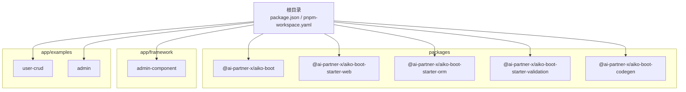
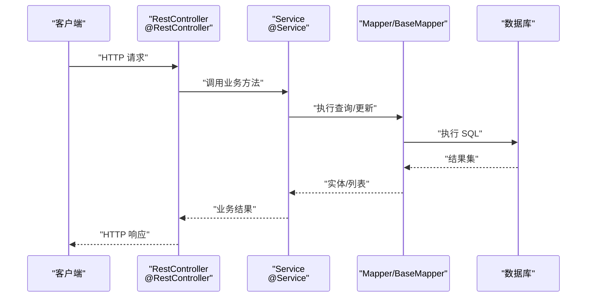
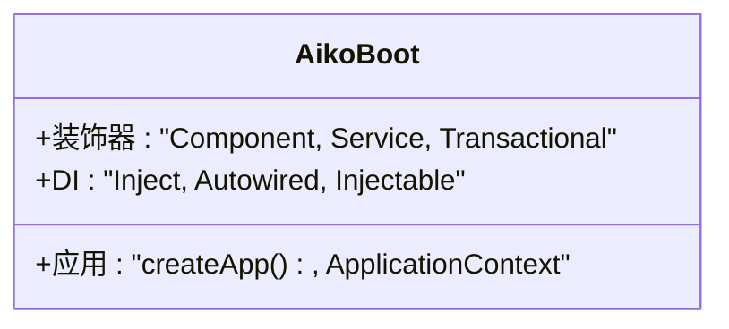
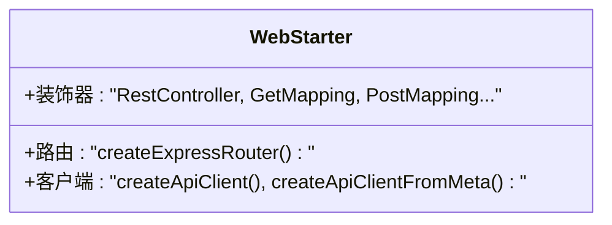
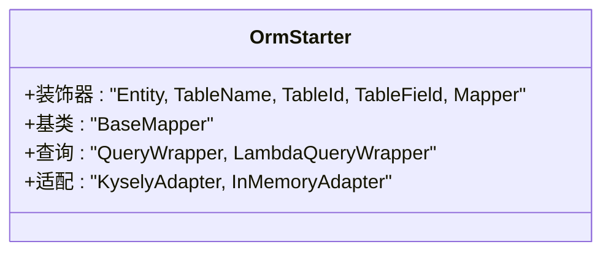
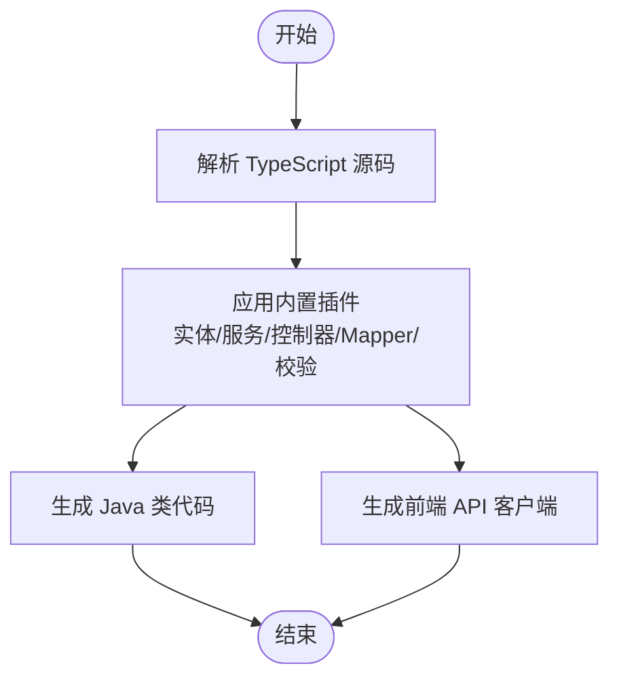
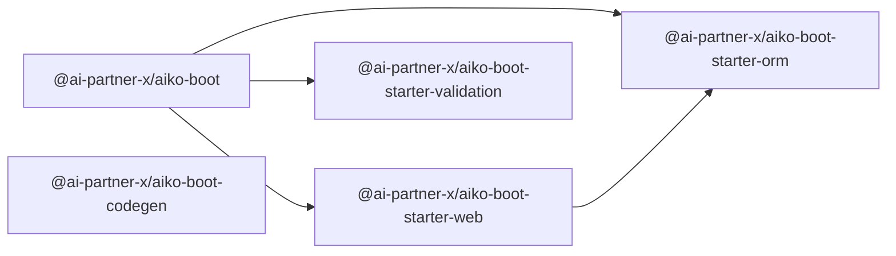

# 项目概述

<cite>
**本文引用的文件**
- [README.md](file://README.md)
- [package.json](file://package.json)
- [pnpm-workspace.yaml](file://pnpm-workspace.yaml)
- [packages/aiko-boot/package.json](file://packages/aiko-boot/package.json)
- [packages/aiko-boot-starter-web/package.json](file://packages/aiko-boot-starter-web/package.json)
- [packages/aiko-boot-starter-orm/package.json](file://packages/aiko-boot-starter-orm/package.json)
- [packages/aiko-boot-starter-validation/package.json](file://packages/aiko-boot-starter-validation/package.json)
- [packages/aiko-boot-codegen/package.json](file://packages/aiko-boot-codegen/package.json)
- [packages/aiko-boot/src/index.ts](file://packages/aiko-boot/src/index.ts)
- [packages/aiko-boot-starter-orm/src/index.ts](file://packages/aiko-boot-starter-orm/src/index.ts)
- [packages/aiko-boot-starter-web/src/index.ts](file://packages/aiko-boot-starter-web/src/index.ts)
- [packages/aiko-boot-codegen/src/index.ts](file://packages/aiko-boot-codegen/src/index.ts)
- [app/framework/admin-component/src/index.ts](file://app/framework/admin-component/src/index.ts)
- [app/examples/user-crud/README.md](file://app/examples/user-crud/README.md)
</cite>

## 目录
1. [引言](#引言)
2. [项目结构](#项目结构)
3. [核心组件](#核心组件)
4. [架构总览](#架构总览)
5. [详细组件分析](#详细组件分析)
6. [依赖关系分析](#依赖关系分析)
7. [性能考虑](#性能考虑)
8. [故障排查指南](#故障排查指南)
9. [结论](#结论)
10. [附录](#附录)

## 引言
AI First Framework（Aiko Boot）是一个面向“AI 原生”的全栈开发框架，核心理念是：以 AI 最熟悉的语言（TypeScript/React/Next.js）进行开发；通过“代码即设计”的 Code First 方法论，借助装饰器驱动简化开发流程；在保持强类型安全的同时，提供与 Java 生态兼容的能力，支持将 TypeScript 代码一键转换为 Java Spring Boot + MyBatis-Plus 项目。该框架采用 monorepo 架构组织多个子包，覆盖依赖注入、Web 层、ORM、校验、代码生成等能力，并提供示例工程帮助快速上手。

## 项目结构
本项目采用 pnpm workspace 的 monorepo 结构，顶层通过工作区配置聚合 packages、framework 和 examples 三类模块：
- packages：核心库与工具包，如 aiko-boot、ORM、Web、校验、代码生成等
- app/framework：前端组件库与示例框架
- app/examples：示例项目，包含用户 CRUD 示例与管理端示例

图表来源
- [pnpm-workspace.yaml](file://pnpm-workspace.yaml#L1-L6)
- [package.json](file://package.json#L1-L32)

章节来源
- [pnpm-workspace.yaml](file://pnpm-workspace.yaml#L1-L6)
- [package.json](file://package.json#L1-L32)

## 核心组件
- aiko-boot：核心启动包，提供依赖注入、自动配置、生命周期事件、异常处理等能力，并导出装饰器与应用入口
- aiko-boot-starter-web：Web 启动器，提供 REST 控制器装饰器、路由自动生成、API 客户端等
- aiko-boot-starter-orm：ORM 启动器，提供实体与映射装饰器、通用 Mapper、条件构造器、多数据库适配
- aiko-boot-starter-validation：校验启动器，提供与 class-validator 兼容的装饰器与运行时校验
- aiko-boot-codegen：代码生成器，支持 TypeScript 到 Java 的一键转换与前端 API 客户端生成

章节来源
- [packages/aiko-boot/package.json](file://packages/aiko-boot/package.json#L1-L61)
- [packages/aiko-boot-starter-web/package.json](file://packages/aiko-boot-starter-web/package.json#L1-L60)
- [packages/aiko-boot-starter-orm/package.json](file://packages/aiko-boot-starter-orm/package.json#L1-L55)
- [packages/aiko-boot-starter-validation/package.json](file://packages/aiko-boot-starter-validation/package.json#L1-L41)
- [packages/aiko-boot-codegen/package.json](file://packages/aiko-boot-codegen/package.json#L1-L34)

## 架构总览
下图展示了从装饰器到运行时的典型调用链路：控制器接收请求，通过依赖注入获取服务实例，服务层调用数据访问层，ORM 层基于装饰器元数据与适配器执行查询，最终返回响应。

图表来源
- [packages/aiko-boot-starter-web/src/index.ts](file://packages/aiko-boot-starter-web/src/index.ts#L14-L34)
- [packages/aiko-boot/src/index.ts](file://packages/aiko-boot/src/index.ts#L29-L53)
- [packages/aiko-boot-starter-orm/src/index.ts](file://packages/aiko-boot-starter-orm/src/index.ts#L44-L64)

## 详细组件分析

### aiko-boot（核心启动包）
- 职责：提供依赖注入容器、自动配置、生命周期事件、异常处理、应用入口等
- 关键点：
  - 导出装饰器：组件、服务、事务等
  - 导出 DI 能力：构造函数/属性注入、作用域、自动注册
  - 应用创建：createApp、ApplicationContext、HttpServer
- 设计要点：以装饰器为中心的声明式配置，结合反射元数据实现自动装配

图表来源
- [packages/aiko-boot/src/index.ts](file://packages/aiko-boot/src/index.ts#L29-L63)

章节来源
- [packages/aiko-boot/src/index.ts](file://packages/aiko-boot/src/index.ts#L1-L64)
- [packages/aiko-boot/package.json](file://packages/aiko-boot/package.json#L1-L61)

### aiko-boot-starter-web（Web 启动器）
- 职责：提供 REST 控制器装饰器、路由自动生成、API 客户端
- 关键点：
  - 控制器装饰器：@RestController、@GetMapping、@PostMapping 等
  - 路由生成：基于装饰器元数据构建 Express 路由
  - 客户端：支持带反射与无反射两种 API 客户端
- 设计要点：Spring Boot 风格的注解体系，降低学习成本

图表来源
- [packages/aiko-boot-starter-web/src/index.ts](file://packages/aiko-boot-starter-web/src/index.ts#L14-L68)

章节来源
- [packages/aiko-boot-starter-web/src/index.ts](file://packages/aiko-boot-starter-web/src/index.ts#L1-L73)
- [packages/aiko-boot-starter-web/package.json](file://packages/aiko-boot-starter-web/package.json#L1-L60)

### aiko-boot-starter-orm（ORM 启动器）
- 职责：提供实体与映射装饰器、通用 Mapper、条件构造器、多数据库适配
- 关键点：
  - 装饰器：@Entity/@TableName/@TableId/@TableField/@Mapper
  - 基类：BaseMapper 提供通用 CRUD
  - 查询：QueryWrapper/LambdaQueryWrapper 动态构造条件
  - 适配：KyselyAdapter、InMemoryAdapter；支持 PostgreSQL、SQLite、MySQL
- 设计要点：MyBatis-Plus 风格 API，提升可读性与一致性

图表来源
- [packages/aiko-boot-starter-orm/src/index.ts](file://packages/aiko-boot-starter-orm/src/index.ts#L22-L81)

章节来源
- [packages/aiko-boot-starter-orm/src/index.ts](file://packages/aiko-boot-starter-orm/src/index.ts#L1-L91)
- [packages/aiko-boot-starter-orm/package.json](file://packages/aiko-boot-starter-orm/package.json#L1-L55)

### aiko-boot-starter-validation（校验启动器）
- 职责：提供与 class-validator 兼容的装饰器与运行时校验
- 关键点：
  - 装饰器：与 class-validator 对齐的校验装饰器
  - 运行时：结合 class-transformer 执行转换与校验
- 设计要点：前后端一致的校验体验，减少样板代码

章节来源
- [packages/aiko-boot-starter-validation/package.json](file://packages/aiko-boot-starter-validation/package.json#L1-L41)

### aiko-boot-codegen（代码生成器）
- 职责：将 TypeScript 装饰器代码转换为 Java Spring Boot + MyBatis-Plus 代码，同时生成前端 API 客户端
- 关键点：
  - 解析：解析 TypeScript 源码，提取类与装饰器信息
  - 转换：内置插件系统，支持实体、Mapper、服务、控制器、校验等插件
  - 输出：生成 Java 类、注释、导入语句，以及前端 API 客户端
- 设计要点：通过装饰器元数据驱动代码生成，确保 TypeScript 与 Java 侧语义对齐

图表来源
- [packages/aiko-boot-codegen/src/index.ts](file://packages/aiko-boot-codegen/src/index.ts#L36-L56)

章节来源
- [packages/aiko-boot-codegen/src/index.ts](file://packages/aiko-boot-codegen/src/index.ts#L1-L57)
- [packages/aiko-boot-codegen/package.json](file://packages/aiko-boot-codegen/package.json#L1-L34)

### 前端组件库（admin-component）
- 职责：提供管理端共享组件，如按钮、卡片、对话框、表格、状态标签、搜索过滤栏等
- 特点：基于设计系统抽象，统一风格与交互

章节来源
- [app/framework/admin-component/src/index.ts](file://app/framework/admin-component/src/index.ts#L1-L38)

## 依赖关系分析
- 包间依赖：
  - web 依赖 boot 与 orm
  - orm 依赖 boot
  - validation 依赖 boot
  - codegen 独立，但与装饰器生态配合
- 运行时依赖：
  - DI 使用 tsyringe + reflect-metadata
  - ORM 使用 kysely + better-sqlite3，可选 pg
  - Web 使用 express + cors
  - 校验使用 class-validator + class-transformer

图表来源
- [packages/aiko-boot/package.json](file://packages/aiko-boot/package.json#L35-L38)
- [packages/aiko-boot-starter-web/package.json](file://packages/aiko-boot-starter-web/package.json#L32-L37)
- [packages/aiko-boot-starter-orm/package.json](file://packages/aiko-boot-starter-orm/package.json#L24-L29)
- [packages/aiko-boot-starter-validation/package.json](file://packages/aiko-boot-starter-validation/package.json#L21-L26)
- [packages/aiko-boot-codegen/package.json](file://packages/aiko-boot-codegen/package.json#L24-L28)

章节来源
- [packages/aiko-boot/package.json](file://packages/aiko-boot/package.json#L1-L61)
- [packages/aiko-boot-starter-web/package.json](file://packages/aiko-boot-starter-web/package.json#L1-L60)
- [packages/aiko-boot-starter-orm/package.json](file://packages/aiko-boot-starter-orm/package.json#L1-L55)
- [packages/aiko-boot-starter-validation/package.json](file://packages/aiko-boot-starter-validation/package.json#L1-L41)
- [packages/aiko-boot-codegen/package.json](file://packages/aiko-boot-codegen/package.json#L1-L34)

## 性能考虑
- ORM 层采用 Kysely，具备类型安全与可组合的查询构建能力，适合复杂查询场景；InMemoryAdapter 便于测试与本地开发
- 多数据库适配通过适配器抽象，可在不同环境选择最优驱动
- 代码生成器在构建期执行，避免运行时开销；同时提供轻量级 API 客户端以适配 SSR 场景

## 故障排查指南
- 装饰器未生效：确认已启用 reflect-metadata 并在入口处引入；检查装饰器是否正确导出与使用
- DI 注入失败：核对 @Service/@Component 的作用域与注入位置（构造函数 vs 属性），确保容器已注册
- ORM 查询异常：检查实体装饰器配置与字段映射，确认适配器与数据库连接配置正确
- Web 路由不生效：确认控制器装饰器路径与方法映射，检查路由生成逻辑
- Java 生成结果不符合预期：核对 TypeScript 源码中的装饰器与类型标注，必要时扩展或调整插件

## 结论
Aiko Boot 将 Spring Boot 的工程化思想与 TypeScript/React/Next.js 的现代开发体验融合，通过装饰器驱动的 Code First 方法论，显著降低了全栈开发的学习与维护成本。其 Java 兼容性特性进一步提升了跨团队协作与迁移效率。结合 monorepo 的模块化组织，开发者可以按需组合所需能力，快速搭建高质量的全栈应用。

## 附录

### 快速开始
- 安装依赖与构建
  - 在根目录执行安装与构建命令，确保所有包编译完成
- 运行示例
  - 进入示例 API 包并启动开发服务器，打开浏览器访问示例页面

章节来源
- [README.md](file://README.md#L35-L54)
- [app/examples/user-crud/README.md](file://app/examples/user-crud/README.md#L3-L15)

### 核心理念与优势
- AI Native：以 AI 最熟悉的语言与生态进行开发，便于 AI 辅助与自动化
- Code First：以代码为唯一真相，无需额外 DSL 学习成本
- Type Safe：结合装饰器与强类型系统，提升代码质量与可维护性
- Java Compatible：通过代码生成器实现 TypeScript 与 Java 的双向互通

章节来源
- [README.md](file://README.md#L7-L12)

### 示例与最佳实践
- 实体与 Mapper：使用装饰器声明表结构与映射，继承 BaseMapper 获取通用 CRUD
- 服务层：通过 @Service 与 @Autowired 组织业务逻辑，利用 QueryWrapper 构造复杂查询
- 控制器：使用 @RestController 与 HTTP 装饰器暴露接口，结合 API 客户端进行前后端联调

章节来源
- [README.md](file://README.md#L81-L158)