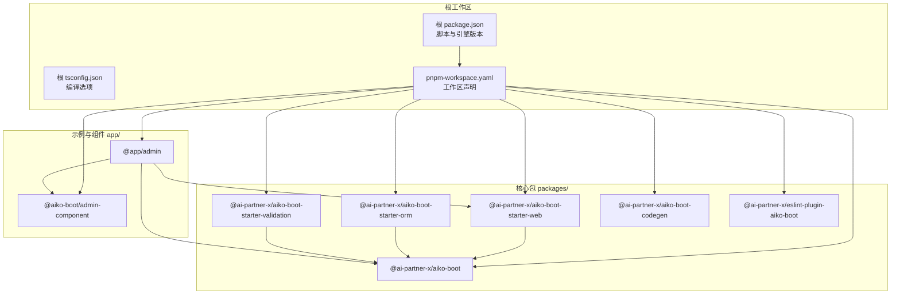
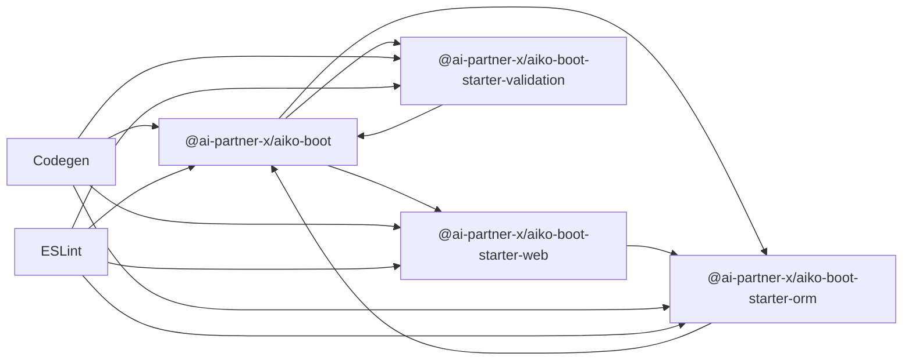
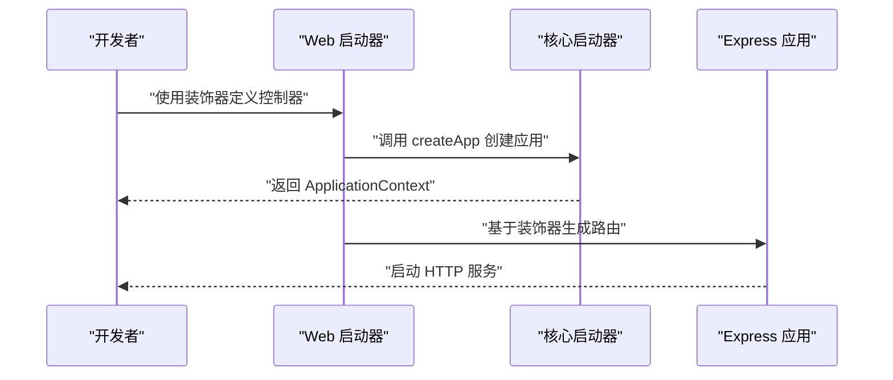
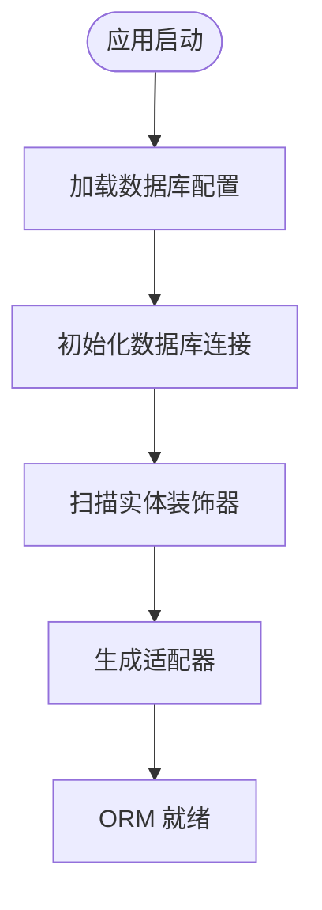
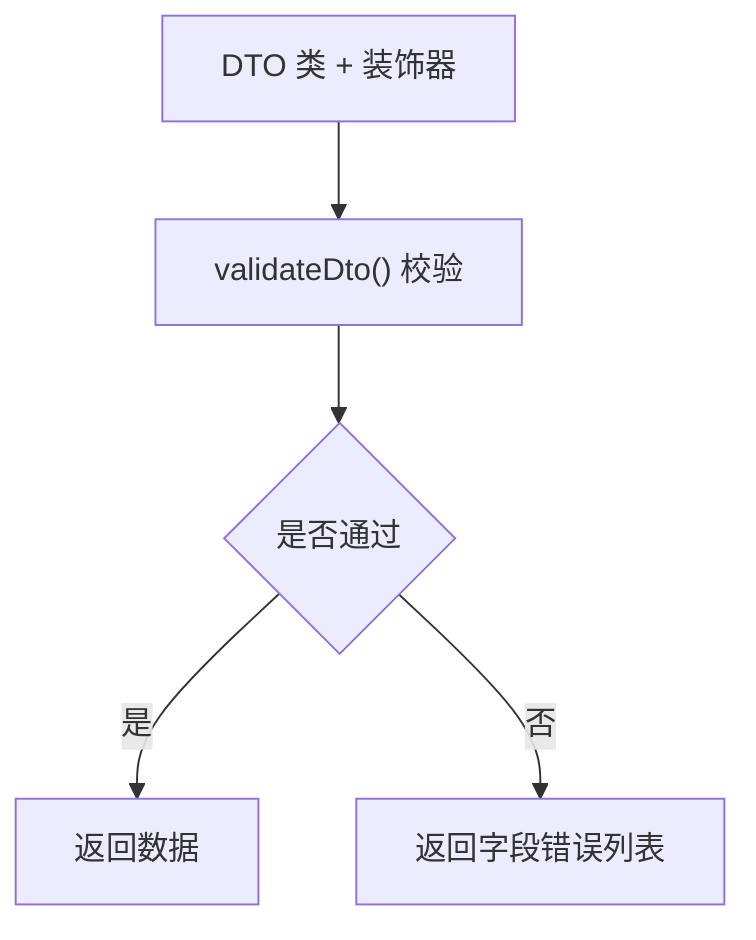
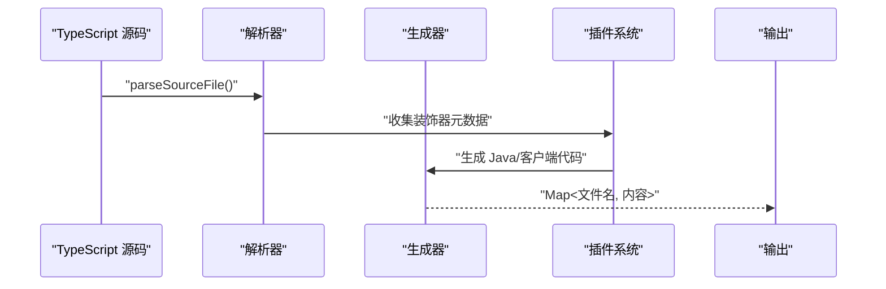
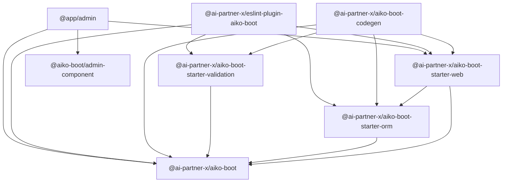

# 项目结构与模块说明

<cite>
**本文档引用的文件**
- [pnpm-workspace.yaml](file://pnpm-workspace.yaml)
- [package.json](file://package.json)
- [tsconfig.json](file://tsconfig.json)
- [packages/aiko-boot/package.json](file://packages/aiko-boot/package.json)
- [packages/aiko-boot/src/index.ts](file://packages/aiko-boot/src/index.ts)
- [packages/aiko-boot-starter-web/package.json](file://packages/aiko-boot-starter-web/package.json)
- [packages/aiko-boot-starter-web/src/index.ts](file://packages/aiko-boot-starter-web/src/index.ts)
- [packages/aiko-boot-starter-orm/package.json](file://packages/aiko-boot-starter-orm/package.json)
- [packages/aiko-boot-starter-orm/src/index.ts](file://packages/aiko-boot-starter-orm/src/index.ts)
- [packages/aiko-boot-starter-validation/package.json](file://packages/aiko-boot-starter-validation/package.json)
- [packages/aiko-boot-starter-validation/src/index.ts](file://packages/aiko-boot-starter-validation/src/index.ts)
- [packages/aiko-boot-codegen/package.json](file://packages/aiko-boot-codegen/package.json)
- [packages/aiko-boot-codegen/src/index.ts](file://packages/aiko-boot-codegen/src/index.ts)
- [packages/eslint-plugin-aiko-boot/package.json](file://packages/eslint-plugin-aiko-boot/package.json)
- [packages/eslint-plugin-aiko-boot/src/index.ts](file://packages/eslint-plugin-aiko-boot/src/index.ts)
- [app/examples/admin/package.json](file://app/examples/admin/package.json)
- [app/framework/admin-component/package.json](file://app/framework/admin-component/package.json)
</cite>

## 目录
1. [简介](#简介)
2. [项目结构](#项目结构)
3. [核心组件](#核心组件)
4. [架构总览](#架构总览)
5. [详细组件分析](#详细组件分析)
6. [依赖关系分析](#依赖关系分析)
7. [性能考虑](#性能考虑)
8. [故障排除指南](#故障排除指南)
9. [结论](#结论)
10. [附录](#附录)

## 简介
本项目是一个以 monorepo 形式组织的全栈开发框架（AI First Framework），目标是“用 AI 构建，随处运行”。通过 pnpm workspace 统一管理多个包，结合装饰器驱动的依赖注入、自动配置与启动器生态，提供从后端服务到前端组件的一体化开发体验。核心模块包括：
- aiko-boot：核心启动与 DI 容器
- aiko-boot-starter-web：Web 层装饰器与路由生成
- aiko-boot-starter-orm：ORM 装饰器与查询封装
- aiko-boot-starter-validation：校验装饰器与前端集成
- aiko-boot-codegen：TypeScript 到 Java 的代码生成器
- eslint-plugin-aiko-boot：规范插件，保障 Java 兼容风格

同时，示例应用与框架组件位于 app 目录，演示如何在实际项目中使用这些包。

## 项目结构
仓库采用 monorepo 结构，使用 pnpm workspace 进行统一包管理与版本对齐。根目录的 pnpm-workspace.yaml 将 packages、app/framework 与 app/examples 下的子包纳入工作区，确保跨包依赖解析为 workspace:*，提升构建与调试效率。



图表来源
- [pnpm-workspace.yaml](file://pnpm-workspace.yaml#L1-L6)
- [package.json](file://package.json#L1-L32)
- [packages/aiko-boot/package.json](file://packages/aiko-boot/package.json#L1-L61)
- [packages/aiko-boot-starter-web/package.json](file://packages/aiko-boot-starter-web/package.json#L1-L60)
- [packages/aiko-boot-starter-orm/package.json](file://packages/aiko-boot-starter-orm/package.json#L1-L55)
- [packages/aiko-boot-starter-validation/package.json](file://packages/aiko-boot-starter-validation/package.json#L1-L41)
- [packages/aiko-boot-codegen/package.json](file://packages/aiko-boot-codegen/package.json#L1-L34)
- [packages/eslint-plugin-aiko-boot/package.json](file://packages/eslint-plugin-aiko-boot/package.json#L1-L45)
- [app/examples/admin/package.json](file://app/examples/admin/package.json#L1-L31)
- [app/framework/admin-component/package.json](file://app/framework/admin-component/package.json#L1-L43)

章节来源
- [pnpm-workspace.yaml](file://pnpm-workspace.yaml#L1-L6)
- [package.json](file://package.json#L1-L32)
- [tsconfig.json](file://tsconfig.json#L1-L33)

## 核心组件
本节概述各核心包的职责与对外接口，帮助快速定位功能入口。

- aiko-boot（核心启动与 DI）
  - 提供依赖注入容器、生命周期事件、配置属性、自动配置与异常处理等能力
  - 对外导出类型、装饰器与应用创建入口
  - 参考路径：[packages/aiko-boot/src/index.ts](file://packages/aiko-boot/src/index.ts#L1-L64)，[packages/aiko-boot/package.json](file://packages/aiko-boot/package.json#L1-L61)

- aiko-boot-starter-web（Web 启动器）
  - 基于装饰器的控制器与路由生成，集成 Express
  - 提供 Feign 风格客户端与 SSR 友好的轻量客户端
  - 自动配置服务器参数与 HTTP 服务
  - 参考路径：[packages/aiko-boot-starter-web/src/index.ts](file://packages/aiko-boot-starter-web/src/index.ts#L1-L73)，[packages/aiko-boot-starter-web/package.json](file://packages/aiko-boot-starter-web/package.json#L1-L60)

- aiko-boot-starter-orm（ORM 启动器）
  - 提供实体与映射装饰器、基础 Mapper、查询包装器与多数据库适配
  - 支持 PostgreSQL、SQLite 等数据库的自动配置
  - 参考路径：[packages/aiko-boot-starter-orm/src/index.ts](file://packages/aiko-boot-starter-orm/src/index.ts#L1-L91)，[packages/aiko-boot-starter-orm/package.json](file://packages/aiko-boot-starter-orm/package.json#L1-L55)

- aiko-boot-starter-validation（验证启动器）
  - 重导出 class-validator/class-transformer，并提供 DTO 校验与 react-hook-form 集成
  - 提供 Java 转译映射，配合 codegen 使用
  - 参考路径：[packages/aiko-boot-starter-validation/src/index.ts](file://packages/aiko-boot-starter-validation/src/index.ts#L1-L242)，[packages/aiko-boot-starter-validation/package.json](file://packages/aiko-boot-starter-validation/package.json#L1-L41)

- aiko-boot-codegen（代码生成器）
  - 将 TypeScript 源码解析并生成 Java 类与前端 API 客户端
  - 提供插件系统与内置插件（实体、映射、验证、日期、服务、控制器、查询包装器等）
  - 参考路径：[packages/aiko-boot-codegen/src/index.ts](file://packages/aiko-boot-codegen/src/index.ts#L1-L57)，[packages/aiko-boot-codegen/package.json](file://packages/aiko-boot-codegen/package.json#L1-L34)

- eslint-plugin-aiko-boot（规范插件）
  - 强制 Java 兼容风格的 TypeScript 编写规范，包含推荐与严格配置
  - 提供规则集与 Java 兼容配置
  - 参考路径：[packages/eslint-plugin-aiko-boot/src/index.ts](file://packages/eslint-plugin-aiko-boot/src/index.ts#L1-L79)，[packages/eslint-plugin-aiko-boot/package.json](file://packages/eslint-plugin-aiko-boot/package.json#L1-L45)

章节来源
- [packages/aiko-boot/src/index.ts](file://packages/aiko-boot/src/index.ts#L1-L64)
- [packages/aiko-boot-starter-web/src/index.ts](file://packages/aiko-boot-starter-web/src/index.ts#L1-L73)
- [packages/aiko-boot-starter-orm/src/index.ts](file://packages/aiko-boot-starter-orm/src/index.ts#L1-L91)
- [packages/aiko-boot-starter-validation/src/index.ts](file://packages/aiko-boot-starter-validation/src/index.ts#L1-L242)
- [packages/aiko-boot-codegen/src/index.ts](file://packages/aiko-boot-codegen/src/index.ts#L1-L57)
- [packages/eslint-plugin-aiko-boot/src/index.ts](file://packages/eslint-plugin-aiko-boot/src/index.ts#L1-L79)

## 架构总览
下图展示核心包之间的依赖关系与交互模式，体现“核心启动器”作为上层能力的基础地位。



图表来源
- [packages/aiko-boot/package.json](file://packages/aiko-boot/package.json#L35-L44)
- [packages/aiko-boot-starter-web/package.json](file://packages/aiko-boot-starter-web/package.json#L32-L37)
- [packages/aiko-boot-starter-orm/package.json](file://packages/aiko-boot-starter-orm/package.json#L24-L28)
- [packages/aiko-boot-starter-validation/package.json](file://packages/aiko-boot-starter-validation/package.json#L21-L26)
- [packages/aiko-boot-codegen/package.json](file://packages/aiko-boot-codegen/package.json#L24-L27)
- [packages/eslint-plugin-aiko-boot/package.json](file://packages/eslint-plugin-aiko-boot/package.json#L28-L32)

## 详细组件分析

### aiko-boot（核心启动与 DI）
- 设计要点
  - 以装饰器为核心，提供组件与服务注册、事务标记、元数据读取
  - 通过 DI 容器管理生命周期与自动装配
  - 对外暴露应用创建入口与配置类型，便于上层启动器扩展
- 关键导出
  - 类型与配置：AppConfig、LoggingConfig 等
  - 装饰器：Component、Service、Transactional 等
  - DI：Container、Injectable、Inject、Singleton、Scoped、AutoRegister 等
  - 应用入口：createApp、ApplicationContext、AppOptions、HttpServer
- 复杂度与性能
  - 装饰器元数据读取与 DI 注册在应用启动阶段完成，运行期开销低
  - 通过命名空间导出减少上层包的导入复杂度

```mermaid
classDiagram
class BootIndex {
"+导出类型与装饰器"
"+导出 DI API"
"+导出 createApp"
}
class DI {
"+Container"
"+Injectable"
"+Inject"
"+Singleton"
"+Scoped"
"+AutoRegister"
}
class Decorators {
"+Component"
"+Service"
"+Transactional"
}
class AppEntry {
"+createApp()"
"+ApplicationContext"
"+AppOptions"
"+HttpServer"
}
BootIndex --> DI
BootIndex --> Decorators
BootIndex --> AppEntry
```

图表来源
- [packages/aiko-boot/src/index.ts](file://packages/aiko-boot/src/index.ts#L19-L63)

章节来源
- [packages/aiko-boot/src/index.ts](file://packages/aiko-boot/src/index.ts#L1-L64)
- [packages/aiko-boot/package.json](file://packages/aiko-boot/package.json#L1-L61)

### aiko-boot-starter-web（Web 启动器）
- 设计要点
  - 控制器装饰器与请求映射装饰器，自动生成 Express 路由
  - 提供 Feign 风格 API 客户端与轻量版客户端（SSR 友好）
  - 自动配置服务器参数与 HTTP 服务实例
- 关键导出
  - 装饰器：RestController、GetMapping、PostMapping 等
  - 路由：createExpressRouter、ExpressRouterOptions
  - 客户端：ApiContract、createApiClient、createApiClientFromMeta
  - 自动配置：WebAutoConfiguration、ServerProperties、ExpressHttpServer



图表来源
- [packages/aiko-boot-starter-web/src/index.ts](file://packages/aiko-boot-starter-web/src/index.ts#L14-L68)
- [packages/aiko-boot/src/index.ts](file://packages/aiko-boot/src/index.ts#L57-L63)

章节来源
- [packages/aiko-boot-starter-web/src/index.ts](file://packages/aiko-boot-starter-web/src/index.ts#L1-L73)
- [packages/aiko-boot-starter-web/package.json](file://packages/aiko-boot-starter-web/package.json#L1-L60)

### aiko-boot-starter-orm（ORM 启动器）
- 设计要点
  - 实体与映射装饰器，提供基础 Mapper 与查询包装器
  - 多数据库适配（PostgreSQL、SQLite 等），自动配置数据库连接
- 关键导出
  - 配置：setDatabaseConfig、getDatabaseConfig、createAdapterFromEntity
  - 装饰器：Entity、TableName、TableId、TableField、Mapper
  - 基础能力：BaseMapper、QueryWrapper/LambdaQueryWrapper
  - 数据库工厂：createKyselyDatabase、getKyselyDatabase、closeKyselyDatabase



图表来源
- [packages/aiko-boot-starter-orm/src/index.ts](file://packages/aiko-boot-starter-orm/src/index.ts#L14-L81)

章节来源
- [packages/aiko-boot-starter-orm/src/index.ts](file://packages/aiko-boot-starter-orm/src/index.ts#L1-L91)
- [packages/aiko-boot-starter-orm/package.json](file://packages/aiko-boot-starter-orm/package.json#L1-L55)

### aiko-boot-starter-validation（验证启动器）
- 设计要点
  - 重导出 class-validator/class-transformer，提供 DTO 校验与前端集成
  - 提供 Java 转译映射，便于与 codegen 协作
  - 自动配置验证相关参数
- 关键导出
  - 校验：validate、validateDto、createResolver
  - 映射：JAVA_VALIDATION_MAPPING
  - 自动配置：ValidationAutoConfiguration、ValidationProperties



图表来源
- [packages/aiko-boot-starter-validation/src/index.ts](file://packages/aiko-boot-starter-validation/src/index.ts#L120-L142)

章节来源
- [packages/aiko-boot-starter-validation/src/index.ts](file://packages/aiko-boot-starter-validation/src/index.ts#L1-L242)
- [packages/aiko-boot-starter-validation/package.json](file://packages/aiko-boot-starter-validation/package.json#L1-L41)

### aiko-boot-codegen（代码生成器）
- 设计要点
  - 解析 TypeScript 源码，生成 Java 类与前端 API 客户端
  - 插件化扩展，内置实体、映射、验证、日期、服务、控制器、查询包装器等插件
- 关键导出
  - 解析与生成：parseSourceFile、generateJavaClass、generateApiClient
  - 插件：mapperPlugin、entityPlugin、validationPlugin、datePlugin、servicePlugin、controllerPlugin、queryWrapperPlugin
  - 转译：transpile()



图表来源
- [packages/aiko-boot-codegen/src/index.ts](file://packages/aiko-boot-codegen/src/index.ts#L43-L56)

章节来源
- [packages/aiko-boot-codegen/src/index.ts](file://packages/aiko-boot-codegen/src/index.ts#L1-L57)
- [packages/aiko-boot-codegen/package.json](file://packages/aiko-boot-codegen/package.json#L1-L34)

### eslint-plugin-aiko-boot（规范插件）
- 设计要点
  - 强制 Java 兼容风格的 TypeScript 编写规范
  - 提供推荐、严格与 Java 兼容三种配置
- 关键导出
  - 规则：no-arrow-methods、no-destructuring-in-methods、static-route-paths 等
  - 配置：recommended、strict、java-compat

章节来源
- [packages/eslint-plugin-aiko-boot/src/index.ts](file://packages/eslint-plugin-aiko-boot/src/index.ts#L1-L79)
- [packages/eslint-plugin-aiko-boot/package.json](file://packages/eslint-plugin-aiko-boot/package.json#L1-L45)

### 示例应用与框架组件（app 目录）
- app/examples/admin
  - 前端示例应用，使用 @aiko-boot/admin-component 组件库与 React 生态
  - 依赖关系：@app/admin -> @aiko-boot/admin-component
  - 参考路径：[app/examples/admin/package.json](file://app/examples/admin/package.json#L1-L31)

- app/framework/admin-component
  - 通用后台组件库，提供表格、表单、对话框等 UI 组件
  - 依赖关系：组件库 -> React、Tailwind、Radix UI 等
  - 参考路径：[app/framework/admin-component/package.json](file://app/framework/admin-component/package.json#L1-L43)

章节来源
- [app/examples/admin/package.json](file://app/examples/admin/package.json#L1-L31)
- [app/framework/admin-component/package.json](file://app/framework/admin-component/package.json#L1-L43)

## 依赖关系分析
- 包内依赖
  - aiko-boot-starter-web 依赖 aiko-boot 与 aiko-boot-starter-orm
  - aiko-boot-starter-orm 依赖 aiko-boot
  - aiko-boot-starter-validation 依赖 aiko-boot
  - aiko-boot-codegen 依赖 aiko-boot、aiko-boot-starter-web、aiko-boot-starter-orm、aiko-boot-starter-validation
  - eslint-plugin-aiko-boot 依赖 aiko-boot 与其他相关包
- 工作区解析
  - 所有 workspace:* 依赖在 pnpm 中解析为本地包，避免重复安装与版本漂移
- 示例应用依赖
  - @app/admin 依赖 @aiko-boot/admin-component 并可间接使用 aiko-boot 与 web 启动器



图表来源
- [packages/aiko-boot-starter-web/package.json](file://packages/aiko-boot-starter-web/package.json#L32-L37)
- [packages/aiko-boot-starter-orm/package.json](file://packages/aiko-boot-starter-orm/package.json#L24-L28)
- [packages/aiko-boot-starter-validation/package.json](file://packages/aiko-boot-starter-validation/package.json#L21-L26)
- [packages/aiko-boot-codegen/package.json](file://packages/aiko-boot-codegen/package.json#L24-L27)
- [packages/eslint-plugin-aiko-boot/package.json](file://packages/eslint-plugin-aiko-boot/package.json#L28-L32)
- [app/examples/admin/package.json](file://app/examples/admin/package.json#L12-L18)
- [app/framework/admin-component/package.json](file://app/framework/admin-component/package.json#L19-L29)

章节来源
- [packages/aiko-boot-starter-web/package.json](file://packages/aiko-boot-starter-web/package.json#L1-L60)
- [packages/aiko-boot-starter-orm/package.json](file://packages/aiko-boot-starter-orm/package.json#L1-L55)
- [packages/aiko-boot-starter-validation/package.json](file://packages/aiko-boot-starter-validation/package.json#L1-L41)
- [packages/aiko-boot-codegen/package.json](file://packages/aiko-boot-codegen/package.json#L1-L34)
- [packages/eslint-plugin-aiko-boot/package.json](file://packages/eslint-plugin-aiko-boot/package.json#L1-L45)
- [app/examples/admin/package.json](file://app/examples/admin/package.json#L1-L31)
- [app/framework/admin-component/package.json](file://app/framework/admin-component/package.json#L1-L43)

## 性能考虑
- 构建与打包
  - 各包使用 tsup 或 tsc 进行增量构建，减少重复编译时间
  - workspace:* 依赖避免重复安装，降低磁盘占用与安装时间
- 运行时
  - 装饰器与反射仅在应用启动阶段使用，运行期开销可控
  - ORM 与 Web 启动器通过懒加载与工厂函数降低初始化成本
- 开发体验
  - pnpm -r 并行脚本加速整体构建与测试
  - ESLint 与 Prettier 在 CI 中统一格式与质量标准

## 故障排除指南
- 依赖解析失败
  - 确认 pnpm-workspace.yaml 中已包含对应包路径
  - 清理锁文件与 node_modules 后重新安装
- 类型检查失败
  - 使用根目录的 type-check 脚本统一执行
  - 检查 tsconfig.json 的严格模式与模块解析设置
- 装饰器未生效
  - 确保已启用 reflect-metadata 并在入口处导入
  - 检查装饰器是否正确标注类与方法
- 路由或客户端问题
  - 核对 Web 启动器导出的装饰器与客户端 API 是否一致
  - 检查自动配置中的服务器参数与数据库配置

## 结论
该 monorepo 通过清晰的模块划分与强约束的规范插件，实现了从核心启动器到前端组件的完整开发链路。借助 pnpm workspace 的统一管理，开发者可以高效地在多包之间共享代码与配置，同时保持严格的类型安全与代码风格一致性。建议在新项目中优先使用 aiko-boot 作为核心，按需引入 web、orm、validation 启动器，并通过 codegen 与 eslint-plugin-aiko-boot 提升工程化水平。

## 附录
- 根级配置
  - pnpm-workspace.yaml：声明工作区范围
  - package.json：统一脚本与引擎版本
  - tsconfig.json：全局编译选项与严格模式
- 包导出约定
  - 各包通过 package.json 的 exports 字段控制模块入口，便于 tree-shaking 与工具链识别
- 示例参考
  - @app/admin 与 @aiko-boot/admin-component 展示了前端组件库与示例应用的协作方式