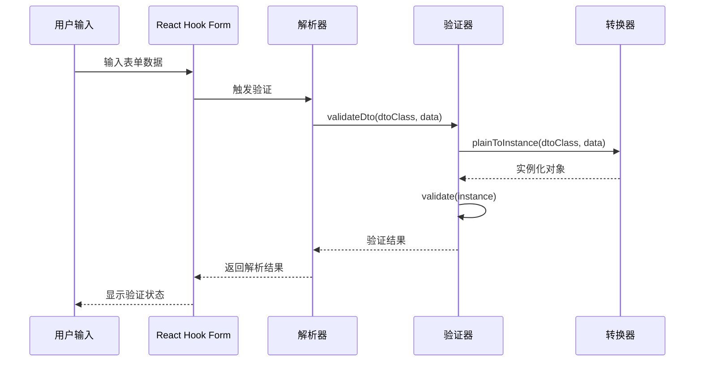
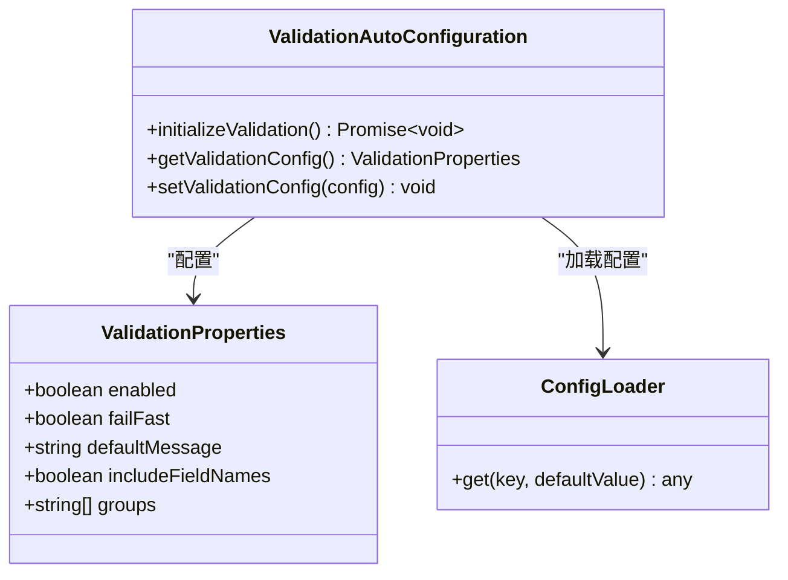
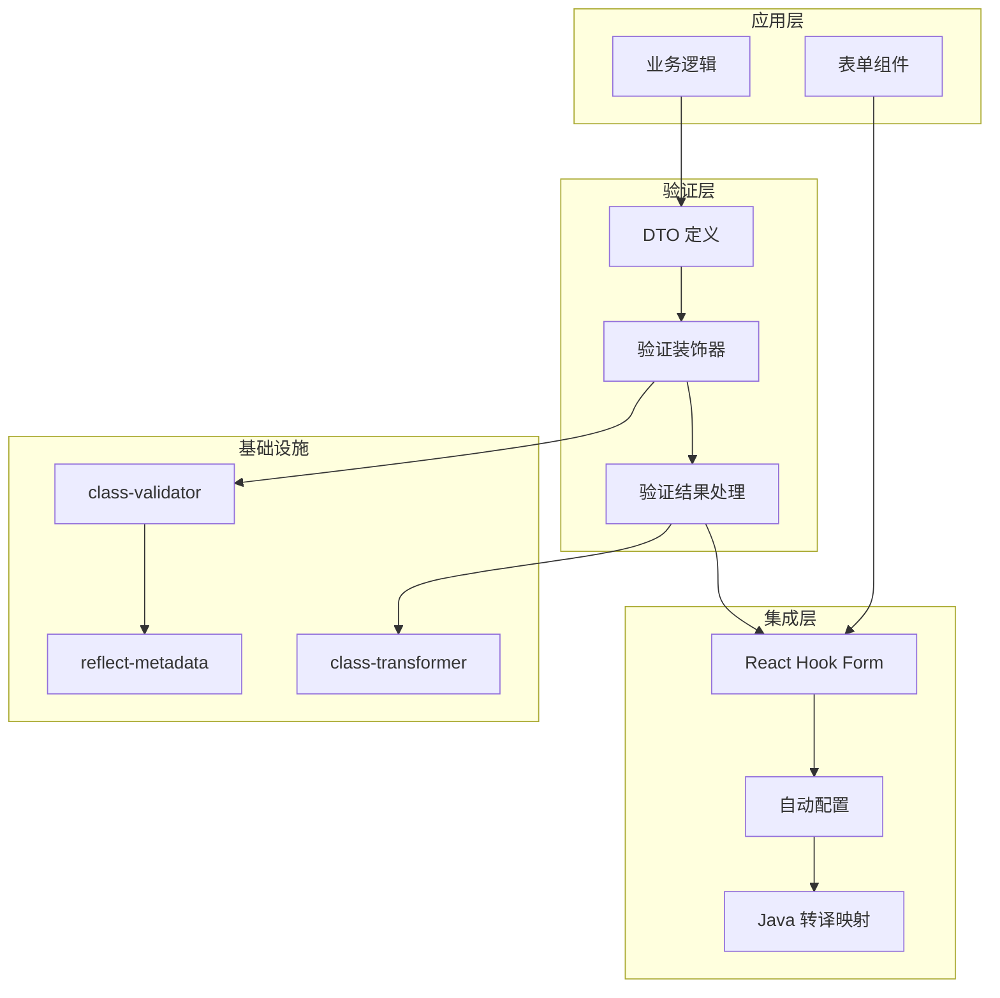

# 验证启动器 (aiko-boot-starter-validation) 使用文档

<cite>
**本文档引用的文件**
- [package.json](file://packages/aiko-boot-starter-validation/package.json)
- [index.ts](file://packages/aiko-boot-starter-validation/src/index.ts)
- [auto-configuration.ts](file://packages/aiko-boot-starter-validation/src/auto-configuration.ts)
- [config-augment.ts](file://packages/aiko-boot-starter-validation/src/config-augment.ts)
- [user.dto.ts](file://app/examples/user-crud/packages/api/src/dto/user.dto.ts)
- [user-dto.ts](file://packages/aiko-boot-starter-validation/examples/user-dto.ts)
- [form.tsx](file://app/framework/admin-component/src/ui/form.tsx)
</cite>

## 目录
1. [简介](#简介)
2. [项目结构](#项目结构)
3. [核心组件](#核心组件)
4. [架构概览](#架构概览)
5. [详细组件分析](#详细组件分析)
6. [依赖关系分析](#依赖关系分析)
7. [性能考虑](#性能考虑)
8. [故障排除指南](#故障排除指南)
9. [结论](#结论)

## 简介

验证启动器 (`@ai-partner-x/aiko-boot-starter-validation`) 是一个基于 Spring Boot 风格设计的 TypeScript 验证解决方案，专为 Aiko Boot 框架生态系统而构建。该启动器提供了与 class-validator 完全兼容的装饰器 API，集成了 React Hook Form 表单处理，并支持 Java 代码转译映射功能。

该启动器的核心特性包括：
- Spring Boot 风格的自动配置系统
- 完整的 class-validator 装饰器重导出
- React Hook Form 集成解析器
- Java 注解转译映射
- 类型安全的验证结果处理

## 项目结构

验证启动器采用模块化设计，主要包含以下核心模块：

```mermaid
graph TB
subgraph "验证启动器核心"
A[index.ts - 主入口]
B[auto-configuration.ts - 自动配置]
C[config-augment.ts - 类型扩展]
end
subgraph "外部依赖"
D[class-validator]
E[class-transformer]
F[reflect-metadata]
G[react-hook-form]
H[@hookform/resolvers]
end
subgraph "示例应用"
I[user-crud 示例]
J[admin-component 组件库]
end
A --> D
A --> E
A --> F
A --> G
A --> H
B --> I
C --> I
J --> G
```

**图表来源**
- [index.ts](file://packages/aiko-boot-starter-validation/src/index.ts#L1-L242)
- [auto-configuration.ts](file://packages/aiko-boot-starter-validation/src/auto-configuration.ts#L1-L101)

**章节来源**
- [package.json](file://packages/aiko-boot-starter-validation/package.json#L1-L41)
- [index.ts](file://packages/aiko-boot-starter-validation/src/index.ts#L1-L30)

## 核心组件

### 验证装饰器系统

验证启动器完全重导出了 class-validator 的所有装饰器，确保与现有代码的无缝兼容性。支持的装饰器类别包括：

#### 基础验证装饰器
- **存在性验证**: `IsDefined`, `IsOptional`
- **类型验证**: `IsString`, `IsNumber`, `IsInt`, `IsBoolean`, `IsArray`, `IsObject`, `IsDate`, `IsEnum`
- **字符串验证**: `IsNotEmpty`, `IsEmpty`, `Length`, `MinLength`, `MaxLength`, `Matches`
- **数值验证**: `Min`, `Max`, `IsPositive`, `IsNegative`
- **格式验证**: `IsEmail`, `IsUrl`, `IsUUID`, `IsIP`, `IsJSON`
- **日期验证**: `MinDate`, `MaxDate`
- **数组验证**: `ArrayContains`, `ArrayNotContains`, `ArrayNotEmpty`, `ArrayMinSize`, `ArrayMaxSize`, `ArrayUnique`
- **对象验证**: `IsInstance`
- **嵌套验证**: `ValidateNested`
- **自定义验证**: `Validate`, `ValidateIf`, `ValidateBy`

#### 数据转换装饰器
- **plainToInstance**: 对象实例化
- **instanceToPlain**: 实例转纯对象
- **Type**: 类型转换
- **Exclude/Expose**: 字段控制
- **Transform**: 数据转换

**章节来源**
- [index.ts](file://packages/aiko-boot-starter-validation/src/index.ts#L36-L113)

### React Hook Form 集成

验证启动器提供了专门的解析器创建函数，用于与 React Hook Form 无缝集成：



**图表来源**
- [index.ts](file://packages/aiko-boot-starter-validation/src/index.ts#L178-L196)
- [index.ts](file://packages/aiko-boot-starter-validation/src/index.ts#L120-L142)

### 自动配置系统

验证启动器实现了 Spring Boot 风格的自动配置机制，支持通过配置文件进行灵活控制：



**图表来源**
- [auto-configuration.ts](file://packages/aiko-boot-starter-validation/src/auto-configuration.ts#L34-L49)
- [auto-configuration.ts](file://packages/aiko-boot-starter-validation/src/auto-configuration.ts#L76-L100)

**章节来源**
- [auto-configuration.ts](file://packages/aiko-boot-starter-validation/src/auto-configuration.ts#L1-L101)

## 架构概览

验证启动器采用分层架构设计，确保各组件之间的松耦合和高内聚：



**图表来源**
- [index.ts](file://packages/aiko-boot-starter-validation/src/index.ts#L1-L242)
- [auto-configuration.ts](file://packages/aiko-boot-starter-validation/src/auto-configuration.ts#L1-L101)

## 详细组件分析

### 验证装饰器使用示例

#### 用户注册场景

```typescript
// CreateUserDto.ts
import { IsNotEmpty, IsEmail, Length, Min, Max, IsInt } from '@ai-partner-x/aiko-boot-starter-validation';

export class CreateUserDto {
  @IsNotEmpty({ message: '用户名不能为空' })
  @Length(2, 50, { message: '用户名长度必须在 2-50 之间' })
  username!: string;

  @IsEmail({}, { message: '邮箱格式不正确' })
  email!: string;

  @IsNotEmpty({ message: '密码不能为空' })
  @Length(6, 100, { message: '密码长度必须在 6-100 之间' })
  @Matches(/^(?=.*[a-z])(?=.*[A-Z])(?=.*\d)/, {
    message: '密码必须包含大小写字母和数字',
  })
  password!: string;

  @IsOptional()
  @IsInt({ message: '年龄必须是整数' })
  @Min(0, { message: '年龄不能小于 0' })
  @Max(150, { message: '年龄不能大于 150' })
  age?: number;
}
```

#### 用户登录场景

```typescript
// LoginDto.ts
import { IsNotEmpty, IsEmail } from '@ai-partner-x/aiko-boot-starter-validation';

export class LoginDto {
  @IsNotEmpty({ message: '邮箱不能为空' })
  @IsEmail({}, { message: '邮箱格式不正确' })
  email!: string;

  @IsNotEmpty({ message: '密码不能为空' })
  password!: string;
}
```

#### 数据编辑场景

```typescript
// UpdateUserDto.ts
import { IsOptional, Length, IsEmail, IsInt, Min, Max } from '@ai-partner-x/aiko-boot-starter-validation';

export class UpdateUserDto {
  @IsOptional()
  @Length(2, 50)
  username?: string;

  @IsOptional()
  @IsEmail()
  email?: string;

  @IsOptional()
  @IsInt()
  @Min(0)
  @Max(150)
  age?: number;
}
```

**章节来源**
- [user.dto.ts](file://app/examples/user-crud/packages/api/src/dto/user.dto.ts#L4-L33)
- [user-dto.ts](file://packages/aiko-boot-starter-validation/examples/user-dto.ts#L70-L129)

### React Hook Form 集成最佳实践

#### 基础表单集成

```typescript
import { useForm } from 'react-hook-form';
import { createResolver, CreateUserDto } from '@ai-partner-x/aiko-boot-starter-validation';

function UserRegistrationForm() {
  const { register, handleSubmit, formState: { errors } } = useForm({
    resolver: createResolver(CreateUserDto),
  });

  const onSubmit = async (data) => {
    const result = await validateDto(CreateUserDto, data);
    if (result.success) {
      // 处理成功提交
      console.log('验证通过:', result.data);
    } else {
      // 处理验证错误
      console.log('验证失败:', result.errors);
    }
  };

  return (
    <form onSubmit={handleSubmit(onSubmit)}>
      <input
        {...register('username')}
        placeholder="用户名"
      />
      {errors.username && (
        <span>{errors.username.message}</span>
      )}
      
      <input
        {...register('email')}
        placeholder="邮箱"
      />
      {errors.email && (
        <span>{errors.email.message}</span>
      )}
      
      <button type="submit">注册</button>
    </form>
  );
}
```

#### 高级表单配置

```typescript
import { Form, FormField, FormItem, FormLabel, FormControl, FormMessage } from '@aiko-boot/admin-component';

function EnhancedUserForm() {
  const form = useForm({
    resolver: createResolver(CreateUserDto),
    defaultValues: {
      username: '',
      email: '',
      password: '',
      age: undefined,
    },
  });

  return (
    <Form {...form}>
      <form onSubmit={form.handleSubmit(onSubmit)}>
        <FormField
          control={form.control}
          name="username"
          render={({ field }) => (
            <FormItem>
              <FormLabel>用户名</FormLabel>
              <FormControl>
                <input placeholder="请输入用户名" {...field} />
              </FormControl>
              <FormMessage />
            </FormItem>
          )}
        />
        
        <FormField
          control={form.control}
          name="email"
          render={({ field }) => (
            <FormItem>
              <FormLabel>邮箱</FormLabel>
              <FormControl>
                <input placeholder="请输入邮箱" {...field} />
              </FormControl>
              <FormMessage />
            </FormItem>
          )}
        />
        
        <FormField
          control={form.control}
          name="password"
          render={({ field }) => (
            <FormItem>
              <FormLabel>密码</FormLabel>
              <FormControl>
                <input 
                  type="password" 
                  placeholder="请输入密码" 
                  {...field} 
                />
              </FormControl>
              <FormMessage />
            </FormItem>
          )}
        />
        
        <FormField
          control={form.control}
          name="age"
          render={({ field }) => (
            <FormItem>
              <FormLabel>年龄</FormLabel>
              <FormControl>
                <input 
                  type="number" 
                  placeholder="请输入年龄" 
                  {...field} 
                  onChange={(e) => field.onChange(Number(e.target.value))}
                />
              </FormControl>
              <FormMessage />
            </FormItem>
          )}
        />
        
        <button type="submit">提交</button>
      </form>
    </Form>
  );
}
```

**章节来源**
- [form.tsx](file://app/framework/admin-component/src/ui/form.tsx#L1-L168)

### Java 转译映射系统

验证启动器提供了完整的 Java 注解转译映射功能，支持代码生成工具的自动化转换：

| TypeScript 装饰器 | Java 注解 | 参数映射 |
|-------------------|-----------|----------|
| IsNotEmpty | @NotBlank | 无参数 |
| IsDefined | @NotNull | 无参数 |
| IsEmail | @Email | 无参数 |
| IsUrl | @URL | 无参数 |
| Length | @Size | @Size(min = %s, max = %s) |
| MinLength | @Size | @Size(min = %s) |
| MaxLength | @Size | @Size(max = %s) |
| Min | @Min | @Min(%s) |
| Max | @Max | @Max(%s) |
| IsPositive | @Positive | 无参数 |
| IsNegative | @Negative | 无参数 |
| Matches | @Pattern | @Pattern(regexp = "%s") |
| IsUUID | @UUID | 无参数 |
| ValidateNested | @Valid | 无参数 |
| ArrayNotEmpty | @NotEmpty | 无参数 |
| ArrayMinSize | @Size | @Size(min = %s) |
| ArrayMaxSize | @Size | @Size(max = %s) |

**章节来源**
- [index.ts](file://packages/aiko-boot-starter-validation/src/index.ts#L205-L229)

### 自定义验证器实现

虽然验证启动器主要重导出 class-validator 的功能，但开发者仍可以实现自定义验证逻辑：

```typescript
// 自定义验证装饰器示例
import { Validate, ValidationArguments } from '@ai-partner-x/aiko-boot-starter-validation';

export function IsStrongPassword(validationOptions?: any) {
  return function (object: Object, propertyName: string) {
    Validate((value: any, args: ValidationArguments) => {
      // 强密码验证逻辑
      const strongPasswordRegex = /^(?=.*[a-z])(?=.*[A-Z])(?=.*\d)(?=.*[@$!%*?&])[A-Za-z\d@$!%*?&]/;
      return typeof value === 'string' && strongPasswordRegex.test(value);
    }, validationOptions)(object, propertyName);
  };
}

// 使用自定义验证器
export class CreateUserDto {
  @IsNotEmpty()
  @IsStrongPassword({ message: '密码强度不足' })
  password!: string;
}
```

## 依赖关系分析

验证启动器的依赖关系体现了清晰的分层架构：

```mermaid
graph LR
subgraph "运行时依赖"
A[@ai-partner-x/aiko-boot]
B[class-validator ^0.14.1]
C[class-transformer ^0.5.1]
D[reflect-metadata ^0.2.1]
end
subgraph "可选依赖"
E[react-hook-form >=7.0.0]
F[@hookform/resolvers >=3.0.0]
end
subgraph "验证启动器"
G[aiko-boot-starter-validation]
end
G --> A
G --> B
G --> C
G --> D
G -.-> E
G -.-> F
```

**图表来源**
- [package.json](file://packages/aiko-boot-starter-validation/package.json#L21-L38)

### 核心依赖分析

#### class-validator 集成
- **版本**: ^0.14.1
- **功能**: 提供完整的验证装饰器集合
- **特性**: 支持同步和异步验证、嵌套对象验证、自定义验证器

#### class-transformer 集成
- **版本**: ^0.5.1
- **功能**: 对象实例化和序列化
- **特性**: 类型转换、字段过滤、数据映射

#### 反射元数据支持
- **版本**: ^0.2.1
- **功能**: 支持装饰器的元数据反射
- **特性**: 运行时类型信息获取

**章节来源**
- [package.json](file://packages/aiko-boot-starter-validation/package.json#L21-L38)

## 性能考虑

### 验证性能优化

1. **延迟导入**: 验证器和转换器采用动态导入，减少初始加载时间
2. **缓存策略**: 验证结果可缓存以避免重复计算
3. **批量验证**: 支持批量数据验证以提高效率

### 内存管理

1. **实例化优化**: 使用 `plainToInstance` 进行高效的对象实例化
2. **错误对象复用**: 验证错误对象的生命周期管理
3. **垃圾回收**: 及时清理不再使用的验证上下文

### 并发处理

1. **异步验证**: 支持并发验证操作
2. **验证队列**: 复杂验证场景下的队列管理
3. **超时控制**: 验证操作的超时机制

## 故障排除指南

### 常见问题诊断

#### 验证装饰器不生效

**症状**: 装饰器标记的字段未触发验证
**解决方案**:
1. 确认已导入 `reflect-metadata`
2. 检查 DTO 类是否正确实例化
3. 验证装饰器参数配置

#### React Hook Form 集成问题

**症状**: 表单验证不按预期工作
**解决方案**:
1. 确认解析器正确创建
2. 检查表单字段名称与 DTO 属性匹配
3. 验证错误消息的显示逻辑

#### Java 转译映射错误

**症状**: 生成的 Java 代码注解不正确
**解决方案**:
1. 检查装饰器参数映射
2. 验证转译配置
3. 确认参数格式化

### 错误处理策略

```typescript
// 验证结果处理示例
interface ValidationResult<T> {
  success: boolean;
  data?: T;
  errors?: FieldError[];
}

interface FieldError {
  field: string;
  message: string;
  constraints: Record<string, string>;
}

// 错误处理最佳实践
function handleValidationResult<T>(
  result: ValidationResult<T>
): T | null {
  if (result.success) {
    return result.data || null;
  }
  
  if (result.errors) {
    result.errors.forEach(error => {
      console.warn(`字段 ${error.field} 验证失败: ${error.message}`);
    });
  }
  
  return null;
}
```

**章节来源**
- [index.ts](file://packages/aiko-boot-starter-validation/src/index.ts#L147-L160)

## 结论

验证启动器 (`@ai-partner-x/aiko-boot-starter-validation`) 为 TypeScript 生态系统提供了强大而灵活的验证解决方案。通过与 class-validator 的深度集成、Spring Boot 风格的自动配置机制以及 React Hook Form 的无缝连接，该启动器为现代 Web 应用提供了完整的数据验证基础设施。

### 主要优势

1. **API 兼容性**: 完全重导出 class-validator 装饰器，确保现有代码无需修改
2. **开发体验**: Spring Boot 风格的配置简化了验证系统的设置
3. **类型安全**: 完整的 TypeScript 类型支持
4. **生态集成**: 与 React Hook Form 和 Java 转译工具的良好集成
5. **扩展性**: 支持自定义验证器和复杂验证场景

### 适用场景

- **企业级应用**: 需要严格数据验证的企业应用
- **微服务架构**: 分布式系统中的数据验证统一
- **全栈开发**: 前后端共享验证规则的全栈应用
- **代码生成**: 需要 Java 转译的多语言项目

验证启动器为开发者提供了一个功能完整、易于使用且高度可扩展的数据验证解决方案，是构建高质量 TypeScript 应用的理想选择。