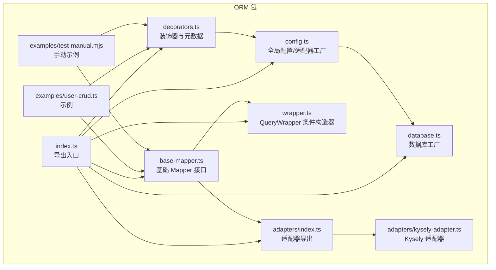
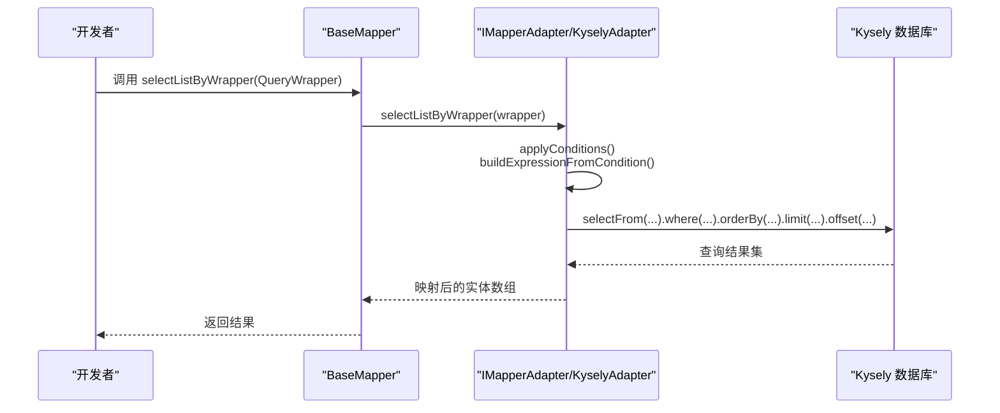
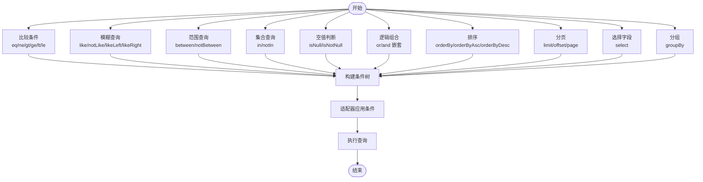
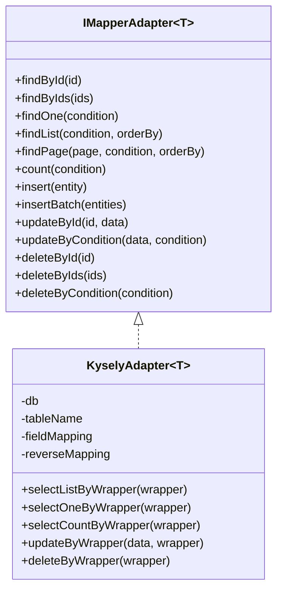
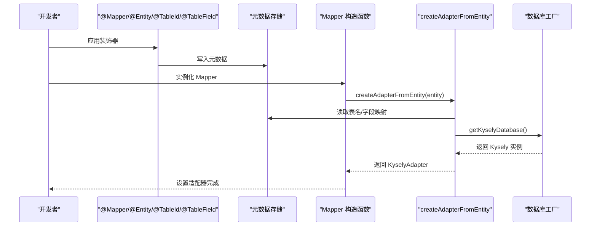
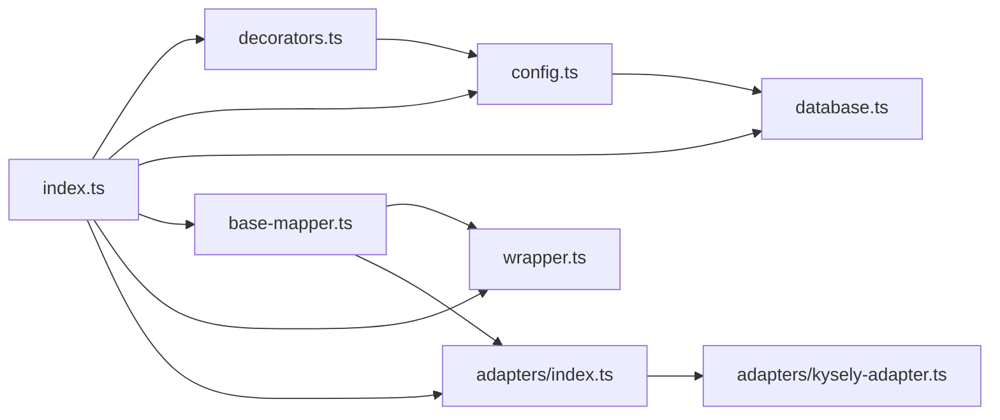

# ORM 高级功能

<cite>
**本文引用的文件**
- [packages/orm/src/index.ts](file://packages/orm/src/index.ts)
- [packages/orm/src/base-mapper.ts](file://packages/orm/src/base-mapper.ts)
- [packages/orm/src/wrapper.ts](file://packages/orm/src/wrapper.ts)
- [packages/orm/src/adapters/kysely-adapter.ts](file://packages/orm/src/adapters/kysely-adapter.ts)
- [packages/orm/src/adapters/index.ts](file://packages/orm/src/adapters/index.ts)
- [packages/orm/src/decorators.ts](file://packages/orm/src/decorators.ts)
- [packages/orm/src/config.ts](file://packages/orm/src/config.ts)
- [packages/orm/src/database.ts](file://packages/orm/src/database.ts)
- [packages/orm/examples/user-crud.ts](file://packages/orm/examples/user-crud.ts)
- [packages/orm/examples/test-manual.mjs](file://packages/orm/examples/test-manual.mjs)
- [README.md](file://README.md)
</cite>

## 目录
1. [简介](#简介)
2. [项目结构](#项目结构)
3. [核心组件](#核心组件)
4. [架构总览](#架构总览)
5. [详细组件分析](#详细组件分析)
6. [依赖关系分析](#依赖关系分析)
7. [性能考虑](#性能考虑)
8. [故障排查指南](#故障排查指南)
9. [结论](#结论)
10. [附录](#附录)

## 简介
本文件面向企业级应用场景，系统化阐述 AI-First Framework 的 ORM 高级能力，包括：
- 复杂查询构建器（多表联接、子查询、聚合函数、动态条件构建）
- 数据库适配器扩展机制（新增数据库支持、自定义适配器）
- 事务管理、连接池配置与性能优化
- 高级映射（继承映射、联合映射、嵌套对象映射）
- 大数据量处理、分页查询优化与缓存策略
- 数据库迁移、版本管理与多租户支持

本指南既适合初学者快速上手，也为资深开发者提供深入的技术细节与最佳实践。

## 项目结构
ORM 包位于 packages/orm，核心模块围绕“装饰器 + Mapper + 适配器 + 查询构建器”的分层设计组织，配合数据库工厂实现多数据库支持。

图表来源
- [packages/orm/src/index.ts](file://packages/orm/src/index.ts#L1-L72)
- [packages/orm/src/decorators.ts](file://packages/orm/src/decorators.ts#L1-L224)
- [packages/orm/src/config.ts](file://packages/orm/src/config.ts#L1-L77)
- [packages/orm/src/database.ts](file://packages/orm/src/database.ts#L1-L134)
- [packages/orm/src/base-mapper.ts](file://packages/orm/src/base-mapper.ts#L1-L332)
- [packages/orm/src/wrapper.ts](file://packages/orm/src/wrapper.ts#L1-L359)
- [packages/orm/src/adapters/index.ts](file://packages/orm/src/adapters/index.ts#L1-L2)
- [packages/orm/src/adapters/kysely-adapter.ts](file://packages/orm/src/adapters/kysely-adapter.ts#L1-L427)
- [packages/orm/examples/user-crud.ts](file://packages/orm/examples/user-crud.ts#L1-L155)
- [packages/orm/examples/test-manual.mjs](file://packages/orm/examples/test-manual.mjs#L1-L87)

章节来源
- [packages/orm/src/index.ts](file://packages/orm/src/index.ts#L1-L72)
- [README.md](file://README.md#L59-L67)

## 核心组件
- 装饰器与元数据：提供实体、主键、字段、Mapper 的声明式标注与运行时元数据读取。
- 基础 Mapper：统一 CRUD 与分页接口，屏蔽具体数据库差异。
- 查询构建器：MyBatis-Plus 风格的 QueryWrapper，支持比较、模糊、范围、NULL、OR/AND 组合、排序、分页、选择字段与分组。
- 适配器：将抽象操作映射到具体数据库（当前内置 KyselyAdapter，支持 PostgreSQL、SQLite、MySQL）。
- 数据库工厂：集中管理 Kysely 实例与连接配置，支持多数据库类型。

章节来源
- [packages/orm/src/decorators.ts](file://packages/orm/src/decorators.ts#L1-L224)
- [packages/orm/src/base-mapper.ts](file://packages/orm/src/base-mapper.ts#L1-L332)
- [packages/orm/src/wrapper.ts](file://packages/orm/src/wrapper.ts#L1-L359)
- [packages/orm/src/adapters/kysely-adapter.ts](file://packages/orm/src/adapters/kysely-adapter.ts#L1-L427)
- [packages/orm/src/database.ts](file://packages/orm/src/database.ts#L1-L134)

## 架构总览
下图展示 ORM 的关键交互：装饰器收集元数据 → Mapper 通过适配器执行 → 适配器将条件转换为 Kysely 查询 → 数据库返回结果。

图表来源
- [packages/orm/src/base-mapper.ts](file://packages/orm/src/base-mapper.ts#L202-L301)
- [packages/orm/src/adapters/kysely-adapter.ts](file://packages/orm/src/adapters/kysely-adapter.ts#L174-L244)
- [packages/orm/src/wrapper.ts](file://packages/orm/src/wrapper.ts#L1-L359)

## 详细组件分析

### 复杂查询构建器（QueryWrapper）
- 支持的条件类型：比较（=、!=、>、>=、<、<=）、LIKE/NOT LIKE（含左右匹配）、BETWEEN/NOT BETWEEN、IN/NOT IN、IS NULL/IS NOT NULL。
- 逻辑组合：OR/AND 嵌套，支持多层条件组合。
- 排序与分页：支持升/降序、LIMIT/OFFSET、page(pageNo, pageSize)。
- 选择字段与分组：select(...)、groupBy(...)。
- 动态条件构建：通过链式 API 动态拼接条件，最终由适配器转换为 SQL。

图表来源
- [packages/orm/src/wrapper.ts](file://packages/orm/src/wrapper.ts#L28-L359)
- [packages/orm/src/adapters/kysely-adapter.ts](file://packages/orm/src/adapters/kysely-adapter.ts#L246-L323)

章节来源
- [packages/orm/src/wrapper.ts](file://packages/orm/src/wrapper.ts#L1-L359)
- [packages/orm/src/adapters/kysely-adapter.ts](file://packages/orm/src/adapters/kysely-adapter.ts#L246-L323)

### 数据库适配器扩展机制
- 适配器接口：IMapperAdapter 定义了查询、插入、更新、删除与分页等统一方法。
- 内置适配器：KyselyAdapter 将条件树转换为 Kysely 查询，支持字段映射与实体映射。
- 扩展新适配器：实现 IMapperAdapter 接口，即可无缝接入 BaseMapper；若需 QueryWrapper 支持，可在适配器中实现 selectListByWrapper、updateByWrapper、deleteByWrapper 等方法。

图表来源
- [packages/orm/src/base-mapper.ts](file://packages/orm/src/base-mapper.ts#L303-L331)
- [packages/orm/src/adapters/kysely-adapter.ts](file://packages/orm/src/adapters/kysely-adapter.ts#L24-L427)

章节来源
- [packages/orm/src/base-mapper.ts](file://packages/orm/src/base-mapper.ts#L303-L331)
- [packages/orm/src/adapters/kysely-adapter.ts](file://packages/orm/src/adapters/kysely-adapter.ts#L1-L427)

### 装饰器与元数据系统
- 实体装饰器：@Entity/@TableName 提供表名与描述等信息。
- 字段装饰器：@TableId/@TableField/@Column 标注主键与字段映射、存在性、填充策略等。
- Mapper 装饰器：@Mapper 标注关联实体，自动注入 DI 并在数据库初始化后自动设置适配器。
- 元数据读取：提供 getEntityMetadata、getTableIdMetadata、getTableFieldMetadata、getMapperMetadata 辅助函数。

图表来源
- [packages/orm/src/decorators.ts](file://packages/orm/src/decorators.ts#L140-L193)
- [packages/orm/src/config.ts](file://packages/orm/src/config.ts#L42-L76)
- [packages/orm/src/database.ts](file://packages/orm/src/database.ts#L100-L105)

章节来源
- [packages/orm/src/decorators.ts](file://packages/orm/src/decorators.ts#L1-L224)
- [packages/orm/src/config.ts](file://packages/orm/src/config.ts#L1-L77)
- [packages/orm/src/database.ts](file://packages/orm/src/database.ts#L1-L134)

### 数据库工厂与连接池
- 支持数据库类型：PostgreSQL、SQLite、MySQL。
- 连接池：PostgreSQL 使用 pg.Pool，MySQL 使用 mysql2 的 Pool，SQLite 使用 better-sqlite3。
- 生命周期：createKyselyDatabase 初始化全局实例，getKyselyDatabase/getKyselyDatabaseConfig 提供访问，closeKyselyDatabase 销毁连接。

章节来源
- [packages/orm/src/database.ts](file://packages/orm/src/database.ts#L1-L134)

### 高级映射能力
- 字段映射：KyselyAdapter 支持 TypeScript 字段名到数据库列名的双向映射，自动进行实体与行的转换。
- 嵌套对象映射：可通过字段装饰器标记非数据库字段（exist: false），用于承载业务计算结果或 DTO 字段。
- 继承映射与联合映射：当前以装饰器与适配器为主，未直接暴露 ORM 层的继承/联合映射 API。如需复杂映射，建议结合查询构建器与自定义适配器实现。

章节来源
- [packages/orm/src/adapters/kysely-adapter.ts](file://packages/orm/src/adapters/kysely-adapter.ts#L39-L65)
- [packages/orm/src/decorators.ts](file://packages/orm/src/decorators.ts#L43-L55)

### 复杂业务场景与企业级功能
- 大数据量处理：利用分页查询（page/no、pageSize）与 LIMIT/OFFSET，避免一次性加载过多数据。
- 分页查询优化：在适配器中对分页查询与 COUNT 并行执行，减少往返次数。
- 缓存策略：可在应用层引入二级缓存（如 Redis）缓存热点查询结果，结合查询构建器的稳定 SQL 片段进行命中。
- 事务管理：通过 Kysely 的事务 API（例如在适配器中封装事务块）确保批量更新/删除的一致性。
- 数据库迁移与版本管理：建议结合 Kysely 的 DDL 能力或外部迁移工具（如 DBML/liquibase）维护 schema 变更。
- 多租户支持：在实体与查询构建器中加入 tenant_id 条件，或在适配器层统一注入过滤条件。

章节来源
- [packages/orm/src/adapters/kysely-adapter.ts](file://packages/orm/src/adapters/kysely-adapter.ts#L123-L157)
- [packages/orm/src/wrapper.ts](file://packages/orm/src/wrapper.ts#L262-L290)

## 依赖关系分析
ORM 包内部模块耦合清晰，遵循“低耦合、高内聚”原则：
- index.ts 作为统一出口，聚合导出装饰器、Mapper、适配器、数据库工厂。
- decorators 与 config 协作，为 Mapper 注入适配器。
- base-mapper 依赖 wrapper 与适配器接口，形成稳定的抽象边界。
- adapters 与 database 解耦，适配器只依赖 Kysely 实例。

图表来源
- [packages/orm/src/index.ts](file://packages/orm/src/index.ts#L1-L72)
- [packages/orm/src/decorators.ts](file://packages/orm/src/decorators.ts#L1-L224)
- [packages/orm/src/config.ts](file://packages/orm/src/config.ts#L1-L77)
- [packages/orm/src/database.ts](file://packages/orm/src/database.ts#L1-L134)
- [packages/orm/src/base-mapper.ts](file://packages/orm/src/base-mapper.ts#L1-L332)
- [packages/orm/src/wrapper.ts](file://packages/orm/src/wrapper.ts#L1-L359)
- [packages/orm/src/adapters/index.ts](file://packages/orm/src/adapters/index.ts#L1-L2)
- [packages/orm/src/adapters/kysely-adapter.ts](file://packages/orm/src/adapters/kysely-adapter.ts#L1-L427)

章节来源
- [packages/orm/src/index.ts](file://packages/orm/src/index.ts#L1-L72)

## 性能考虑
- 查询性能
  - 使用 select(...) 限制字段，减少网络传输与反序列化开销。
  - 合理使用索引列参与条件（如 status、tenant_id），避免全表扫描。
  - 分页查询优先使用 page()/limit/offset，避免一次性拉取大量数据。
- 连接池与并发
  - PostgreSQL/MySQL 使用连接池，合理设置最大连接数与超时时间。
  - SQLite 在高并发场景建议评估 WAL 模式与锁策略。
- 适配器层面
  - KyselyAdapter 已对分页与统计查询采用并行执行，尽量复用该实现。
  - 批量插入/更新使用 insertBatch/updateByCondition，减少往返次数。
- 缓存
  - 对高频读取的维度表与配置表启用缓存；对写密集表采用失效策略。

[本节为通用指导，不直接分析具体文件]

## 故障排查指南
- 适配器未设置
  - 现象：调用 Mapper 抛出“Mapper adapter not set”。
  - 处理：确保在实例化后调用 setAdapter 或使用 @Mapper 装饰器自动注入。
- 数据库未初始化
  - 现象：createAdapterFromEntity 抛出“Database not initialized”。
  - 处理：先调用 createKyselyDatabase 初始化数据库。
- 查询无结果或结果异常
  - 检查字段映射：确认 @TableField/@TableId 的 column 与实体字段名是否一致。
  - 检查条件：使用 QueryWrapper.clear() 清理历史条件，重新构建。
- 分页统计不准确
  - 确认条件在统计查询中同步应用，避免遗漏 where 条件。

章节来源
- [packages/orm/src/base-mapper.ts](file://packages/orm/src/base-mapper.ts#L64-L72)
- [packages/orm/src/config.ts](file://packages/orm/src/config.ts#L42-L47)
- [packages/orm/src/adapters/kysely-adapter.ts](file://packages/orm/src/adapters/kysely-adapter.ts#L123-L157)

## 结论
AI-First Framework 的 ORM 以 MyBatis-Plus 风格的 API 为核心，结合装饰器元数据与适配器模式，实现了跨数据库的统一抽象。通过 QueryWrapper 的丰富条件表达能力、KyselyAdapter 的高效转换与数据库工厂的多数据库支持，能够满足复杂业务场景下的查询、分页、缓存与事务需求。对于企业级特性（迁移、版本管理、多租户），建议在应用层与适配器层协同实现，确保可演进与可维护性。

[本节为总结性内容，不直接分析具体文件]

## 附录

### 快速上手示例
- 示例一：装饰器驱动的 CRUD 与分页
  - 参考：[packages/orm/examples/user-crud.ts](file://packages/orm/examples/user-crud.ts#L1-L155)
- 示例二：手动装饰器语法
  - 参考：[packages/orm/examples/test-manual.mjs](file://packages/orm/examples/test-manual.mjs#L1-L87)

章节来源
- [packages/orm/examples/user-crud.ts](file://packages/orm/examples/user-crud.ts#L1-L155)
- [packages/orm/examples/test-manual.mjs](file://packages/orm/examples/test-manual.mjs#L1-L87)