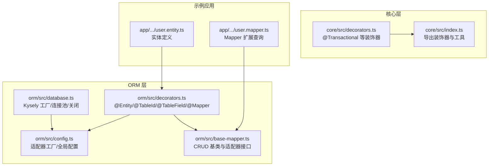
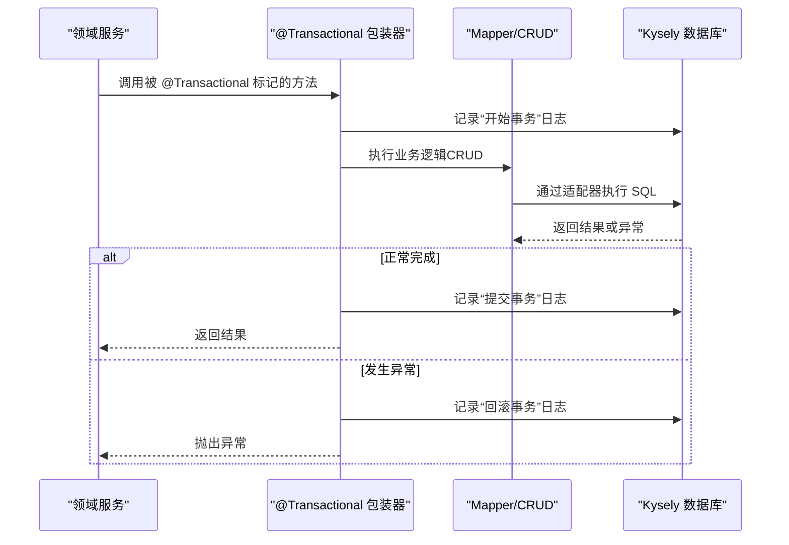
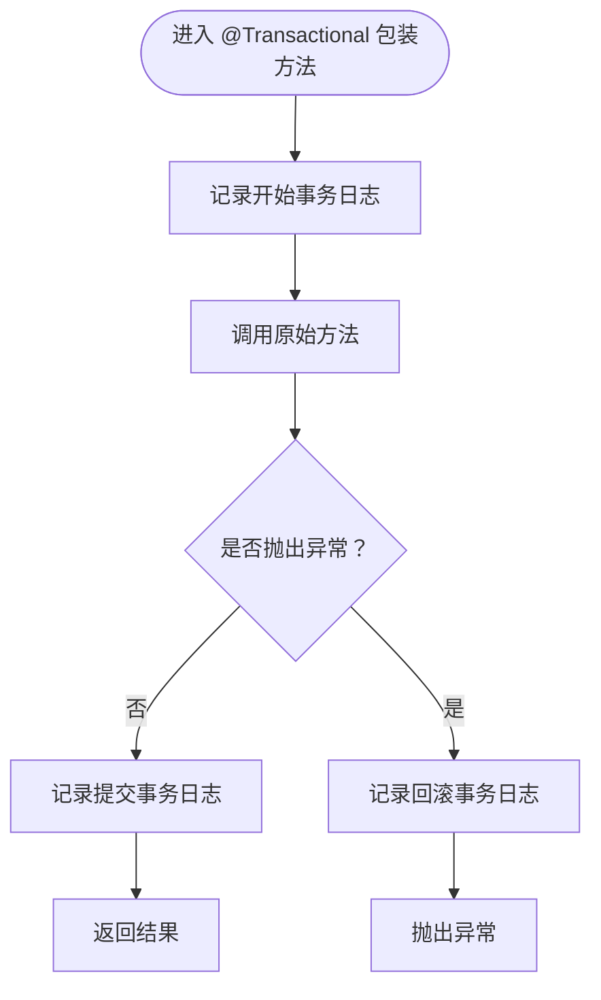
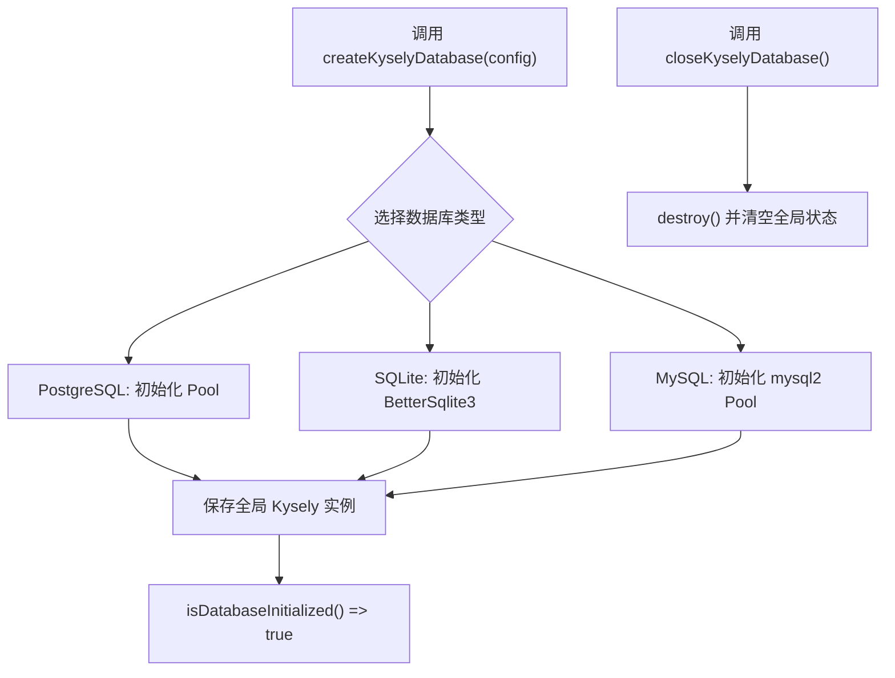
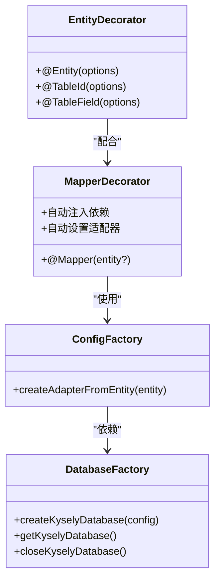
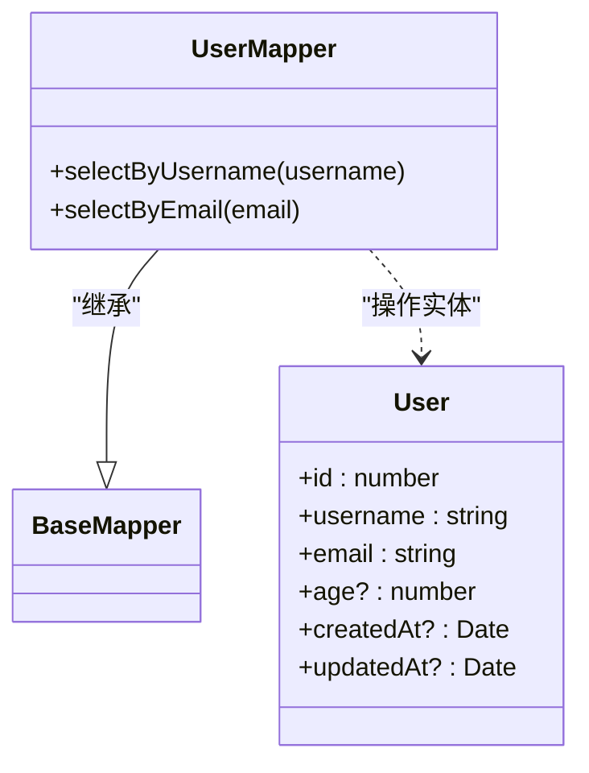
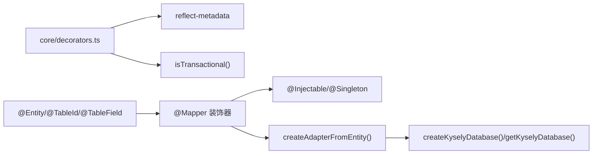

# 事务管理与并发控制

<cite>
**本文引用的文件**
- [packages/core/src/decorators.ts](file://packages/core/src/decorators.ts)
- [packages/core/src/index.ts](file://packages/core/src/index.ts)
- [packages/orm/src/database.ts](file://packages/orm/src/database.ts)
- [packages/orm/src/config.ts](file://packages/orm/src/config.ts)
- [packages/orm/src/decorators.ts](file://packages/orm/src/decorators.ts)
- [packages/orm/src/base-mapper.ts](file://packages/orm/src/base-mapper.ts)
- [app/examples/user-crud/packages/api/src/entity/user.entity.ts](file://app/examples/user-crud/packages/api/src/entity/user.entity.ts)
- [app/examples/user-crud/packages/api/src/mapper/user.mapper.ts](file://app/examples/user-crud/packages/api/src/mapper/user.mapper.ts)
- [docs/packages.md](file://docs/packages.md)
</cite>

## 目录
1. [引言](#引言)
2. [项目结构](#项目结构)
3. [核心组件](#核心组件)
4. [架构总览](#架构总览)
5. [详细组件分析](#详细组件分析)
6. [依赖关系分析](#依赖关系分析)
7. [性能考量](#性能考量)
8. [故障排查指南](#故障排查指南)
9. [结论](#结论)
10. [附录](#附录)

## 引言
本文件围绕 AI-First Framework 的事务管理与并发控制进行系统化说明，目标是帮助开发者在该框架下正确设计与实现事务生命周期（开始、提交、回滚）、嵌套事务处理、并发控制（乐观锁/悲观锁）、分布式一致性（Saga 模式与最终一致性）、以及性能优化与异常处理策略。当前仓库中，事务能力以装饰器形式提供，结合 ORM 的数据库连接工厂与适配器体系，形成从领域服务到持久层的事务边界与并发控制基础。

## 项目结构
本节聚焦与事务与并发相关的核心模块与示例应用：
- 核心装饰器：提供 @Transactional 等领域层装饰器，用于标记事务方法与读取事务元数据
- ORM 数据库工厂：统一创建 Kysely 实例，支持多数据库类型，并提供全局实例与关闭能力
- ORM 配置与适配器：基于实体元数据自动创建适配器，驱动具体数据库操作
- 示例实体与 Mapper：展示如何在业务实体上标注 ORM 装饰器，并通过 Mapper 执行 CRUD

图表来源
- [packages/core/src/decorators.ts](file://packages/core/src/decorators.ts#L120-L157)
- [packages/core/src/index.ts](file://packages/core/src/index.ts#L14-L21)
- [packages/orm/src/database.ts](file://packages/orm/src/database.ts#L44-L133)
- [packages/orm/src/config.ts](file://packages/orm/src/config.ts#L38-L76)
- [packages/orm/src/decorators.ts](file://packages/orm/src/decorators.ts#L68-L193)
- [packages/orm/src/base-mapper.ts](file://packages/orm/src/base-mapper.ts#L54-L331)
- [app/examples/user-crud/packages/api/src/entity/user.entity.ts](file://app/examples/user-crud/packages/api/src/entity/user.entity.ts#L1-L23)
- [app/examples/user-crud/packages/api/src/mapper/user.mapper.ts](file://app/examples/user-crud/packages/api/src/mapper/user.mapper.ts#L1-L16)

章节来源
- [packages/core/src/decorators.ts](file://packages/core/src/decorators.ts#L120-L157)
- [packages/orm/src/database.ts](file://packages/orm/src/database.ts#L44-L133)
- [packages/orm/src/config.ts](file://packages/orm/src/config.ts#L38-L76)
- [packages/orm/src/decorators.ts](file://packages/orm/src/decorators.ts#L68-L193)
- [packages/orm/src/base-mapper.ts](file://packages/orm/src/base-mapper.ts#L54-L331)
- [app/examples/user-crud/packages/api/src/entity/user.entity.ts](file://app/examples/user-crud/packages/api/src/entity/user.entity.ts#L1-L23)
- [app/examples/user-crud/packages/api/src/mapper/user.mapper.ts](file://app/examples/user-crud/packages/api/src/mapper/user.mapper.ts#L1-L16)

## 核心组件
- 事务装饰器
  - @Transactional：将方法标记为事务性，包装原方法以输出事务日志并在异常时抛出
  - isTransactional：读取方法是否被标记为事务性的元数据
- ORM 数据库工厂
  - createKyselyDatabase/getKyselyDatabase/closeKyselyDatabase：统一创建与管理 Kysely 实例，支持 PostgreSQL、SQLite、MySQL
  - isDatabaseInitialized：判断数据库是否已初始化
- ORM 配置与适配器
  - createAdapterFromEntity：根据实体元数据自动创建适配器，绑定表名与字段映射
  - Mapper/@Mapper：自动注入依赖、注册到容器，并在实例化时尝试设置适配器
- 示例实体与 Mapper
  - User 实体：使用 @Entity/@TableId/@TableField 标注
  - UserMapper：继承 BaseMapper 并扩展自定义查询

章节来源
- [packages/core/src/decorators.ts](file://packages/core/src/decorators.ts#L120-L157)
- [packages/orm/src/database.ts](file://packages/orm/src/database.ts#L44-L133)
- [packages/orm/src/config.ts](file://packages/orm/src/config.ts#L38-L76)
- [packages/orm/src/decorators.ts](file://packages/orm/src/decorators.ts#L68-L193)
- [packages/orm/src/base-mapper.ts](file://packages/orm/src/base-mapper.ts#L54-L331)
- [app/examples/user-crud/packages/api/src/entity/user.entity.ts](file://app/examples/user-crud/packages/api/src/entity/user.entity.ts#L1-L23)
- [app/examples/user-crud/packages/api/src/mapper/user.mapper.ts](file://app/examples/user-crud/packages/api/src/mapper/user.mapper.ts#L1-L16)

## 架构总览
事务与并发控制在框架中的位置如下：
- 领域服务通过 @Transactional 标记业务方法，形成事务边界
- ORM 层负责数据库连接与适配器装配，确保 CRUD 操作在统一的连接上下文中执行
- 示例应用展示实体与 Mapper 的典型用法，便于在业务流程中串联事务

图表来源
- [packages/core/src/decorators.ts](file://packages/core/src/decorators.ts#L125-L142)
- [packages/orm/src/base-mapper.ts](file://packages/orm/src/base-mapper.ts#L54-L331)
- [packages/orm/src/database.ts](file://packages/orm/src/database.ts#L44-L133)

## 详细组件分析

### 事务装饰器与生命周期
- 设计要点
  - 通过反射为方法写入事务元数据，便于运行时识别
  - 包装原方法：在调用前后打印事务日志；捕获异常并向上抛出，交由上层处理
- 生命周期
  - 开始：进入包装后的异步函数即视为事务开始
  - 提交：正常返回时视为提交成功
  - 回滚：发生异常时抛出，由调用方决定是否回滚（当前实现不直接执行回滚，而是抛出异常）
- 嵌套事务
  - 当前装饰器未实现传播行为与嵌套事务的显式控制，建议在业务层谨慎组合调用，避免重复开启事务

图表来源
- [packages/core/src/decorators.ts](file://packages/core/src/decorators.ts#L125-L142)

章节来源
- [packages/core/src/decorators.ts](file://packages/core/src/decorators.ts#L120-L157)

### ORM 数据库工厂与连接管理
- 统一创建
  - 支持 PostgreSQL、SQLite、MySQL 三种方言，分别使用对应连接池
  - 初始化后保存为全局实例，后续通过 getKyselyDatabase 获取
- 生命周期
  - isDatabaseInitialized：检查是否已初始化
  - closeKyselyDatabase：销毁连接池并清空全局状态
- 适用场景
  - 在应用启动阶段调用 createKyselyDatabase 完成初始化
  - 在应用关闭阶段调用 closeKyselyDatabase 进行资源回收

图表来源
- [packages/orm/src/database.ts](file://packages/orm/src/database.ts#L44-L133)

章节来源
- [packages/orm/src/database.ts](file://packages/orm/src/database.ts#L44-L133)

### ORM 配置与适配器工厂
- 自动适配器
  - createAdapterFromEntity：从实体元数据推断表名与字段映射，创建 KyselyAdapter
  - 依赖全局数据库实例，需先初始化
- Mapper 注入
  - @Mapper 装饰器：自动注入构造函数依赖、注册为单例
  - 若数据库已初始化且实例具备 setAdapter，则在构造时自动设置适配器

图表来源
- [packages/orm/src/decorators.ts](file://packages/orm/src/decorators.ts#L68-L193)
- [packages/orm/src/config.ts](file://packages/orm/src/config.ts#L38-L76)
- [packages/orm/src/database.ts](file://packages/orm/src/database.ts#L44-L133)

章节来源
- [packages/orm/src/decorators.ts](file://packages/orm/src/decorators.ts#L68-L193)
- [packages/orm/src/config.ts](file://packages/orm/src/config.ts#L38-L76)

### 示例实体与 Mapper
- 实体 User
  - 使用 @Entity/@TableId/@TableField 标注，定义表名、主键与字段映射
- Mapper UserMapper
  - 继承 BaseMapper，复用标准 CRUD 方法
  - 可扩展自定义查询（如按用户名/邮箱查询）

图表来源
- [app/examples/user-crud/packages/api/src/entity/user.entity.ts](file://app/examples/user-crud/packages/api/src/entity/user.entity.ts#L1-L23)
- [app/examples/user-crud/packages/api/src/mapper/user.mapper.ts](file://app/examples/user-crud/packages/api/src/mapper/user.mapper.ts#L1-L16)
- [packages/orm/src/base-mapper.ts](file://packages/orm/src/base-mapper.ts#L54-L331)

章节来源
- [app/examples/user-crud/packages/api/src/entity/user.entity.ts](file://app/examples/user-crud/packages/api/src/entity/user.entity.ts#L1-L23)
- [app/examples/user-crud/packages/api/src/mapper/user.mapper.ts](file://app/examples/user-crud/packages/api/src/mapper/user.mapper.ts#L1-L16)
- [packages/orm/src/base-mapper.ts](file://packages/orm/src/base-mapper.ts#L54-L331)

## 依赖关系分析
- 装饰器依赖
  - @Transactional 依赖 reflect-metadata 与运行时元数据
  - isTransactional 用于读取方法级事务元数据
- ORM 依赖
  - Mapper 依赖 DI 容器（@Injectable/@Singleton）与数据库工厂
  - 适配器工厂依赖实体元数据与全局数据库实例
- 示例应用
  - 实体与 Mapper 通过 @Entity/@Mapper 与 BaseMapper 协作

图表来源
- [packages/core/src/decorators.ts](file://packages/core/src/decorators.ts#L120-L157)
- [packages/orm/src/decorators.ts](file://packages/orm/src/decorators.ts#L68-L193)
- [packages/orm/src/config.ts](file://packages/orm/src/config.ts#L38-L76)
- [packages/orm/src/database.ts](file://packages/orm/src/database.ts#L44-L133)

章节来源
- [packages/core/src/decorators.ts](file://packages/core/src/decorators.ts#L120-L157)
- [packages/orm/src/decorators.ts](file://packages/orm/src/decorators.ts#L68-L193)
- [packages/orm/src/config.ts](file://packages/orm/src/config.ts#L38-L76)
- [packages/orm/src/database.ts](file://packages/orm/src/database.ts#L44-L133)

## 性能考量
- 事务大小控制
  - 将原子业务单元封装在单一 @Transactional 方法内，避免跨服务长事务
  - 合理拆分业务步骤，减少锁持有时间
- 锁等待与死锁预防
  - 通过 ORM 的查询/更新接口尽量缩小临界区，避免长时间持有行级锁
  - 控制批量操作粒度，降低锁竞争概率
- 连接池与资源回收
  - 在应用关闭时调用 closeKyselyDatabase，释放连接池资源
  - 根据数据库类型选择合适的连接池参数（最大连接数、空闲超时等）

[本节为通用指导，无需特定文件引用]

## 故障排查指南
- 事务未生效
  - 确认方法已被 @Transactional 包装，且 isTransactional 返回 true
  - 检查调用链是否在同一个实例上下文中执行（DI 单例与代理行为）
- 数据库未初始化
  - createKyselyDatabase 未被调用或未在适配器创建前完成初始化
  - 调用 getKyselyDatabase 会抛出未初始化异常
- 异常处理
  - @Transactional 在捕获异常后会抛出，需在上层捕获并决定是否回滚
  - 建议在业务层区分业务异常与系统异常，前者可直接返回错误信息，后者用于触发回滚

章节来源
- [packages/core/src/decorators.ts](file://packages/core/src/decorators.ts#L120-L157)
- [packages/orm/src/database.ts](file://packages/orm/src/database.ts#L97-L133)

## 结论
AI-First Framework 提供了基础的事务装饰器与 ORM 数据库工厂，使开发者能够在领域服务中以声明式方式标注事务边界，并通过 ORM 适配器将业务操作与数据库连接统一管理。当前实现侧重于事务日志与异常抛出，未内置传播行为与嵌套事务控制，建议在业务层谨慎设计事务边界，并结合 ORM 的连接管理与适配器机制，构建稳定可靠的并发控制与一致性保障。

[本节为总结，无需特定文件引用]

## 附录
- 实际业务场景的事务设计模式（建议）
  - 订单处理：下单原子化（创建订单 + 冻结库存），失败则回滚
  - 库存管理：高并发下优先使用乐观锁版本号，避免长时间持锁
  - 支付流程：采用 Saga 模式拆分长事务，每个步骤可补偿，最终达到一致性
- 分布式事务与最终一致
  - 通过事件驱动与补偿动作实现跨服务一致性
  - 重试与幂等：对关键操作设计幂等键与重试策略，避免重复执行

[本节为概念性内容，无需特定文件引用]