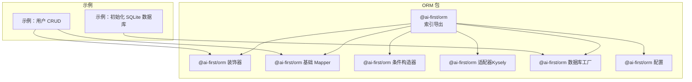
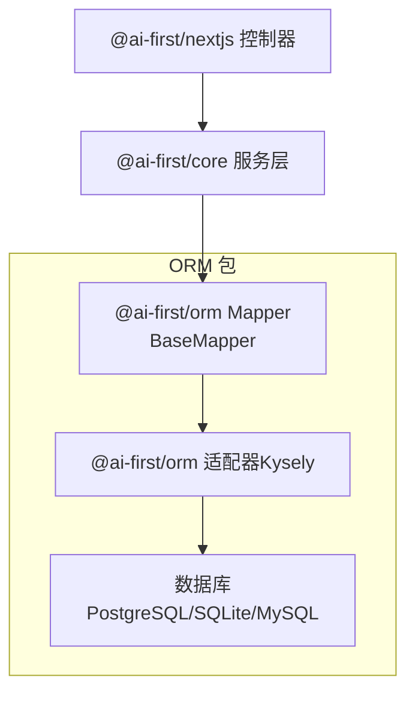
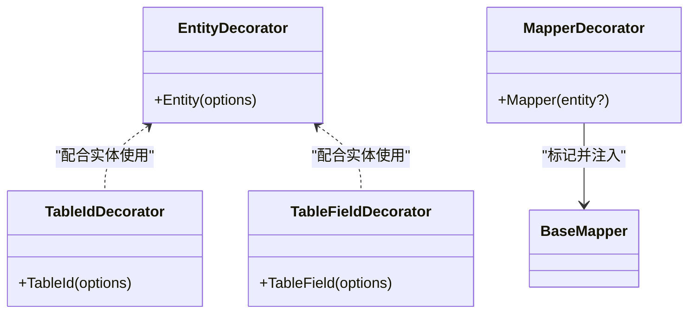
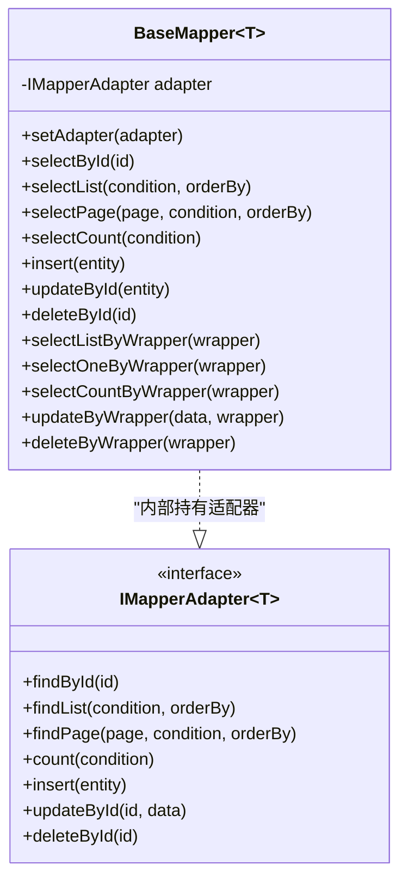
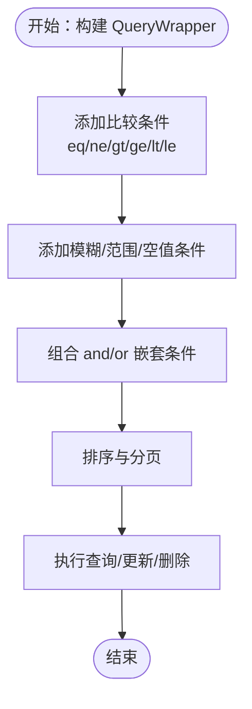
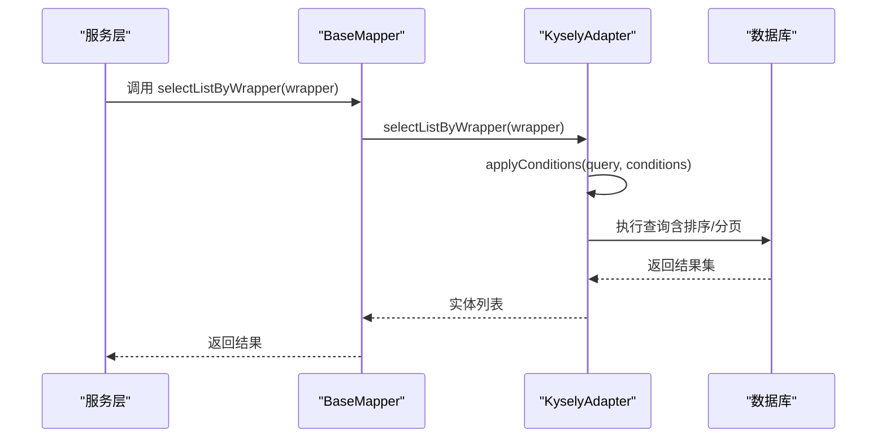
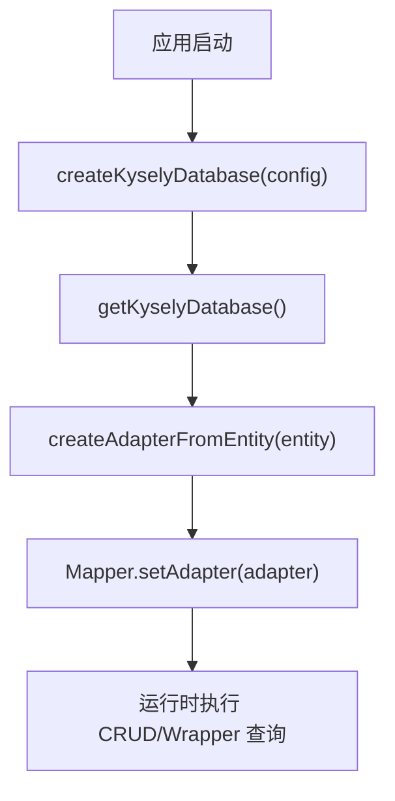
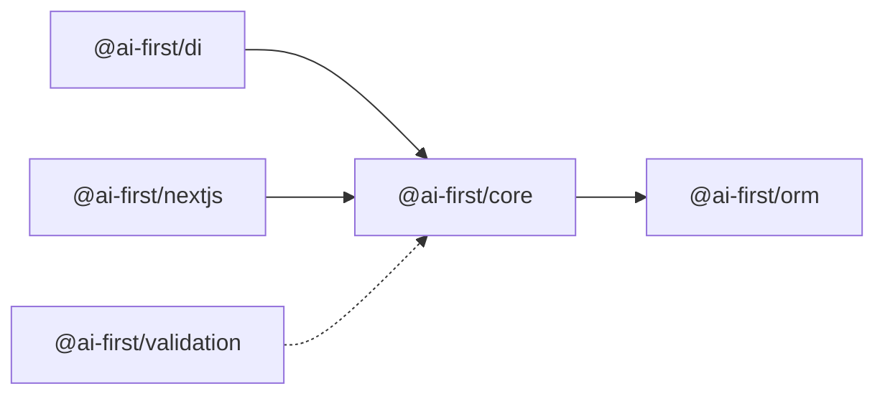

# 企业级功能特性

<cite>
**本文引用的文件**
- [README.md](file://README.md)
- [架构设计.md](file://docs/architecture.md)
- [包说明.md](file://docs/packages.md)
- [@ai-first/orm 源码索引](file://packages/orm/src/index.ts)
- [@ai-first/orm 装饰器](file://packages/orm/src/decorators.ts)
- [@ai-first/orm 基础 Mapper](file://packages/orm/src/base-mapper.ts)
- [@ai-first/orm 条件构造器](file://packages/orm/src/wrapper.ts)
- [@ai-first/orm 适配器（Kysely）](file://packages/orm/src/adapters/kysely-adapter.ts)
- [@ai-first/orm 数据库工厂](file://packages/orm/src/database.ts)
- [@ai-first/orm 配置](file://packages/orm/src/config.ts)
- [示例：用户 CRUD](file://packages/orm/examples/user-crud.ts)
- [示例：初始化 SQLite 数据库](file://app/examples/user-crud/packages/api/src/scripts/init-db.ts)
</cite>

## 目录
1. [简介](#简介)
2. [项目结构](#项目结构)
3. [核心组件](#核心组件)
4. [架构总览](#架构总览)
5. [详细组件分析](#详细组件分析)
6. [依赖关系分析](#依赖关系分析)
7. [性能考量](#性能考量)
8. [故障排查指南](#故障排查指南)
9. [结论](#结论)
10. [附录](#附录)

## 简介
本文件面向企业级场景，系统化梳理 AI-First Framework 的 ORM 能力与企业级特性。结合仓库现有代码，重点覆盖以下主题：
- 数据库迁移管理：版本控制、迁移脚本编写与回滚策略
- 多租户架构支持：数据隔离策略、租户标识管理与安全访问控制
- 分库分表实现：水平分片策略、数据路由算法与跨分片查询处理
- 审计日志：操作记录、数据变更跟踪与合规性报告
- 数据加密与安全：敏感数据加密、传输安全与访问权限控制
- 高可用设计：主从复制、故障转移与备份恢复
- 监控与运维：健康检查、性能指标监控与告警机制
- 企业级部署：容器化部署、云服务集成与灾难恢复方案

说明：当前仓库未包含数据库迁移、多租户、分库分表、审计日志、数据加密与高可用等企业级功能的具体实现代码。本文在“现状”基础上，提供“概念性方案与最佳实践”，帮助读者在现有 ORM 能力之上进行扩展与落地。

## 项目结构
AI-First Framework 采用 Monorepo 结构，ORM 包位于 packages/orm，提供与 MyBatis-Plus 风格兼容的装饰器与基础 Mapper 能力，并通过 Kysely 适配器对接 PostgreSQL、SQLite、MySQL 等数据库。

图表来源
- [packages/orm/src/index.ts](file://packages/orm/src/index.ts#L1-L72)
- [packages/orm/src/decorators.ts](file://packages/orm/src/decorators.ts#L1-L224)
- [packages/orm/src/base-mapper.ts](file://packages/orm/src/base-mapper.ts#L1-L332)
- [packages/orm/src/wrapper.ts](file://packages/orm/src/wrapper.ts#L1-L359)
- [packages/orm/src/adapters/kysely-adapter.ts](file://packages/orm/src/adapters/kysely-adapter.ts#L1-L427)
- [packages/orm/src/database.ts](file://packages/orm/src/database.ts#L1-L134)
- [packages/orm/src/config.ts](file://packages/orm/src/config.ts#L1-L77)
- [packages/orm/examples/user-crud.ts](file://packages/orm/examples/user-crud.ts#L1-L155)
- [app/examples/user-crud/packages/api/src/scripts/init-db.ts](file://app/examples/user-crud/packages/api/src/scripts/init-db.ts#L1-L51)

章节来源
- [README.md](file://README.md#L14-L34)
- [docs/architecture.md](file://docs/architecture.md#L18-L31)
- [docs/packages.md](file://docs/packages.md#L116-L230)

## 核心组件
- 装饰器体系：Entity/TableName、TableId、TableField/Column、Mapper，用于声明实体与数据访问层。
- 基础 Mapper：提供通用 CRUD、分页、统计等能力，适配器模式解耦具体数据库实现。
- 条件构造器：QueryWrapper/LambdaQueryWrapper，提供链式条件拼装与排序、分页、聚合等能力。
- 数据库工厂：统一创建与管理 Kysely 实例，支持 PostgreSQL、SQLite、MySQL。
- 适配器（Kysely）：将 ORM 调用转换为 Kysely 查询，实现字段映射、Wrapper 条件应用与分页统计。

章节来源
- [packages/orm/src/index.ts](file://packages/orm/src/index.ts#L7-L72)
- [packages/orm/src/decorators.ts](file://packages/orm/src/decorators.ts#L65-L193)
- [packages/orm/src/base-mapper.ts](file://packages/orm/src/base-mapper.ts#L38-L332)
- [packages/orm/src/wrapper.ts](file://packages/orm/src/wrapper.ts#L49-L359)
- [packages/orm/src/database.ts](file://packages/orm/src/database.ts#L47-L134)
- [packages/orm/src/adapters/kysely-adapter.ts](file://packages/orm/src/adapters/kysely-adapter.ts#L24-L427)

## 架构总览
ORM 层位于 Web 层与数据库之间，通过装饰器与 Mapper 抽象屏蔽底层差异；数据库工厂负责连接管理；适配器将高层调用翻译为具体 SQL。

图表来源
- [docs/architecture.md](file://docs/architecture.md#L55-L65)
- [packages/orm/src/base-mapper.ts](file://packages/orm/src/base-mapper.ts#L54-L72)
- [packages/orm/src/adapters/kysely-adapter.ts](file://packages/orm/src/adapters/kysely-adapter.ts#L24-L37)
- [packages/orm/src/database.ts](file://packages/orm/src/database.ts#L47-L95)

## 详细组件分析

### 组件 A：装饰器与实体映射
- Entity/TableName：声明表名、Schema、描述等元信息。
- TableId：声明主键及生成策略。
- TableField/Column：声明字段映射、是否存在数据库、填充策略等。
- Mapper：标记数据访问层，自动注入 DI 并在数据库初始化后自动设置适配器。

图表来源
- [packages/orm/src/decorators.ts](file://packages/orm/src/decorators.ts#L65-L193)

章节来源
- [packages/orm/src/decorators.ts](file://packages/orm/src/decorators.ts#L23-L128)

### 组件 B：基础 Mapper 与适配器接口
- BaseMapper<T>：提供 selectById/selectList/selectPage/count、insert/update/delete 等标准 CRUD。
- 适配器接口：IMapperAdapter<T> 定义统一的数据库操作契约，便于替换不同实现（如 Kysely、原生 SQL、缓存桥接等）。

图表来源
- [packages/orm/src/base-mapper.ts](file://packages/orm/src/base-mapper.ts#L54-L332)

章节来源
- [packages/orm/src/base-mapper.ts](file://packages/orm/src/base-mapper.ts#L54-L332)

### 组件 C：条件构造器（QueryWrapper）
- 支持比较、模糊、范围、空值判断、逻辑组合（and/or）、排序、分页、选择字段、分组等。
- 提供 selectListByWrapper/selectOneByWrapper/selectCountByWrapper/updateByWrapper/deleteByWrapper 等高级查询能力。

图表来源
- [packages/orm/src/wrapper.ts](file://packages/orm/src/wrapper.ts#L49-L359)

章节来源
- [packages/orm/src/wrapper.ts](file://packages/orm/src/wrapper.ts#L49-L359)

### 组件 D：Kysely 适配器
- 字段映射：支持 TypeScript 字段名与数据库列名不一致的场景。
- Wrapper 条件应用：将 QueryWrapper 条件树转换为 Kysely 查询表达式。
- 分页与统计：统一处理 limit/offset 与 COUNT(*)。
- 插入/批量插入/更新/删除：封装常见操作并返回一致的结果。

图表来源
- [packages/orm/src/base-mapper.ts](file://packages/orm/src/base-mapper.ts#L217-L225)
- [packages/orm/src/adapters/kysely-adapter.ts](file://packages/orm/src/adapters/kysely-adapter.ts#L177-L200)
- [packages/orm/src/wrapper.ts](file://packages/orm/src/wrapper.ts#L314-L359)

章节来源
- [packages/orm/src/adapters/kysely-adapter.ts](file://packages/orm/src/adapters/kysely-adapter.ts#L24-L427)

### 组件 E：数据库工厂与配置
- createKyselyDatabase：按配置创建 Kysely 实例，支持 PostgreSQL、SQLite、MySQL。
- getKyselyDatabase/getKyselyDatabaseConfig/closeKyselyDatabase/isDatabaseInitialized：全局连接管理。
- createAdapterFromEntity：从实体元数据自动创建适配器，简化 Mapper 初始化。

图表来源
- [packages/orm/src/database.ts](file://packages/orm/src/database.ts#L47-L134)
- [packages/orm/src/config.ts](file://packages/orm/src/config.ts#L42-L76)

章节来源
- [packages/orm/src/database.ts](file://packages/orm/src/database.ts#L47-L134)
- [packages/orm/src/config.ts](file://packages/orm/src/config.ts#L42-L76)

### 组件 F：示例与初始化脚本
- user-crud.ts：展示实体、Mapper、CRUD、分页、统计、条件更新与删除的完整流程。
- init-db.ts：SQLite 初始化脚本，演示如何创建表与插入测试数据。

章节来源
- [packages/orm/examples/user-crud.ts](file://packages/orm/examples/user-crud.ts#L34-L155)
- [app/examples/user-crud/packages/api/src/scripts/init-db.ts](file://app/examples/user-crud/packages/api/src/scripts/init-db.ts#L16-L25)

## 依赖关系分析
ORM 包与其他核心包的依赖关系如下：

图表来源
- [docs/packages.md](file://docs/packages.md#L479-L491)

章节来源
- [docs/packages.md](file://docs/packages.md#L479-L491)

## 性能考量
- 查询性能
  - 使用条件构造器的 and/or 嵌套时，注意索引设计与谓词下推，避免全表扫描。
  - 分页查询优先使用覆盖索引，减少回表。
- 写入性能
  - 批量插入使用 insertBatch，减少网络往返。
  - 更新尽量使用 where 条件精确命中，避免全表更新。
- 适配器与连接
  - 复用全局 Kysely 实例，避免频繁创建连接池。
  - PostgreSQL/MySQL 使用连接池参数调优（最大连接数、空闲超时等）。

[本节为通用性能建议，不直接分析具体文件]

## 故障排查指南
- 数据库未初始化
  - 现象：调用 Mapper 方法时报错提示数据库未初始化。
  - 处理：先调用 createKyselyDatabase 并确保全局实例存在。
- 适配器未设置
  - 现象：BaseMapper 抛出适配器未设置错误。
  - 处理：通过 Mapper 装饰器自动注入或手动 setAdapter。
- 字段映射不一致
  - 现象：查询结果字段缺失或列名不匹配。
  - 处理：在 TableField/TableId 中显式声明 column，或在适配器 fieldMapping 中建立映射。
- Wrapper 条件不生效
  - 现象：复杂条件未按预期生成 SQL。
  - 处理：检查条件拼装顺序与嵌套逻辑，必要时降级为简单条件查询。

章节来源
- [packages/orm/src/base-mapper.ts](file://packages/orm/src/base-mapper.ts#L67-L72)
- [packages/orm/src/decorators.ts](file://packages/orm/src/decorators.ts#L158-L193)
- [packages/orm/src/adapters/kysely-adapter.ts](file://packages/orm/src/adapters/kysely-adapter.ts#L41-L65)

## 结论
AI-First Framework 的 ORM 已具备企业级应用所需的基础设施：装饰器驱动的实体声明、通用 Mapper、强类型的条件构造器、可插拔适配器与多数据库支持。在此基础上，可通过扩展适配器、引入中间件与拦截器等方式，逐步实现数据库迁移、多租户、分库分表、审计日志、数据加密与高可用等企业级能力。

[本节为总结性内容，不直接分析具体文件]

## 附录

### 企业级功能特性（概念性方案与最佳实践）

- 数据库迁移管理
  - 版本控制：基于 Git 的迁移脚本版本管理，每个迁移脚本包含 up/down。
  - 迁移脚本编写：遵循幂等性，先检查目标状态再执行变更；对大表变更采用在线 DDL 或影子表。
  - 回滚策略：支持逐版本回滚与原子回滚；回滚前进行数据备份与一致性校验。
  - 工具集成：与 CI/CD 流水线集成，自动执行迁移并记录结果。

- 多租户架构支持
  - 数据隔离策略：独立库（物理隔离）、独立表（逻辑隔离）、共享库分表（混合）。
  - 租户标识管理：在实体中增加 tenant_id 字段，或通过全局上下文注入。
  - 安全访问控制：查询默认加上 tenant_id 条件；禁止跨租户访问；审计日志记录敏感操作。

- 分库分表实现
  - 水平分片策略：按租户 ID、时间、地域等维度进行哈希或范围分片。
  - 数据路由算法：根据分片键计算路由规则，确保读写一致性。
  - 跨分片查询处理：聚合查询拆分为多分片并归并；避免跨分片事务。

- 审计日志
  - 操作记录：记录用户、时间、IP、操作类型、影响行数。
  - 数据变更跟踪：基于触发器或 CDC 记录变更前后镜像。
  - 合规性报告：生成固定周期的审计报告，满足法规要求。

- 数据加密与安全
  - 敏感数据加密：对身份证、银行卡号等字段进行对称加密存储。
  - 传输安全：启用 TLS，限制弱密码与协议。
  - 访问权限控制：RBAC 权限模型，最小权限原则与操作授权。

- 高可用设计
  - 主从复制：读写分离，只读流量走从库。
  - 故障转移：自动切换与延迟阈值控制，保障 RPO/RTO。
  - 备份恢复：定时全备+增量备份，支持点恢复与跨区域灾备。

- 监控与运维
  - 健康检查：数据库连接池健康度、慢查询、锁等待。
  - 性能指标监控：QPS、TP99、连接数、缓冲池命中率。
  - 告警机制：阈值告警、趋势告警、自愈联动。

- 企业级部署
  - 容器化部署：使用 Docker/Kubernetes，配置资源限制与滚动升级。
  - 云服务集成：托管数据库（如云 PostgreSQL/MySQL）、对象存储与消息队列。
  - 灾难恢复方案：多地多活、异地容灾演练与恢复计划。

[本节为概念性方案，不直接分析具体文件]