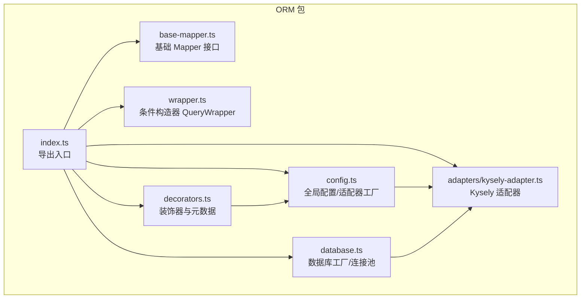
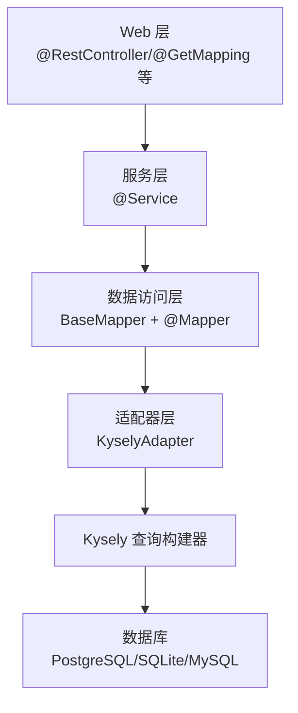
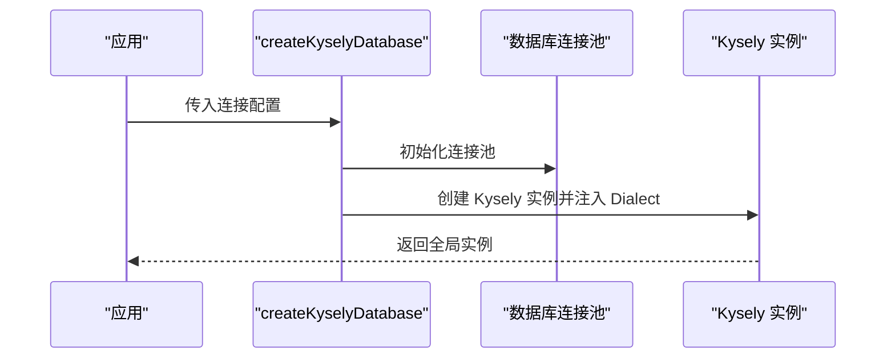
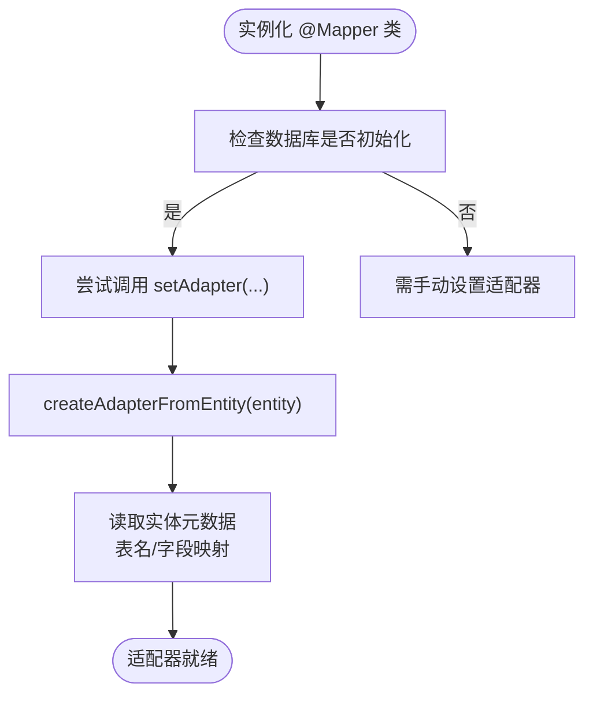
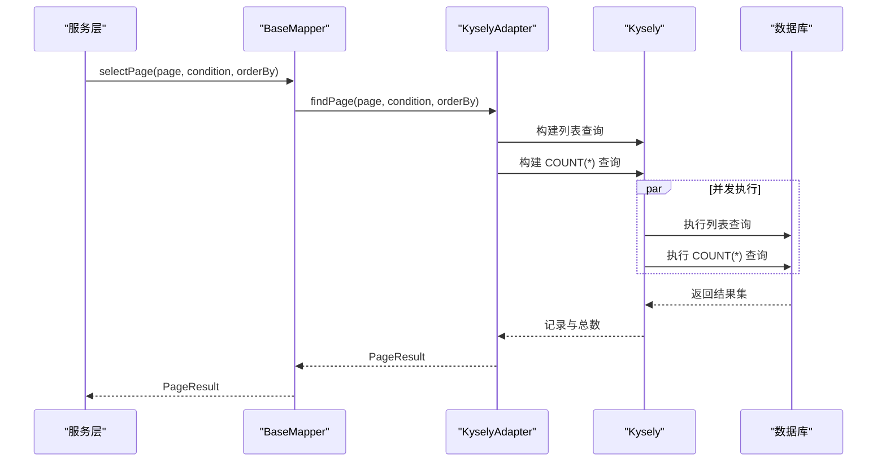
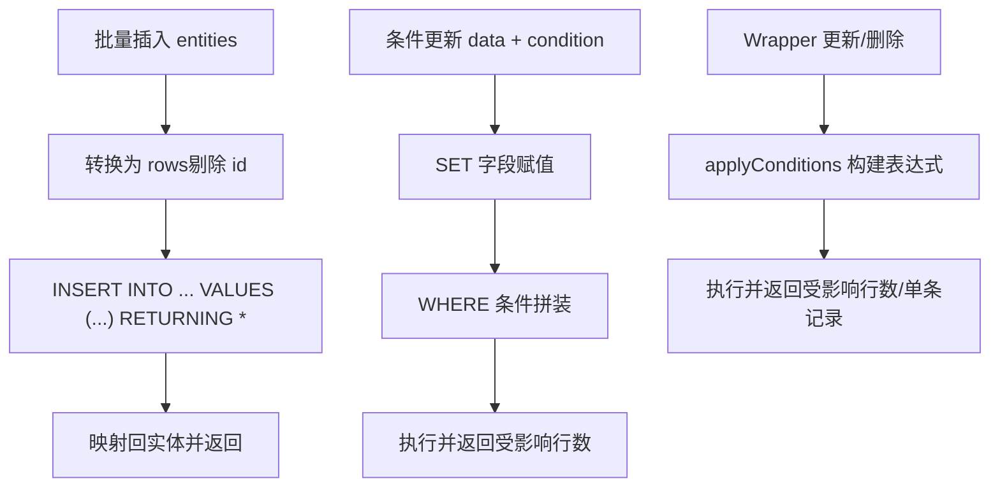
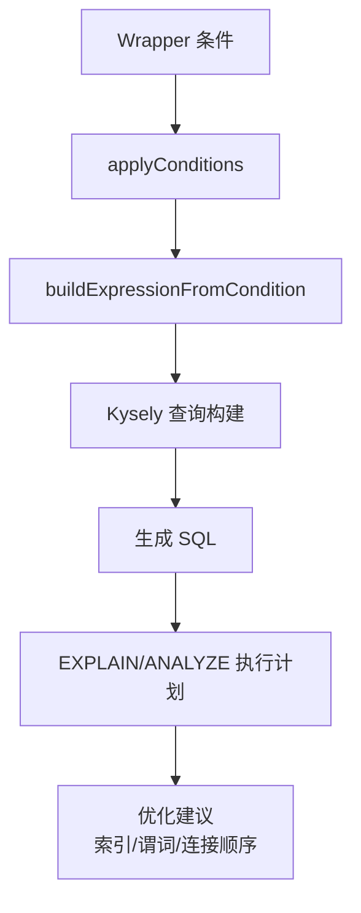
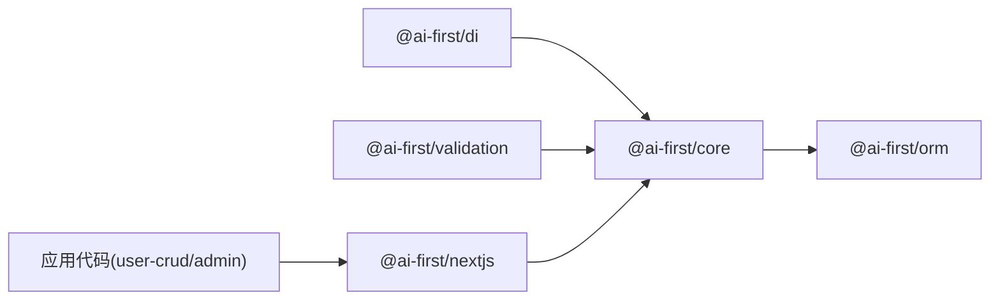

# 性能优化与调优

<cite>
**本文引用的文件**   
- [README.md](file://README.md)
- [packages/orm/src/index.ts](file://packages/orm/src/index.ts)
- [packages/orm/src/config.ts](file://packages/orm/src/config.ts)
- [packages/orm/src/database.ts](file://packages/orm/src/database.ts)
- [packages/orm/src/base-mapper.ts](file://packages/orm/src/base-mapper.ts)
- [packages/orm/src/wrapper.ts](file://packages/orm/src/wrapper.ts)
- [packages/orm/src/adapters/kysely-adapter.ts](file://packages/orm/src/adapters/kysely-adapter.ts)
- [packages/orm/src/decorators.ts](file://packages/orm/src/decorators.ts)
- [packages/orm/examples/user-crud.ts](file://packages/orm/examples/user-crud.ts)
- [packages/orm/examples/test-manual.mjs](file://packages/orm/examples/test-manual.mjs)
- [docs/architecture.md](file://docs/architecture.md)
- [docs/packages.md](file://docs/packages.md)
</cite>

## 目录
1. [简介](#简介)
2. [项目结构](#项目结构)
3. [核心组件](#核心组件)
4. [架构总览](#架构总览)
5. [详细组件分析](#详细组件分析)
6. [依赖分析](#依赖分析)
7. [性能考虑](#性能考虑)
8. [故障排查指南](#故障排查指南)
9. [结论](#结论)
10. [附录](#附录)

## 简介
本指南聚焦于 AI-First Framework 的 ORM 子系统在性能优化与调优方面的最佳实践，围绕以下主题展开：
- 查询性能优化：慢查询分析、执行计划优化、索引策略设计
- 连接池配置与管理：连接数限制、空闲连接回收、连接泄漏防护
- 缓存策略：查询结果缓存、实体缓存、二级缓存配置
- 批量操作优化：批量插入、更新、删除的性能提升技巧
- 内存使用优化：大对象处理、垃圾回收优化、内存泄漏检测
- 数据库层面优化：分区表设计、物化视图使用、查询重写
- 性能监控与诊断：APM 工具集成、性能指标采集、瓶颈识别方法
- 不同规模应用的调优案例与实践

## 项目结构
AI-First Framework 采用 Monorepo 结构，ORM 包位于 packages/orm，提供与 MyBatis-Plus 风格兼容的装饰器与适配器能力，底层基于 Kysely 支持 PostgreSQL、SQLite、MySQL。

图表来源
- [packages/orm/src/index.ts](file://packages/orm/src/index.ts#L1-L72)
- [packages/orm/src/config.ts](file://packages/orm/src/config.ts#L1-L77)
- [packages/orm/src/database.ts](file://packages/orm/src/database.ts#L1-L134)
- [packages/orm/src/base-mapper.ts](file://packages/orm/src/base-mapper.ts#L1-L332)
- [packages/orm/src/wrapper.ts](file://packages/orm/src/wrapper.ts#L1-L359)
- [packages/orm/src/adapters/kysely-adapter.ts](file://packages/orm/src/adapters/kysely-adapter.ts#L1-L427)
- [packages/orm/src/decorators.ts](file://packages/orm/src/decorators.ts#L1-L224)

章节来源
- [README.md](file://README.md#L14-L34)
- [docs/architecture.md](file://docs/architecture.md#L18-L31)
- [docs/packages.md](file://docs/packages.md#L116-L230)

## 核心组件
- 数据库工厂与连接池：统一创建 Kysely 实例，按数据库类型注入 Dialect 与连接池，提供全局实例与关闭能力
- 装饰器与元数据：Entity/TableId/TableField/Mapper 等装饰器用于声明实体与 Mapper，运行时读取元数据并自动装配适配器
- 基础 Mapper：提供标准 CRUD 与分页、统计等方法，屏蔽具体数据库差异
- 条件构造器：QueryWrapper 提供链式条件拼装，支持比较、模糊、范围、NULL 判断、OR/AND 组合、排序、分页、选择字段等
- 适配器：KyselyAdapter 将 MyBatis-Plus 风格 API 转换为 Kysely 查询，支持批量插入、条件更新/删除、Wrapper 查询等

章节来源
- [packages/orm/src/database.ts](file://packages/orm/src/database.ts#L47-L95)
- [packages/orm/src/decorators.ts](file://packages/orm/src/decorators.ts#L140-L193)
- [packages/orm/src/base-mapper.ts](file://packages/orm/src/base-mapper.ts#L54-L301)
- [packages/orm/src/wrapper.ts](file://packages/orm/src/wrapper.ts#L49-L359)
- [packages/orm/src/adapters/kysely-adapter.ts](file://packages/orm/src/adapters/kysely-adapter.ts#L24-L427)

## 架构总览
ORM 层位于 Web 层与数据库之间，通过装饰器与 Mapper 抽象屏蔽底层差异，配合 Kysely 生成高性能 SQL。

图表来源
- [docs/architecture.md](file://docs/architecture.md#L32-L65)
- [packages/orm/src/base-mapper.ts](file://packages/orm/src/base-mapper.ts#L54-L301)
- [packages/orm/src/adapters/kysely-adapter.ts](file://packages/orm/src/adapters/kysely-adapter.ts#L24-L427)
- [packages/orm/src/database.ts](file://packages/orm/src/database.ts#L47-L95)

## 详细组件分析

### 数据库工厂与连接池（性能关键点）
- 支持三种数据库类型：PostgreSQL、SQLite、MySQL
- PostgreSQL 使用 pg.Pool；MySQL 使用 mysql2.createPool；SQLite 使用 BetterSqlite3
- 全局持有 Kysely 实例，避免重复创建开销
- 提供关闭连接的能力，便于优雅停机

图表来源
- [packages/orm/src/database.ts](file://packages/orm/src/database.ts#L47-L95)

章节来源
- [packages/orm/src/database.ts](file://packages/orm/src/database.ts#L47-L134)

### 装饰器与自动适配器装配（减少样板代码）
- @Mapper 装饰器在实例化时尝试自动注入适配器，若数据库已初始化且实例具备 setAdapter，则自动创建适配器
- 通过反射读取 @Entity/@TableId/@TableField 元数据，推断表名与字段映射

图表来源
- [packages/orm/src/decorators.ts](file://packages/orm/src/decorators.ts#L158-L193)
- [packages/orm/src/config.ts](file://packages/orm/src/config.ts#L42-L76)

章节来源
- [packages/orm/src/decorators.ts](file://packages/orm/src/decorators.ts#L140-L193)
- [packages/orm/src/config.ts](file://packages/orm/src/config.ts#L42-L76)

### 基础 Mapper 与条件构造器（查询性能基石）
- BaseMapper 提供 selectList/selectPage/selectCount 等常用方法
- Wrapper 支持复杂条件拼装，最终转换为 Kysely 查询
- 分页查询采用“列表+COUNT(*)”并发执行，减少一次往返

图表来源
- [packages/orm/src/base-mapper.ts](file://packages/orm/src/base-mapper.ts#L117-L128)
- [packages/orm/src/adapters/kysely-adapter.ts](file://packages/orm/src/adapters/kysely-adapter.ts#L123-L157)

章节来源
- [packages/orm/src/base-mapper.ts](file://packages/orm/src/base-mapper.ts#L117-L128)
- [packages/orm/src/adapters/kysely-adapter.ts](file://packages/orm/src/adapters/kysely-adapter.ts#L123-L157)

### 批量操作优化（插入/更新/删除）
- 批量插入：一次性 VALUES 多行，减少网络往返
- 条件更新/删除：将条件转换为 WHERE 子句，避免逐条循环
- Wrapper 更新/删除：支持复杂条件组合，最终转换为 Kysely 表达式

图表来源
- [packages/orm/src/adapters/kysely-adapter.ts](file://packages/orm/src/adapters/kysely-adapter.ts#L340-L354)
- [packages/orm/src/adapters/kysely-adapter.ts](file://packages/orm/src/adapters/kysely-adapter.ts#L376-L390)
- [packages/orm/src/adapters/kysely-adapter.ts](file://packages/orm/src/adapters/kysely-adapter.ts#L224-L244)

章节来源
- [packages/orm/src/adapters/kysely-adapter.ts](file://packages/orm/src/adapters/kysely-adapter.ts#L340-L390)
- [packages/orm/src/adapters/kysely-adapter.ts](file://packages/orm/src/adapters/kysely-adapter.ts#L224-L244)

### 查询条件与执行计划优化（索引与谓词）
- Wrapper 支持比较、LIKE、IN、BETWEEN、IS NULL 等，最终转换为 Kysely 表达式
- 建议：
  - 为高频过滤字段建立合适索引（唯一/普通/复合）
  - 避免在 WHERE 中对列进行函数计算
  - 使用 EXPLAIN/ANALYZE 分析执行计划，关注索引选择率与扫描行数
  - 对高选择性的过滤条件优先放置，减少中间结果集

图表来源
- [packages/orm/src/wrapper.ts](file://packages/orm/src/wrapper.ts#L249-L323)
- [packages/orm/src/adapters/kysely-adapter.ts](file://packages/orm/src/adapters/kysely-adapter.ts#L249-L323)

章节来源
- [packages/orm/src/wrapper.ts](file://packages/orm/src/wrapper.ts#L249-L323)
- [packages/orm/src/adapters/kysely-adapter.ts](file://packages/orm/src/adapters/kysely-adapter.ts#L249-L323)

## 依赖分析
ORM 包与其他子包的依赖关系如下：

图表来源
- [docs/packages.md](file://docs/packages.md#L479-L491)

章节来源
- [docs/packages.md](file://docs/packages.md#L479-L491)

## 性能考虑

### 查询性能优化
- 使用 Wrapper 精准拼装条件，避免全表扫描
- 对高频查询字段建立索引，必要时使用复合索引
- 分页查询使用 LIMIT/OFFSET，避免深分页（大数据量场景建议游标分页）
- 统计查询与列表查询并发执行，减少 RT

章节来源
- [packages/orm/src/adapters/kysely-adapter.ts](file://packages/orm/src/adapters/kysely-adapter.ts#L123-L157)

### 连接池配置与管理
- PostgreSQL：使用 pg.Pool，默认池大小可按 QPS 与并发连接数调整
- MySQL：使用 mysql2.createPool，合理设置连接池容量与超时
- SQLite：BetterSqlite3 为本地文件型，适合开发/测试
- 管理要点：
  - 设置最大连接数上限，防止资源耗尽
  - 合理配置空闲回收与连接超时
  - 应用关闭时调用 destroy/close，避免连接泄漏

章节来源
- [packages/orm/src/database.ts](file://packages/orm/src/database.ts#L53-L87)
- [packages/orm/src/database.ts](file://packages/orm/src/database.ts#L120-L126)

### 缓存策略
- 查询结果缓存：对稳定数据（如字典、配置）启用短期缓存，结合失效策略
- 实体缓存：针对热点实体在服务层做 LRU 缓存，注意缓存一致性
- 二级缓存：根据业务场景评估引入，注意分布式一致性与失效策略
- 注意：ORM 层未内置二级缓存，可在服务层自行实现

章节来源
- [packages/orm/src/base-mapper.ts](file://packages/orm/src/base-mapper.ts#L54-L72)

### 批量操作优化
- 批量插入：使用一次性 VALUES 多行，减少往返
- 批量更新/删除：利用 IN/BETWEEN/条件组合，避免逐条循环
- 注意：批量操作需控制批次大小，避免单次请求过大导致超时或内存压力

章节来源
- [packages/orm/src/adapters/kysely-adapter.ts](file://packages/orm/src/adapters/kysely-adapter.ts#L340-L354)
- [packages/orm/src/adapters/kysely-adapter.ts](file://packages/orm/src/adapters/kysely-adapter.ts#L376-L390)

### 内存使用优化
- 大对象处理：避免一次性加载超大结果集，优先分页或流式处理
- 垃圾回收优化：减少临时对象创建，复用查询条件对象
- 内存泄漏检测：确保连接池与全局实例在应用生命周期内正确释放

章节来源
- [packages/orm/src/database.ts](file://packages/orm/src/database.ts#L120-L126)

### 数据库层面优化
- 分区表：对时间序列数据按月/季分区，提升查询与维护效率
- 物化视图：对复杂聚合查询预先物化，降低实时查询成本
- 查询重写：将频繁使用的复杂查询封装为视图或存储过程，减少重复计算

[本节为通用指导，不直接分析具体文件]

### 性能监控与诊断
- APM 集成：在 Next.js 层面可利用内置性能测量与 OpenTelemetry 能力，对关键路径打点
- 指标采集：记录慢查询阈值、连接池使用率、GC 时间占比、错误率
- 瓶颈识别：结合数据库 EXPLAIN/ANALYZE 与应用埋点，定位热点模块与慢查询

章节来源
- [docs/architecture.md](file://docs/architecture.md#L164-L204)

### 不同规模应用的最佳实践
- 小型应用：单实例数据库 + 适度连接池；重点在于索引与查询优化
- 中型应用：读写分离/只读副本；引入缓存与批量操作
- 大型应用：分库分表/分区表；异步化与限流降载；完善的监控与压测体系

[本节为通用指导，不直接分析具体文件]

## 故障排查指南
- 数据库未初始化：调用 createKyselyDatabase 后再使用 ORM 功能
- 适配器未设置：@Mapper 自动装配失败时需手动 setAdapter
- 连接泄漏：确认应用关闭时调用 closeKyselyDatabase
- 查询异常：使用 EXPLAIN/ANALYZE 分析执行计划，检查索引与谓词

章节来源
- [packages/orm/src/config.ts](file://packages/orm/src/config.ts#L45-L47)
- [packages/orm/src/decorators.ts](file://packages/orm/src/decorators.ts#L164-L172)
- [packages/orm/src/database.ts](file://packages/orm/src/database.ts#L120-L126)

## 结论
AI-First Framework 的 ORM 通过装饰器与适配器抽象，提供了与 MyBatis-Plus 风格一致的开发体验，并以 Kysely 为基础实现高性能查询。结合合理的索引设计、连接池配置、缓存策略与批量操作，可在不同规模应用中获得稳定的性能表现。同时，借助 APM 与数据库执行计划分析，可持续发现并解决性能瓶颈。

## 附录
- 示例工程展示了实体、Mapper、CRUD 与分页的基本用法，可作为性能优化的起点

章节来源
- [packages/orm/examples/user-crud.ts](file://packages/orm/examples/user-crud.ts#L70-L155)
- [packages/orm/examples/test-manual.mjs](file://packages/orm/examples/test-manual.mjs#L29-L87)