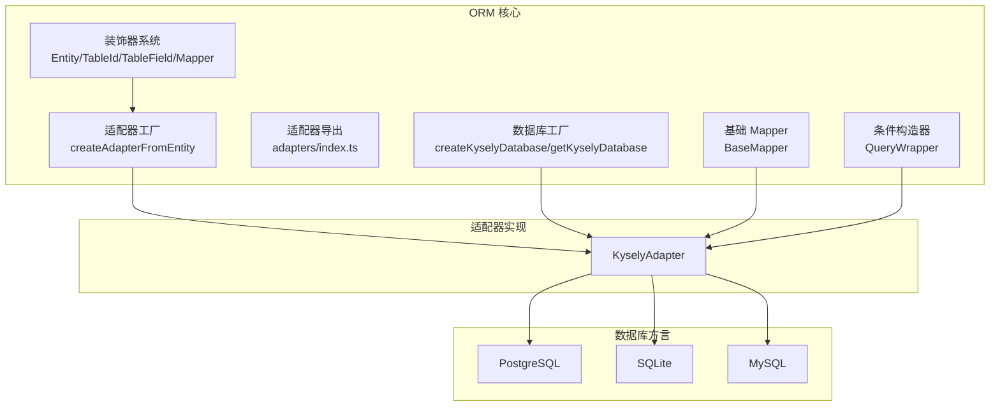
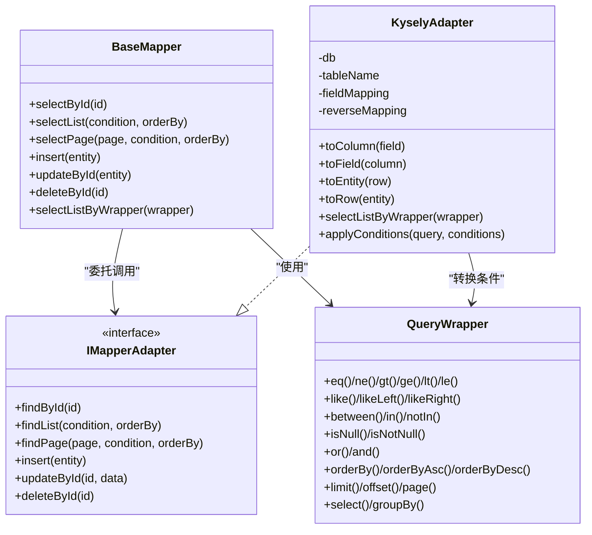
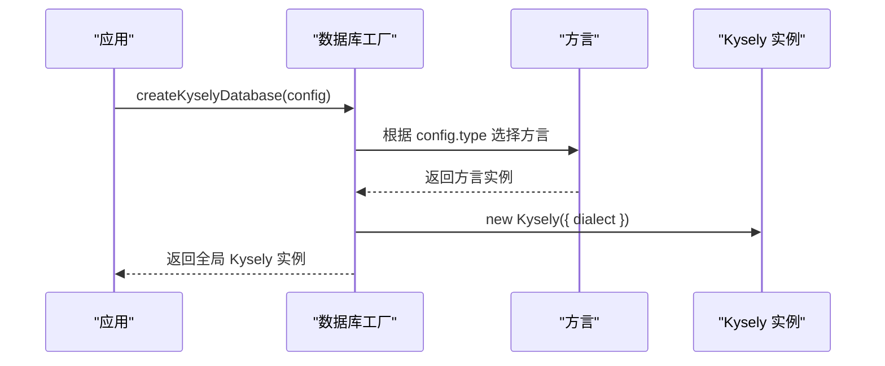
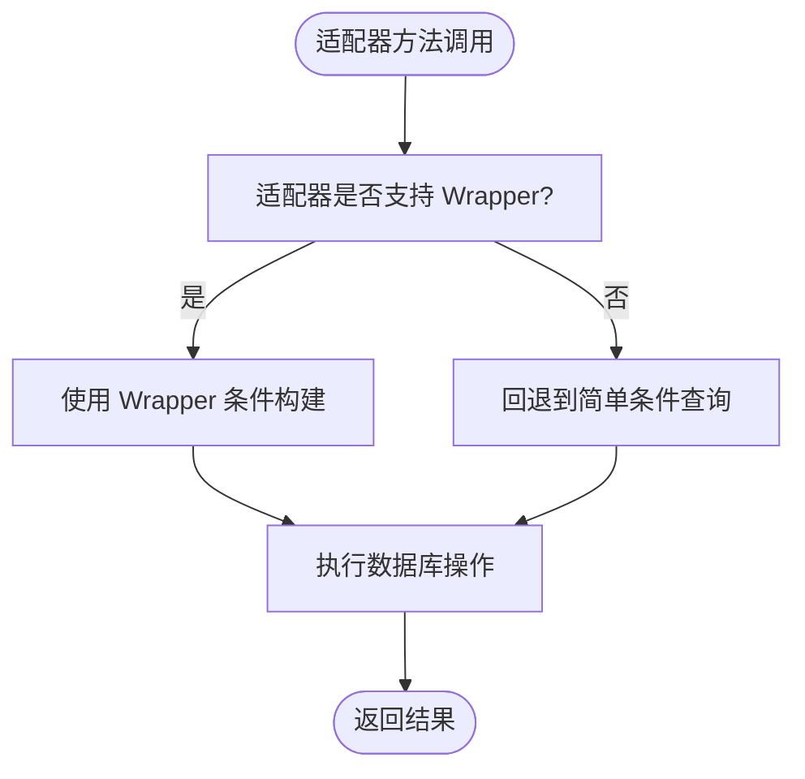
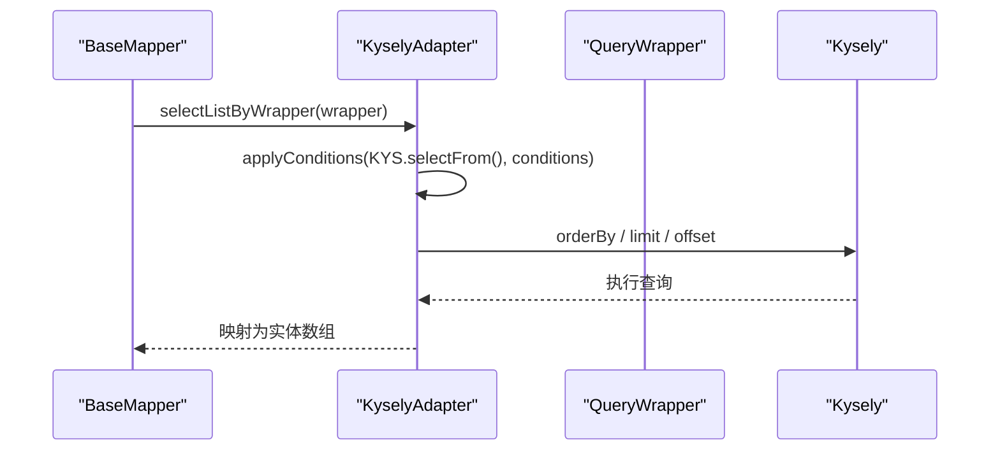
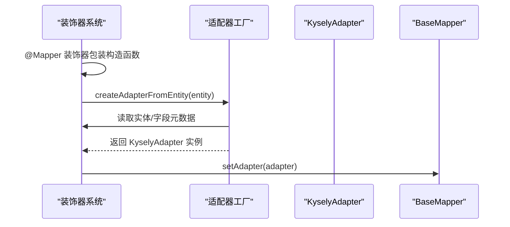
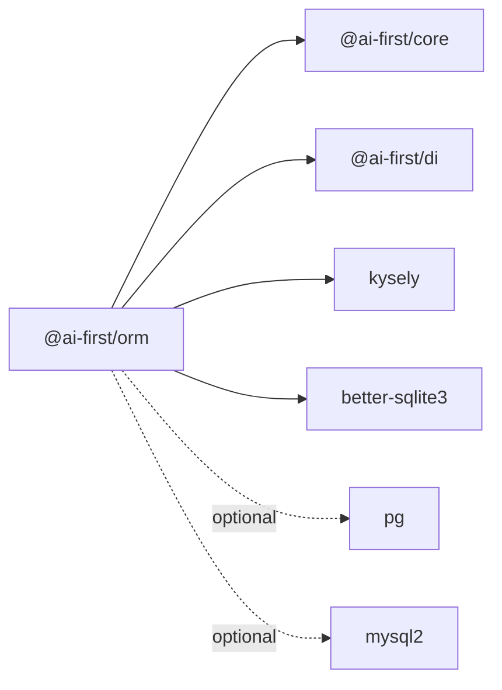

# 数据库适配器扩展

<cite>
**本文引用的文件**
- [packages/orm/src/database.ts](file://packages/orm/src/database.ts)
- [packages/orm/src/adapters/kysely-adapter.ts](file://packages/orm/src/adapters/kysely-adapter.ts)
- [packages/orm/src/adapters/index.ts](file://packages/orm/src/adapters/index.ts)
- [packages/orm/src/base-mapper.ts](file://packages/orm/src/base-mapper.ts)
- [packages/orm/src/decorators.ts](file://packages/orm/src/decorators.ts)
- [packages/orm/src/wrapper.ts](file://packages/orm/src/wrapper.ts)
- [packages/orm/src/config.ts](file://packages/orm/src/config.ts)
- [packages/orm/package.json](file://packages/orm/package.json)
- [packages/orm/examples/user-crud.ts](file://packages/orm/examples/user-crud.ts)
- [packages/orm/examples/test-manual.mjs](file://packages/orm/examples/test-manual.mjs)
- [README.md](file://README.md)
- [docs/packages.md](file://docs/packages.md)
</cite>

## 目录
1. [简介](#简介)
2. [项目结构](#项目结构)
3. [核心组件](#核心组件)
4. [架构总览](#架构总览)
5. [详细组件分析](#详细组件分析)
6. [依赖关系分析](#依赖关系分析)
7. [性能考虑](#性能考虑)
8. [故障排除指南](#故障排除指南)
9. [结论](#结论)
10. [附录](#附录)

## 简介
本文件面向希望在 AI-First Framework 中扩展数据库适配器的开发者，系统阐述如何创建自定义数据库适配器、适配器接口规范、数据库方言支持与连接管理策略。文档同时解析现有适配器（KyselyAdapter）的实现原理，说明适配器注册机制、工厂模式与运行时适配器选择策略，并提供完整的自定义适配器开发指南，涵盖 SQL 方言转换、类型映射、事务处理与错误处理。最后给出性能优化建议与企业级功能扩展思路（读写分离、分库分表、多租户）。

## 项目结构
AI-First Framework 的 ORM 子系统位于 packages/orm，核心模块包括：
- 数据库连接工厂：负责创建与管理 Kysely 实例，支持 PostgreSQL、SQLite、MySQL
- 适配器层：将 BaseMapper 的调用转换为具体数据库方言的查询
- 基础 Mapper：提供与 MyBatis-Plus 风格一致的 CRUD API
- 装饰器系统：通过反射元数据驱动实体与 Mapper 的自动装配
- 条件构造器：QueryWrapper 提供链式条件构建能力

**图表来源**
- [packages/orm/src/database.ts](file://packages/orm/src/database.ts#L47-L95)
- [packages/orm/src/adapters/index.ts](file://packages/orm/src/adapters/index.ts#L1-L1)
- [packages/orm/src/base-mapper.ts](file://packages/orm/src/base-mapper.ts#L54-L331)
- [packages/orm/src/decorators.ts](file://packages/orm/src/decorators.ts#L140-L193)
- [packages/orm/src/wrapper.ts](file://packages/orm/src/wrapper.ts#L49-L359)
- [packages/orm/src/config.ts](file://packages/orm/src/config.ts#L42-L76)

**章节来源**
- [README.md](file://README.md#L59-L67)
- [packages/orm/package.json](file://packages/orm/package.json#L23-L44)

## 核心组件
- 数据库工厂：统一创建 Kysely 实例，按配置类型选择不同方言（PostgresDialect/SqliteDialect/MysqlDialect），并提供全局实例与关闭能力
- 适配器接口：IMapperAdapter 定义了查询、插入、更新、删除等方法，适配器需实现这些方法以对接具体数据库
- 基础 Mapper：封装 CRUD API，内部委托给适配器执行；对 QueryWrapper 提供适配器回退策略
- 装饰器系统：Entity/TableId/TableField/Mapper 通过 reflect-metadata 注入元数据，@Mapper 装饰器在实例化时自动设置适配器
- 适配器工厂：根据实体元数据自动创建 KyselyAdapter，支持字段映射与表名推断

**章节来源**
- [packages/orm/src/database.ts](file://packages/orm/src/database.ts#L47-L133)
- [packages/orm/src/base-mapper.ts](file://packages/orm/src/base-mapper.ts#L310-L331)
- [packages/orm/src/decorators.ts](file://packages/orm/src/decorators.ts#L140-L193)
- [packages/orm/src/config.ts](file://packages/orm/src/config.ts#L42-L76)

## 架构总览
下图展示 ORM 适配器扩展的整体架构：上层通过 BaseMapper 调用，中间层由适配器实现具体数据库操作，底层通过数据库工厂创建的 Kysely 实例与方言交互。

**图表来源**
- [packages/orm/src/base-mapper.ts](file://packages/orm/src/base-mapper.ts#L54-L331)
- [packages/orm/src/adapters/kysely-adapter.ts](file://packages/orm/src/adapters/kysely-adapter.ts#L24-L427)
- [packages/orm/src/wrapper.ts](file://packages/orm/src/wrapper.ts#L49-L359)

## 详细组件分析

### 数据库工厂与连接管理
- 支持数据库类型：postgres、sqlite、mysql
- 运行时根据配置动态导入对应驱动并创建连接池
- 提供全局 Kysely 实例缓存、配置获取与销毁能力
- 初始化检查：isDatabaseInitialized 用于装饰器自动装配前的前置校验

**图表来源**
- [packages/orm/src/database.ts](file://packages/orm/src/database.ts#L47-L95)

**章节来源**
- [packages/orm/src/database.ts](file://packages/orm/src/database.ts#L47-L133)

### 适配器接口规范
- 基础 CRUD：findById/findList/findPage/count、insert/insertBatch、updateById/updateByCondition、deleteById/deleteByIds/deleteByCondition
- 扩展能力：selectListByWrapper/selectOneByWrapper/selectCountByWrapper/updateByWrapper/deleteByWrapper
- 回退策略：当适配器不支持 Wrapper 时，BaseMapper 提供降级行为（如回退到简单查询）

**图表来源**
- [packages/orm/src/base-mapper.ts](file://packages/orm/src/base-mapper.ts#L217-L300)

**章节来源**
- [packages/orm/src/base-mapper.ts](file://packages/orm/src/base-mapper.ts#L310-L331)
- [packages/orm/src/base-mapper.ts](file://packages/orm/src/base-mapper.ts#L217-L300)

### KyselyAdapter 实现原理
- 字段映射：支持 TypeScript 字段名到数据库列名的双向映射，自动转换实体与行记录
- 条件转换：将 QueryWrapper 的条件树转换为 Kysely 查询表达式，支持比较、范围、集合、空值判断与逻辑组合
- 分页与统计：并行执行查询与计数，避免重复扫描
- 批量操作：insertBatch 批量插入并返回完整实体集

**图表来源**
- [packages/orm/src/adapters/kysely-adapter.ts](file://packages/orm/src/adapters/kysely-adapter.ts#L177-L200)
- [packages/orm/src/wrapper.ts](file://packages/orm/src/wrapper.ts#L49-L359)

**章节来源**
- [packages/orm/src/adapters/kysely-adapter.ts](file://packages/orm/src/adapters/kysely-adapter.ts#L24-L427)

### 装饰器与自动适配器装配
- @Mapper 装饰器在构造函数包装中检测数据库是否已初始化，若满足条件则自动创建适配器并注入
- createAdapterFromEntity 从实体元数据推断表名与字段映射，创建 KyselyAdapter
- getEntityMetadata/getTableFieldMetadata/getTableIdMetadata 提供反射读取能力

**图表来源**
- [packages/orm/src/decorators.ts](file://packages/orm/src/decorators.ts#L140-L193)
- [packages/orm/src/config.ts](file://packages/orm/src/config.ts#L42-L76)

**章节来源**
- [packages/orm/src/decorators.ts](file://packages/orm/src/decorators.ts#L140-L193)
- [packages/orm/src/config.ts](file://packages/orm/src/config.ts#L42-L76)

### 条件构造器 QueryWrapper
- 提供与 MyBatis-Plus 一致的链式 API：eq/ne/gt/ge/lt/le、like/likeLeft/likeRight、between/in/notIn、isNull/isNotNull、or/and、orderBy、limit/offset/page、select/groupBy
- 内部以条件树形式存储，最终由适配器转换为 SQL

**章节来源**
- [packages/orm/src/wrapper.ts](file://packages/orm/src/wrapper.ts#L49-L359)

## 依赖关系分析
- ORM 包依赖：
  - @ai-first/core、@ai-first/di：核心装饰器与依赖注入
  - kysely：SQL 查询构建器
  - better-sqlite3：SQLite 驱动
  - pg/mysql2：PostgreSQL/MySQL 驱动（可选，peerDependencies）
- 运行时依赖：reflect-metadata 提供装饰器元数据支持

**图表来源**
- [packages/orm/package.json](file://packages/orm/package.json#L23-L44)

**章节来源**
- [packages/orm/package.json](file://packages/orm/package.json#L23-L44)

## 性能考虑
- 连接池配置：PostgreSQL/MySQL 使用连接池，合理设置最大连接数、空闲超时与重试策略
- 并行查询：分页场景中查询与计数并行执行，减少往返时间
- 批量操作：insertBatch 一次性提交多个插入，降低网络开销
- 字段映射缓存：KyselyAdapter 内部维护字段映射与反向映射，避免重复计算
- 查询缓存：可在适配器层引入轻量缓存（如 LRU），针对热点查询进行缓存（需结合业务场景评估失效策略）

[本节为通用性能建议，不直接分析具体文件]

## 故障排除指南
- 数据库未初始化：在使用装饰器自动装配前必须先调用 createKyselyDatabase，否则会抛出异常
- 适配器未设置：BaseMapper 在未设置适配器时会抛出错误，确保通过 @Mapper 或手动 setAdapter 设置
- Wrapper 不支持：部分适配器可能未实现 Wrapper 特定方法，BaseMapper 会抛出错误或回退到简单查询
- 字段映射错误：确认实体字段与数据库列名映射正确，避免查询结果字段缺失或错位

**章节来源**
- [packages/orm/src/config.ts](file://packages/orm/src/config.ts#L42-L47)
- [packages/orm/src/base-mapper.ts](file://packages/orm/src/base-mapper.ts#L67-L72)
- [packages/orm/src/base-mapper.ts](file://packages/orm/src/base-mapper.ts#L276-L282)

## 结论
AI-First Framework 的 ORM 通过“基础 Mapper + 适配器 + 数据库工厂”的分层架构，实现了对多种数据库的统一抽象与扩展。现有 KyselyAdapter 已覆盖常见 CRUD 与复杂条件查询，并提供自动适配器装配与类型安全的条件构造器。开发者可据此扩展新的适配器，实现企业级功能（读写分离、分库分表、多租户）与性能优化。

[本节为总结性内容，不直接分析具体文件]

## 附录

### 自定义适配器开发指南
- 实现 IMapperAdapter 接口：至少实现基础 CRUD 与扩展方法（如 selectListByWrapper）
- 字段映射：提供 TypeScript 字段名到数据库列名的双向映射，确保实体与行记录转换正确
- 条件转换：参考 KyselyAdapter 的 applyConditions 与 buildExpressionFromCondition，将 QueryWrapper 条件树转换为具体数据库方言表达式
- 事务处理：在适配器层封装事务边界，确保更新/删除操作的一致性
- 错误处理：捕获数据库异常并转换为统一的业务异常，便于上层处理
- 性能优化：利用连接池、并行查询与批量操作提升吞吐量

**章节来源**
- [packages/orm/src/base-mapper.ts](file://packages/orm/src/base-mapper.ts#L310-L331)
- [packages/orm/src/adapters/kysely-adapter.ts](file://packages/orm/src/adapters/kysely-adapter.ts#L249-L323)

### 企业级功能扩展思路
- 读写分离：在适配器层区分读写连接，查询走从库，写入走主库
- 分库分表：根据路由规则选择数据库与表，适配器内部实现路由与 SQL 改写
- 多租户：在适配器层自动注入租户过滤条件，确保数据隔离

[本节为概念性扩展建议，不直接分析具体文件]

### 示例参考
- 用户 CRUD 示例展示了实体定义、Mapper 使用与 InMemoryAdapter 的手动装配方式
- 手动测试示例演示了通过装饰器语法与反射元数据驱动的 ORM 使用流程

**章节来源**
- [packages/orm/examples/user-crud.ts](file://packages/orm/examples/user-crud.ts#L70-L155)
- [packages/orm/examples/test-manual.mjs](file://packages/orm/examples/test-manual.mjs#L29-L65)