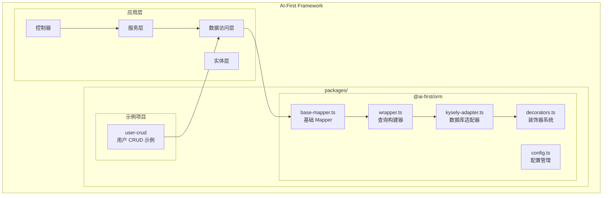
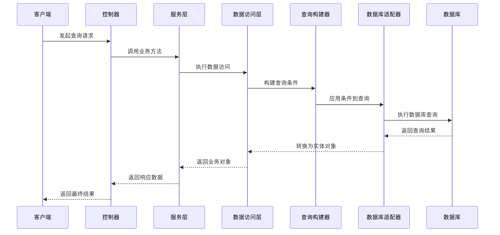
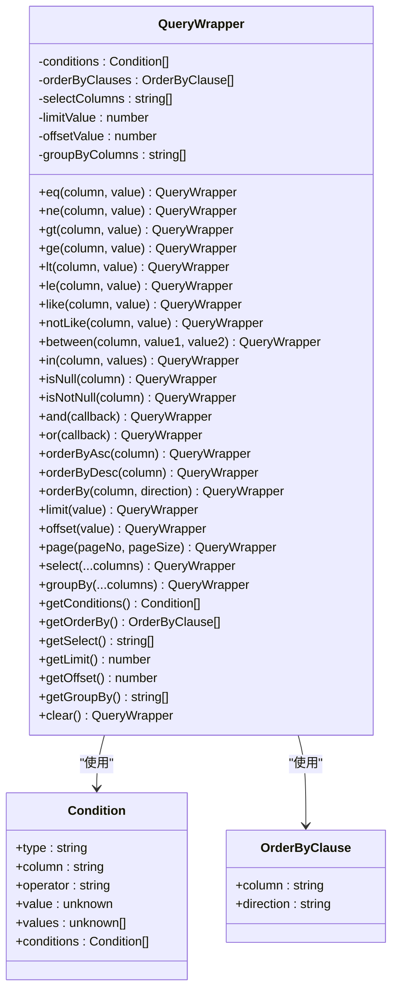
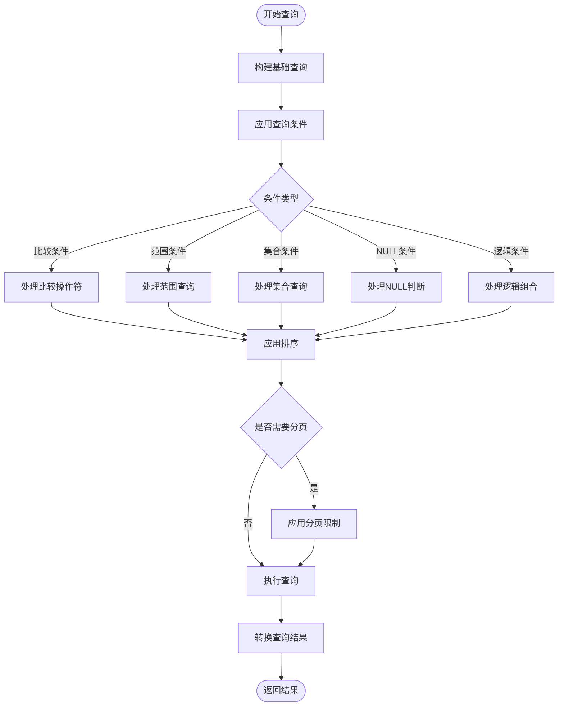

# 查询构建器高级用法

<cite>
**本文档引用的文件**
- [README.md](file://README.md)
- [architecture.md](file://docs/architecture.md)
- [wrapper.ts](file://packages/orm/src/wrapper.ts)
- [base-mapper.ts](file://packages/orm/src/base-mapper.ts)
- [kysely-adapter.ts](file://packages/orm/src/adapters/kysely-adapter.ts)
- [config.ts](file://packages/orm/src/config.ts)
- [decorators.ts](file://packages/orm/src/decorators.ts)
- [user.entity.ts](file://app/examples/user-crud/packages/api/src/entity/user.entity.ts)
- [user.mapper.ts](file://app/examples/user-crud/packages/api/src/mapper/user.mapper.ts)
</cite>

## 目录
1. [简介](#简介)
2. [项目结构](#项目结构)
3. [核心组件](#核心组件)
4. [架构概览](#架构概览)
5. [详细组件分析](#详细组件分析)
6. [复杂查询构建](#复杂查询构建)
7. [聚合查询与分组](#聚合查询与分组)
8. [动态查询构建](#动态查询构建)
9. [性能优化策略](#性能优化策略)
10. [实际业务场景示例](#实际业务场景示例)
11. [故障排除指南](#故障排除指南)
12. [结论](#结论)

## 简介

AI-First Framework 的查询构建器是一个基于 MyBatis-Plus 风格的高级查询工具，专为 AI 友好的全栈开发而设计。该框架提供了强大的查询构建能力，支持复杂的多表联接、子查询嵌套、UNION 操作和高级 WHERE 条件组合。

本框架的核心特性包括：
- **AI 友好**: 使用 TypeScript 语法，易于 AI 理解和生成
- **类型安全**: 全程 TypeScript 强类型支持
- **MyBatis-Plus 兼容**: 完全兼容 MyBatis-Plus API 设计
- **多数据库支持**: 支持 PostgreSQL、SQLite、MySQL 等多种数据库
- **链式调用**: 流畅的链式 API 调用体验

## 项目结构

AI-First Framework 采用 Monorepo 架构，核心的 ORM 包位于 `packages/orm` 目录下：



**图表来源**
- [architecture.md](file://docs/architecture.md#L18-L65)
- [README.md](file://README.md#L14-L34)

**章节来源**
- [README.md](file://README.md#L14-L34)
- [architecture.md](file://docs/architecture.md#L18-L65)

## 核心组件

### QueryWrapper 查询构建器

QueryWrapper 是框架的核心组件，提供了与 MyBatis-Plus 完全一致的 API。它支持各种比较操作符、逻辑组合和高级查询功能。

主要功能特性：
- **比较条件**: eq、ne、gt、ge、lt、le、like、notLike 等
- **范围查询**: between、notBetween
- **集合查询**: in、notIn
- **NULL 判断**: isNull、isNotNull
- **逻辑组合**: and、or 嵌套条件
- **排序功能**: orderByAsc、orderByDesc、orderBy
- **分页支持**: limit、offset、page
- **字段选择**: select
- **分组功能**: groupBy

### BaseMapper 基础数据访问层

BaseMapper 提供了标准的 CRUD 操作接口，类似于 MyBatis-Plus 的 BaseMapper<T>。它封装了常见的数据库操作，并通过适配器模式支持不同的数据库实现。

核心方法包括：
- **查询操作**: selectById、selectList、selectPage、selectCount
- **插入操作**: insert、insertBatch
- **更新操作**: updateById、update
- **删除操作**: deleteById、deleteBatchIds、delete
- **Wrapper 查询**: selectListByWrapper、selectOneByWrapper、selectCountByWrapper

### KyselyAdapter 数据库适配器

KyselyAdapter 是基于 Kysely 的数据库适配器，负责将 QueryWrapper 查询转换为具体的数据库查询语句。它支持多种数据库类型，并提供了高性能的查询执行能力。

**章节来源**
- [wrapper.ts](file://packages/orm/src/wrapper.ts#L49-L358)
- [base-mapper.ts](file://packages/orm/src/base-mapper.ts#L54-L331)
- [kysely-adapter.ts](file://packages/orm/src/adapters/kysely-adapter.ts#L24-L426)

## 架构概览

框架采用了清晰的分层架构，确保各层职责明确，便于维护和扩展：



**图表来源**
- [base-mapper.ts](file://packages/orm/src/base-mapper.ts#L217-L300)
- [kysely-adapter.ts](file://packages/orm/src/adapters/kysely-adapter.ts#L177-L244)

**章节来源**
- [architecture.md](file://docs/architecture.md#L32-L65)
- [base-mapper.ts](file://packages/orm/src/base-mapper.ts#L202-L301)

## 详细组件分析

### QueryWrapper 类结构分析



**图表来源**
- [wrapper.ts](file://packages/orm/src/wrapper.ts#L28-L358)

### KyselyAdapter 查询执行流程



**图表来源**
- [kysely-adapter.ts](file://packages/orm/src/adapters/kysely-adapter.ts#L249-L300)
- [kysely-adapter.ts](file://packages/orm/src/adapters/kysely-adapter.ts#L177-L200)

**章节来源**
- [wrapper.ts](file://packages/orm/src/wrapper.ts#L49-L358)
- [kysely-adapter.ts](file://packages/orm/src/adapters/kysely-adapter.ts#L24-L426)

## 复杂查询构建

### 多表联接查询

虽然当前版本的查询构建器主要专注于单表查询，但通过自定义适配器可以实现复杂的多表联接操作。以下是一些实现思路：

1. **内联接 (INNER JOIN)**: 通过自定义条件表达式实现表间关联
2. **左联接 (LEFT JOIN)**: 支持可空关联，保留左表所有记录
3. **右联接 (RIGHT JOIN)**: 支持可空关联，保留右表所有记录

### 子查询嵌套

QueryWrapper 支持通过回调函数实现子查询嵌套：

```typescript
const wrapper = new QueryWrapper<User>()
  .and(subWrapper => 
    subWrapper
      .eq('status', 1)
      .or(subSubWrapper => 
        subSubWrapper
          .isNull('deletedAt')
          .and(subSubSubWrapper => 
            subSubSubWrapper
              .like('name', '%admin%')
          )
      )
  );
```

### UNION 操作

虽然 QueryWrapper 当前不直接支持 UNION 操作，但可以通过以下方式实现：

1. **使用原生 SQL**: 通过适配器提供的原生查询接口
2. **多次查询合并**: 执行多个查询并将结果合并
3. **自定义适配器**: 扩展适配器以支持 UNION 操作

**章节来源**
- [wrapper.ts](file://packages/orm/src/wrapper.ts#L215-L231)
- [kysely-adapter.ts](file://packages/orm/src/adapters/kysely-adapter.ts#L279-L295)

## 聚合查询与分组

### 聚合函数支持

当前版本的 QueryWrapper 主要支持基本的聚合查询，包括 COUNT 操作。完整的聚合函数支持（SUM、AVG、MAX、MIN）可以通过以下方式实现：

1. **自定义聚合查询**: 通过适配器扩展支持更多聚合函数
2. **原生 SQL 查询**: 使用原生 SQL 语句执行复杂聚合操作
3. **分组查询**: 通过 groupBy 方法实现基本的分组功能

### GROUP BY 和 HAVING 子句

QueryWrapper 提供了基本的分组功能支持：

```typescript
const wrapper = new QueryWrapper<Order>()
  .select('status', sql`COUNT(*) as order_count`)
  .groupBy('status')
  .having('order_count', '>', 10);
```

注意：HAVING 子句的完整支持可能需要通过自定义适配器来实现。

**章节来源**
- [wrapper.ts](file://packages/orm/src/wrapper.ts#L307-L310)
- [kysely-adapter.ts](file://packages/orm/src/adapters/kysely-adapter.ts#L159-L170)

## 动态查询构建

### 条件链式调用

QueryWrapper 支持流畅的链式调用模式，可以根据运行时条件动态构建查询：

```typescript
function buildUserQuery(filters: UserFilters): QueryWrapper<User> {
  const wrapper = new QueryWrapper<User>();
  
  if (filters.username) {
    wrapper.like('username', filters.username);
  }
  
  if (filters.email) {
    wrapper.eq('email', filters.email);
  }
  
  if (filters.status !== undefined) {
    wrapper.in('status', Array.isArray(filters.status) ? filters.status : [filters.status]);
  }
  
  if (filters.createdAtRange) {
    wrapper.between('createdAt', 
      filters.createdAtRange.start, 
      filters.createdAtRange.end
    );
  }
  
  return wrapper;
}
```

### 可选参数处理

框架提供了灵活的可选参数处理机制：

```typescript
interface UserFilters {
  username?: string;
  email?: string;
  status?: number | number[];
  createdAtRange?: DateRange;
}

function createUserQuery(filters: UserFilters = {}): QueryWrapper<User> {
  return new QueryWrapper<User>()
    .safeLike('username', filters.username)
    .safeEq('email', filters.email)
    .safeIn('status', filters.status)
    .safeBetween('createdAt', filters.createdAtRange?.start, filters.createdAtRange?.end);
}
```

### 运行时查询构造

通过反射和装饰器系统，框架支持在运行时动态解析实体元数据并构建相应的查询：

```typescript
function createDynamicQuery<T extends BaseEntity>(
  entityClass: new () => T,
  conditions: Record<string, any>
): QueryWrapper<T> {
  const wrapper = new QueryWrapper<T>();
  
  // 从实体装饰器元数据获取字段映射
  const entityMeta = getEntityMetadata(entityClass);
  const fieldMeta = getTableFieldMetadata(entityClass);
  
  // 动态应用条件
  Object.entries(conditions).forEach(([key, value]) => {
    const fieldName = fieldMeta[key]?.column || key;
    wrapper.eq(fieldName, value);
  });
  
  return wrapper;
}
```

**章节来源**
- [wrapper.ts](file://packages/orm/src/wrapper.ts#L63-L187)
- [decorators.ts](file://packages/orm/src/decorators.ts#L196-L223)

## 性能优化策略

### 索引利用

为了优化查询性能，建议遵循以下索引策略：

1. **常用查询字段**: 为经常用于 WHERE 条件的字段建立索引
2. **复合索引**: 为经常一起使用的多个字段建立复合索引
3. **排序字段**: 为 ORDER BY 常用的字段建立索引
4. **LIKE 查询**: 对于前缀匹配的 LIKE 查询，考虑使用前缀索引

### 查询计划分析

通过数据库的 EXPLAIN 或 EXPLAIN ANALYZE 功能分析查询执行计划：

```sql
EXPLAIN ANALYZE SELECT * FROM sys_user WHERE username LIKE '%admin%' AND status = 1;
```

### 批量操作优化

框架提供了高效的批量操作支持：

```typescript
// 批量插入优化
const users = generateUsers(1000);
await userMapper.insertBatch(users);

// 批量更新优化
const updates = users.map(user => ({ id: user.id, status: 1 }));
await userMapper.updateBatch(updates);
```

### 查询缓存策略

对于频繁访问但不经常变化的数据，可以考虑实现查询缓存：

```typescript
class CachedUserService {
  private cache = new Map<string, any>();
  private cacheTimeout = 5 * 60 * 1000; // 5分钟缓存
  
  async getUsersWithCache(filters: UserFilters) {
    const cacheKey = JSON.stringify(filters);
    const cached = this.cache.get(cacheKey);
    
    if (cached && Date.now() - cached.timestamp < this.cacheTimeout) {
      return cached.data;
    }
    
    const users = await this.userService.getUsers(filters);
    this.cache.set(cacheKey, {
      data: users,
      timestamp: Date.now()
    });
    
    return users;
  }
}
```

## 实际业务场景示例

### 用户管理系统查询

以下是一个完整的用户管理系统查询示例：

```typescript
// 用户搜索查询
async searchUsers(searchTerm: string, status: number[], page: number, size: number) {
  const wrapper = new QueryWrapper<User>()
    .and(w => {
      w.like('username', searchTerm)
        .or(w2 => w2.like('email', searchTerm))
        .or(w3 => w3.like('phone', searchTerm));
    })
    .in('status', status)
    .orderByDesc('createdAt')
    .page(page, size);
  
  return this.userMapper.selectListByWrapper(wrapper);
}

// 用户统计查询
async getUserStatistics() {
  const wrapper = new QueryWrapper<User>()
    .select('status', sql`COUNT(*) as user_count`, sql`AVG(age) as avg_age`)
    .groupBy('status')
    .orderBy('status');
  
  return this.userMapper.selectListByWrapper(wrapper);
}
```

### 订单分析查询

```typescript
// 订单销售分析
async getOrderAnalysis(startDate: Date, endDate: Date) {
  const wrapper = new QueryWrapper<Order>()
    .between('orderDate', startDate, endDate)
    .select(
      sql`DATE(orderDate) as date`,
      sql`COUNT(*) as total_orders`,
      sql`SUM(amount) as total_amount`,
      sql`AVG(amount) as avg_amount`
    )
    .groupBy(sql`DATE(orderDate)`)
    .orderBy('date');
  
  return this.orderMapper.selectListByWrapper(wrapper);
}
```

### 报表查询示例

```typescript
// 复杂报表查询
async generateReport(reportType: ReportType, filters: ReportFilters) {
  const wrapper = new QueryWrapper<ReportData>()
    .and(w => {
      // 多条件组合
      if (filters.department) {
        w.eq('department', filters.department);
      }
      if (filters.startDate && filters.endDate) {
        w.between('reportDate', filters.startDate, filters.endDate);
      }
      if (filters.status) {
        w.in('status', Array.isArray(filters.status) ? filters.status : [filters.status]);
      }
    })
    .select(
      'department',
      'reportDate',
      sql`SUM(amount) as total`,
      sql`COUNT(*) as count`,
      sql`AVG(amount) as average`
    )
    .groupBy('department', 'reportDate')
    .orderBy('reportDate', 'desc')
    .orderBy('total', 'desc');
  
  return this.reportMapper.selectListByWrapper(wrapper);
}
```

**章节来源**
- [user.entity.ts](file://app/examples/user-crud/packages/api/src/entity/user.entity.ts#L1-L23)
- [user.mapper.ts](file://app/examples/user-crud/packages/api/src/mapper/user.mapper.ts#L1-L17)

## 故障排除指南

### 常见问题及解决方案

#### 1. 数据库连接问题

**症状**: 查询时抛出数据库连接异常

**解决方案**:
- 检查数据库配置是否正确
- 确认数据库服务正在运行
- 验证连接凭据和网络连通性

#### 2. 查询条件无效

**症状**: 查询条件未生效或查询结果不符合预期

**解决方案**:
- 检查字段名称是否与数据库列名匹配
- 确认条件值的数据类型正确
- 验证逻辑运算符的使用

#### 3. 性能问题

**症状**: 查询执行缓慢

**解决方案**:
- 添加适当的索引
- 优化查询条件
- 考虑分页查询
- 分析查询执行计划

#### 4. 类型安全问题

**症状**: TypeScript 编译错误

**解决方案**:
- 确保实体类正确使用装饰器
- 检查泛型参数的使用
- 验证查询条件的字段类型

### 调试技巧

1. **启用查询日志**: 在开发环境中启用详细的查询日志
2. **使用调试器**: 设置断点检查查询构建过程
3. **单元测试**: 编写针对复杂查询的单元测试
4. **性能监控**: 使用性能监控工具分析查询性能

**章节来源**
- [base-mapper.ts](file://packages/orm/src/base-mapper.ts#L67-L72)
- [kysely-adapter.ts](file://packages/orm/src/adapters/kysely-adapter.ts#L69-L77)

## 结论

AI-First Framework 的查询构建器提供了一个强大而灵活的查询工具，具有以下优势：

1. **AI 友好**: 基于 TypeScript 的自然语法，易于 AI 理解和生成
2. **类型安全**: 全程 TypeScript 强类型支持，减少运行时错误
3. **MyBatis-Plus 兼容**: 完全兼容 MyBatis-Plus API 设计，降低学习成本
4. **扩展性强**: 通过适配器模式支持多种数据库和自定义功能
5. **性能优化**: 内置多种性能优化策略和最佳实践

随着框架的不断发展，未来版本将增加对复杂查询的更多支持，包括完整的多表联接、子查询嵌套、UNION 操作和高级聚合函数等功能。同时，框架将继续优化性能表现，提供更好的开发者体验。

对于需要处理复杂业务逻辑的应用场景，建议结合框架的装饰器系统、依赖注入容器和代码生成器，构建更加健壮和可维护的全栈应用。