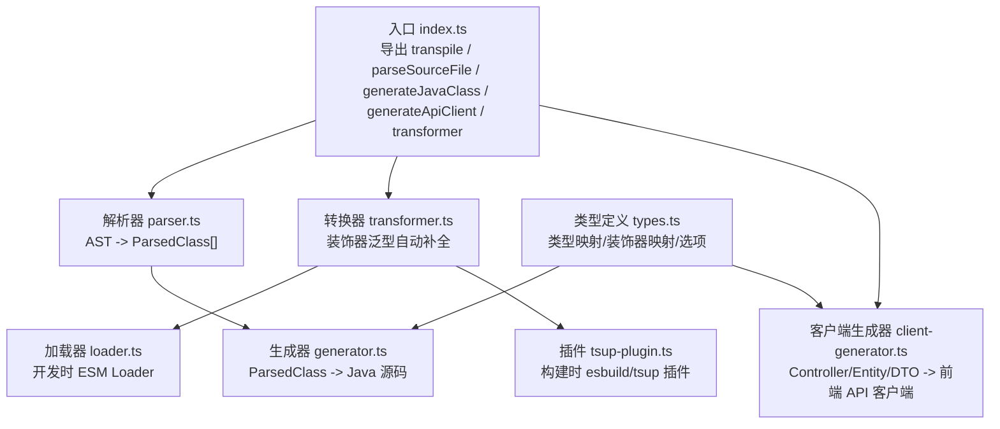
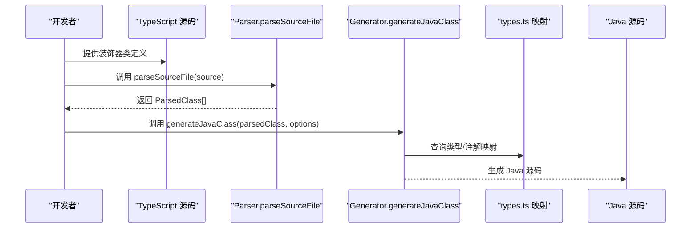
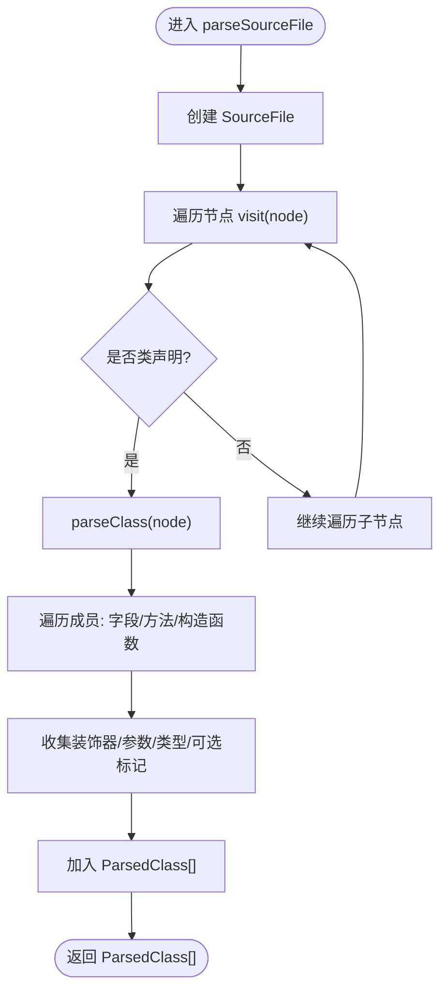
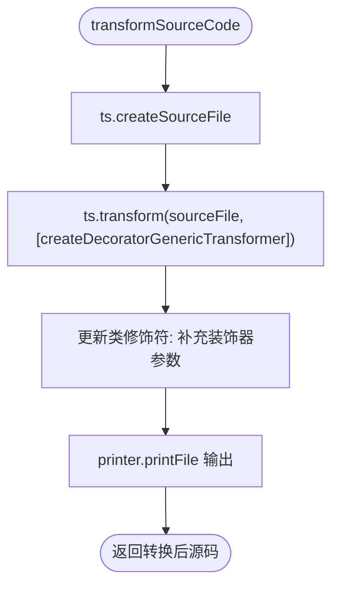
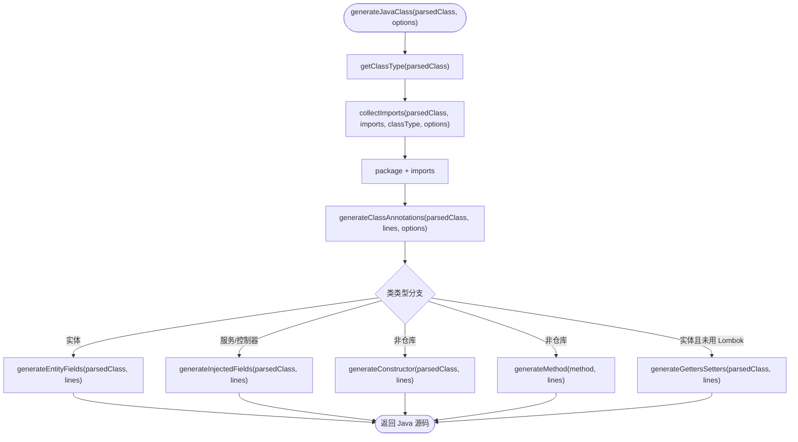
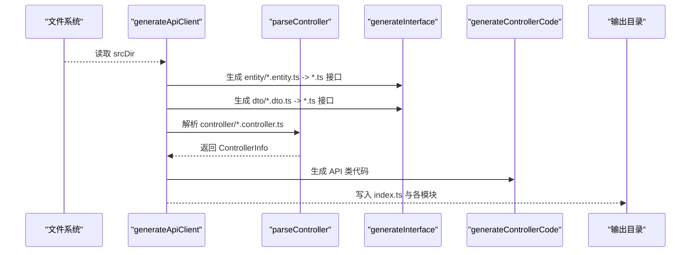
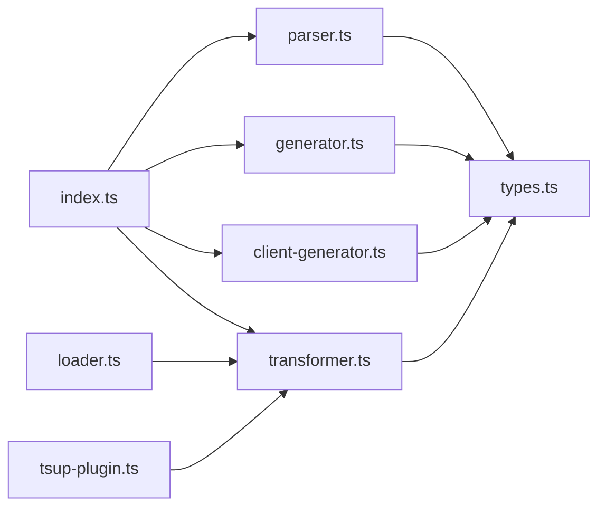

# 代码生成器

<cite>
**本文引用的文件**
- [packages/codegen/src/index.ts](file://packages/codegen/src/index.ts)
- [packages/codegen/src/parser.ts](file://packages/codegen/src/parser.ts)
- [packages/codegen/src/transformer.ts](file://packages/codegen/src/transformer.ts)
- [packages/codegen/src/generator.ts](file://packages/codegen/src/generator.ts)
- [packages/codegen/src/client-generator.ts](file://packages/codegen/src/client-generator.ts)
- [packages/codegen/src/types.ts](file://packages/codegen/src/types.ts)
- [packages/codegen/src/loader.ts](file://packages/codegen/src/loader.ts)
- [packages/codegen/src/tsup-plugin.ts](file://packages/codegen/src/tsup-plugin.ts)
- [packages/codegen/package.json](file://packages/codegen/package.json)
- [README.md](file://README.md)
</cite>

## 目录
1. [简介](#简介)
2. [项目结构](#项目结构)
3. [核心组件](#核心组件)
4. [架构总览](#架构总览)
5. [组件详解](#组件详解)
6. [依赖关系分析](#依赖关系分析)
7. [性能考量](#性能考量)
8. [故障排查指南](#故障排查指南)
9. [结论](#结论)
10. [附录](#附录)

## 简介
本文件面向 AI-First Framework 的代码生成器，系统化阐述其工作原理与实现细节，覆盖以下主题：
- TypeScript AST 解析器：类声明、装饰器、字段与方法的解析机制
- TypeScript 到 Java 的转换算法：类型映射、装饰器转换与代码结构转换
- 核心组件：Parser（AST 解析）、Transformer（类型转换）、Generator（代码生成）、Client-Generator（前端 API 客户端生成）
- 实战示例：自定义模板开发、批量代码生成、集成到构建流程
- 性能优化策略、错误处理机制与调试技巧

## 项目结构
代码生成器位于 packages/codegen，核心入口导出如下能力：
- 解析 TypeScript 源码为内部结构化对象
- 将结构化对象转为 Java 源码
- 基于装饰器泛型自动补全的 Transformer
- 开发时与构建时的加载器与插件
- 前端 API 客户端生成器

图表来源
- [packages/codegen/src/index.ts](file://packages/codegen/src/index.ts#L1-L33)
- [packages/codegen/src/parser.ts](file://packages/codegen/src/parser.ts#L1-L172)
- [packages/codegen/src/generator.ts](file://packages/codegen/src/generator.ts#L1-L381)
- [packages/codegen/src/transformer.ts](file://packages/codegen/src/transformer.ts#L1-L217)
- [packages/codegen/src/loader.ts](file://packages/codegen/src/loader.ts#L1-L53)
- [packages/codegen/src/tsup-plugin.ts](file://packages/codegen/src/tsup-plugin.ts#L1-L65)
- [packages/codegen/src/types.ts](file://packages/codegen/src/types.ts#L1-L177)

章节来源
- [packages/codegen/src/index.ts](file://packages/codegen/src/index.ts#L1-L33)
- [packages/codegen/src/types.ts](file://packages/codegen/src/types.ts#L1-L177)
- [packages/codegen/package.json](file://packages/codegen/package.json#L1-L28)

## 核心组件
- Parser（AST 解析）：将 TypeScript 源码解析为 ParsedClass 结构，包含类名、装饰器、字段、方法、构造函数等
- Transformer（装饰器泛型自动补全）：在构建/开发时自动将 @Mapper() + extends BaseMapper<Entity> 转换为 @Mapper(Entity)，提升开发体验
- Generator（Java 代码生成）：根据解析结果与类型映射，生成符合 MyBatis-Plus/Spring 注解规范的 Java 源码
- Client-Generator（前端 API 客户端生成）：从 Controller/Entity/DTO 源码生成前端可用的 API 客户端类与接口声明
- Loader（开发时加载器）：ESM Loader，在开发时按需转换源码
- Plugin（构建时插件）：tsup/esbuild 插件，在打包阶段自动转换

章节来源
- [packages/codegen/src/parser.ts](file://packages/codegen/src/parser.ts#L1-L172)
- [packages/codegen/src/transformer.ts](file://packages/codegen/src/transformer.ts#L1-L217)
- [packages/codegen/src/generator.ts](file://packages/codegen/src/generator.ts#L1-L381)
- [packages/codegen/src/client-generator.ts](file://packages/codegen/src/client-generator.ts#L1-L349)
- [packages/codegen/src/loader.ts](file://packages/codegen/src/loader.ts#L1-L53)
- [packages/codegen/src/tsup-plugin.ts](file://packages/codegen/src/tsup-plugin.ts#L1-L65)

## 架构总览
整体流程：输入 TypeScript 源码 → 解析为结构化对象 → 转换装饰器泛型（可选）→ 生成 Java 源码或前端 API 客户端。

图表来源
- [packages/codegen/src/index.ts](file://packages/codegen/src/index.ts#L19-L32)
- [packages/codegen/src/parser.ts](file://packages/codegen/src/parser.ts#L11-L30)
- [packages/codegen/src/generator.ts](file://packages/codegen/src/generator.ts#L11-L74)
- [packages/codegen/src/types.ts](file://packages/codegen/src/types.ts#L8-L17)

## 组件详解

### Parser（AST 解析器）
职责
- 将 TypeScript 源码解析为 ParsedClass 数组
- 收集类装饰器、字段、方法、构造函数及其参数与装饰器
- 支持装饰器参数的字面量/对象字面量解析

关键点
- 使用 TypeScript 编译器 API 遍历节点，识别类声明、属性、方法、构造函数
- 装饰器解析支持 CallExpression 与 Identifier 两种形式
- 方法返回类型去除 Promise 包装以简化 Java 返回类型映射

图表来源
- [packages/codegen/src/parser.ts](file://packages/codegen/src/parser.ts#L11-L53)
- [packages/codegen/src/parser.ts](file://packages/codegen/src/parser.ts#L35-L53)
- [packages/codegen/src/parser.ts](file://packages/codegen/src/parser.ts#L58-L77)
- [packages/codegen/src/parser.ts](file://packages/codegen/src/parser.ts#L135-L152)

章节来源
- [packages/codegen/src/parser.ts](file://packages/codegen/src/parser.ts#L1-L172)

### Transformer（装饰器泛型自动补全）
职责
- 在构建/开发时自动将 @Mapper() + extends BaseMapper<Entity> 转换为 @Mapper(Entity)
- 保持开发时简洁、运行时保留完整类型信息

工作机制
- 通过 TypeScript TransformerFactory 遍历类声明
- 识别 @Mapper 且继承 BaseMapper 的场景
- 从基类泛型参数提取实体类型并注入装饰器调用
- 使用工厂 API 重新生成修饰符与类声明

图表来源
- [packages/codegen/src/transformer.ts](file://packages/codegen/src/transformer.ts#L32-L130)
- [packages/codegen/src/transformer.ts](file://packages/codegen/src/transformer.ts#L197-L214)

章节来源
- [packages/codegen/src/transformer.ts](file://packages/codegen/src/transformer.ts#L1-L217)
- [packages/codegen/src/loader.ts](file://packages/codegen/src/loader.ts#L1-L53)
- [packages/codegen/src/tsup-plugin.ts](file://packages/codegen/src/tsup-plugin.ts#L1-L65)

### Generator（Java 代码生成）
职责
- 将 ParsedClass 转换为 Java 源码
- 自动推断类类型（实体/仓库/服务/控制器）
- 依据装饰器生成注解与导入
- 处理字段、方法、构造函数、Getter/Setter

类型映射与注解映射
- 基于 TYPE_MAPPING 将 TypeScript 类型映射为 Java 类型
- 基于 DECORATOR_MAPPING 将 TS 装饰器映射为 Java 注解
- 自动收集 MyBatis-Plus/Spring/Validation/Lombok 等导入

图表来源
- [packages/codegen/src/generator.ts](file://packages/codegen/src/generator.ts#L11-L74)
- [packages/codegen/src/generator.ts](file://packages/codegen/src/generator.ts#L79-L87)
- [packages/codegen/src/generator.ts](file://packages/codegen/src/generator.ts#L106-L174)
- [packages/codegen/src/generator.ts](file://packages/codegen/src/generator.ts#L217-L246)
- [packages/codegen/src/generator.ts](file://packages/codegen/src/generator.ts#L294-L334)

章节来源
- [packages/codegen/src/generator.ts](file://packages/codegen/src/generator.ts#L1-L381)
- [packages/codegen/src/types.ts](file://packages/codegen/src/types.ts#L8-L104)

### Client-Generator（前端 API 客户端生成）
职责
- 从 Controller/Entity/DTO 源码生成前端 API 客户端类与类型声明
- 自动解析 HTTP 方法、路径、参数装饰器、返回类型与内嵌类型
- 生成 fetch 实现的 API 类，自动导入实体与 DTO 接口

工作流
- 扫描 src/entity、src/dto、src/controller
- 解析 Controller 方法签名与装饰器，生成 API 类方法
- 生成实体/DTO 的 TypeScript 接口声明
- 输出统一的 index.ts 再导出

图表来源
- [packages/codegen/src/client-generator.ts](file://packages/codegen/src/client-generator.ts#L249-L325)
- [packages/codegen/src/client-generator.ts](file://packages/codegen/src/client-generator.ts#L33-L147)
- [packages/codegen/src/client-generator.ts](file://packages/codegen/src/client-generator.ts#L207-L235)

章节来源
- [packages/codegen/src/client-generator.ts](file://packages/codegen/src/client-generator.ts#L1-L349)

### Loader 与 Plugin（开发/构建时自动转换）
- Loader（开发时）：ESM Loader，拦截 .ts/.tsx 请求，仅对包含 @Mapper/BaseMapper 的文件进行转换
- Plugin（构建时）：tsup/esbuild 插件，按扩展名过滤并转换匹配文件

章节来源
- [packages/codegen/src/loader.ts](file://packages/codegen/src/loader.ts#L1-L53)
- [packages/codegen/src/tsup-plugin.ts](file://packages/codegen/src/tsup-plugin.ts#L1-L65)

## 依赖关系分析
- Parser 依赖 TypeScript 编译器 API 进行 AST 遍历
- Generator 依赖 types.ts 中的类型/注解映射
- Client-Generator 依赖 TypeScript 编译器 API 解析装饰器与类型
- Transformer 依赖 TypeScript 编译器 API 的工厂 API 重写节点
- Loader/Plugin 依赖 Transformer 的转换函数

图表来源
- [packages/codegen/src/index.ts](file://packages/codegen/src/index.ts#L6-L10)
- [packages/codegen/src/parser.ts](file://packages/codegen/src/parser.ts#L5-L6)
- [packages/codegen/src/generator.ts](file://packages/codegen/src/generator.ts#L5-L6)
- [packages/codegen/src/types.ts](file://packages/codegen/src/types.ts#L1-L177)
- [packages/codegen/src/transformer.ts](file://packages/codegen/src/transformer.ts#L9-L9)
- [packages/codegen/src/loader.ts](file://packages/codegen/src/loader.ts#L10-L10)
- [packages/codegen/src/tsup-plugin.ts](file://packages/codegen/src/tsup-plugin.ts#L12-L12)

章节来源
- [packages/codegen/src/index.ts](file://packages/codegen/src/index.ts#L1-L33)
- [packages/codegen/src/types.ts](file://packages/codegen/src/types.ts#L1-L177)

## 性能考量
- AST 解析与遍历：Parser 采用单次遍历收集信息，复杂度 O(N)（N 为节点数），建议在大型项目中分批处理或缓存中间结果
- 转换器：Transformer 仅对包含特定关键字的文件进行转换，避免不必要的处理；Loader/Plugin 在 onLoad/load 钩子中快速短路
- 生成器：按需收集导入与注解，避免重复导入；数组/可空类型映射为线性扫描，复杂度低
- 客户端生成器：按目录扫描与逐文件解析，建议在 CI 中限制扫描范围或使用白名单

[本节为通用性能建议，不直接分析具体文件]

## 故障排查指南
常见问题与定位
- 装饰器泛型未自动补全
  - 确认类是否同时满足：@Mapper 且继承 BaseMapper<T>
  - 确认 Loader/Plugin 是否正确接入开发/构建流程
  - 查看控制台警告日志，确认转换失败原因
- Java 代码生成异常
  - 检查类型映射是否覆盖目标 TS 类型
  - 确认装饰器映射是否包含所需注解
  - 核对 TranspilerOptions 的 packageName/outDir 等配置
- 前端 API 客户端生成失败
  - 确认 src/entity、src/dto、src/controller 目录存在且命名规范一致
  - 检查 Controller 方法装饰器与参数装饰器是否符合预期
  - 确认输出目录可写

章节来源
- [packages/codegen/src/loader.ts](file://packages/codegen/src/loader.ts#L47-L51)
- [packages/codegen/src/tsup-plugin.ts](file://packages/codegen/src/tsup-plugin.ts#L54-L58)
- [packages/codegen/src/client-generator.ts](file://packages/codegen/src/client-generator.ts#L256-L262)

## 结论
AI-First Framework 的代码生成器以 TypeScript AST 为基础，结合装饰器泛型自动补全与类型/注解映射，实现了从 TypeScript 到 Java 与前端 API 客户端的高效转换。通过 Parser、Transformer、Generator、Client-Generator 四大组件协同，配合 Loader/Plugin 的无缝集成，既提升了开发效率，也保证了生成代码的质量与一致性。

[本节为总结性内容，不直接分析具体文件]

## 附录

### 实战示例与最佳实践
- 自定义模板开发
  - 在生成器中扩展注解与导入集合，以适配更多框架注解
  - 在类型映射中增加 TS 类型到 Java 类型的映射规则
- 批量代码生成
  - 使用 transpile 函数一次性处理多个类，返回 Map<文件名, 源码>
  - 在 CI 中调用 generateApiClient 生成前端 API 客户端
- 集成到构建流程
  - 开发时：通过 ESM Loader 在运行前自动转换
  - 构建时：通过 tsup-plugin 在打包阶段自动转换
- 错误处理与调试
  - 在 Loader/Plugin 中捕获转换异常并降级回退
  - 使用 CLI 参数控制输出目录与静默模式

章节来源
- [packages/codegen/src/index.ts](file://packages/codegen/src/index.ts#L19-L32)
- [packages/codegen/src/client-generator.ts](file://packages/codegen/src/client-generator.ts#L249-L325)
- [packages/codegen/src/loader.ts](file://packages/codegen/src/loader.ts#L35-L51)
- [packages/codegen/src/tsup-plugin.ts](file://packages/codegen/src/tsup-plugin.ts#L43-L59)