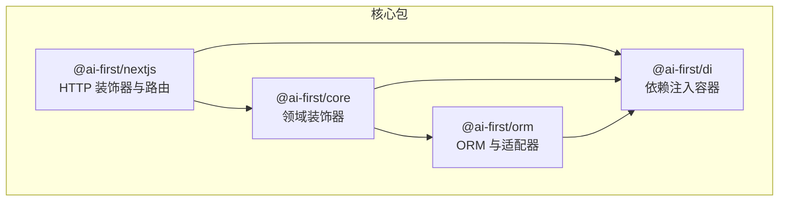
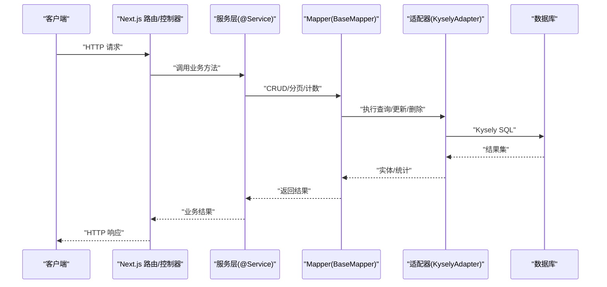
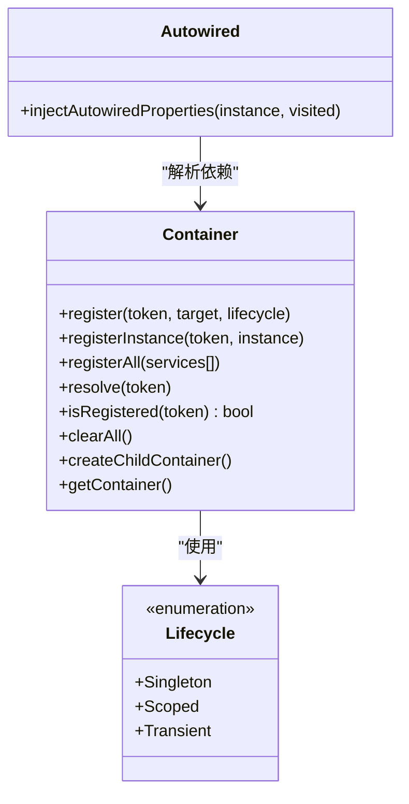
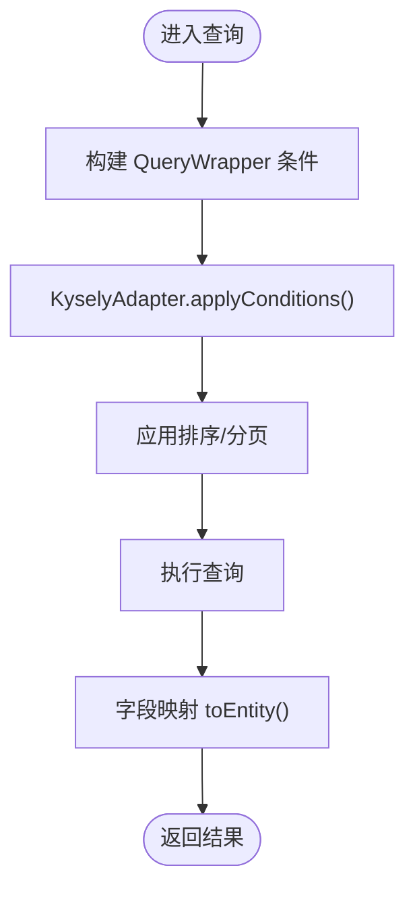
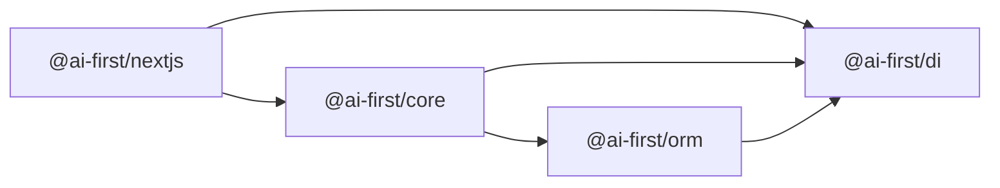

# 性能优化

<cite>
**本文引用的文件**
- [README.md](file://README.md)
- [packages/di/src/index.ts](file://packages/di/src/index.ts)
- [packages/di/src/container.ts](file://packages/di/src/container.ts)
- [packages/di/src/decorators.ts](file://packages/di/src/decorators.ts)
- [packages/orm/src/index.ts](file://packages/orm/src/index.ts)
- [packages/orm/src/base-mapper.ts](file://packages/orm/src/base-mapper.ts)
- [packages/orm/src/wrapper.ts](file://packages/orm/src/wrapper.ts)
- [packages/orm/src/adapters/kysely-adapter.ts](file://packages/orm/src/adapters/kysely-adapter.ts)
- [packages/nextjs/src/index.ts](file://packages/nextjs/src/index.ts)
</cite>

## 目录
1. [简介](#简介)
2. [项目结构](#项目结构)
3. [核心组件](#核心组件)
4. [架构总览](#架构总览)
5. [详细组件分析](#详细组件分析)
6. [依赖关系分析](#依赖关系分析)
7. [性能考量](#性能考量)
8. [故障排查指南](#故障排查指南)
9. [结论](#结论)
10. [附录](#附录)

## 简介
本指南聚焦于 AI-First Framework 的性能优化策略，围绕以下主题展开：
- 依赖注入容器的性能优化：单例模式、作用域生命周期、延迟初始化与循环依赖检测思路
- ORM 查询性能调优：索引优化、查询缓存、批量操作、适配器与查询构造器的性能要点
- Web 层性能优化：路由与控制器装饰器、中间件与请求处理链路优化
- 内存管理与垃圾回收：容器生命周期与对象复用
- 性能监控与分析：埋点、度量与瓶颈定位
- 生产环境最佳实践：负载均衡、CDN、数据库优化

## 项目结构
该仓库采用 monorepo 结构，核心包包括：
- @ai-first/di：基于 TSyringe 的依赖注入容器与装饰器
- @ai-first/orm：MyBatis-Plus 风格 ORM，适配 Kysely
- @ai-first/nextjs：Next.js 适配层，提供 Spring Boot 风格的 HTTP 装饰器与路由
- @ai-first/core：领域层装饰器（事务、组件、服务等）

图表来源
- [README.md](file://README.md#L14-L34)
- [packages/di/src/index.ts](file://packages/di/src/index.ts#L1-L34)
- [packages/orm/src/index.ts](file://packages/orm/src/index.ts#L1-L72)
- [packages/nextjs/src/index.ts](file://packages/nextjs/src/index.ts#L1-L47)

章节来源
- [README.md](file://README.md#L14-L34)

## 核心组件
- 依赖注入容器
  - 生命周期：Singleton、Scoped、Transient
  - 注册与解析：register/registerInstance/registerAll/resolve/isRegistered/clearAll/createChildContainer/getContainer
  - 自动装配：@Autowired、属性注入与递归注入
- ORM 与查询
  - BaseMapper：统一 CRUD 与分页
  - QueryWrapper/LambdaQueryWrapper：类型安全的条件构造器
  - KyselyAdapter：将条件转换为 Kysely 查询，支持字段映射与并发查询
- Next.js 适配层
  - 控制器装饰器：RestController、GetMapping、PostMapping 等
  - Express 路由与引导：createExpressRouter、createApp

章节来源
- [packages/di/src/container.ts](file://packages/di/src/container.ts#L10-L104)
- [packages/di/src/decorators.ts](file://packages/di/src/decorators.ts#L22-L107)
- [packages/orm/src/base-mapper.ts](file://packages/orm/src/base-mapper.ts#L54-L331)
- [packages/orm/src/wrapper.ts](file://packages/orm/src/wrapper.ts#L49-L359)
- [packages/orm/src/adapters/kysely-adapter.ts](file://packages/orm/src/adapters/kysely-adapter.ts#L24-L426)
- [packages/nextjs/src/index.ts](file://packages/nextjs/src/index.ts#L6-L46)

## 架构总览
下图展示从控制器到服务、再到 ORM 适配器与数据库的整体调用链。

图表来源
- [packages/nextjs/src/index.ts](file://packages/nextjs/src/index.ts#L6-L27)
- [packages/di/src/decorators.ts](file://packages/di/src/decorators.ts#L16-L21)
- [packages/orm/src/base-mapper.ts](file://packages/orm/src/base-mapper.ts#L54-L331)
- [packages/orm/src/adapters/kysely-adapter.ts](file://packages/orm/src/adapters/kysely-adapter.ts#L24-L426)

## 详细组件分析

### 依赖注入容器性能优化
- 单例模式优化
  - 使用 Singleton 生命周期减少重复实例化开销；适合无状态或轻状态服务
  - 通过 registerInstance 直接注册已实例化对象，避免重复构造
- 作用域与延迟初始化
  - Scoped 生命周期结合 createChildContainer 实现请求级隔离，避免跨请求污染
  - 通过 Container.getContainer() 获取底层 TSyringe 容器，按需创建子容器
- 循环依赖检测与规避
  - @Autowired 属性注入在递归注入时使用 visited 集合进行检测，避免无限递归
  - 建议优先使用构造函数注入或拆分职责，降低循环耦合
- 批量注册与清理
  - registerAll 一次性注册多个服务，减少多次注册成本
  - clearAll 用于测试场景，释放实例避免内存泄漏

图表来源
- [packages/di/src/container.ts](file://packages/di/src/container.ts#L22-L104)
- [packages/di/src/decorators.ts](file://packages/di/src/decorators.ts#L42-L84)

章节来源
- [packages/di/src/container.ts](file://packages/di/src/container.ts#L22-L104)
- [packages/di/src/decorators.ts](file://packages/di/src/decorators.ts#L42-L84)

### ORM 查询性能调优
- 基础 Mapper 性能要点
  - 统一 CRUD 与分页接口，便于在适配器层集中优化
  - selectListByWrapper/selectOneByWrapper/selectCountByWrapper/updateByWrapper/deleteByWrapper 支持复杂条件时，优先使用适配器实现
- 查询构造器性能
  - QueryWrapper/LambdaQueryWrapper 提供链式 API，注意避免过深嵌套与重复条件
  - orderBy、limit/offset、groupBy 等会直接影响数据库执行计划
- 适配器与数据库
  - KyselyAdapter 支持字段映射与表达式构建，applyConditions 将条件树转为 Kysely 查询
  - 并发查询：findPage 同时执行查询与 COUNT，使用 Promise.all 提升吞吐
  - 字段映射 toField/toColumn 降低 ORM 与数据库列名差异带来的额外处理成本

图表来源
- [packages/orm/src/wrapper.ts](file://packages/orm/src/wrapper.ts#L49-L359)
- [packages/orm/src/adapters/kysely-adapter.ts](file://packages/orm/src/adapters/kysely-adapter.ts#L249-L323)

章节来源
- [packages/orm/src/base-mapper.ts](file://packages/orm/src/base-mapper.ts#L54-L331)
- [packages/orm/src/wrapper.ts](file://packages/orm/src/wrapper.ts#L49-L359)
- [packages/orm/src/adapters/kysely-adapter.ts](file://packages/orm/src/adapters/kysely-adapter.ts#L123-L170)

### Web 层性能优化
- 控制器与路由
  - 使用 RestController、GetMapping、PostMapping 等装饰器声明路由，减少样板代码
  - 通过 createExpressRouter 创建路由，结合 DI 注入服务，避免全局状态
- 中间件与请求链路
  - 在 Next.js 适配层中，建议将日志、限流、鉴权等中间件前置，尽早失败
  - 控制器内尽量只做编排，耗时逻辑下沉至服务层
- 静态资源处理
  - 利用 Next.js 默认静态资源优化能力，配合 CDN 缓存策略

章节来源
- [packages/nextjs/src/index.ts](file://packages/nextjs/src/index.ts#L6-L27)

## 依赖关系分析
- 包间依赖
  - @ai-first/core 为上层装饰器与领域模型提供基础
  - @ai-first/di 为各层提供依赖注入能力
  - @ai-first/orm 为数据访问层提供统一抽象与适配器
  - @ai-first/nextjs 为 Web 层提供 HTTP 装饰器与路由

图表来源
- [packages/di/src/index.ts](file://packages/di/src/index.ts#L10-L24)
- [packages/orm/src/index.ts](file://packages/orm/src/index.ts#L7-L13)
- [packages/nextjs/src/index.ts](file://packages/nextjs/src/index.ts#L6-L27)

章节来源
- [packages/di/src/index.ts](file://packages/di/src/index.ts#L10-L24)
- [packages/orm/src/index.ts](file://packages/orm/src/index.ts#L7-L13)
- [packages/nextjs/src/index.ts](file://packages/nextjs/src/index.ts#L6-L27)

## 性能考量
- 依赖注入容器
  - 优先使用 Singleton 减少实例化与 GC 压力；对有状态或易变资源使用 Scoped
  - 避免循环依赖；必要时拆分接口或引入工厂模式
  - 使用 registerAll 批量注册，减少注册次数；clearAll 仅用于测试
- ORM 查询
  - 为高频查询字段建立合适索引，避免全表扫描
  - 使用 select 指定字段，减少不必要的列传输
  - 合理分页：limit/offset 与 COUNT 并行执行，避免 N+1 查询
  - 批量插入/更新：使用 insertBatch/updateByCondition，减少往返
- Web 层
  - 控制器内避免重计算与阻塞 IO；将耗时任务异步化
  - 合理设置缓存头与 CDN，减少静态资源与响应时间
- 内存与 GC
  - 单例对象尽量无状态或轻状态；避免持有大对象引用导致晋升老年代
  - 使用 Scoped 限定生命周期，及时释放上下文资源

## 故障排查指南
- 依赖注入
  - 症状：属性注入失败或循环依赖导致卡死
  - 排查：检查 @Autowired 是否正确标注；确认 visited 集合是否生效；避免双向依赖
- ORM 查询
  - 症状：查询慢、内存占用高
  - 排查：确认索引是否存在；检查 QueryWrapper 条件是否冗余；避免 select *；评估分页策略
- Web 层
  - 症状：路由未命中、中间件未生效
  - 排查：确认装饰器使用是否正确；检查 createExpressRouter 初始化顺序；核对路径变量与参数绑定

章节来源
- [packages/di/src/decorators.ts](file://packages/di/src/decorators.ts#L67-L84)
- [packages/orm/src/adapters/kysely-adapter.ts](file://packages/orm/src/adapters/kysely-adapter.ts#L123-L170)
- [packages/nextjs/src/index.ts](file://packages/nextjs/src/index.ts#L6-L27)

## 结论
通过合理运用依赖注入容器的生命周期策略、ORM 查询的条件与索引优化、Web 层的路由与中间件设计，以及内存与监控体系，AI-First Framework 可在开发效率与运行性能之间取得良好平衡。生产环境建议结合负载均衡、CDN 与数据库优化进一步提升整体性能与稳定性。

## 附录
- 快速开始与示例
  - 参考根目录 README 的安装与示例运行步骤
- 相关包导出
  - @ai-first/di：容器、生命周期、装饰器、React 集成
  - @ai-first/orm：配置、装饰器、BaseMapper、QueryWrapper、适配器、数据库工厂
  - @ai-first/nextjs：控制器装饰器、Express 路由、应用引导、API 客户端

章节来源
- [README.md](file://README.md#L36-L56)
- [packages/di/src/index.ts](file://packages/di/src/index.ts#L10-L33)
- [packages/orm/src/index.ts](file://packages/orm/src/index.ts#L7-L71)
- [packages/nextjs/src/index.ts](file://packages/nextjs/src/index.ts#L6-L46)