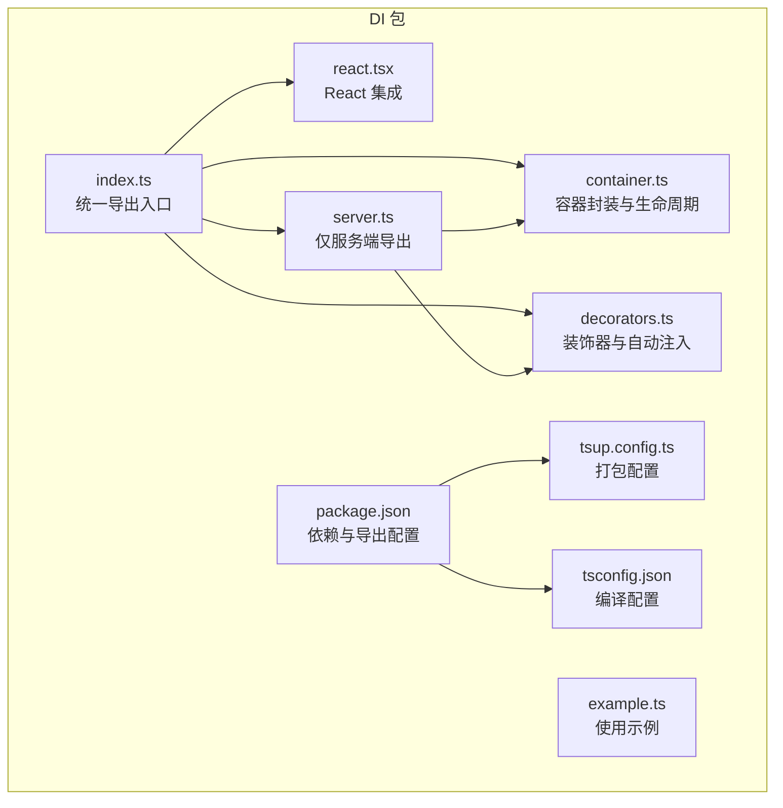
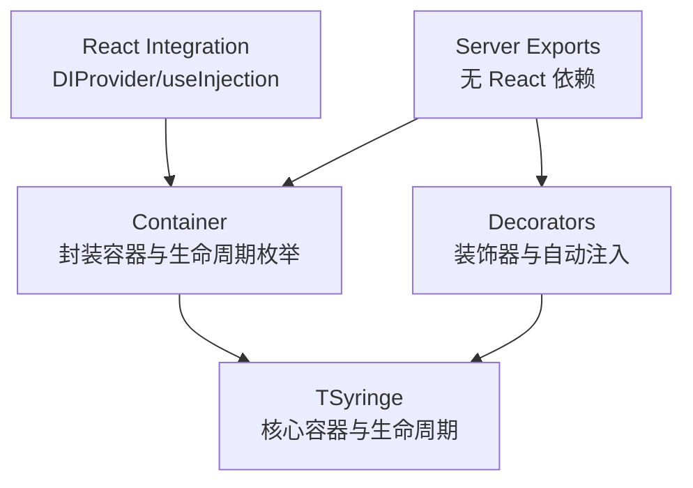
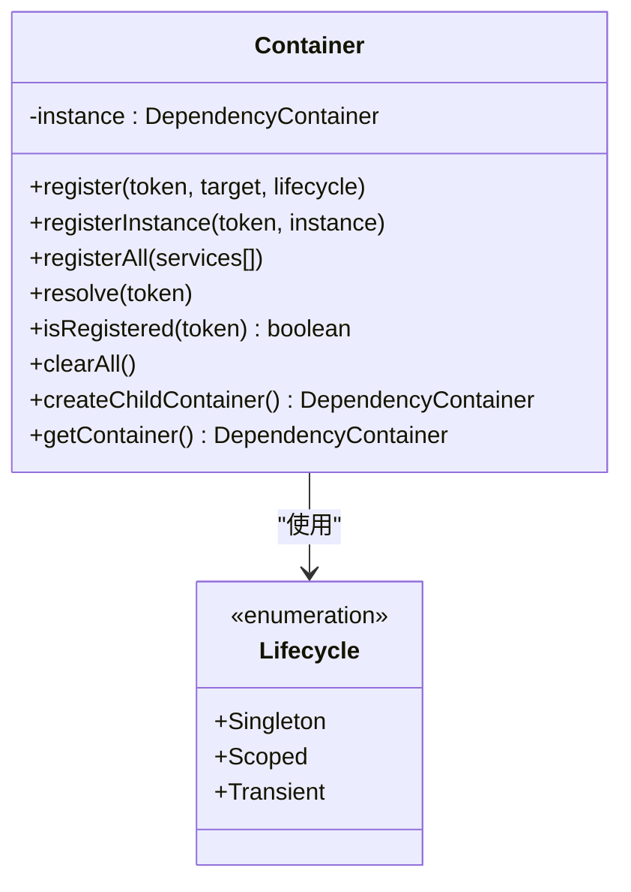
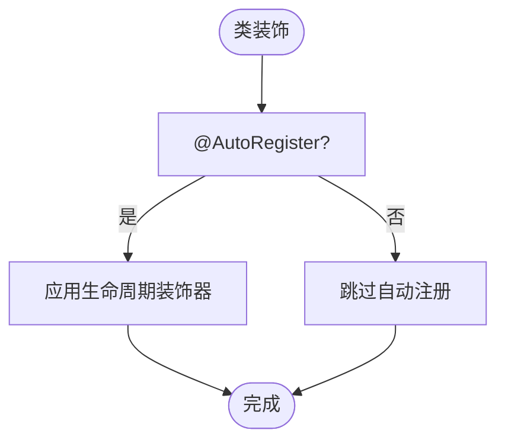
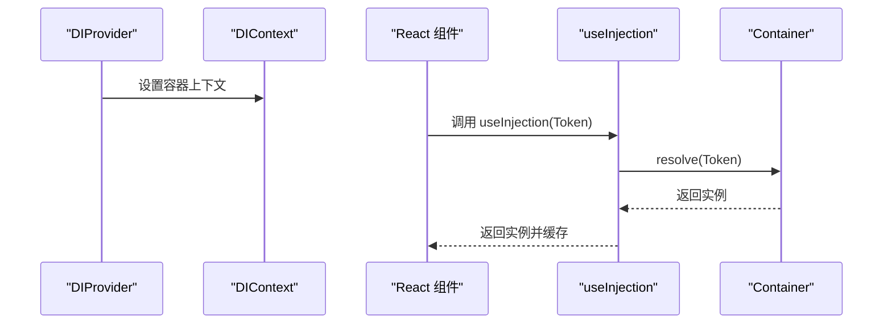
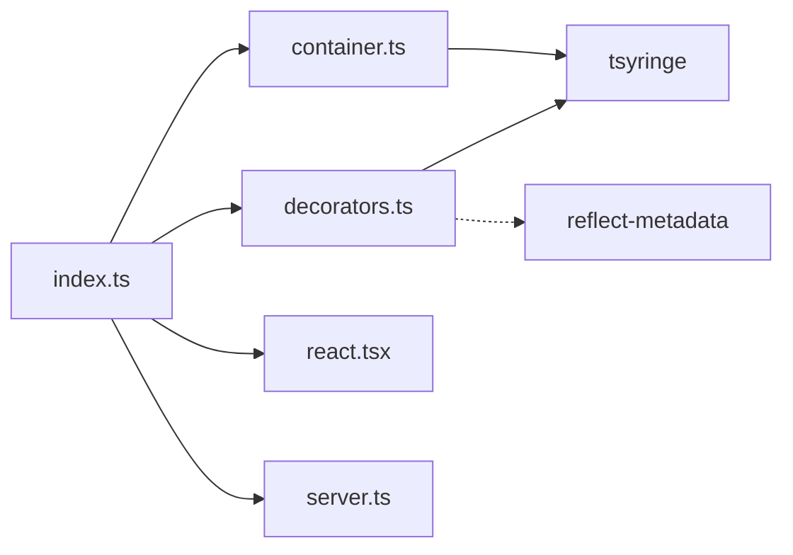

# 依赖注入容器扩展

<cite>
**本文引用的文件**
- [packages/di/src/index.ts](file://packages/di/src/index.ts)
- [packages/di/src/container.ts](file://packages/di/src/container.ts)
- [packages/di/src/decorators.ts](file://packages/di/src/decorators.ts)
- [packages/di/src/react.tsx](file://packages/di/src/react.tsx)
- [packages/di/src/server.ts](file://packages/di/src/server.ts)
- [packages/di/src/example.ts](file://packages/di/src/example.ts)
- [packages/di/package.json](file://packages/di/package.json)
- [packages/di/tsconfig.json](file://packages/di/tsconfig.json)
- [packages/di/tsup.config.ts](file://packages/di/tsup.config.ts)
- [README.md](file://README.md)
- [package.json](file://package.json)
</cite>

## 目录
1. [简介](#简介)
2. [项目结构](#项目结构)
3. [核心组件](#核心组件)
4. [架构总览](#架构总览)
5. [详细组件分析](#详细组件分析)
6. [依赖关系分析](#依赖关系分析)
7. [性能考虑](#性能考虑)
8. [故障排查指南](#故障排查指南)
9. [结论](#结论)
10. [附录](#附录)

## 简介
本指南面向希望在 AI-First Framework 中扩展与深度使用依赖注入（DI）能力的开发者，重点围绕基于 TSyringe 的容器扩展，系统讲解以下主题：
- 自定义注册器与生命周期管理
- 作用域控制与容器分层
- 单例、作用域、瞬态服务的注册与使用
- 生命周期钩子与事件系统的集成思路
- 自定义装饰器与容器的集成、服务替换与装饰器增强
- 在 React 组件中使用依赖注入
- 性能优化、内存管理与调试技巧
- 最佳实践与常见问题解决方案

## 项目结构
AI-First Framework 的 DI 包位于 packages/di，采用模块化导出策略，分别提供通用 DI 能力与仅服务端可用的导出，同时提供 React 集成能力。

图表来源
- [packages/di/src/index.ts](file://packages/di/src/index.ts#L1-L34)
- [packages/di/src/container.ts](file://packages/di/src/container.ts#L1-L105)
- [packages/di/src/decorators.ts](file://packages/di/src/decorators.ts#L1-L110)
- [packages/di/src/react.tsx](file://packages/di/src/react.tsx#L1-L59)
- [packages/di/src/server.ts](file://packages/di/src/server.ts#L1-L26)
- [packages/di/src/example.ts](file://packages/di/src/example.ts#L1-L68)
- [packages/di/package.json](file://packages/di/package.json#L1-L53)
- [packages/di/tsconfig.json](file://packages/di/tsconfig.json#L1-L10)
- [packages/di/tsup.config.ts](file://packages/di/tsup.config.ts#L1-L12)

章节来源
- [packages/di/src/index.ts](file://packages/di/src/index.ts#L1-L34)
- [packages/di/package.json](file://packages/di/package.json#L1-L53)
- [packages/di/tsconfig.json](file://packages/di/tsconfig.json#L1-L10)
- [packages/di/tsup.config.ts](file://packages/di/tsup.config.ts#L1-L12)

## 核心组件
- 容器封装：对 TSyringe 的容器进行统一封装，提供注册、解析、作用域控制、子容器创建等能力。
- 装饰器扩展：在 TSyringe 基础装饰器之上，新增属性自动注入与自动注册装饰器。
- React 集成：提供上下文与 Hook，使 React 组件树内可直接使用 DI 容器解析依赖。
- 服务端专用导出：提供不含 React 依赖的服务端导出，便于在 SSR、Server Components、Server Actions、API Routes 中使用。

章节来源
- [packages/di/src/container.ts](file://packages/di/src/container.ts#L1-L105)
- [packages/di/src/decorators.ts](file://packages/di/src/decorators.ts#L1-L110)
- [packages/di/src/react.tsx](file://packages/di/src/react.tsx#L1-L59)
- [packages/di/src/server.ts](file://packages/di/src/server.ts#L1-L26)

## 架构总览
下图展示了 DI 包的整体架构与模块间关系，以及与 TSyringe 的集成方式。

图表来源
- [packages/di/src/container.ts](file://packages/di/src/container.ts#L1-L105)
- [packages/di/src/decorators.ts](file://packages/di/src/decorators.ts#L1-L110)
- [packages/di/src/react.tsx](file://packages/di/src/react.tsx#L1-L59)
- [packages/di/src/server.ts](file://packages/di/src/server.ts#L1-L26)

## 详细组件分析

### 容器封装（Container）
Container 对 TSyringe 的容器进行了统一封装，提供以下能力：
- 生命周期枚举：单例、作用域、瞬态
- 注册方法：按生命周期注册类或实例
- 批量注册：一次注册多个服务
- 解析与查询：解析依赖、判断是否已注册
- 清理与子容器：测试场景清理、创建子容器用于作用域隔离
- 底层容器访问：暴露 TSyringe 容器以支持高级用法

图表来源
- [packages/di/src/container.ts](file://packages/di/src/container.ts#L1-L105)

章节来源
- [packages/di/src/container.ts](file://packages/di/src/container.ts#L1-L105)

### 装饰器与自动注入（Decorators）
装饰器模块在 TSyringe 基础装饰器之上，新增了：
- 属性自动注入：通过反射收集被 @Autowired 标记的属性，在实例化后自动注入依赖
- 自动注册装饰器：在类上使用 @AutoRegister 可自动完成可注入声明与生命周期注册
- 与 TSyringe 的无缝对接：保留 injectable、inject、singleton、scoped 等原生装饰器

图表来源
- [packages/di/src/decorators.ts](file://packages/di/src/decorators.ts#L89-L107)

章节来源
- [packages/di/src/decorators.ts](file://packages/di/src/decorators.ts#L1-L110)

### React 集成（DIProvider 与 Hooks）
React 集成提供了：
- DIProvider：向组件树提供 DI 容器上下文
- useContainer：获取当前容器实例
- useInjection：解析并缓存依赖
- useOptionalInjection：解析可选依赖，解析失败返回空

图表来源
- [packages/di/src/react.tsx](file://packages/di/src/react.tsx#L21-L58)

章节来源
- [packages/di/src/react.tsx](file://packages/di/src/react.tsx#L1-L59)

### 服务端专用导出（Server）
服务端导出模块移除了 React 依赖，适合在 SSR、Server Components、Server Actions、API Routes 等环境中使用，保持与通用导出一致的 API。

章节来源
- [packages/di/src/server.ts](file://packages/di/src/server.ts#L1-L26)

### 使用示例（Example）
示例文件演示了：
- 基础服务与构造函数注入
- 单例服务的使用
- 批量注册与解析流程

章节来源
- [packages/di/src/example.ts](file://packages/di/src/example.ts#L1-L68)

## 依赖关系分析
- 内部依赖：index.ts 作为统一导出入口，聚合 container、decorators、react、server 模块的导出。
- 外部依赖：依赖 TSyringe 与 reflect-metadata；React 为可选 peer 依赖。
- 导出策略：提供通用与服务端两套导出，避免在服务端引入 React 依赖。

图表来源
- [packages/di/src/index.ts](file://packages/di/src/index.ts#L1-L34)
- [packages/di/src/container.ts](file://packages/di/src/container.ts#L1-L105)
- [packages/di/src/decorators.ts](file://packages/di/src/decorators.ts#L1-L110)
- [packages/di/package.json](file://packages/di/package.json#L27-L36)

章节来源
- [packages/di/package.json](file://packages/di/package.json#L1-L53)
- [packages/di/src/index.ts](file://packages/di/src/index.ts#L1-L34)

## 性能考虑
- 生命周期选择
  - 单例：适合无状态或全局共享资源，减少重复实例化开销
  - 作用域：适合请求级或会话级资源，避免跨请求污染
  - 瞬态：适合轻量且易创建的对象
- 批量注册：使用 registerAll 一次性注册多个服务，减少多次调用开销
- 子容器隔离：通过 createChildContainer 创建作用域隔离的子容器，避免全局容器膨胀
- React Hooks 缓存：useInjection 通过 useMemo 缓存解析结果，避免重复解析
- 反射与元数据：属性自动注入依赖 reflect-metadata，注意在构建阶段启用元数据支持

章节来源
- [packages/di/src/container.ts](file://packages/di/src/container.ts#L58-L96)
- [packages/di/src/react.tsx](file://packages/di/src/react.tsx#L41-L58)
- [packages/di/package.json](file://packages/di/package.json#L27-L36)

## 故障排查指南
- 未在 DIProvider 内使用 useContainer/useInjection
  - 现象：抛出错误提示必须在 DIProvider 内使用
  - 处理：确保根组件包裹 DIProvider，或传入自定义容器实例
- 未注册依赖导致解析失败
  - 现象：解析时报错提示未注册依赖
  - 处理：确认使用 @Inject/@Injectable 或通过 Container.register/registerAll 正确注册
- 属性自动注入异常
  - 现象：控制台警告无法自动注入属性
  - 处理：检查属性上的 @Autowired 是否正确标注，确认类型信息存在或显式传入类型
- 测试环境状态泄漏
  - 现象：测试之间相互影响
  - 处理：在测试前后调用 clearAll 清理容器状态
- React 组件未更新
  - 现象：依赖变化但组件未重新渲染
  - 处理：确认依赖解析结果是否稳定，必要时调整依赖对象的生命周期

章节来源
- [packages/di/src/react.tsx](file://packages/di/src/react.tsx#L30-L36)
- [packages/di/src/decorators.ts](file://packages/di/src/decorators.ts#L75-L84)
- [packages/di/src/container.ts](file://packages/di/src/container.ts#L87-L89)

## 结论
AI-First Framework 的 DI 包在 TSyringe 基础上提供了更贴近工程实践的能力：
- 明确的生命周期与作用域控制
- 装饰器增强与自动注入
- React 与服务端双场景导出
- 清晰的 API 与良好的扩展性

通过合理选择生命周期、善用批量注册与子容器、结合 React Hooks，可在复杂应用中获得高性能与高可维护性的 DI 体验。

## 附录

### 注册自定义服务（单例/作用域/瞬态）
- 单例：使用 @Singleton 或在注册时指定生命周期为单例
- 作用域：使用 @Scoped 或在注册时指定生命周期为作用域
- 瞬态：默认生命周期为瞬态，每次解析创建新实例
- 直接注册实例：使用 registerInstance 将现有实例注册为依赖

章节来源
- [packages/di/src/decorators.ts](file://packages/di/src/decorators.ts#L18-L20)
- [packages/di/src/container.ts](file://packages/di/src/container.ts#L28-L46)

### 生命周期钩子与事件系统
- 当前实现未内置生命周期钩子与事件系统
- 建议方案
  - 使用容器的子容器在请求开始/结束时创建/销毁，模拟钩子行为
  - 在服务内部自行实现初始化/销毁逻辑（如构造函数/析构方法），并在容器外层进行生命周期管理
  - 若需跨服务通知，可通过事件总线或发布订阅模式配合容器使用

章节来源
- [packages/di/src/container.ts](file://packages/di/src/container.ts#L94-L96)

### 自定义装饰器与容器集成
- 可通过 @AutoRegister 在类上自动完成可注入声明与生命周期注册
- 可通过 @Autowired 实现属性自动注入，结合 injectAutowiredProperties 完成依赖链注入

章节来源
- [packages/di/src/decorators.ts](file://packages/di/src/decorators.ts#L89-L107)
- [packages/di/src/decorators.ts](file://packages/di/src/decorators.ts#L42-L84)

### 服务替换与装饰器增强
- 通过 registerInstance 可替换已注册实例
- 通过 register 与 registerAll 可覆盖默认实现
- 装饰器增强：在类上使用 @AutoRegister 可自动完成生命周期装饰器应用

章节来源
- [packages/di/src/container.ts](file://packages/di/src/container.ts#L51-L68)
- [packages/di/src/decorators.ts](file://packages/di/src/decorators.ts#L89-L107)

### 在 React 组件中使用依赖注入
- 使用 DIProvider 提供容器上下文
- 使用 useInjection 解析依赖并缓存
- 使用 useOptionalInjection 解析可选依赖

章节来源
- [packages/di/src/react.tsx](file://packages/di/src/react.tsx#L21-L58)

### 容器性能优化与内存管理
- 合理选择生命周期，避免不必要的实例化
- 使用子容器隔离作用域，防止全局容器膨胀
- 在测试中使用 clearAll 清理状态
- 在 React 中利用 useMemo 缓存解析结果

章节来源
- [packages/di/src/container.ts](file://packages/di/src/container.ts#L87-L96)
- [packages/di/src/react.tsx](file://packages/di/src/react.tsx#L41-L58)

### 调试技巧
- 启用 reflect-metadata 支持，确保类型信息可用
- 使用 Container.isRegistered 检查依赖是否已注册
- 在属性自动注入失败时查看控制台警告信息

章节来源
- [packages/di/src/decorators.ts](file://packages/di/src/decorators.ts#L75-L84)
- [packages/di/src/container.ts](file://packages/di/src/container.ts#L80-L82)