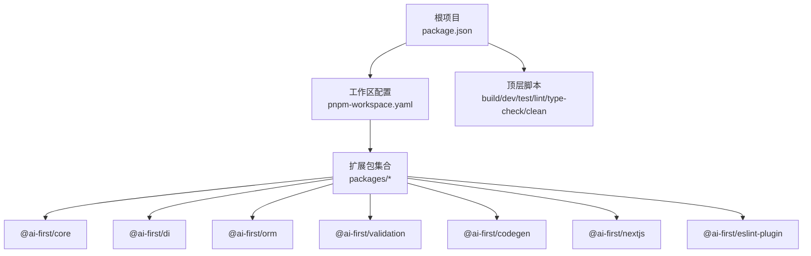
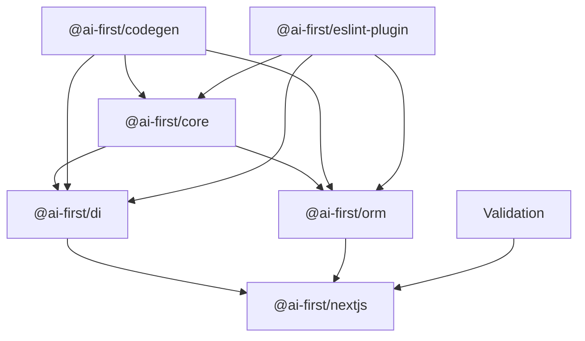
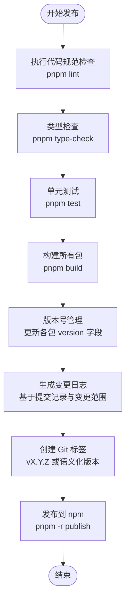

# 扩展包发布与管理

<cite>
**本文档引用的文件**
- [package.json](file://package.json)
- [pnpm-workspace.yaml](file://pnpm-workspace.yaml)
- [README.md](file://README.md)
- [@ai-first/core/package.json](file://packages/core/package.json)
- [@ai-first/di/package.json](file://packages/di/package.json)
- [@ai-first/orm/package.json](file://packages/orm/package.json)
- [@ai-first/validation/package.json](file://packages/validation/package.json)
- [@ai-first/codegen/package.json](file://packages/codegen/package.json)
- [@ai-first/nextjs/package.json](file://packages/nextjs/package.json)
- [@ai-first/eslint-plugin/package.json](file://packages/eslint-plugin/package.json)
</cite>

## 目录
1. [简介](#简介)
2. [项目结构](#项目结构)
3. [核心组件](#核心组件)
4. [架构概览](#架构概览)
5. [详细组件分析](#详细组件分析)
6. [依赖分析](#依赖分析)
7. [性能考虑](#性能考虑)
8. [故障排除指南](#故障排除指南)
9. [结论](#结论)
10. [附录](#附录)

## 简介
本指南面向 AI-First Framework 的扩展包发布与管理，围绕 monorepo 环境下的包结构、配置文件设置、版本管理、依赖声明、发布流程、测试策略、质量保证、文档编写、维护策略及最佳实践进行系统化说明。目标是帮助开发者在保持扩展包稳定性与兼容性的前提下，高效完成从开发到发布的全流程。

## 项目结构
AI-First Framework 采用 pnpm workspace 的 monorepo 结构，统一管理多个扩展包与示例应用。根目录包含工作区配置与顶层脚本，各扩展包位于 packages 目录下，遵循一致的构建与发布规范。

图表来源
- [pnpm-workspace.yaml](file://pnpm-workspace.yaml#L1-L5)
- [package.json](file://package.json#L11-L18)

章节来源
- [README.md](file://README.md#L14-L34)
- [pnpm-workspace.yaml](file://pnpm-workspace.yaml#L1-L5)
- [package.json](file://package.json#L1-L31)

## 核心组件
本节聚焦各扩展包的 package.json 配置要点，包括导出字段、依赖关系、构建脚本与发布清单等，这些是发布与管理的基础。

- @ai-first/core
  - 导出入口与类型声明：通过 exports 字段暴露主入口与类型定义，files 字段限定发布内容为 dist 目录。
  - 依赖关系：对 @ai-first/di 使用 workspace:*，确保本地联调与版本一致性。
  - 构建脚本：使用 tsup 进行打包，提供 watch 模式与类型检查。
  
- @ai-first/di
  - 多入口导出：除默认入口外，还提供 ./server 子路径导出，满足不同运行时需求。
  - peerDependencies：对 React 做可选 peer 依赖声明，避免强制安装。
  - 依赖关系：内部依赖 reflect-metadata，外部依赖 tsyringe。
  
- @ai-first/orm
  - 依赖关系：同时依赖 @ai-first/core 与 @ai-first/di，体现 ORM 对核心与依赖注入的强耦合。
  - peerDependencies：对 pg 做可选 peer 依赖，适配不同数据库环境。
  - 依赖：kysely 作为查询构建器，better-sqlite3 用于 SQLite 场景。
  
- @ai-first/validation
  - 依赖：class-validator 与 class-transformer，结合 reflect-metadata 提供装饰器风格的数据校验。
  - peerDependencies：对 react-hook-form 与 @hookform/resolvers 做可选 peer 依赖。
  
- @ai-first/codegen
  - 用途：TypeScript 到 Java 的代码生成器，主要依赖 TypeScript 编译器。
  - 导出：通过 exports 暴露默认导出与类型声明。
  
- @ai-first/nextjs
  - 依赖关系：对 @ai-first/core、@ai-first/di、@ai-first/orm 形成多入口依赖，体现其适配层特性。
  - peerDependencies：对 express 做可选 peer 依赖，适配 Express 生态。
  - 多入口导出：提供默认入口、Express 路由器与客户端轻量版等子路径导出。
  
- @ai-first/eslint-plugin
  - 用途：强制 Java 兼容的 TypeScript 代码风格，依赖 @typescript-eslint/utils。
  - peerDependencies：对 eslint、@typescript-eslint/parser、typescript 做 peer 依赖声明。

章节来源
- [@ai-first/core/package.json](file://packages/core/package.json#L1-L39)
- [@ai-first/di/package.json](file://packages/di/package.json#L1-L53)
- [@ai-first/orm/package.json](file://packages/orm/package.json#L1-L54)
- [@ai-first/validation/package.json](file://packages/validation/package.json#L1-L40)
- [@ai-first/codegen/package.json](file://packages/codegen/package.json#L1-L28)
- [@ai-first/nextjs/package.json](file://packages/nextjs/package.json#L1-L59)
- [@ai-first/eslint-plugin/package.json](file://packages/eslint-plugin/package.json#L1-L45)

## 架构概览
下图展示扩展包之间的依赖关系与发布约束，有助于理解版本管理与发布顺序。

图表来源
- [@ai-first/core/package.json](file://packages/core/package.json#L23-L26)
- [@ai-first/di/package.json](file://packages/di/package.json#L27-L30)
- [@ai-first/orm/package.json](file://packages/orm/package.json#L23-L29)
- [@ai-first/nextjs/package.json](file://packages/nextjs/package.json#L31-L36)
- [@ai-first/codegen/package.json](file://packages/codegen/package.json#L21-L23)
- [@ai-first/eslint-plugin/package.json](file://packages/eslint-plugin/package.json#L41-L43)

## 详细组件分析

### 版本管理与依赖声明策略
- workspace:* 依赖模式
  - @ai-first/core 依赖 @ai-first/di 使用 workspace:*，确保本地开发时直接引用本地包，避免发布前的版本漂移。
  - @ai-first/orm 同时依赖 @ai-first/core 与 @ai-first/di，形成稳定的层级依赖链。
  - @ai-first/nextjs 依赖 @ai-first/core、@ai-first/di、@ai-first/orm，体现其作为适配层的聚合特性。
- peerDependencies 设计
  - @ai-first/di 对 React 做可选 peer 依赖，避免在非 React 环境中强制安装。
  - @ai-first/orm 对 pg 做可选 peer 依赖，允许用户按需选择数据库驱动。
  - @ai-first/validation 对 react-hook-form 与 @hookform/resolvers 做可选 peer 依赖，适配前端表单场景。
  - @ai-first/nextjs 对 express 做可选 peer 依赖，适配 Express 服务器场景。
  - @ai-first/eslint-plugin 对 @typescript-eslint/parser、eslint、typescript 做 peer 依赖，确保规则与工具链版本匹配。
- 发布清单与导出
  - 所有包均通过 files 字段限制发布内容为 dist 目录，确保 npm 包仅包含编译产物。
  - exports 字段明确主入口与类型声明，支持 ESM 与类型推断。

章节来源
- [@ai-first/core/package.json](file://packages/core/package.json#L23-L26)
- [@ai-first/di/package.json](file://packages/di/package.json#L31-L36)
- [@ai-first/orm/package.json](file://packages/orm/package.json#L37-L44)
- [@ai-first/validation/package.json](file://packages/validation/package.json#L30-L37)
- [@ai-first/nextjs/package.json](file://packages/nextjs/package.json#L38-L41)
- [@ai-first/eslint-plugin/package.json](file://packages/eslint-plugin/package.json#L28-L32)

### 发布流程（含版本号、变更日志与标签）
以下流程适用于 monorepo 环境下的扩展包发布，结合 pnpm workspace 与各包的构建脚本：

说明
- 代码规范与类型检查：在发布前确保代码风格与类型安全，减少运行时风险。
- 单元测试：保证功能正确性，避免引入回归。
- 构建：统一构建所有包，确保产物一致性。
- 版本管理：建议采用语义化版本控制，结合变更范围（major/minor/patch）决定升级级别。
- 变更日志：建议使用工具自动生成，保留每个包的独立变更记录。
- 标签：为每个发布版本创建 Git 标签，便于回溯与审计。
- 发布：在 CI 环境中执行发布，确保凭证与权限正确。

章节来源
- [package.json](file://package.json#L11-L18)
- [@ai-first/core/package.json](file://packages/core/package.json#L17-L22)
- [@ai-first/di/package.json](file://packages/di/package.json#L21-L26)
- [@ai-first/orm/package.json](file://packages/orm/package.json#L17-L22)
- [@ai-first/validation/package.json](file://packages/validation/package.json#L15-L20)
- [@ai-first/codegen/package.json](file://packages/codegen/package.json#L17-L20)
- [@ai-first/nextjs/package.json](file://packages/nextjs/package.json#L25-L30)
- [@ai-first/eslint-plugin/package.json](file://packages/eslint-plugin/package.json#L17-L20)

### 测试策略与质量保证
- 测试框架：根项目使用 vitest 作为测试运行器，建议在各包内保持一致的测试约定。
- 类型检查：通过 type-check 脚本确保 TypeScript 类型安全，避免潜在的类型错误。
- 代码规范：通过 eslint 与 prettier 统一代码风格，减少审查成本。
- 依赖一致性：使用 workspace:* 降低版本漂移风险；peerDependencies 明确运行时依赖边界。
- 发布前检查清单
  - 通过 lint、type-check、test
  - 更新版本号与变更日志
  - 本地构建并验证产物
  - 在隔离环境中进行预发布验证

章节来源
- [package.json](file://package.json#L19-L28)
- [@ai-first/di/package.json](file://packages/di/package.json#L31-L36)
- [@ai-first/orm/package.json](file://packages/orm/package.json#L37-L44)
- [@ai-first/validation/package.json](file://packages/validation/package.json#L30-L37)
- [@ai-first/nextjs/package.json](file://packages/nextjs/package.json#L38-L41)

### 文档编写与示例准备
- 包级文档：在各包内提供清晰的 README，说明用途、安装方式、基本用法与导出示例。
- 示例项目：利用 app/examples 下的示例工程演示包的实际使用场景，便于用户快速上手。
- API 文档：结合类型声明与注释，生成可读性强的 API 文档，辅助开发者查阅。
- 变更日志：记录每次发布的重要变更，帮助用户评估升级影响。

章节来源
- [README.md](file://README.md#L57-L217)

### 维护策略（向后兼容、弃用警告与迁移指南）
- 向后兼容性
  - 严格遵循语义化版本，避免在 patch 版本引入破坏性变更。
  - 对于可能破坏兼容的修改，优先采用渐进式迁移策略。
- 弃用警告
  - 在受影响的 API 上添加弃用标记与替代方案提示，引导用户迁移。
- 迁移指南
  - 提供从旧版本到新版本的迁移步骤与示例，降低升级成本。
- 长期维护
  - 定期清理未使用的依赖，保持依赖树简洁。
  - 对 peerDependencies 的版本范围进行审慎评估，避免锁定过严或过松。

## 依赖分析
下图展示扩展包间的直接与间接依赖关系，帮助识别发布顺序与潜在循环依赖风险。

图表来源
- [@ai-first/core/package.json](file://packages/core/package.json#L23-L26)
- [@ai-first/di/package.json](file://packages/di/package.json#L27-L30)
- [@ai-first/orm/package.json](file://packages/orm/package.json#L23-L29)
- [@ai-first/nextjs/package.json](file://packages/nextjs/package.json#L31-L36)
- [@ai-first/codegen/package.json](file://packages/codegen/package.json#L21-L23)
- [@ai-first/eslint-plugin/package.json](file://packages/eslint-plugin/package.json#L41-L43)

章节来源
- [@ai-first/core/package.json](file://packages/core/package.json#L23-L26)
- [@ai-first/di/package.json](file://packages/di/package.json#L27-L30)
- [@ai-first/orm/package.json](file://packages/orm/package.json#L23-L29)
- [@ai-first/nextjs/package.json](file://packages/nextjs/package.json#L31-L36)
- [@ai-first/codegen/package.json](file://packages/codegen/package.json#L21-L23)
- [@ai-first/eslint-plugin/package.json](file://packages/eslint-plugin/package.json#L41-L43)

## 性能考虑
- 构建性能
  - 使用 tsup 进行增量构建与并行打包，缩短构建时间。
  - 将第三方依赖标记为 external 或 peer，减少打包体积与重复依赖。
- 运行时性能
  - 通过 peerDependencies 降低运行时依赖数量，减少内存占用。
  - 在适配层（如 @ai-first/nextjs）中按需导出子模块，避免不必要的加载。
- 发布效率
  - 在 CI 中缓存 pnpm store 与构建产物，提升重复构建速度。
  - 使用工作区一次性构建所有包，避免逐个包构建的开销。

## 故障排除指南
- 发布失败（权限/凭证问题）
  - 确认 npm token 与 CI 凭证配置正确，且具有发布权限。
- 依赖冲突
  - 检查 peerDependencies 与 workspace:* 的使用是否合理，避免重复安装与版本不一致。
- 构建失败
  - 确保所有包的构建脚本与 tsconfig 配置一致，类型检查通过后再进行发布。
- 版本不一致
  - 在 monorepo 中统一管理版本，避免部分包版本落后导致发布异常。

## 结论
通过规范的 monorepo 结构、严格的依赖与版本管理、完善的测试与质量保证流程，以及清晰的文档与维护策略，AI-First Framework 的扩展包能够在保证稳定性与兼容性的前提下高效迭代与发布。建议在团队内建立标准化的发布流程与审查机制，持续优化构建与发布效率。

## 附录
- 快速参考
  - 安装依赖：在根目录执行安装命令，自动处理工作区内依赖。
  - 构建所有包：使用根目录的构建脚本一次性构建所有包。
  - 运行示例：进入示例工程目录，启动开发服务器进行调试。
- 建议的发布检查清单
  - 代码规范与类型检查通过
  - 单元测试全部通过
  - 本地构建产物完整
  - 版本号与变更日志更新
  - Git 标签创建
  - 正式发布到 npm

章节来源
- [README.md](file://README.md#L36-L56)
- [package.json](file://package.json#L11-L18)