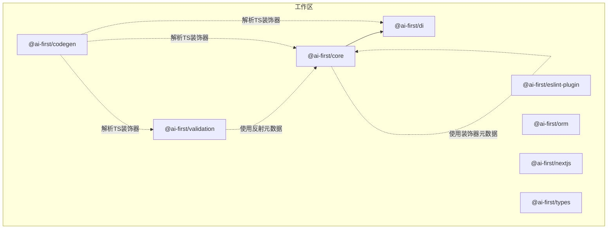
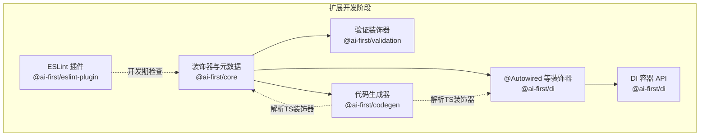
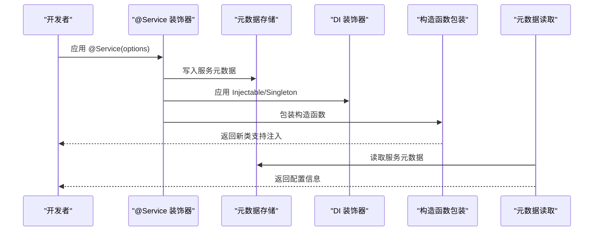
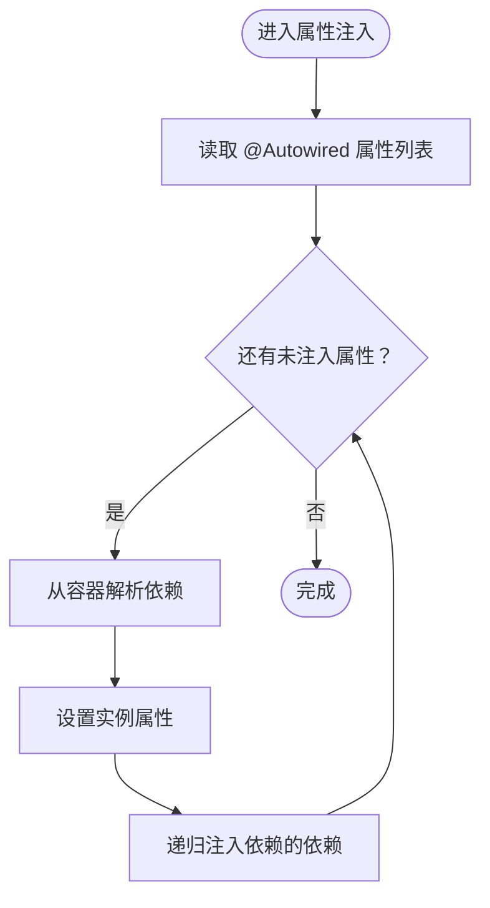
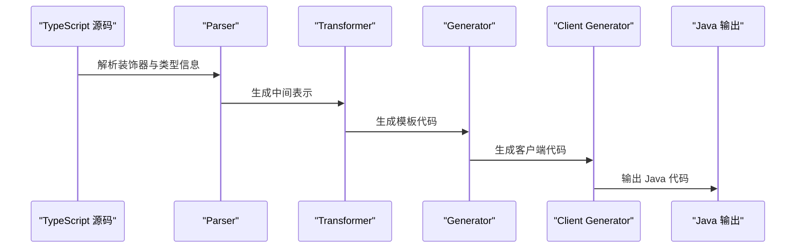
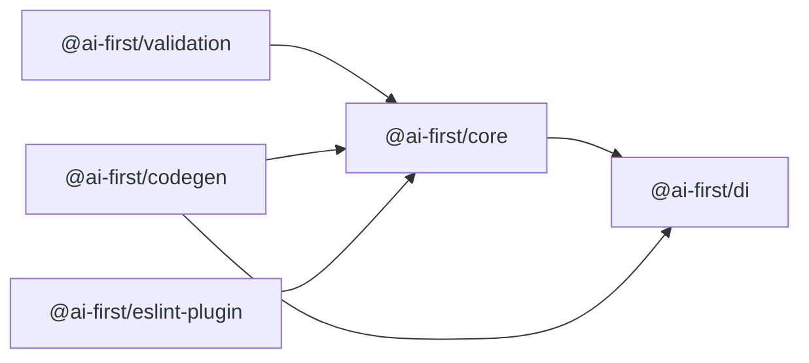

# 扩展开发

<cite>
**本文引用的文件**
- [README.md](file://README.md)
- [package.json](file://package.json)
- [pnpm-workspace.yaml](file://pnpm-workspace.yaml)
- [packages/core/src/index.ts](file://packages/core/src/index.ts)
- [packages/core/src/decorators.ts](file://packages/core/src/decorators.ts)
- [packages/core/src/types.ts](file://packages/core/src/types.ts)
- [packages/di/src/decorators.ts](file://packages/di/src/decorators.ts)
- [packages/di/src/container.ts](file://packages/di/src/container.ts)
- [packages/validation/src/index.ts](file://packages/validation/src/index.ts)
- [packages/eslint-plugin/src/index.ts](file://packages/eslint-plugin/src/index.ts)
- [packages/codegen/src/index.ts](file://packages/codegen/src/index.ts)
- [packages/codegen/src/client-generator.ts](file://packages/codegen/src/client-generator.ts)
- [packages/codegen/src/generator.ts](file://packages/codegen/src/generator.ts)
- [packages/codegen/src/parser.ts](file://packages/codegen/src/parser.ts)
- [packages/codegen/src/transformer.ts](file://packages/codegen/src/transformer.ts)
- [packages/codegen/src/loader.ts](file://packages/codegen/src/loader.ts)
- [packages/codegen/src/types.ts](file://packages/codegen/src/types.ts)
</cite>

## 目录
1. [简介](#简介)
2. [项目结构](#项目结构)
3. [核心组件](#核心组件)
4. [架构总览](#架构总览)
5. [详细组件分析](#详细组件分析)
6. [依赖关系分析](#依赖关系分析)
7. [性能考虑](#性能考虑)
8. [故障排除指南](#故障排除指南)
9. [结论](#结论)
10. [附录](#附录)

## 简介
本指南面向希望为 AI-First Framework 开发扩展的工程师，覆盖以下主题：
- 自定义装饰器的开发流程：装饰器工厂模式、参数解析、元数据注册与读取
- 插件系统架构与扩展点：ESLint 插件、TypeScript 装饰器插件、构建工具插件
- 完整扩展开发示例：自定义验证规则、API 客户端生成器、代码检查规则
- 依赖注入容器扩展机制：注册自定义服务、生命周期管理
- 扩展包发布流程、版本管理与向后兼容性保障
- 故障排除与性能优化建议

## 项目结构
该仓库采用 monorepo 结构，通过工作区统一管理多个包。核心包包括：
- @ai-first/core：领域层装饰器与元数据系统
- @ai-first/di：基于 TSyringe 的依赖注入容器与装饰器
- @ai-first/validation：基于 class-validator 的验证装饰器
- @ai-first/eslint-plugin：Java 兼容风格的 ESLint 规则插件
- @ai-first/codegen：TypeScript 到 Java 的代码生成器
- @ai-first/orm、@ai-first/nextjs、@ai-first/types：其他配套能力

图表来源
- [pnpm-workspace.yaml](file://pnpm-workspace.yaml#L1-L5)
- [packages/core/package.json](file://packages/core/package.json#L1-L39)
- [packages/di/package.json](file://packages/di/package.json#L1-L53)
- [packages/validation/package.json](file://packages/validation/package.json#L1-L40)
- [packages/eslint-plugin/package.json](file://packages/eslint-plugin/package.json#L1-L45)
- [packages/codegen/package.json](file://packages/codegen/package.json#L1-L28)

章节来源
- [pnpm-workspace.yaml](file://pnpm-workspace.yaml#L1-L5)
- [README.md](file://README.md#L14-L34)

## 核心组件
本节聚焦于扩展开发最常用的两类基础设施：装饰器与依赖注入。

- 装饰器与元数据
  - @ai-first/core 提供领域层装饰器（如 @Component、@Service、@Transactional）以及元数据读取接口
  - 装饰器通过 reflect-metadata 在类与方法上写入/读取元数据，实现运行时行为增强
  - 该机制是扩展点的基础：自定义装饰器可复用相同模式

- 依赖注入容器
  - @ai-first/di 基于 TSyringe，提供 @Service/@Component 等装饰器与容器 API
  - 支持构造函数注入、属性注入（@Autowired）、生命周期（Singleton/Scoped/Transient）
  - 容器封装 TSyringe，提供 register/registerAll/resolve/isRegistered/clearAll 等能力

章节来源
- [packages/core/src/decorators.ts](file://packages/core/src/decorators.ts#L1-L158)
- [packages/core/src/types.ts](file://packages/core/src/types.ts#L1-L14)
- [packages/di/src/decorators.ts](file://packages/di/src/decorators.ts#L1-L110)
- [packages/di/src/container.ts](file://packages/di/src/container.ts#L1-L105)

## 架构总览
下图展示了扩展开发的关键交互路径：装饰器在编译期写入元数据；运行时 DI 读取元数据并完成注入；代码生成器解析 TS 装饰器生成 Java；ESLint 插件在开发期约束代码风格。

图表来源
- [packages/core/src/decorators.ts](file://packages/core/src/decorators.ts#L1-L158)
- [packages/di/src/decorators.ts](file://packages/di/src/decorators.ts#L1-L110)
- [packages/di/src/container.ts](file://packages/di/src/container.ts#L1-L105)
- [packages/validation/src/index.ts](file://packages/validation/src/index.ts#L1-L100)
- [packages/eslint-plugin/src/index.ts](file://packages/eslint-plugin/src/index.ts#L1-L200)
- [packages/codegen/src/index.ts](file://packages/codegen/src/index.ts#L1-L200)

## 详细组件分析

### 组件 A：装饰器与元数据系统（@ai-first/core）
- 设计要点
  - 使用装饰器工厂模式，接收配置对象并返回装饰器函数
  - 通过 reflect-metadata 写入符号键（如 SERVICE_METADATA、COMPONENT_METADATA、TRANSACTIONAL_METADATA）
  - 对类进行包装以支持属性注入（构造函数注入由 DI 装饰器自动完成）
  - 提供 getComponentMetadata/getServiceMetadata/isTransactional 等读取接口

- 关键流程（以 @Service 为例）
  1) 装饰器调用：对目标类写入服务元数据
  2) 构造函数注入：读取设计时类型并注入依赖
  3) 属性注入：包装构造函数，运行时注入 @Autowired 属性
  4) 方法事务：对被 @Transactional 标记的方法进行包装，记录日志并保持语义

图表来源
- [packages/core/src/decorators.ts](file://packages/core/src/decorators.ts#L81-L118)
- [packages/core/src/decorators.ts](file://packages/core/src/decorators.ts#L147-L157)

章节来源
- [packages/core/src/decorators.ts](file://packages/core/src/decorators.ts#L1-L158)
- [packages/core/src/types.ts](file://packages/core/src/types.ts#L1-L14)
- [packages/core/src/index.ts](file://packages/core/src/index.ts#L1-L22)

### 组件 B：依赖注入容器与属性注入（@ai-first/di）
- 设计要点
  - 重导出 TSyringe 装饰器，提供一致的命名（如 Injectable、Inject、Singleton）
  - 自定义 @Autowired 实现属性注入，结合容器 resolve 完成依赖解析
  - 注入过程支持递归解析依赖链，避免循环依赖（通过 visited 集合）
  - Container 封装 TSyringe，提供 register/registerAll/resolve/isRegistered/clearAll 等 API

- 关键流程（属性注入）
  1) 解析类的 @Autowired 属性列表
  2) 逐个尝试从容器解析依赖
  3) 递归注入依赖的依赖，直到无更多可注入项

图表来源
- [packages/di/src/decorators.ts](file://packages/di/src/decorators.ts#L67-L84)

章节来源
- [packages/di/src/decorators.ts](file://packages/di/src/decorators.ts#L1-L110)
- [packages/di/src/container.ts](file://packages/di/src/container.ts#L1-L105)

### 组件 C：验证装饰器（@ai-first/validation）
- 设计要点
  - 基于 class-validator/class-transformer，提供与之兼容的装饰器
  - 通过 reflect-metadata 记录校验规则，运行时执行校验
  - 作为扩展点，可参考其装饰器工厂与元数据写入模式

章节来源
- [packages/validation/src/index.ts](file://packages/validation/src/index.ts#L1-L100)

### 组件 D：ESLint 插件（@ai-first/eslint-plugin）
- 设计要点
  - 作为 ESLint 规则插件，用于强制 Java 兼容风格的 TypeScript 编码规范
  - 通过 @typescript-eslint/utils 与 @typescript-eslint/parser 协作
  - 作为扩展点，可参考其插件入口与规则注册方式

章节来源
- [packages/eslint-plugin/src/index.ts](file://packages/eslint-plugin/src/index.ts#L1-L200)
- [packages/eslint-plugin/package.json](file://packages/eslint-plugin/package.json#L1-L45)

### 组件 E：代码生成器（@ai-first/codegen）
- 设计要点
  - 输入：包含装饰器的 TypeScript 源码
  - 流程：解析（parser）→ 转换（transformer）→ 生成（generator）→ 输出（client-generator）
  - loader 提供打包集成入口，tsup-plugin 支持构建工具扩展

图表来源
- [packages/codegen/src/parser.ts](file://packages/codegen/src/parser.ts#L1-L200)
- [packages/codegen/src/transformer.ts](file://packages/codegen/src/transformer.ts#L1-L200)
- [packages/codegen/src/generator.ts](file://packages/codegen/src/generator.ts#L1-L200)
- [packages/codegen/src/client-generator.ts](file://packages/codegen/src/client-generator.ts#L1-L200)
- [packages/codegen/src/loader.ts](file://packages/codegen/src/loader.ts#L1-L200)
- [packages/codegen/src/types.ts](file://packages/codegen/src/types.ts#L1-L200)

章节来源
- [packages/codegen/src/index.ts](file://packages/codegen/src/index.ts#L1-L200)
- [packages/codegen/src/parser.ts](file://packages/codegen/src/parser.ts#L1-L200)
- [packages/codegen/src/transformer.ts](file://packages/codegen/src/transformer.ts#L1-L200)
- [packages/codegen/src/generator.ts](file://packages/codegen/src/generator.ts#L1-L200)
- [packages/codegen/src/client-generator.ts](file://packages/codegen/src/client-generator.ts#L1-L200)
- [packages/codegen/src/loader.ts](file://packages/codegen/src/loader.ts#L1-L200)
- [packages/codegen/src/types.ts](file://packages/codegen/src/types.ts#L1-L200)

## 依赖关系分析
- 包间依赖
  - @ai-first/core 依赖 @ai-first/di（服务与组件装饰器内部使用 DI 装饰器）
  - @ai-first/validation 依赖 class-validator 等第三方库
  - @ai-first/codegen 依赖 TypeScript 编译器与内部类型定义
  - @ai-first/eslint-plugin 依赖 ESLint 与 TypeScript ESLint 工具集

图表来源
- [packages/core/package.json](file://packages/core/package.json#L23-L26)
- [packages/validation/package.json](file://packages/validation/package.json#L21-L25)
- [packages/codegen/package.json](file://packages/codegen/package.json#L21-L23)
- [packages/eslint-plugin/package.json](file://packages/eslint-plugin/package.json#L41-L43)

章节来源
- [packages/core/package.json](file://packages/core/package.json#L1-L39)
- [packages/di/package.json](file://packages/di/package.json#L1-L53)
- [packages/validation/package.json](file://packages/validation/package.json#L1-L40)
- [packages/eslint-plugin/package.json](file://packages/eslint-plugin/package.json#L1-L45)
- [packages/codegen/package.json](file://packages/codegen/package.json#L1-L28)

## 性能考虑
- 装饰器与元数据
  - 反射元数据写入发生在类声明时，属于编译期/加载期开销，通常可忽略
  - 避免在热路径重复读取元数据，可在模块初始化时缓存结果
- 依赖注入
  - Singleton 生命周期可显著降低对象创建成本
  - 属性注入递归解析依赖链时注意避免深层循环依赖
- 代码生成
  - 解析与转换阶段尽量减少不必要的 AST 遍历
  - 使用增量构建与缓存策略提升迭代效率

## 故障排除指南
- 装饰器未生效
  - 确认已启用 reflect-metadata 并在入口处导入
  - 检查装饰器是否正确包裹类构造函数并复制元数据
- 注入失败
  - 确认目标类已使用 Injectable/Singleton/AutoRegister 等装饰器
  - 检查 @Autowired 的类型是否与容器中注册的令牌匹配
  - 查看控制台警告信息，定位具体注入失败的属性
- 事务方法异常
  - 确认 @Transactional 是否应用于方法而非类
  - 检查方法是否为异步，确保包装逻辑正确处理 Promise
- 生成器输出不符合预期
  - 检查装饰器是否完整（如实体类需包含表名、主键等）
  - 确认 parser 能正确识别装饰器语法与类型注解

章节来源
- [packages/core/src/decorators.ts](file://packages/core/src/decorators.ts#L125-L143)
- [packages/di/src/decorators.ts](file://packages/di/src/decorators.ts#L67-L84)

## 结论
AI-First Framework 通过装饰器与依赖注入提供了清晰的扩展点。开发者可遵循装饰器工厂模式与元数据注册机制，快速实现自定义装饰器；借助 DI 容器的生命周期与注入能力，实现复杂业务服务的模块化组织；通过代码生成器与 ESLint 插件，保障代码风格与跨语言一致性。建议在扩展开发中重视向后兼容性与性能优化，确保生态稳定演进。

## 附录

### 扩展开发示例清单
- 自定义验证规则
  - 参考 @ai-first/validation 的装饰器工厂与元数据写入方式
  - 在运行时读取元数据并结合 class-validator 执行校验
- API 客户端生成器
  - 参考 @ai-first/codegen 的 parser/transformer/generator 分层设计
  - 从装饰器中提取路由、参数、响应模型等信息，生成客户端 SDK
- 代码检查规则
  - 参考 @ai-first/eslint-plugin 的插件入口与规则注册
  - 基于 AST 分析约束 Java 兼容风格的编码规范

章节来源
- [packages/validation/src/index.ts](file://packages/validation/src/index.ts#L1-L100)
- [packages/codegen/src/parser.ts](file://packages/codegen/src/parser.ts#L1-L200)
- [packages/codegen/src/transformer.ts](file://packages/codegen/src/transformer.ts#L1-L200)
- [packages/codegen/src/generator.ts](file://packages/codegen/src/generator.ts#L1-L200)
- [packages/eslint-plugin/src/index.ts](file://packages/eslint-plugin/src/index.ts#L1-L200)

### 发布与版本管理建议
- 版本策略
  - 采用语义化版本（SemVer），破坏性变更提升主版本号
  - 为每个包维护独立版本，避免强耦合导致的非必要升级
- 向后兼容性
  - 新增装饰器时保留旧签名的兼容实现（如默认参数）
  - DI 容器新增生命周期选项时提供默认值，避免破坏现有注册
- 发布流程
  - 在 monorepo 中统一构建与测试，确保各包依赖关系正确
  - 使用工作区脚本进行批量构建与清理，避免遗漏

章节来源
- [package.json](file://package.json#L11-L18)
- [packages/di/src/container.ts](file://packages/di/src/container.ts#L28-L46)