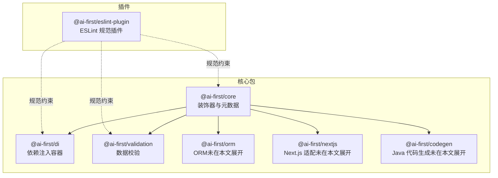
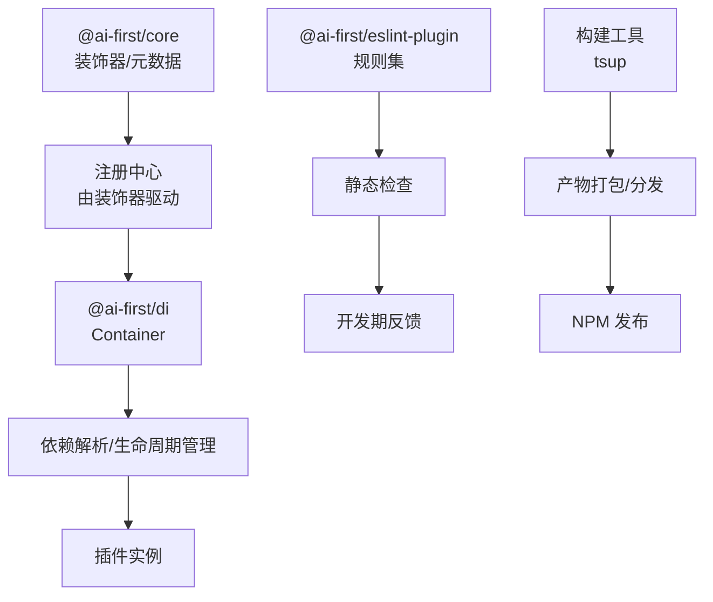
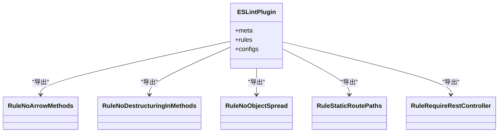
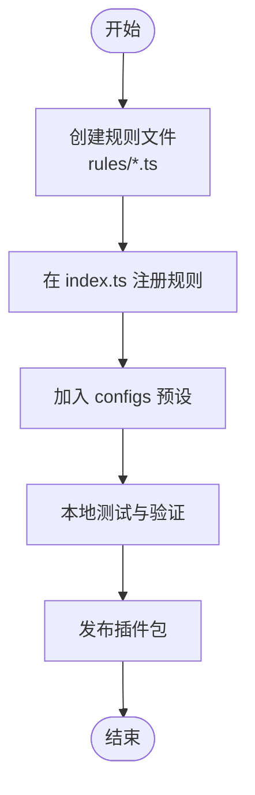
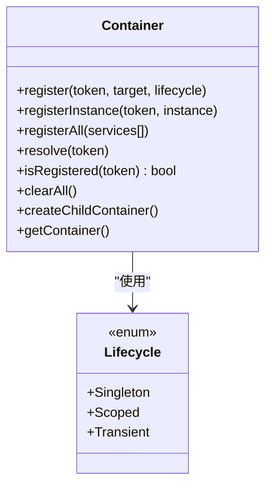
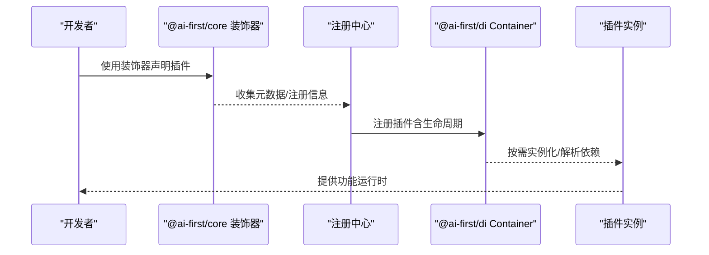
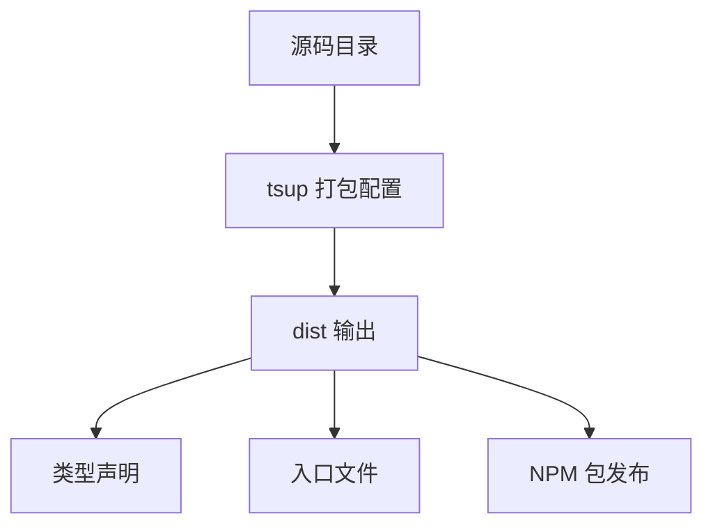
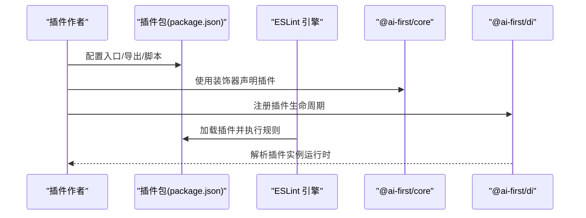
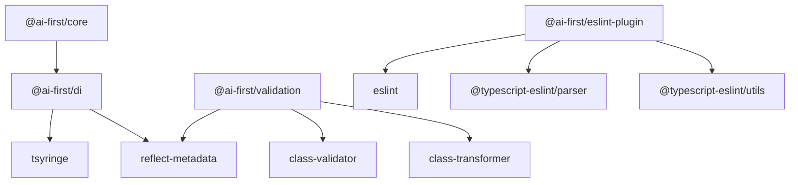

# 插件系统架构

<cite>
**本文引用的文件**
- [README.md](file://README.md)
- [packages/eslint-plugin/package.json](file://packages/eslint-plugin/package.json)
- [packages/eslint-plugin/src/index.ts](file://packages/eslint-plugin/src/index.ts)
- [packages/eslint-plugin/src/rules/no-arrow-methods.ts](file://packages/eslint-plugin/src/rules/no-arrow-methods.ts)
- [packages/eslint-plugin/src/rules/no-destructuring-in-methods.ts](file://packages/eslint-plugin/src/rules/no-destructuring-in-methods.ts)
- [packages/eslint-plugin/src/rules/no-object-spread.ts](file://packages/eslint-plugin/src/rules/no-object-spread.ts)
- [packages/eslint-plugin/src/rules/static-route-paths.ts](file://packages/eslint-plugin/src/rules/static-route-paths.ts)
- [packages/eslint-plugin/src/rules/require-rest-controller.ts](file://packages/eslint-plugin/src/rules/require-rest-controller.ts)
- [packages/di/package.json](file://packages/di/package.json)
- [packages/di/src/container.ts](file://packages/di/src/container.ts)
- [packages/core/package.json](file://packages/core/package.json)
- [packages/validation/package.json](file://packages/validation/package.json)
</cite>

## 目录
1. [简介](#简介)
2. [项目结构](#项目结构)
3. [核心组件](#核心组件)
4. [架构总览](#架构总览)
5. [详细组件分析](#详细组件分析)
6. [依赖关系分析](#依赖关系分析)
7. [性能考量](#性能考量)
8. [故障排查指南](#故障排查指南)
9. [结论](#结论)
10. [附录](#附录)

## 简介
本文件面向 AI-First Framework 的插件系统，系统化梳理其整体架构设计、插件接口定义、生命周期管理与动态加载机制；深入解析 ESLint 插件的开发流程（如何创建自定义 lint 规则与代码检查器）；详解构建工具插件的开发要点（以 tsup 插件为例）；说明插件与核心框架的集成方式（装饰器系统注册与管理）；提供从配置到运行时行为与错误处理的完整示例；覆盖插件的打包、分发与版本管理策略；最后介绍插件系统的扩展点与自定义机制。

## 项目结构
AI-First Framework 采用 monorepo 结构，核心包围绕“装饰器 + 依赖注入 + ORM + 校验 + 代码生成 + Next.js 适配 + ESLint 插件”组织。插件系统主要体现在以下位置：
- 核心装饰器与元数据系统：@ai-first/core
- 依赖注入容器：@ai-first/di
- 数据校验：@ai-first/validation
- 构建工具：各包使用 tsup 进行打包（如 @ai-first/di、@ai-first/core、@ai-first/validation）
- 代码规范插件：@ai-first/eslint-plugin

图表来源
- [README.md](file://README.md#L14-L34)
- [packages/core/package.json](file://packages/core/package.json#L1-L39)
- [packages/di/package.json](file://packages/di/package.json#L1-L53)
- [packages/validation/package.json](file://packages/validation/package.json#L1-L40)
- [packages/eslint-plugin/package.json](file://packages/eslint-plugin/package.json#L1-L45)

章节来源
- [README.md](file://README.md#L14-L34)

## 核心组件
- 装饰器系统与元数据：@ai-first/core 提供装饰器与反射元数据支持，是插件注册与管理的基础。
- 依赖注入容器：@ai-first/di 基于 TSyringe，提供生命周期（单例/作用域/瞬态）、批量注册、子容器等能力，用于插件实例化与管理。
- 数据校验：@ai-first/validation 基于 class-validator/class-transformer，提供装饰器风格的数据校验，可作为插件扩展点之一。
- 构建工具：各包使用 tsup 打包，便于插件与核心包统一构建与发布。
- ESLint 插件：@ai-first/eslint-plugin 提供一组规则，确保代码符合 Java 兼容风格与框架约定。

章节来源
- [packages/core/package.json](file://packages/core/package.json#L1-L39)
- [packages/di/package.json](file://packages/di/package.json#L1-L53)
- [packages/validation/package.json](file://packages/validation/package.json#L1-L40)
- [packages/eslint-plugin/package.json](file://packages/eslint-plugin/package.json#L1-L45)

## 架构总览
下图展示插件系统与核心框架的交互关系：装饰器系统负责声明式注册；DI 容器负责生命周期与依赖解析；ESLint 插件在开发期进行静态检查；构建工具负责产物打包与分发。

图表来源
- [packages/core/package.json](file://packages/core/package.json#L23-L26)
- [packages/di/src/container.ts](file://packages/di/src/container.ts#L22-L104)
- [packages/eslint-plugin/src/index.ts](file://packages/eslint-plugin/src/index.ts#L42-L52)

## 详细组件分析

### ESLint 插件：接口定义、规则与配置
- 插件入口导出：
  - meta：包含插件名称与版本信息
  - rules：规则映射表
  - configs：预设配置（如 recommended、strict）
- 规则清单（示例）：
  - no-arrow-methods：禁止在类方法中使用箭头函数
  - no-destructuring-in-methods：禁止在方法中使用解构赋值
  - no-object-spread：禁止对象展开
  - static-route-paths：要求路由路径为静态字符串
  - require-rest-controller：要求控制器使用特定注解
- 配置策略：
  - recommended：部分规则警告，部分错误
  - strict：全部规则错误，更严格

图表来源
- [packages/eslint-plugin/src/index.ts](file://packages/eslint-plugin/src/index.ts#L11-L17)
- [packages/eslint-plugin/src/index.ts](file://packages/eslint-plugin/src/index.ts#L19-L40)

章节来源
- [packages/eslint-plugin/src/index.ts](file://packages/eslint-plugin/src/index.ts#L1-L53)
- [packages/eslint-plugin/package.json](file://packages/eslint-plugin/package.json#L1-L45)

#### ESLint 规则开发流程（以某规则为例）
- 定义规则：在 rules 目录新增规则文件，遵循 ESLint 规则接口
- 在 index.ts 中注册规则与别名
- 在 configs 中添加规则到推荐或严格配置
- 导出插件对象

图表来源
- [packages/eslint-plugin/src/index.ts](file://packages/eslint-plugin/src/index.ts#L11-L17)
- [packages/eslint-plugin/src/index.ts](file://packages/eslint-plugin/src/index.ts#L19-L40)

### 依赖注入容器：生命周期与动态加载
- 生命周期枚举：Singleton、Scoped、Transient
- 关键能力：
  - register：按生命周期注册类
  - registerInstance：直接注册实例
  - registerAll：批量注册
  - resolve：解析依赖
  - isRegistered：查询注册状态
  - clearAll：清空注册（适合测试）
  - createChildContainer：创建子容器（作用域隔离）
  - getContainer：获取底层容器实例

图表来源
- [packages/di/src/container.ts](file://packages/di/src/container.ts#L10-L17)
- [packages/di/src/container.ts](file://packages/di/src/container.ts#L22-L104)

章节来源
- [packages/di/src/container.ts](file://packages/di/src/container.ts#L1-L105)
- [packages/di/package.json](file://packages/di/package.json#L1-L53)

#### 插件动态加载与生命周期管理
- 装饰器驱动注册：通过 @ai-first/core 的装饰器收集元数据，交由注册中心统一管理
- DI 容器接管：根据生命周期策略实例化与缓存插件
- 作用域隔离：使用子容器实现请求级或事务级作用域
- 清理与重置：测试或热更新场景下可清空注册并重建

图表来源
- [packages/core/package.json](file://packages/core/package.json#L23-L26)
- [packages/di/src/container.ts](file://packages/di/src/container.ts#L28-L46)

### 构建工具插件：tsup 配置与实现要点
- 各包统一使用 tsup 进行打包，支持：
  - 多目标输出（ESM/CJS）
  - 类型声明生成
  - watch 模式开发
- 对于 ESLint 插件：
  - package.json 中配置 main/types/exports
  - scripts 包含 build/dev
  - peerDependencies 指定 ESLint、TypeScript、parser 版本范围
- 对于 DI、core、validation 等：
  - 依赖 reflect-metadata
  - 通过 tsup 统一构建与清理

图表来源
- [packages/di/package.json](file://packages/di/package.json#L17-L26)
- [packages/core/package.json](file://packages/core/package.json#L17-L22)
- [packages/validation/package.json](file://packages/validation/package.json#L14-L20)
- [packages/eslint-plugin/package.json](file://packages/eslint-plugin/package.json#L17-L20)

章节来源
- [packages/di/package.json](file://packages/di/package.json#L1-L53)
- [packages/core/package.json](file://packages/core/package.json#L1-L39)
- [packages/validation/package.json](file://packages/validation/package.json#L1-L40)
- [packages/eslint-plugin/package.json](file://packages/eslint-plugin/package.json#L1-L45)

### 插件与核心框架的集成：装饰器系统
- @ai-first/core 通过装饰器与 reflect-metadata 提供声明式注册能力
- @ai-first/di 作为容器层承接生命周期与依赖解析
- 插件开发建议：
  - 使用装饰器声明插件元数据
  - 将插件类注册到 DI 容器，指定生命周期
  - 在运行时通过容器解析插件实例并调用

图表来源
- [packages/core/package.json](file://packages/core/package.json#L23-L26)
- [packages/di/src/container.ts](file://packages/di/src/container.ts#L22-L104)

章节来源
- [packages/core/package.json](file://packages/core/package.json#L1-L39)
- [packages/di/src/container.ts](file://packages/di/src/container.ts#L1-L105)

### 插件开发完整示例（流程与要点）
- 配置阶段
  - 在插件包中定义规则（ESLint）或类（DI）
  - 在 package.json 中声明入口、类型与导出
  - 设置 peerDependencies 与脚本
- 运行时行为
  - 通过装饰器注册插件元数据
  - 容器按生命周期解析插件实例
  - 在业务流程中注入并使用插件
- 错误处理
  - ESLint 规则返回错误/警告信息
  - DI 解析失败时抛出异常，可在上层捕获并提示修复

图表来源
- [packages/eslint-plugin/package.json](file://packages/eslint-plugin/package.json#L1-L45)
- [packages/core/package.json](file://packages/core/package.json#L23-L26)
- [packages/di/src/container.ts](file://packages/di/src/container.ts#L28-L46)

## 依赖关系分析
- @ai-first/core 依赖 @ai-first/di，体现“装饰器系统依赖 DI 容器”的设计
- @ai-first/di 依赖 tsyringe 与 reflect-metadata
- @ai-first/validation 依赖 class-validator、class-transformer 与 reflect-metadata
- @ai-first/eslint-plugin 依赖 @typescript-eslint/utils，并对 ESLint、TypeScript、parser 做 peerDependencies 约束

图表来源
- [packages/core/package.json](file://packages/core/package.json#L23-L26)
- [packages/di/package.json](file://packages/di/package.json#L27-L30)
- [packages/validation/package.json](file://packages/validation/package.json#L21-L25)
- [packages/eslint-plugin/package.json](file://packages/eslint-plugin/package.json#L28-L43)

章节来源
- [packages/core/package.json](file://packages/core/package.json#L1-L39)
- [packages/di/package.json](file://packages/di/package.json#L1-L53)
- [packages/validation/package.json](file://packages/validation/package.json#L1-L40)
- [packages/eslint-plugin/package.json](file://packages/eslint-plugin/package.json#L1-L45)

## 性能考量
- ESLint 插件规则应避免昂贵的 AST 遍历与正则匹配，优先使用轻量判断与缓存
- DI 容器尽量使用 Singleton 缓存无状态插件，减少实例化开销
- 构建阶段启用增量编译与并行任务，缩短开发等待时间
- 发布前进行体积分析，剔除冗余导出与未使用依赖

## 故障排查指南
- ESLint 规则不生效
  - 检查插件是否正确导出并在配置中启用
  - 确认规则别名与配置项一致
- DI 解析失败
  - 检查是否已注册对应 token
  - 确认生命周期设置是否合理
  - 若使用作用域，确认子容器创建与销毁时机
- 构建失败
  - 检查 peerDependencies 版本范围是否满足
  - 确认 tsup 配置与类型声明生成

章节来源
- [packages/eslint-plugin/src/index.ts](file://packages/eslint-plugin/src/index.ts#L19-L40)
- [packages/di/src/container.ts](file://packages/di/src/container.ts#L78-L82)
- [packages/eslint-plugin/package.json](file://packages/eslint-plugin/package.json#L28-L43)

## 结论
AI-First Framework 的插件系统以装饰器与 DI 容器为核心，结合 ESLint 插件与 tsup 构建工具，形成“声明式注册 + 生命周期管理 + 静态检查 + 统一打包”的闭环。该架构既保证了插件的可扩展性与可维护性，又兼顾了开发体验与运行效率。后续可在现有基础上进一步完善插件发现、热加载与版本治理能力。

## 附录
- 扩展点与自定义机制
  - 新增 ESLint 规则：在 rules 目录新增规则文件，在 index.ts 注册并加入 configs
  - 新增 DI 插件：使用装饰器声明元数据，通过 Container.register 注册，选择合适生命周期
  - 自定义构建：在各包的 tsup 配置中扩展输出格式与产物优化策略
- 打包、分发与版本管理
  - 使用 tsup 统一构建，确保类型声明与入口导出一致
  - 在 package.json 中明确 exports 字段与 peerDependencies
  - 通过语义化版本控制与变更日志管理插件版本