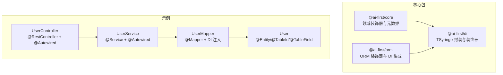
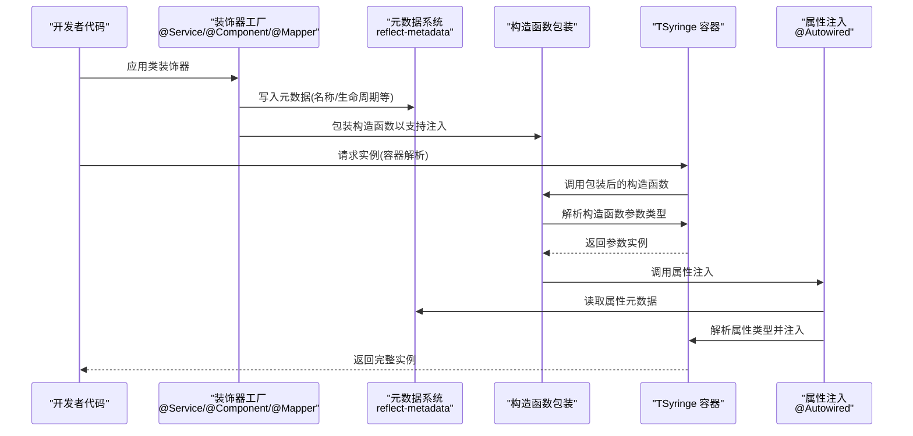
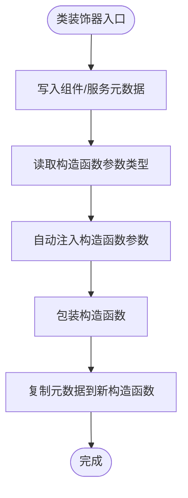
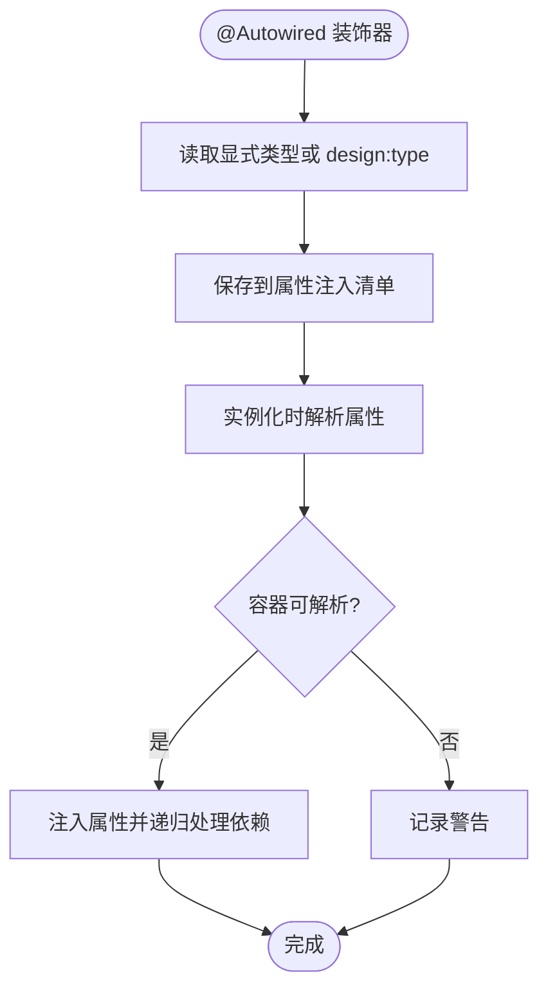
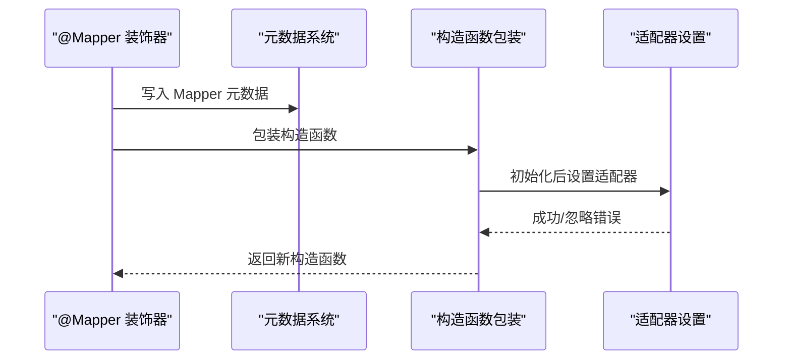
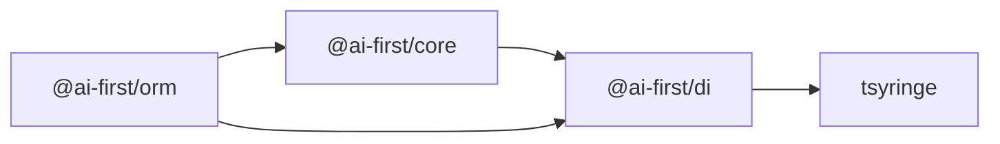

# 自定义装饰器开发

<cite>
**本文引用的文件**
- [packages/core/src/decorators.ts](file://packages/core/src/decorators.ts)
- [packages/core/src/index.ts](file://packages/core/src/index.ts)
- [packages/core/src/types.ts](file://packages/core/src/types.ts)
- [packages/di/src/decorators.ts](file://packages/di/src/decorators.ts)
- [packages/di/src/container.ts](file://packages/di/src/container.ts)
- [packages/di/src/index.ts](file://packages/di/src/index.ts)
- [packages/orm/src/decorators.ts](file://packages/orm/src/decorators.ts)
- [packages/core/package.json](file://packages/core/package.json)
- [packages/di/package.json](file://packages/di/package.json)
- [packages/orm/package.json](file://packages/orm/package.json)
- [app/examples/user-crud/packages/api/src/controller/user.controller.ts](file://app/examples/user-crud/packages/api/src/controller/user.controller.ts)
- [README.md](file://README.md)
</cite>

## 目录
1. [简介](#简介)
2. [项目结构](#项目结构)
3. [核心组件](#核心组件)
4. [架构总览](#架构总览)
5. [详细组件分析](#详细组件分析)
6. [依赖关系分析](#依赖关系分析)
7. [性能考量](#性能考量)
8. [故障排查指南](#故障排查指南)
9. [结论](#结论)
10. [附录](#附录)

## 简介
本指南面向希望在 AI-First Framework 中开发“自定义装饰器”的工程师，系统讲解装饰器工厂模式的实现原理、参数解析、元数据注册机制与反射 API 的使用；并提供完整示例，展示如何实现类似 @Autowired、@AutoRegister 的装饰器；说明装饰器与 TSyringe 容器的集成方式、服务注册与生命周期管理；覆盖装饰器元数据的存储与检索、装饰器链执行顺序；最后给出最佳实践与常见陷阱。

## 项目结构
AI-First Framework 采用 monorepo 结构，核心装饰器与 DI 容器位于 packages 目录：
- @ai-first/core：领域层装饰器（如 @Component、@Service、@Transactional）与元数据系统
- @ai-first/di：基于 TSyringe 的依赖注入容器与装饰器（如 @Autowired、@AutoRegister、@Injectable）
- @ai-first/orm：ORM 装饰器（如 @Entity/@TableName、@TableId、@TableField、@Mapper），并与 DI 协作
- 示例工程：app/examples/user-crud 展示控制器、服务、实体、Mapper 的组合使用

**图表来源**
- [packages/core/src/decorators.ts](file://packages/core/src/decorators.ts#L1-L158)
- [packages/di/src/decorators.ts](file://packages/di/src/decorators.ts#L1-L110)
- [packages/orm/src/decorators.ts](file://packages/orm/src/decorators.ts#L1-L224)
- [app/examples/user-crud/packages/api/src/controller/user.controller.ts](file://app/examples/user-crud/packages/api/src/controller/user.controller.ts#L1-L53)

**章节来源**
- [README.md](file://README.md#L14-L34)
- [packages/core/package.json](file://packages/core/package.json#L1-L39)
- [packages/di/package.json](file://packages/di/package.json#L1-L53)
- [packages/orm/package.json](file://packages/orm/package.json#L1-L54)

## 核心组件
- 装饰器工厂模式
  - 通过高阶函数返回装饰器函数，实现参数化配置与复用
  - 在目标类/方法/属性上写入元数据，供运行时读取
- 反射与元数据
  - 使用 reflect-metadata 记录设计时类型信息与自定义元数据
  - 通过 Reflect.getMetadata/Reflect.defineMetadata 读写元数据
- DI 集成
  - 基于 TSyringe 的 @Injectable、@Inject、@Singleton、@Scoped
  - 扩展 @Autowired、@AutoRegister，支持属性注入与自动注册
- 元数据检索
  - 提供 getter 函数读取装饰器元数据，如 getComponentMetadata、getServiceMetadata、getMapperMetadata 等

**章节来源**
- [packages/core/src/decorators.ts](file://packages/core/src/decorators.ts#L1-L158)
- [packages/di/src/decorators.ts](file://packages/di/src/decorators.ts#L1-L110)
- [packages/orm/src/decorators.ts](file://packages/orm/src/decorators.ts#L1-L224)

## 架构总览
下图展示了装饰器在运行时的调用链：类装饰器包装构造函数、自动注入构造函数参数、属性级 @Autowired 注入、TSyringe 容器解析依赖。

**图表来源**
- [packages/core/src/decorators.ts](file://packages/core/src/decorators.ts#L30-L118)
- [packages/di/src/decorators.ts](file://packages/di/src/decorators.ts#L42-L84)
- [packages/orm/src/decorators.ts](file://packages/orm/src/decorators.ts#L140-L193)

## 详细组件分析

### 组件 A：领域装饰器（@Component、@Service、@Transactional）
- 设计要点
  - 类装饰器：写入服务/组件元数据，自动注入构造函数参数，包装构造函数以支持属性注入
  - 方法装饰器：为事务方法添加元数据并在调用前后打印日志（示例）
- 参数解析与元数据
  - 读取设计时类型信息（design:paramtypes），用于自动注入
  - 通过 Reflect.defineMetadata 写入自定义元数据（名称、描述等）
- 错误处理
  - 包装构造函数，保留原构造函数原型与静态属性
  - 复制已有元数据，避免丢失

**图表来源**
- [packages/core/src/decorators.ts](file://packages/core/src/decorators.ts#L30-L118)

**章节来源**
- [packages/core/src/decorators.ts](file://packages/core/src/decorators.ts#L1-L158)
- [packages/core/src/types.ts](file://packages/core/src/types.ts#L1-L14)

### 组件 B：DI 装饰器（@Autowired、@AutoRegister、@Injectable/@Inject）
- 设计要点
  - @Autowired：记录属性注入清单，支持显式类型或从 design:type 推断
  - @AutoRegister：根据生命周期选项自动注册到 TSyringe
  - @Injectable/@Singleton/@Scoped：直接 re-export TSyringe 能力
- 参数验证与错误处理
  - 属性注入时若容器无法解析，记录警告但不中断流程
  - 递归注入依赖，使用 visited 集合避免循环依赖导致的无限递归
- 生命周期管理
  - 通过 AutoRegister 的 lifecycle 选项选择 singleton/scoped/transient

**图表来源**
- [packages/di/src/decorators.ts](file://packages/di/src/decorators.ts#L42-L84)

**章节来源**
- [packages/di/src/decorators.ts](file://packages/di/src/decorators.ts#L1-L110)
- [packages/di/src/index.ts](file://packages/di/src/index.ts#L1-L34)

### 组件 C：ORM 装饰器（@Entity/@TableName、@TableId、@TableField、@Mapper）
- 设计要点
  - 类装饰器：记录实体元数据（表名、schema 等）
  - 属性装饰器：记录主键与字段元数据（列名、填充策略等）
  - @Mapper：自动注入构造函数参数、标记为可注入与单例、包装构造函数以自动设置适配器
- 与 DI 的协作
  - @Mapper 内部调用 inject(...) 注入依赖，再应用 Injectable()/Singleton()
  - 构造函数包装中检测数据库是否初始化，动态设置适配器

**图表来源**
- [packages/orm/src/decorators.ts](file://packages/orm/src/decorators.ts#L140-L193)

**章节来源**
- [packages/orm/src/decorators.ts](file://packages/orm/src/decorators.ts#L1-L224)

### 组件 D：容器封装（Container 与生命周期）
- 设计要点
  - Container 封装 TSyringe 的 register/registerInstance/registerAll/resolve/isRegistered/clearAll/createChildContainer/getContainer
  - Lifecycle 枚举统一生命周期语义（singleton/scoped/transient）
- 使用建议
  - 通过 registerAll 批量注册服务，减少重复样板代码
  - 测试场景使用 clearAll 清理状态

**章节来源**
- [packages/di/src/container.ts](file://packages/di/src/container.ts#L1-L105)

### 组件 E：示例工程中的装饰器使用
- 控制器使用 @Autowired 注入服务
- 服务使用 @Service 标注并被容器管理
- 实体与 Mapper 使用 ORM 装饰器并由 DI 管理

**章节来源**
- [app/examples/user-crud/packages/api/src/controller/user.controller.ts](file://app/examples/user-crud/packages/api/src/controller/user.controller.ts#L1-L53)

## 依赖关系分析
- @ai-first/core 依赖 @ai-first/di，用于在领域装饰器中复用 DI 能力
- @ai-first/orm 同时依赖 @ai-first/core 与 @ai-first/di，既使用其元数据系统，又复用 DI 注入能力
- TSyringe 作为底层容器，提供注入生命周期与容器管理能力

**图表来源**
- [packages/core/package.json](file://packages/core/package.json#L23-L26)
- [packages/orm/package.json](file://packages/orm/package.json#L23-L26)
- [packages/di/package.json](file://packages/di/package.json#L27-L30)

**章节来源**
- [packages/core/package.json](file://packages/core/package.json#L1-L39)
- [packages/di/package.json](file://packages/di/package.json#L1-L53)
- [packages/orm/package.json](file://packages/orm/package.json#L1-L54)

## 性能考量
- 元数据读写开销
  - 反射与元数据操作在类装饰器阶段进行，通常发生在模块加载时，对运行时影响较小
- 构造函数包装
  - 包装仅在类装饰器阶段发生一次，运行时仅触发少量逻辑（属性注入）
- 递归属性注入
  - 使用 visited 集合避免重复解析，注意控制依赖树深度，防止过深递归导致栈溢出
- 生命周期选择
  - singleton 适合无状态服务，scoped 适合请求上下文隔离，transient 适合轻量对象

[本节为通用指导，无需列出具体文件来源]

## 故障排查指南
- 属性注入失败
  - 现象：属性未被注入，出现空值
  - 排查：确认 @Autowired 的类型是否正确，容器是否已注册该类型；检查 getAutowiredProperties 与 injectAutowiredProperties 的调用链
- 构造函数注入异常
  - 现象：实例化时报错
  - 排查：检查 TSyringe 是否已注册构造函数参数类型；确认包装后的构造函数是否正确调用
- 循环依赖
  - 现象：递归注入导致死循环或性能问题
  - 排查：使用 visited 集合避免重复解析；重构依赖关系，拆分职责
- 元数据缺失
  - 现象：运行时读取不到元数据
  - 排查：确保在类装饰器阶段已写入元数据；检查 Reflect.getMetadata/Reflect.defineMetadata 的 key 是否一致

**章节来源**
- [packages/di/src/decorators.ts](file://packages/di/src/decorators.ts#L67-L84)

## 结论
AI-First Framework 的装饰器体系以“装饰器工厂 + 反射元数据 + TSyringe 容器”为核心，提供了可扩展、可组合的 DI 与领域建模能力。通过统一的生命周期管理与元数据检索接口，开发者可以快速构建自定义装饰器并融入现有生态。遵循本文的最佳实践与排错建议，可在保证类型安全的同时获得良好的开发体验与运行时性能。

[本节为总结性内容，无需列出具体文件来源]

## 附录

### A. 如何创建自定义装饰器（步骤与模板）
- 步骤
  - 明确装饰目标：类/方法/属性
  - 设计参数结构与默认值
  - 在装饰器工厂中写入元数据
  - 若需要注入，结合 TSyringe 的 inject/Injectable 等能力
  - 提供对应的元数据读取函数
- 模板参考
  - 类装饰器模板：参考 @Service/@Component 的实现
  - 属性装饰器模板：参考 @Autowired 的实现
  - 方法装饰器模板：参考 @Transactional 的实现

**章节来源**
- [packages/core/src/decorators.ts](file://packages/core/src/decorators.ts#L30-L143)
- [packages/di/src/decorators.ts](file://packages/di/src/decorators.ts#L42-L107)

### B. 与 TSyringe 的集成要点
- 自动注册
  - 使用 @AutoRegister 或手动调用 Container.register/Container.registerAll
- 生命周期
  - singleton：全局唯一实例
  - scoped：容器作用域内共享
  - transient：每次解析创建新实例
- 容器管理
  - 使用 Container.resolve 获取实例
  - 使用 Container.clearAll 清理测试状态

**章节来源**
- [packages/di/src/decorators.ts](file://packages/di/src/decorators.ts#L89-L107)
- [packages/di/src/container.ts](file://packages/di/src/container.ts#L28-L96)

### C. 装饰器链执行顺序
- 类装饰器先于属性/方法装饰器执行
- 构造函数包装在实例化时执行，随后执行属性注入
- 依赖解析遵循 TSyringe 的生命周期规则

**章节来源**
- [packages/core/src/decorators.ts](file://packages/core/src/decorators.ts#L81-L118)
- [packages/di/src/decorators.ts](file://packages/di/src/decorators.ts#L42-L84)