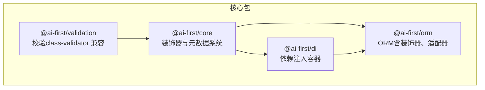
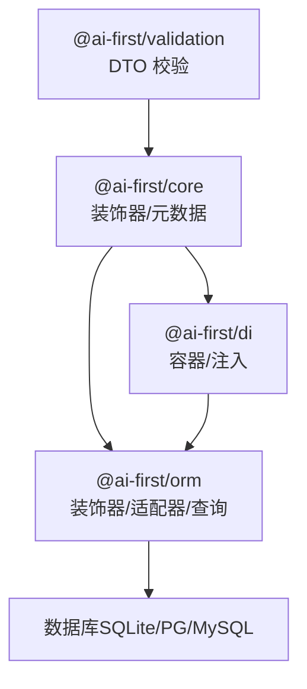
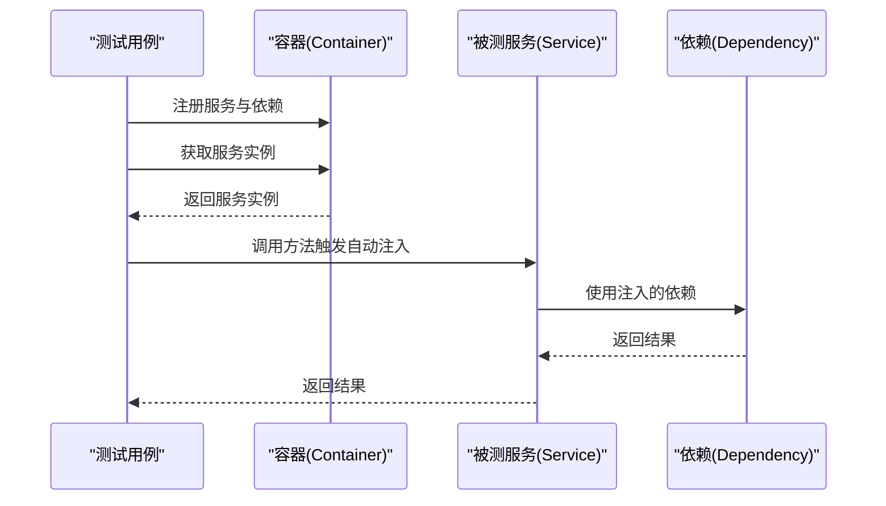
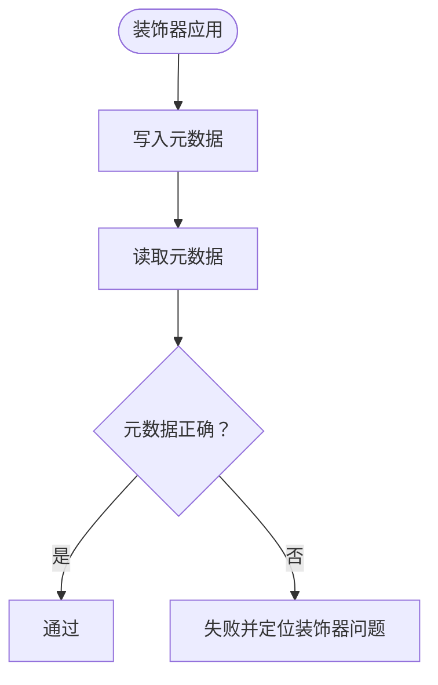
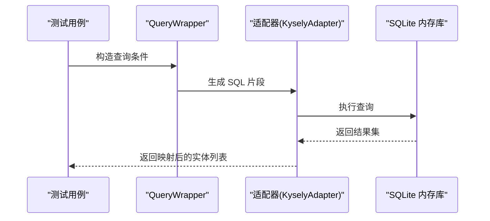
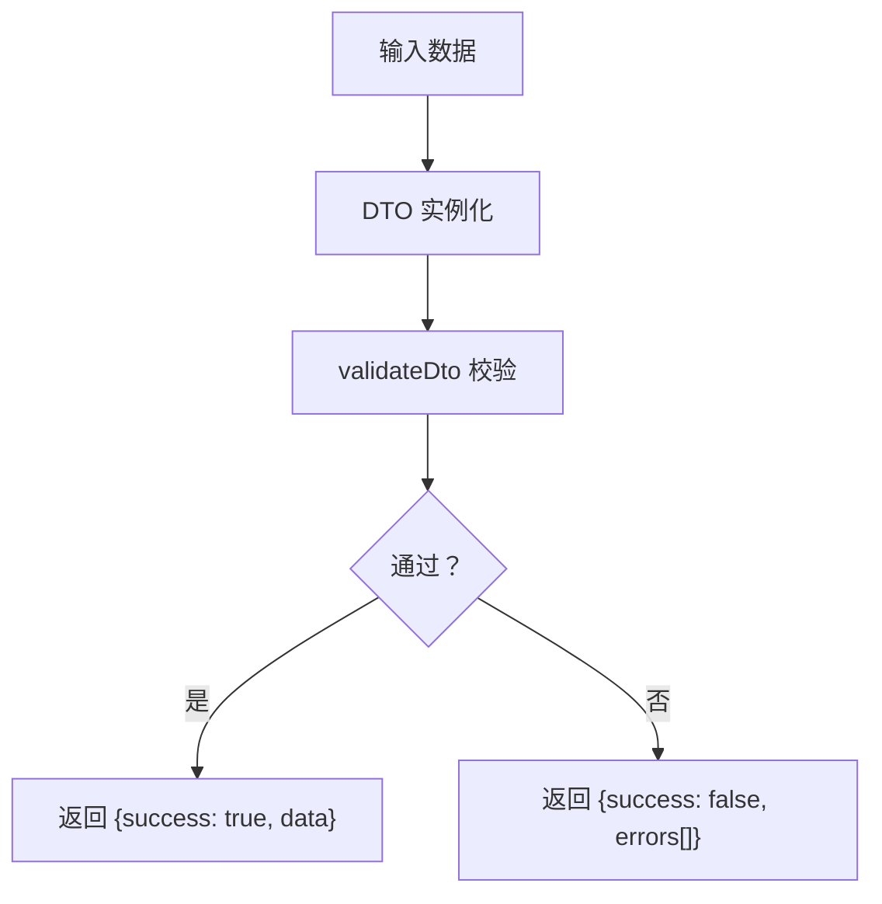
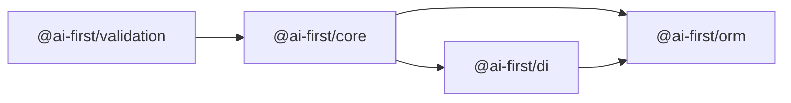

# 测试策略

<cite>
**本文引用的文件**
- [README.md](file://README.md)
- [packages/di/package.json](file://packages/di/package.json)
- [packages/core/package.json](file://packages/core/package.json)
- [packages/orm/package.json](file://packages/orm/package.json)
- [packages/validation/package.json](file://packages/validation/package.json)
- [packages/orm/src/index.ts](file://packages/orm/src/index.ts)
- [packages/validation/src/index.ts](file://packages/validation/src/index.ts)
</cite>

## 目录
1. [引言](#引言)
2. [项目结构](#项目结构)
3. [核心组件](#核心组件)
4. [架构总览](#架构总览)
5. [详细组件分析](#详细组件分析)
6. [依赖分析](#依赖分析)
7. [性能考量](#性能考量)
8. [故障排查指南](#故障排查指南)
9. [结论](#结论)
10. [附录](#附录)

## 引言
本测试策略文档面向 AI-First Framework 的单元与集成测试，聚焦以下目标：
- 单元测试最佳实践：依赖注入容器的测试模拟、装饰器行为的测试、业务逻辑隔离测试
- 集成测试设计方法：数据库测试、API 端到端测试、依赖关系测试
- 测试数据管理：测试数据生成、数据库重置与状态清理
- Mock 与 Stub 技巧：装饰器与依赖注入的测试模拟
- 测试覆盖率与质量保证流程
- 持续集成中的测试自动化与并行执行策略

## 项目结构
AI-First Framework 采用 monorepo 结构，核心包围绕“装饰器 + 依赖注入 + ORM + 校验 + Next.js 适配 + 代码生成”展开。下图展示与测试相关的关键模块及其导出入口。

图表来源
- [packages/core/package.json](file://packages/core/package.json#L1-L39)
- [packages/di/package.json](file://packages/di/package.json#L1-L53)
- [packages/orm/package.json](file://packages/orm/package.json#L1-L54)
- [packages/validation/package.json](file://packages/validation/package.json#L1-L40)

章节来源
- [README.md](file://README.md#L14-L34)
- [packages/core/package.json](file://packages/core/package.json#L1-L39)
- [packages/di/package.json](file://packages/di/package.json#L1-L53)
- [packages/orm/package.json](file://packages/orm/package.json#L1-L54)
- [packages/validation/package.json](file://packages/validation/package.json#L1-L40)

## 核心组件
- 装饰器与元数据系统（@ai-first/core）
  - 提供实体、字段、映射器等装饰器及元数据读取能力，是 ORM 与 DI 的基础
- 依赖注入容器（@ai-first/di）
  - 基于 TSyringe，提供容器封装、生命周期、自动注入、React 集成等
- ORM（@ai-first/orm）
  - 提供 MyBatis-Plus 风格的装饰器、查询包装器、适配器与多数据库工厂
- 校验（@ai-first/validation）
  - 基于 class-validator/class-transformer，提供 DTO 校验与前端表单解析器

章节来源
- [packages/core/package.json](file://packages/core/package.json#L1-L39)
- [packages/di/package.json](file://packages/di/package.json#L1-L53)
- [packages/orm/package.json](file://packages/orm/package.json#L1-L54)
- [packages/validation/package.json](file://packages/validation/package.json#L1-L40)
- [packages/orm/src/index.ts](file://packages/orm/src/index.ts#L1-L72)
- [packages/validation/src/index.ts](file://packages/validation/src/index.ts#L1-L225)

## 架构总览
下图展示测试关注点：装饰器元数据、DI 注入链路、ORM 映射与查询、校验链路，以及它们在单元与集成测试中的交互。

图表来源
- [packages/core/package.json](file://packages/core/package.json#L23-L26)
- [packages/di/package.json](file://packages/di/package.json#L27-L30)
- [packages/orm/package.json](file://packages/orm/package.json#L23-L29)
- [packages/validation/package.json](file://packages/validation/package.json#L21-L25)

## 详细组件分析

### 依赖注入容器测试策略（@ai-first/di）
- 测试目标
  - 容器注册与作用域（Singleton/Scoped/AutoRegister）行为
  - 自动注入（构造函数/属性）的正确性
  - 装饰器与反射元数据的配合
  - React 集成（Provider/useInjection）在测试环境中的可用性
- 关键测试点
  - 注册实例与获取实例一致性
  - 多级依赖链的注入与生命周期
  - 循环依赖检测与错误处理
  - 通过 Mock 替换真实实现，验证上层逻辑
- 推荐工具
  - 使用容器的内存模式进行快速单元测试
  - 对外部依赖（如数据库连接）进行接口抽象与 Stub

图表来源
- [packages/di/package.json](file://packages/di/package.json#L7-L24)

章节来源
- [packages/di/package.json](file://packages/di/package.json#L1-L53)

### 装饰器行为测试策略（@ai-first/core）
- 测试目标
  - 装饰器对类与属性的元数据写入是否正确
  - 元数据读取 API（如 getEntityMetadata/getMapperMetadata）的行为
  - 装饰器组合与优先级
- 关键测试点
  - 在不同装饰器组合下的元数据一致性
  - 元数据缓存与重复装饰的幂等性
  - 与 DI/ORM 的协作（例如通过元数据驱动的自动注册）
- 推荐工具
  - 使用最小化测试上下文，避免真实数据库或网络依赖
  - 对反射 API 进行白盒断言

图表来源
- [packages/orm/src/index.ts](file://packages/orm/src/index.ts#L16-L35)

章节来源
- [packages/orm/src/index.ts](file://packages/orm/src/index.ts#L1-L72)

### ORM 与数据库测试策略（@ai-first/orm）
- 测试目标
  - 实体映射与查询包装器的正确性
  - 多数据库适配器（SQLite/PG/MySQL）的一致性
  - 查询条件、排序、分页等组合场景
- 关键测试点
  - 基于 SQLite 的内存数据库进行快速集成测试
  - 使用事务回滚与表重建，确保测试隔离
  - 对复杂查询（嵌套条件、联表、聚合）进行回归测试
- 推荐工具
  - 使用 better-sqlite3 作为测试数据库，速度快且易重置
  - 对 KyselyAdapter 进行接口抽象，便于替换与 Mock

图表来源
- [packages/orm/package.json](file://packages/orm/package.json#L26-L29)
- [packages/orm/src/index.ts](file://packages/orm/src/index.ts#L48-L71)

章节来源
- [packages/orm/package.json](file://packages/orm/package.json#L1-L54)
- [packages/orm/src/index.ts](file://packages/orm/src/index.ts#L1-L72)

### 校验与 DTO 测试策略（@ai-first/validation）
- 测试目标
  - DTO 字段约束的正确性与错误消息格式
  - 与前端表单解析器（createResolver）的集成
  - 与 Java 转译映射（JAVA_VALIDATION_MAPPING）的一致性
- 关键测试点
  - 各类约束（长度、范围、格式、嵌套）的边界值测试
  - validateDto 与 createResolver 的返回结构一致性
  - 与 class-validator 的兼容性回归
- 推荐工具
  - 使用小而精的 DTO 类进行参数化测试
  - 对 createResolver 的错误映射进行契约测试

图表来源
- [packages/validation/src/index.ts](file://packages/validation/src/index.ts#L115-L137)
- [packages/validation/src/index.ts](file://packages/validation/src/index.ts#L173-L191)

章节来源
- [packages/validation/src/index.ts](file://packages/validation/src/index.ts#L1-L225)

### API 端到端测试策略（Next.js 适配层）
- 测试目标
  - 控制器路由与请求处理的端到端验证
  - 与 DI/ORM/校验的完整链路测试
- 关键测试点
  - 使用 Next.js 测试工具（如 @testing-library/react 或 vitest+msw）启动最小化服务
  - Mock 外部依赖（数据库、第三方 API），聚焦业务逻辑
  - 覆盖常见 HTTP 方法与状态码
- 推荐工具
  - 使用内存数据库与容器 Mock，缩短测试时间
  - 对响应体结构与错误处理进行断言

（本节为概念性内容，不直接分析具体文件）

## 依赖分析
- 包间依赖
  - @ai-first/core 为基础设施，被 @ai-first/di 与 @ai-first/orm 依赖
  - @ai-first/validation 与 @ai-first/core 协作，提供校验能力
- 测试耦合度
  - 单元测试应尽量通过接口抽象隔离具体实现
  - 集成测试覆盖关键路径，避免过度耦合

图表来源
- [packages/core/package.json](file://packages/core/package.json#L23-L26)
- [packages/di/package.json](file://packages/di/package.json#L27-L30)
- [packages/orm/package.json](file://packages/orm/package.json#L23-L26)
- [packages/validation/package.json](file://packages/validation/package.json#L21-L25)

章节来源
- [packages/core/package.json](file://packages/core/package.json#L1-L39)
- [packages/di/package.json](file://packages/di/package.json#L1-L53)
- [packages/orm/package.json](file://packages/orm/package.json#L1-L54)
- [packages/validation/package.json](file://packages/validation/package.json#L1-L40)

## 性能考量
- 单元测试
  - 使用内存容器与内存数据库，避免 IO 开销
  - 将 Mock 与 Stub 放在测试前置中，减少重复创建
- 集成测试
  - 使用事务回滚与表重建，避免全量重建数据库
  - 对热点路径进行基准测试，识别回归
- 并行执行
  - 单元测试可并行；集成测试需串行或按数据库隔离
  - 利用 CI 并行矩阵，按包拆分任务

（本节提供一般性指导，不直接分析具体文件）

## 故障排查指南
- 装饰器未生效
  - 检查 reflect-metadata 是否在入口处导入
  - 确认装饰器顺序与元数据写入时机
- DI 注入失败
  - 核对注册 Token 与注入类型是否一致
  - 检查作用域与生命周期设置
- ORM 查询异常
  - 使用最小化查询条件复现
  - 对比不同数据库适配器的 SQL 输出
- 校验不一致
  - 对比 validateDto 与 createResolver 的错误映射
  - 核对 class-validator 版本与兼容性

章节来源
- [packages/validation/src/index.ts](file://packages/validation/src/index.ts#L26-L27)
- [packages/orm/src/index.ts](file://packages/orm/src/index.ts#L16-L35)
- [packages/di/package.json](file://packages/di/package.json#L27-L30)

## 结论
通过以装饰器与元数据为核心、以 DI 为装配枢纽、以 ORM 为数据通道、以校验为边界约束的测试体系，AI-First Framework 可在单元与集成层面实现高覆盖率与高稳定性。建议在 CI 中结合并行执行与隔离数据库，持续提升测试效率与质量。

## 附录
- 测试数据管理建议
  - 使用固定种子与可预测的数据生成器
  - 采用事务回滚或数据库快照恢复
  - 对外部依赖进行稳定 Mock，避免环境波动
- 覆盖率与质量门禁
  - 设定关键模块的行/分支/指令覆盖率阈值
  - 对核心路径（DI、ORM、校验）进行强制覆盖
- 持续集成
  - 分包并行执行，减少总耗时
  - 使用缓存与增量构建，加速重复任务