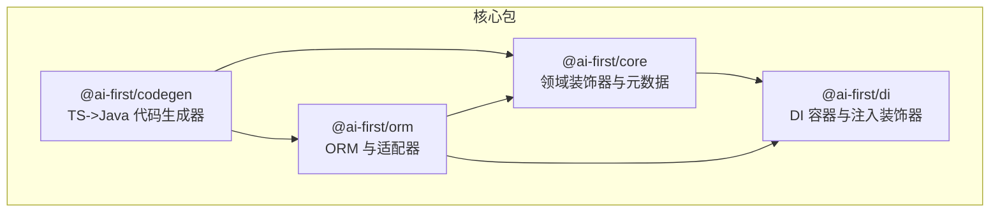
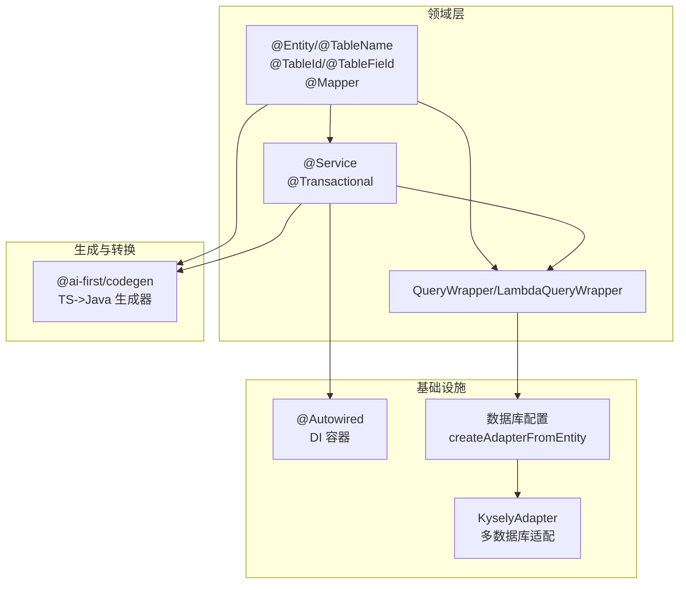
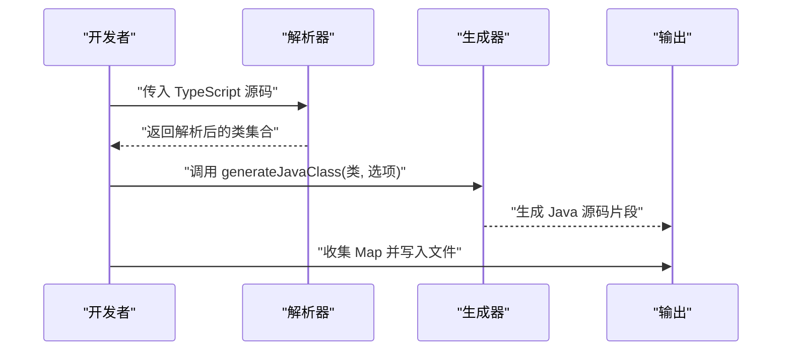
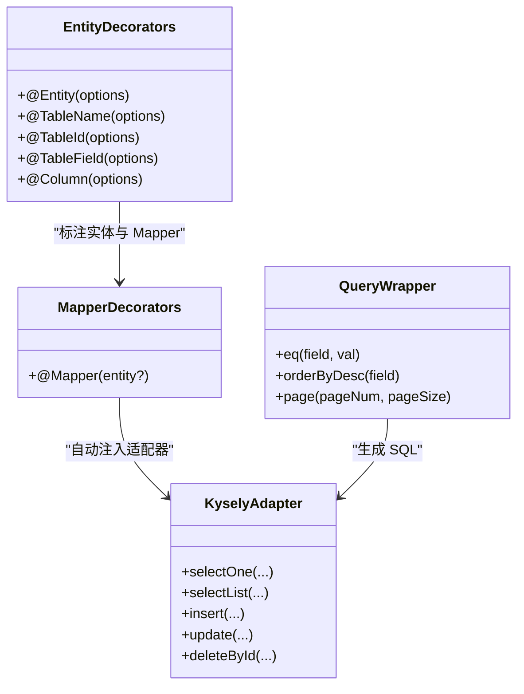
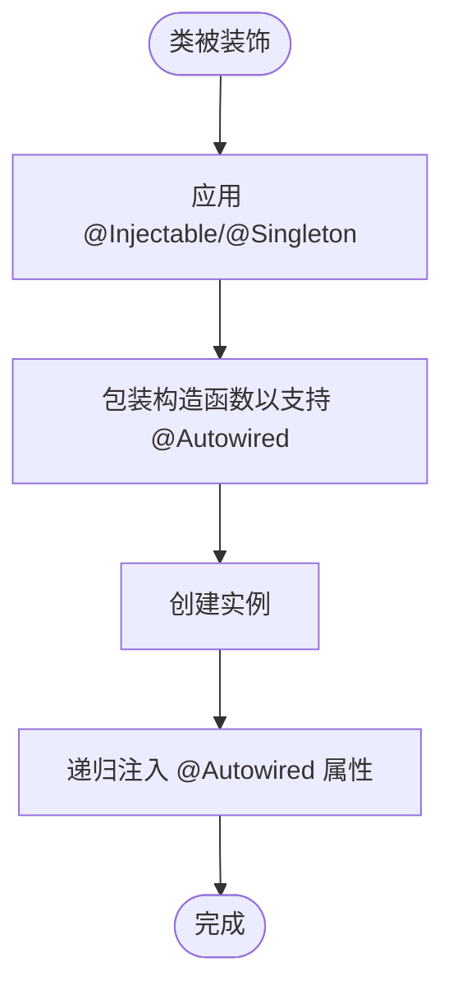
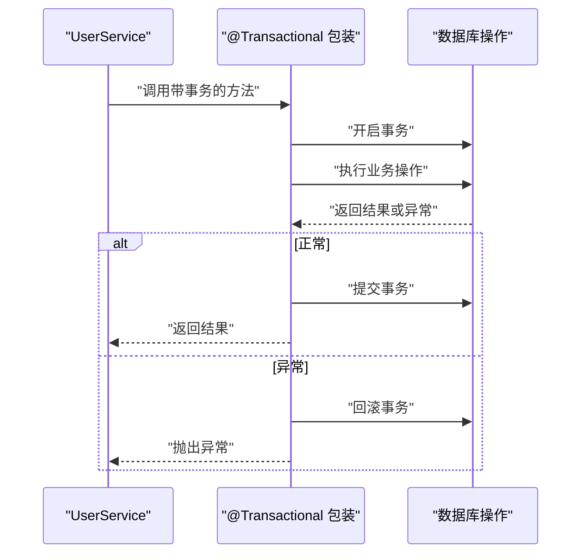
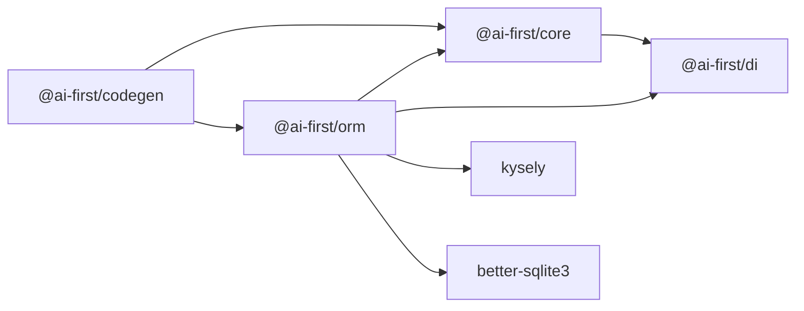

# 高级主题

<cite>
**本文引用的文件**
- [README.md](file://README.md)
- [packages/codegen/package.json](file://packages/codegen/package.json)
- [packages/orm/package.json](file://packages/orm/package.json)
- [packages/core/package.json](file://packages/core/package.json)
- [packages/di/package.json](file://packages/di/package.json)
- [packages/core/src/index.ts](file://packages/core/src/index.ts)
- [packages/core/src/decorators.ts](file://packages/core/src/decorators.ts)
- [packages/di/src/index.ts](file://packages/di/src/index.ts)
- [packages/di/src/decorators.ts](file://packages/di/src/decorators.ts)
- [packages/orm/src/index.ts](file://packages/orm/src/index.ts)
- [packages/orm/src/decorators.ts](file://packages/orm/src/decorators.ts)
- [packages/codegen/src/index.ts](file://packages/codegen/src/index.ts)
- [packages/codegen/src/generator.ts](file://packages/codegen/src/generator.ts)
</cite>

## 目录
1. [简介](#简介)
2. [项目结构](#项目结构)
3. [核心组件](#核心组件)
4. [架构总览](#架构总览)
5. [详细组件分析](#详细组件分析)
6. [依赖关系分析](#依赖关系分析)
7. [性能考量](#性能考量)
8. [故障排除指南](#故障排除指南)
9. [结论](#结论)
10. [附录](#附录)

## 简介
本高级主题文档聚焦于 AI-First Framework 的三大核心能力：TypeScript 到 Java 的代码生成器、ORM 的高级查询与数据库适配器扩展、以及 DI 容器与装饰器体系。文档将从架构视角解释这些能力如何协同工作，如何在企业级场景中进行扩展与优化，并提供故障排除与安全最佳实践。

## 项目结构
该仓库采用 monorepo 结构，核心包包括：
- @ai-first/core：领域层装饰器与元数据系统
- @ai-first/di：基于 TSyringe 的依赖注入容器
- @ai-first/orm：MyBatis-Plus 风格 ORM，支持多数据库与装饰器驱动
- @ai-first/codegen：TypeScript 到 Java 的代码生成器（含前端 API 客户端生成）

图表来源
- [packages/core/src/index.ts](file://packages/core/src/index.ts#L1-L22)
- [packages/di/src/index.ts](file://packages/di/src/index.ts#L1-L34)
- [packages/orm/src/index.ts](file://packages/orm/src/index.ts#L1-L72)
- [packages/codegen/src/index.ts](file://packages/codegen/src/index.ts#L1-L33)

章节来源
- [README.md](file://README.md#L14-L34)
- [packages/core/src/index.ts](file://packages/core/src/index.ts#L1-L22)
- [packages/di/src/index.ts](file://packages/di/src/index.ts#L1-L34)
- [packages/orm/src/index.ts](file://packages/orm/src/index.ts#L1-L72)
- [packages/codegen/src/index.ts](file://packages/codegen/src/index.ts#L1-L33)

## 核心组件
- 装饰器与元数据系统：提供 @Component、@Service、@Transactional 等领域层装饰器，结合 reflect-metadata 实现运行时元数据读取与方法包装。
- 依赖注入容器：基于 TSyringe，提供 @Autowired、@Inject、@Injectable、@Singleton 等装饰器，支持构造函数与属性注入。
- ORM 与适配器：提供 @Entity/@TableName、@TableId、@TableField、@Mapper 等装饰器；封装 QueryWrapper/LambdaQueryWrapper；支持多数据库适配器（PostgreSQL、SQLite、MySQL）。
- 代码生成器：解析 TypeScript 源码，识别装饰器与类型，生成 Java Spring Boot + MyBatis-Plus 代码及前端 API 客户端代码。

章节来源
- [packages/core/src/decorators.ts](file://packages/core/src/decorators.ts#L1-L158)
- [packages/di/src/decorators.ts](file://packages/di/src/decorators.ts#L1-L110)
- [packages/orm/src/decorators.ts](file://packages/orm/src/decorators.ts#L1-L224)
- [packages/codegen/src/generator.ts](file://packages/codegen/src/generator.ts#L1-L381)

## 架构总览
下图展示了从“领域模型与服务”到“数据库适配器与代码生成”的整体流程：

图表来源
- [packages/orm/src/decorators.ts](file://packages/orm/src/decorators.ts#L68-L193)
- [packages/orm/src/index.ts](file://packages/orm/src/index.ts#L7-L72)
- [packages/core/src/decorators.ts](file://packages/core/src/decorators.ts#L81-L143)
- [packages/di/src/decorators.ts](file://packages/di/src/decorators.ts#L42-L84)
- [packages/codegen/src/generator.ts](file://packages/codegen/src/generator.ts#L11-L74)

## 详细组件分析

### 组件一：代码生成器（TypeScript → Java）
- 输入：装饰器标记的 TypeScript 类（实体、Mapper、Service、Controller）
- 解析：解析源码，提取类、字段、方法、参数与装饰器信息
- 转换：根据装饰器映射生成 Java 类型、注解与方法骨架
- 输出：Java 源码 Map（类名.java → 源码），并可生成前端 API 客户端

图表来源
- [packages/codegen/src/index.ts](file://packages/codegen/src/index.ts#L16-L32)
- [packages/codegen/src/generator.ts](file://packages/codegen/src/generator.ts#L11-L74)

章节来源
- [packages/codegen/src/index.ts](file://packages/codegen/src/index.ts#L1-L33)
- [packages/codegen/src/generator.ts](file://packages/codegen/src/generator.ts#L1-L381)
- [packages/codegen/package.json](file://packages/codegen/package.json#L1-L28)

### 组件二：ORM 高级查询与适配器
- 装饰器驱动：@Entity/@TableName、@TableId、@TableField、@Mapper
- 查询构造：QueryWrapper/LambdaQueryWrapper 支持等值、排序、分页等条件
- 适配器：KyselyAdapter 封装不同数据库方言，统一 CRUD 语义
- 生命周期：@Mapper 装饰器在实例化时自动注入适配器（若数据库已初始化）

图表来源
- [packages/orm/src/decorators.ts](file://packages/orm/src/decorators.ts#L68-L193)
- [packages/orm/src/index.ts](file://packages/orm/src/index.ts#L47-L71)

章节来源
- [packages/orm/src/decorators.ts](file://packages/orm/src/decorators.ts#L1-L224)
- [packages/orm/src/index.ts](file://packages/orm/src/index.ts#L1-L72)
- [packages/orm/package.json](file://packages/orm/package.json#L1-L54)

### 组件三：DI 容器与装饰器（属性注入与生命周期）
- 注入装饰器：@Autowired、@Inject、@Injectable、@Singleton、@Scoped、@AutoRegister
- 属性注入：支持在实例化后递归注入 @Autowired 属性，避免循环依赖死锁
- 生命周期：支持 singleton/scoped/transient，配合 @AutoRegister 快速注册

图表来源
- [packages/di/src/decorators.ts](file://packages/di/src/decorators.ts#L42-L84)
- [packages/core/src/decorators.ts](file://packages/core/src/decorators.ts#L30-L66)

章节来源
- [packages/di/src/decorators.ts](file://packages/di/src/decorators.ts#L1-L110)
- [packages/di/src/index.ts](file://packages/di/src/index.ts#L1-L34)
- [packages/core/src/decorators.ts](file://packages/core/src/decorators.ts#L1-L158)
- [packages/di/package.json](file://packages/di/package.json#L1-L53)

### 组件四：领域装饰器（事务与组件）
- @Component：通用组件，自动注册到 DI 容器，支持构造函数与属性注入
- @Service：领域服务，自动注册与注入，适合业务逻辑封装
- @Transactional：方法级事务包装，统一开启/提交/回滚日志

图表来源
- [packages/core/src/decorators.ts](file://packages/core/src/decorators.ts#L125-L143)

章节来源
- [packages/core/src/decorators.ts](file://packages/core/src/decorators.ts#L1-L158)
- [packages/core/src/index.ts](file://packages/core/src/index.ts#L1-L22)
- [packages/core/package.json](file://packages/core/package.json#L1-L39)

## 依赖关系分析
- @ai-first/orm 依赖 @ai-first/core 与 @ai-first/di，用于装饰器与 DI 能力
- @ai-first/di 基于 tsyringe，提供注入与生命周期管理
- @ai-first/codegen 依赖 TypeScript 编译器，解析源码并生成 Java 代码
- @ai-first/orm 内部依赖 kysely 与 better-sqlite3，支持多数据库

图表来源
- [packages/orm/package.json](file://packages/orm/package.json#L23-L28)
- [packages/di/package.json](file://packages/di/package.json#L27-L29)
- [packages/codegen/package.json](file://packages/codegen/package.json#L21-L22)

章节来源
- [packages/orm/package.json](file://packages/orm/package.json#L1-L54)
- [packages/di/package.json](file://packages/di/package.json#L1-L53)
- [packages/codegen/package.json](file://packages/codegen/package.json#L1-L28)

## 性能考量
- ORM 查询优化
  - 使用 QueryWrapper 的等值与排序条件，避免全表扫描
  - 合理使用分页参数，避免一次性加载大量数据
  - 在高频查询字段上建立索引，结合数据库统计信息优化执行计划
- 适配器与连接
  - 复用数据库连接池，避免频繁创建/销毁连接
  - 在高并发场景下，合理设置连接池大小与超时时间
- 代码生成器
  - 批量生成时尽量减少重复解析与字符串拼接
  - 对导入集合去重，按字母序输出，便于版本控制对比
- DI 注入
  - 避免过深的依赖链与循环依赖
  - 使用合适的生命周期（singleton/scoped/transient）降低对象创建成本

## 故障排除指南
- 无法注入 @Autowired 属性
  - 检查目标类是否被 @Injectable 或 @Service/@Component 装饰并注册
  - 确认属性未被提前访问（应在实例化后再注入）
  - 查看注入日志，确认容器 resolve 是否成功
- Mapper 未自动设置适配器
  - 确保数据库已初始化（isDatabaseInitialized）
  - 确认实体类存在 @Entity/@TableName 装饰
  - 手动调用 setAdapter 或检查 createAdapterFromEntity 返回
- 事务未生效
  - 确认方法被 @Transactional 包装
  - 检查异常是否被捕获导致未触发回滚
  - 确认数据库支持事务（如 SQLite 在某些模式下限制较多）
- 生成的 Java 代码缺少注解
  - 检查装饰器名称与参数是否符合生成器预期
  - 确认类型映射表包含对应 TS 类型
  - 若使用 Lombok，确保生成器选项启用 useLombok

章节来源
- [packages/di/src/decorators.ts](file://packages/di/src/decorators.ts#L67-L84)
- [packages/orm/src/decorators.ts](file://packages/orm/src/decorators.ts#L158-L172)
- [packages/core/src/decorators.ts](file://packages/core/src/decorators.ts#L125-L143)
- [packages/codegen/src/generator.ts](file://packages/codegen/src/generator.ts#L106-L174)

## 结论
AI-First Framework 通过装饰器与元数据系统、DI 容器与 ORM 适配器，构建了“代码即设计”的开发体验，并以代码生成器实现 TypeScript 到 Java 的无缝转换。在企业级场景中，建议结合事务管理、查询优化、连接池与生命周期策略，持续迭代扩展点（如自定义适配器、装饰器与生成规则），以满足复杂业务需求与性能要求。

## 附录
- 快速开始与示例参考：README 中的示例项目与命令行步骤
- 包脚本与构建：各包的 build/dev/type-check/clean 脚本与依赖声明

章节来源
- [README.md](file://README.md#L36-L56)
- [packages/core/package.json](file://packages/core/package.json#L17-L21)
- [packages/di/package.json](file://packages/di/package.json#L21-L26)
- [packages/orm/package.json](file://packages/orm/package.json#L17-L22)
- [packages/codegen/package.json](file://packages/codegen/package.json#L17-L20)